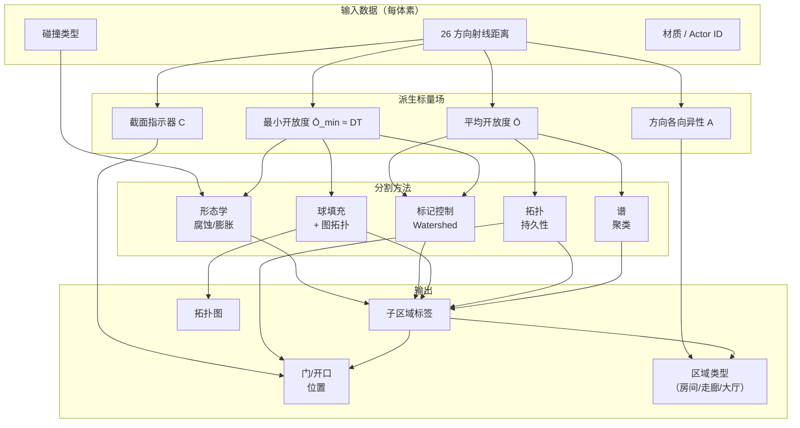
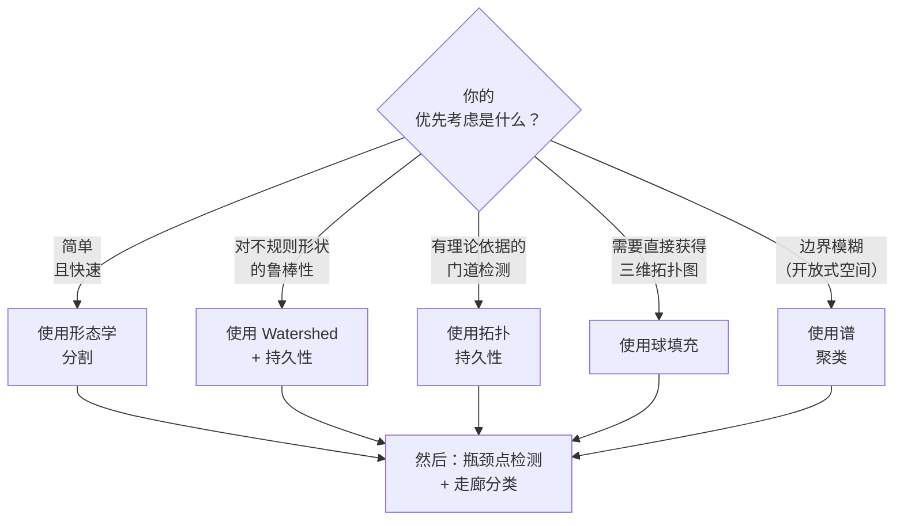

# 室内空间分割 — 总览

室内空间分割将复杂的建筑内部（房间、走廊、大厅）划分为带标签的子区域（SubZone），并识别它们之间的连接（门、开口）。以体素化的三维网格为起点——每个体素存储 26 方向射线距离、碰撞类型和材质信息——目标是生成带有门户几何体的区域划分结果。整个过程完全离线执行，使用确定性的几何算法。

本维基涵盖五类算法，各有不同的权衡取舍。下图展示了它们之间的关系。

## 问题架构

## 处理流水线（所有方法通用）

每种方法都遵循相同的三阶段结构，区别在于它们**如何执行第二阶段**：

| 阶段 | 处理内容 | 关键决策 |
|-------|----------|----------|
| **阶段 1** — [标量场推导](./wiki/ray-to-scalar-fields.md) | 将 26 方向射线距离转换为一个或多个标量场 | 选择哪种聚合函数（均值、最小值、调和均值）？ |
| **阶段 2** — 分割 | 将体素划分为区域 | 选择哪种算法族？（见下文） |
| **阶段 3** — 后处理 | 检测门、分类区域、构建拓扑图 | [瓶颈点检测](./wiki/chokepoint-detection.md)、[走廊分类](./wiki/corridor-classification.md) |

## 五类算法

| 方法 | 核心思想 | 优势 | 劣势 | 最佳适用场景 |
|------|----------|------|------|-------------|
| [形态学分割](./wiki/morphological-segmentation.md) | 通过腐蚀断开门道连接，然后按房间逐一膨胀 | 简单、快速、直观 | 结构元素尺寸至关重要；小房间可能被抹除 | 具有标准门道的规则布局 |
| [Watershed 分割](./wiki/watershed-segmentation.md) | 从距离场峰值泛洪；边界在门道处形成 | 能很好地处理不规则形状 | 无标记时容易过度分割；需要调节阈值 | 复杂的非曼哈顿布局 |
| [球填充](./wiki/sphere-packing.md) | 用最大内切球填充空间；房间 = 密集球簇 | 真正的三维处理；图拓扑关系可直接获得 | 需要距离场；需设定最小球尺寸参数 | 多层建筑 |
| [拓扑持久性](./wiki/topological-persistence.md) | 随阈值扫描跟踪连通分量的合并过程 | 有理论依据；可自动排序瓶颈点；单一可解释参数 | 需要外部库（Gudhi）；对多数开发者较为陌生 | 需要严格的门道排序时 |
| [谱聚类](./wiki/spectral-clustering.md) | 图拉普拉斯特征向量找到自然聚类边界 | 数学上最优切分；可处理任意拓扑 | 大规模网格上计算代价高；需要设计亲和度函数 | 仅靠几何信息难以区分边界时 |

## 快速决策指南

## 本维基页面

### 数据准备
- [射线到标量场](./wiki/ray-to-scalar-fields.md) — 如何将 26 方向射线距离转换为可用于分割的标量场

### 分割算法
- [形态学分割](./wiki/morphological-segmentation.md) — 二维与三维下的腐蚀/膨胀流水线
- [Watershed 分割](./wiki/watershed-segmentation.md) — 距离场峰值 + 标记控制泛洪
- [球填充](./wiki/sphere-packing.md) — 最大内切球 + 图拓扑
- [拓扑持久性](./wiki/topological-persistence.md) — 基于持久同调的有理论依据的瓶颈检测
- [谱聚类](./wiki/spectral-clustering.md) — 图拉普拉斯特征向量 + Nyström 缩放

### 后处理
- [瓶颈点检测](./wiki/chokepoint-detection.md) — 4 种查找门和开口的方法
- [走廊分类](./wiki/corridor-classification.md) — 识别走廊、大厅和 T 形交叉口

### 分析
- [方法对比](./wiki/method-comparison.md) — 并列权衡分析与推荐矩阵
- [学术综述](./wiki/academic-survey.md) — 2017–2026 文献图谱

## 覆盖范围

| 关键问题 | 由以下页面解答 |
|----------|---------------|
| Q1：基于距离场的空间分割 | [射线到标量场](./wiki/ray-to-scalar-fields.md)、[Watershed](./wiki/watershed-segmentation.md)、[形态学](./wiki/morphological-segmentation.md)、[球填充](./wiki/sphere-packing.md) |
| Q2：瓶颈点/卡点检测 | [瓶颈点检测](./wiki/chokepoint-detection.md)、[拓扑持久性](./wiki/topological-persistence.md) |
| Q3：走廊检测与分类 | [走廊分类](./wiki/corridor-classification.md) |
| Q4：室内划分的谱聚类 | [谱聚类](./wiki/spectral-clustering.md) |
| Q5：学术前沿综述 | [学术综述](./wiki/academic-survey.md)、[方法对比](./wiki/method-comparison.md) |

## 质量说明

- **总页面数**：10
- **总参考来源数**：19
- **空白领域**：无关键缺失。基于骨架的走廊检测来源多样性有限，但该方法已被广泛验证。
- **最后更新**：2026-04-18
