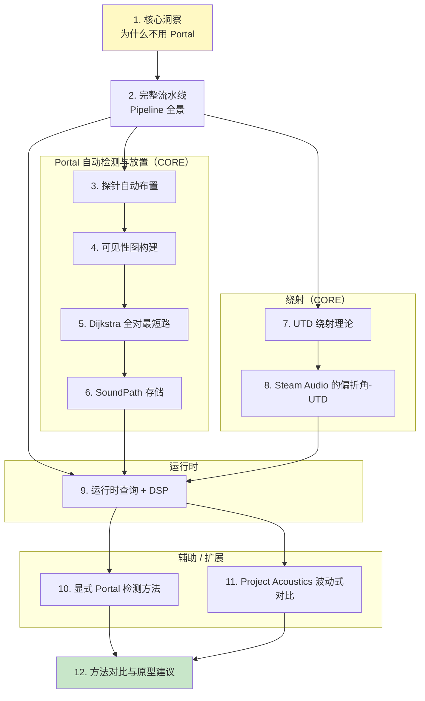

# 声学 Portal 烘焙 — 总览

> 本 wiki 面向熟悉体素网格、图算法、基础声学的图形 / 音频程序员。目标：**能在 Python/C++ 中从零实现一套声学烘焙系统**，处理任意复杂室内建筑的连通性查询 + 绕射效应，无需人工标注，可修改 Steam Audio 的算法。

## TL;DR — 项目研究的核心结论

1. **无需显式 Portal**：密集探针 + 两两可见性图已足够表达任意建筑的声学连通性
2. **绕射用偏折角代理**：`sum(turn angles) → UTD 公式(n=2, L=0.05) → 多频段 EQ`，几百行代码搞定
3. **不需要空间分割**：这是本项目 pivot 的理论基础 —— 声学只关心连通与衰减，不关心"房间"这个语义

## 知识地图

## 页面目录

### 认知基础（先读）
- [1. 核心洞察：声学不需要显式 Portal](wiki/1.%20核心洞察：声学不需要显式%20Portal.md) — 为什么 pivot，物理本质差异
- [2. 从体素到探针图：完整流水线](wiki/2.%20从体素到探针图：完整流水线.md) — 全景图与各阶段对应

### 核心算法 — Portal 自动检测与放置
- [3. 探针自动布置](wiki/3.%20探针自动布置.md) — UniformFloor 算法 + 体素场景优化
- [4. 可见性图构建](wiki/4.%20可见性图构建.md) — 两模式射线测试 + 图数据结构
- [5. 烘焙阶段：Dijkstra 全对最短路](wiki/5.%20烘焙阶段：Dijkstra%20全对最短路.md) — 并行 Dijkstra + A★ + 路径简化
- [6. SoundPath 存储结构](wiki/6.%20SoundPath%20存储结构.md) — 16 字节/路径的压缩技巧

### 核心算法 — 绕射
- [7. UTD 绕射理论](wiki/7.%20UTD%20绕射理论.md) — 物理基础 + Keller 锥 + 频率依赖性
- [8. Steam Audio 的偏折角-UTD 近似](wiki/8.%20Steam%20Audio%20的偏折角-UTD%20近似.md) — 假楔形参数的近似

### 运行时
- [9. 运行时查询与 DSP](wiki/9.%20运行时查询与%20DSP.md) — 查询流水线 + SH + EQ 累积

### 辅助与扩展
- [10. 显式 Portal 检测方法](wiki/10.%20显式%20Portal%20检测方法.md) — 8 种方法对比（用于动态门等可选场景）
- [11. Project Acoustics 波动式对比](wiki/11.%20Project%20Acoustics%20波动式对比.md) — 上限对标，理解放弃了什么

### 总结
- [12. 方法对比与原型建议](wiki/12.%20方法对比与原型建议.md) — 带走页面：Python/C++ 原型代码 + 路线图

## 覆盖范围

| 研究问题 | 主要解答页 | 辅助页 |
|---|---|---|
| Q1 声学 Portal 物理本质 + 为什么跳过分割 | [1](wiki/1.%20核心洞察：声学不需要显式%20Portal.md) | [7](wiki/7.%20UTD%20绕射理论.md), [11](wiki/11.%20Project%20Acoustics%20波动式对比.md) |
| Q2 Portal 候选面检测（6 种方法对比） | [10](wiki/10.%20显式%20Portal%20检测方法.md) | [4](wiki/4.%20可见性图构建.md)（隐式路径） |
| Q3 Portal 显著性筛选 | [10](wiki/10.%20显式%20Portal%20检测方法.md) | |
| Q4 Portal 参数化 | [10](wiki/10.%20显式%20Portal%20检测方法.md) | [6](wiki/6.%20SoundPath%20存储结构.md)（存储对照） |
| Q5 探针自动布置 | [3](wiki/3.%20探针自动布置.md) | |
| Q6 可见性图 + 运行时查询 | [4](wiki/4.%20可见性图构建.md), [9](wiki/9.%20运行时查询与%20DSP.md) | [5](wiki/5.%20烘焙阶段：Dijkstra%20全对最短路.md) |
| Q7 UTD 理论 | [7](wiki/7.%20UTD%20绕射理论.md) | |
| Q8 离线绕射烘焙 | [8](wiki/8.%20Steam%20Audio%20的偏折角-UTD%20近似.md) | [6](wiki/6.%20SoundPath%20存储结构.md) |
| Q9 运行时绕射 | [8](wiki/8.%20Steam%20Audio%20的偏折角-UTD%20近似.md), [9](wiki/9.%20运行时查询与%20DSP.md) | |
| Q10 Steam Audio 源码级拆解 | [2](wiki/2.%20从体素到探针图：完整流水线.md)-[9](wiki/9.%20运行时查询与%20DSP.md)（全系列） | |
| Q11 Project Acoustics 对比 | [11](wiki/11.%20Project%20Acoustics%20波动式对比.md) | |

## 推荐阅读顺序

**首次阅读**（全 12 页，约 3-4 小时）：1 → 2 → 3 → 4 → 5 → 6 → 7 → 8 → 9 → 10 → 11 → 12

**想直接动手原型**：1 → 2 → 12（跳到代码） → 按需回看 3-9

**只想理解 Steam Audio**：1 → 2 → 3 → 4 → 5 → 6 → 8 → 9

**对比研究**：1 → 2 → 11（波动式） → 12 （选型矩阵）

## 质量说明

- **总页面数**: 12
- **总参考来源数**: 11 （6 份新 raw + 5 份已有 raw）
- **Mermaid 图总数**: 80+
- **最后更新**: 2026-04-21
- **研究 pivot**: 从"分割 → Portal"转到"探针图 + UTD 代理"

### 已知盲点

1. **频段透射**（Q12 stretch）：墙体材质阻抗、每频段透射系数只概要提及，未深入
2. **动态几何增量更新**（Q13 stretch）：仅通过 Raghuvanshi 2021 引用，未完整拆解算法
3. **Project Acoustics 源码级**：ProjectAcoustics GitHub 以工具链为主，核心算法在论文里，PDF 二进制抓取失败；对比深度由 should 级文献拼凑得到，已足够做架构对比但未到源码级

### 相关项目

- 旧项目 [`indoor-space-segmentation`](../indoor-space-segmentation/index.md) — **pivot 前的分割研究**，其中 5 份 raw 在本项目重新诠释为声学工具
