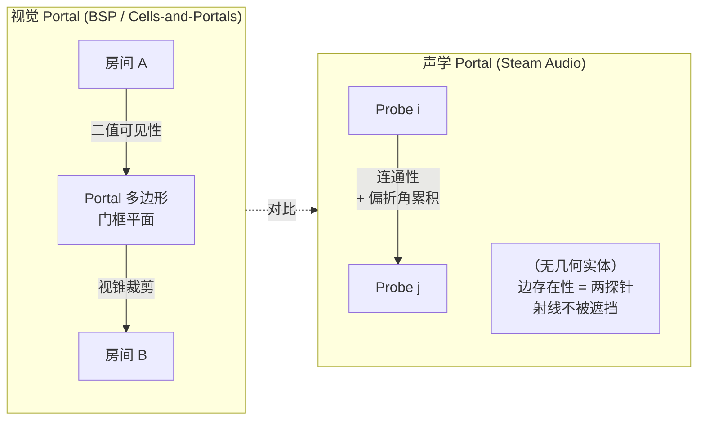
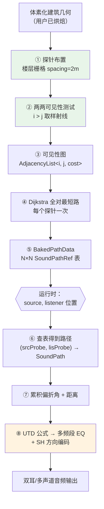
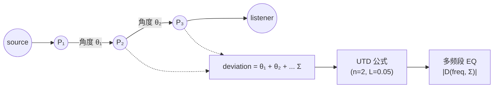

# 核心洞察：声学不需要显式 Portal

本项目起源于一个自然而然的假设：**要做室内声学烘焙，先把建筑切成房间，再在房间之间放 Portal**。深挖 Steam Audio 源码后，这个假设被彻底推翻了[^20]。Valve 在 Half-Life: Alyx 上验证过的方案里，**既没有房间，也没有 Portal 几何** —— 只有密集探针（probe）和它们之间的可见性图。这一页解释为什么这样行得通、以及它和"视觉 Portal"的本质差异。

## 两种 Portal 的本质差异

### 关键差异

| 维度 | 视觉 Portal | 声学 Portal (Steam Audio 派) |
|---|---|---|
| **几何表达** | 显式多边形 | 无（图的边隐含） |
| **二值 vs 连续** | 可见 / 不可见 | 带衰减的连续场 |
| **频率相关** | 无 | 有（低频绕射强） |
| **绕射处理** | 硬阴影 | 偏折角 → UTD 低通 |
| **放置方式** | 手工 / BSP 自动 | 无需放置 |
| **几何限制** | 要求可凸分解 | 任意几何 |
| **动态性** | 状态切换 | 路径重搜 |

视觉 Portal 服务于**可见性剔除**这个二值问题：像素要么被遮挡要么不被遮挡。声学 Portal 服务于**能量传播**这个连续问题：声波会绕过边缘、穿过缝隙、按频率选择性透射。强行把声学问题套在视觉 Portal 框架里，会错过"绕射"这个最关键的物理效应。

## Steam Audio 的替代架构

不放 Portal，放**探针**，然后测**探针之间能不能互相看见**。如果 A 房间有 4 个探针能看见 B 房间的 3 个探针（通过一扇门），那这 12 条可见边**就是**这扇门的声学表达 —— 不需要任何多边形。

整条流水线从未出现 "portal" 这个词。声学语义全部隐含在两个数据结构里：**探针位置**和**探针两两可见性**。

## 为什么这样就够了？

### 原因一：声学 Portal 的物理本质是"瓶颈面"，不是"房间门"

一个门洞为什么是声学 Portal？因为它是两侧自由空间之间的**瓶颈截面** —— 声能被迫集中通过这里。数学上，这对应于**连接两个空腔的最小割**。Steam Audio 不去显式求这个最小割，而是让密集的探针样本自动发现它：**如果 A 侧有探针能看见 B 侧有探针，那这对探针的连线必然穿过瓶颈**，瓶颈位置和法向自然被这条线记录下来了。

### 原因二：绕射效应只需要"路径总偏折角"

绕射的物理效果是：低频声能从直线路径被"拉"进阴影区。Steam Audio 把整条探针链的总转弯角当作绕射强度的代理量[^22]：

这不是物理精确的 UTD（没有真实楔形边缘、没有真实源到边距离），但它捕捉了**最重要的定性行为**：路径越弯，低通越强。详见 [8. Steam Audio 的偏折角-UTD 近似](8.%20Steam%20Audio%20的偏折角-UTD%20近似.md)。

### 原因三：游戏场景的感知阈值

玩家戴耳机，频率感知分辨率约 1/3 倍频程，方向感知分辨率约 10°-20°。Steam Audio 团队在 Half-Life: Alyx 开发期验证过：**"声音被一面墙衰减了，从门口拐弯传来，高频被削掉"**这个总体印象是否正确，比具体衰减曲线是否精确到 ±1dB 更重要。几何近似就够了。

## 这对实现意味着什么

用户的输入契约是**一份体素网格 + SDF**，这比 Steam Audio 假设的多边形场景更有利：

```mermaid
flowchart LR
    subgraph INPUT["用户已有"]
        V[体素占用]
        S[SDF]
        E["可追加字段<br/>openness / material..."]
    end

    subgraph NEED["需要实现"]
        P[探针布置]
        R["体素射线可见性<br/>3D-DDA"]
        G[可见性图]
        D[Dijkstra]
        U[UTD LUT]
        RT[运行时查询]
    end

    V --> R
    S --> P
    R --> G --> D
    D --> RT
    U --> RT

    style INPUT fill:#e3f2fd
    style NEED fill:#fff9c4
```

所有需要实现的部分都是**无几何的**算法：探针是空间里的点集，可见性是体素射线问题，图算法是标准图算法。**体素化的建筑反而比三角网格更好处理** —— 射线可见性是简单的 3D-DDA 行走，不需要 BVH。

## 如果还想要显式 Portal

某些场景仍然想要显式 Portal 数据：
- **动态门开合** —— 需要知道这扇门在哪，才能调制透射量（Raghuvanshi 2021 的思路[^23]）
- **分区混响** —— 每个"腔室"一套混响预设，需要房间边界
- **调试可视化** —— 关卡设计师想在编辑器里看到"声学门在哪"

这种情况下，**混合方案**是首选：主干仍然是探针图（保持 Steam Audio 的性能和鲁棒性），附加一层 Portal 识别（形态学开运算或持久同调）**仅用于上述三个辅助用途**。详见 [10. 显式 Portal 检测方法](10.%20显式%20Portal%20检测方法.md)。

## 三句话总结

1. **声学连通性可以不需要显式 Portal**，探针图隐式编码了所有瓶颈信息。
2. **绕射可以用路径总偏折角近似**，喂给带假楔形参数的 UTD 公式即可。
3. **Portal 显式检测只在需要动态状态调制或可视化时才必要**，作为可选的辅助层。

[^20]: [[steam-audio-pathing-source-breakdown|Steam Audio Pathing 源码级拆解]] · [原仓库](https://github.com/ValveSoftware/steam-audio)
[^22]: [[utd-diffraction-steam-audio-vs-tsingos|UTD 绕射：Steam Audio vs Tsingos]] · 综合多源
[^23]: [[project-acoustics-wave-based-contrast|Project Acoustics 波动式对比]] · [Raghuvanshi 2021](https://arxiv.org/abs/2107.11548)

## Sources

| # | 标题 | Raw Note | Original |
|---|------|----------|----------|
| 20 | Steam Audio Pathing 源码级拆解 | [[steam-audio-pathing-source-breakdown]] | [Steam Audio repo](https://github.com/ValveSoftware/steam-audio/tree/master) |
| 22 | UTD 绕射：Steam Audio vs Tsingos | [[utd-diffraction-steam-audio-vs-tsingos]] | [Tsingos 2001](https://pixl.cs.princeton.edu/pubs/Tsingos_2001_MAI/index.php) |
| 23 | Project Acoustics 波动式对比 | [[project-acoustics-wave-based-contrast]] | [Microsoft Research](https://www.microsoft.com/en-us/research/project/project-triton/) |
