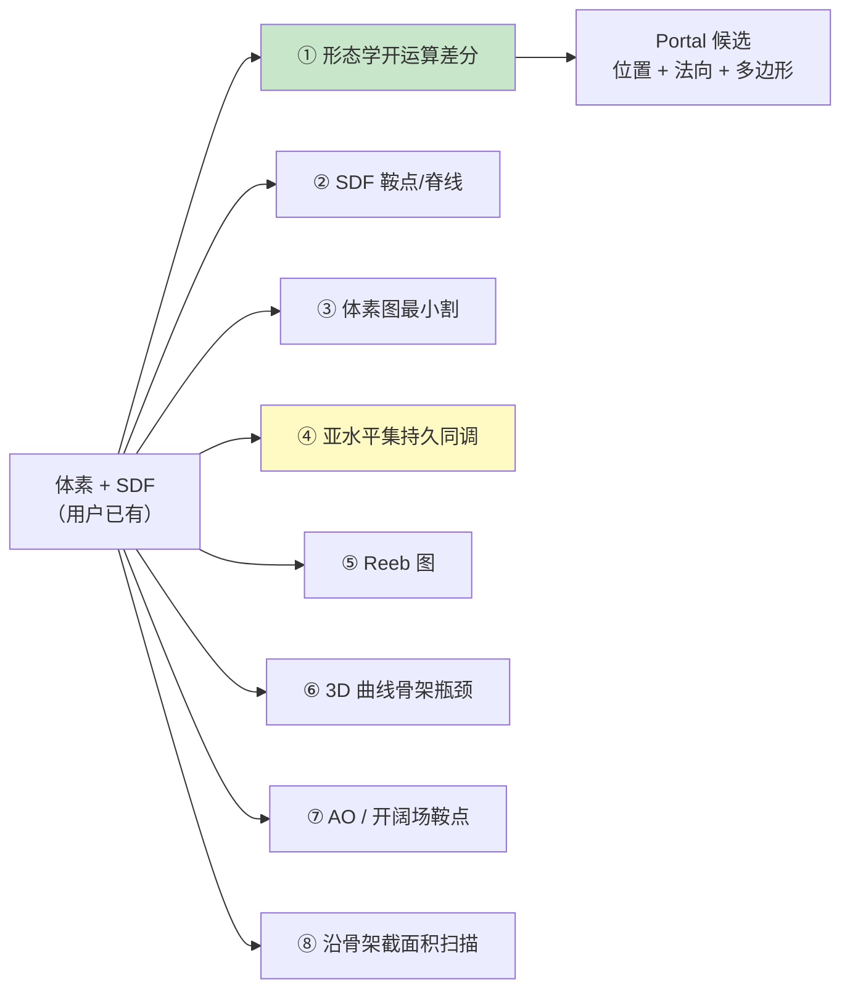
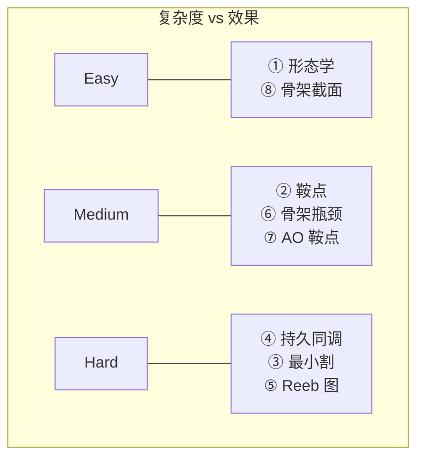
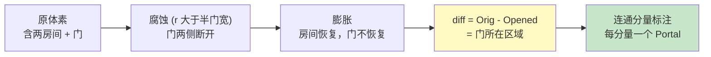
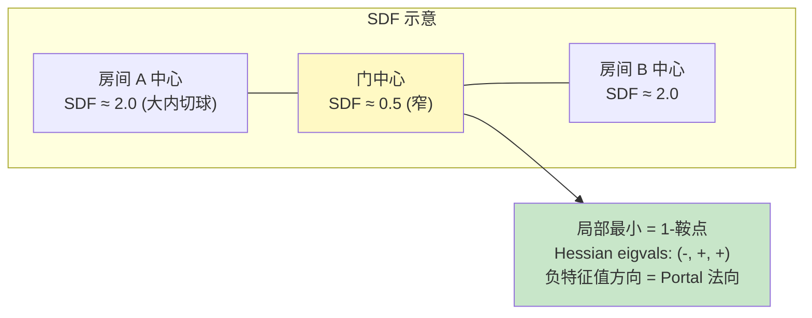
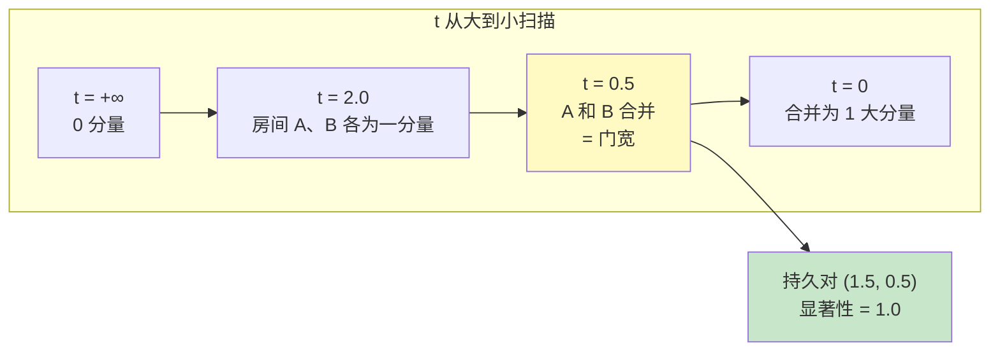
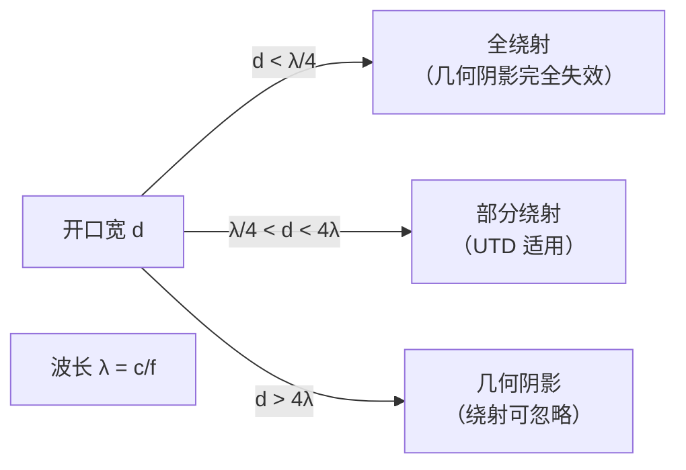
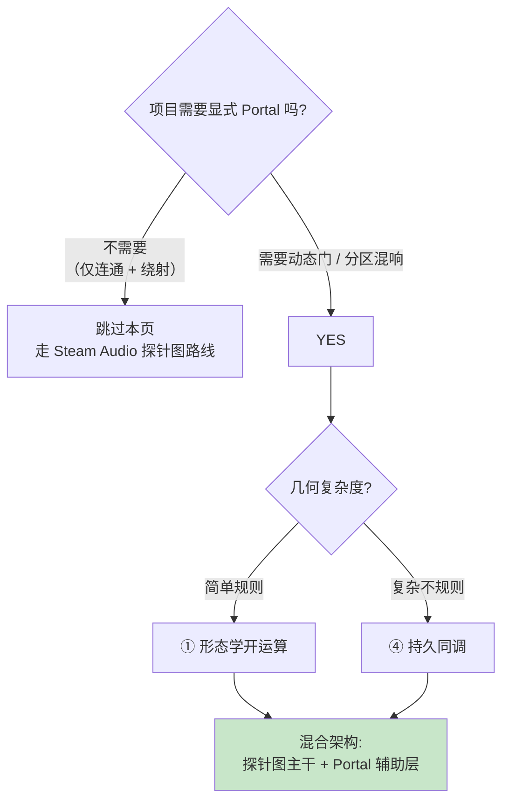

# 显式 Portal 检测方法

[1. 核心洞察：声学不需要显式 Portal](1.%20核心洞察：声学不需要显式%20Portal.md) 告诉我们：**主干系统可以完全不用 Portal**。但某些增强功能需要知道"门在哪"：动态开合（Raghuvanshi 2021）、分区混响、调试可视化。本页梳理在给定体素 + SDF 的情况下、自动检测 Portal 候选面的 8 种方法，并给出针对声学用途的推荐[^24]。

## 总览：8 种方法





## ① 形态学开运算 —— 最简单也常够用

### 原理

```
Opened(A, B) = (A ⊖ B) ⊕ B
```

先用球形结构元素 `B` 腐蚀（`⊖`），消除比 `B` 细的特征（窄通道），再膨胀恢复大空间但不能恢复已消失的细特征。**原始 − Opened = 被消除的细特征 = 窄通道 = Portal 候选**[^24]。



### 算法

```python
import scipy.ndimage as nd

def detect_portals_morphological(occupancy, voxel_size, r_min=0.3, r_max=1.5):
    """
    occupancy: 3D bool array (True = solid, False = free)
    """
    free = ~occupancy
    portals = []
    for r_m in np.arange(r_min, r_max, 0.1):
        r_voxels = int(r_m / voxel_size)
        SE = nd.generate_binary_structure(3, 3)  # 球形近似
        opened = nd.binary_closing(free, structure=ball(r_voxels))
        narrow = free & ~opened

        labeled, num = nd.label(narrow, structure=nd.generate_binary_structure(3, 3))
        for i in range(1, num+1):
            comp = (labeled == i)
            centroid = nd.center_of_mass(comp)
            normal = estimate_portal_normal(comp, occupancy)
            polygon = fit_polygon(comp, centroid, normal)
            portals.append({
                'center': centroid,
                'normal': normal,
                'aperture_radius': r_m,
                'polygon': polygon,
            })
    return portals
```

### 优势 / 局限

| 维度 | 评分 |
|---|---|
| 实现 | ⭐⭐⭐⭐⭐ 一个 scipy 函数 |
| 速度 | ⭐⭐⭐⭐ O(N) 每 r |
| 不规则几何 | ⭐⭐⭐ 好（对房间型 OK） |
| 半开放 | ⭐⭐ 差（大开口检测不到） |
| 给出法向 | ⭐⭐ 需要后处理 |
| 阈值敏感 | ⭐⭐⭐ 多尺度扫描缓解 |

### 多尺度扫描

单一 r 只能检测某一尺度的 Portal。**对 r 做扫描**（如从 0.3 m 到 1.5 m），每个 r 产生一批候选。去重 + 按尺寸排序得到完整 Portal 列表。

## ② SDF 鞍点 / 脊线

### 原理

SDF 在中轴线（medial axis）上取局部最大（内切球半径）。Portal 对应**中轴线上的局部最小** —— 即 SDF 的 **1-鞍点**（Hessian 一个负特征值 + 两个正特征值）[^24]。



### 算法

```python
def detect_sdf_saddles(sdf, sigma_smooth=1.0):
    # 1. 平滑 SDF 避免离散伪影
    sdf_s = gaussian_filter(sdf, sigma_smooth)

    # 2. 每点算 Hessian (3x3)
    Hxx, Hyy, Hzz, Hxy, Hxz, Hyz = compute_hessian(sdf_s)

    portals = []
    for (z, y, x) in np.ndindex(sdf.shape):
        if sdf[z,y,x] < 0: continue  # 墙内跳过
        H = np.array([[Hxx[z,y,x], Hxy[z,y,x], Hxz[z,y,x]],
                      [Hxy[z,y,x], Hyy[z,y,x], Hyz[z,y,x]],
                      [Hxz[z,y,x], Hyz[z,y,x], Hzz[z,y,x]]])
        eigvals, eigvecs = np.linalg.eigh(H)  # 升序

        # 1-鞍点: 一个负 + 两个正
        if eigvals[0] < 0 and eigvals[1] > 0 and eigvals[2] > 0:
            # 限制强度: 主负值 >> 正值
            if abs(eigvals[0]) > 2 * abs(eigvals[1]):
                normal = eigvecs[:, 0]  # 最小特征值对应向量
                portals.append({
                    'center': (x, y, z),
                    'normal': normal,
                    'strength': abs(eigvals[0]),
                })
    return portals
```

### 特点

- ⭐ **直接给出法向** —— Hessian 最小特征向量
- ⚠️ **对离散 SDF 噪声敏感** —— 必须先高斯滤波
- ⚠️ **没有显式的多边形** —— 还要再切一刀

## ③ 体素图最小割

### 原理

把自由体素当图节点，6-连通边权为 1。**两房间之间的最小 s-t 割 = Portal 截面**[^24]。

### 为什么 **不** 推荐

- 要先知道哪些是房间 → **反 pivot**
- 最大流 O(N^2.5)，百万体素超贵
- 返回的是体素集合，需要额外处理成多边形

**跳过。**

## ④ 亚水平集持久同调

### 原理

扫描阈值 `t`：`{ϕ ≤ t}` 这个水平集的连通分量随 `t` 变化。两分量首次合并的事件 = **门洞打通** = Portal[^24]。

每个合并事件带有：
- **出生**（第一个房间出现的 `t` 值）
- **死亡**（合并发生的 `t` 值）= 门宽
- **持续时间** `birth - death` = Portal 显著性（越大越显著）



### 算法（Gudhi）

```python
import gudhi as gd

def detect_portals_persistence(sdf, voxel_size):
    # CubicalComplex 对 sdf 的负值做滤波（sublevel set on -sdf 等价于 superlevel on sdf）
    cc = gd.CubicalComplex(
        dimensions=sdf.shape,
        top_dimensional_cells=(-sdf).flatten()
    )
    cc.compute_persistence()
    pairs = cc.persistence_intervals_in_dimension(0)

    portals = []
    for (birth, death) in pairs:
        if death == float('inf'): continue
        aperture_radius = -death  # 反转
        significance = death - birth  # = birth - death in reversed conv
        if significance < 0.05: continue  # 门槛

        # 查找合并发生的体素位置
        merge_voxel = cc.cofaces_of_persistence_pairs()...
        portals.append({
            'aperture_radius': aperture_radius,
            'significance': significance,
            'merge_voxel': merge_voxel,
        })

    portals.sort(key=lambda p: -p['significance'])
    return portals
```

### 优势

- ⭐ **原则性排名**：持久时间直接对应 Portal 重要性
- ⭐ **参数单一**：只需设置最小显著性阈值
- ⭐ **自然多尺度**：同时捕捉大小 Portal
- ⚠️ Gudhi 库依赖

## ⑤ Reeb 图 / ⑥ 3D 曲线骨架

两种方法详见[^24]。它们本质上追踪拓扑变化（Reeb 全局，骨架局部）。**对游戏开发来说实现成本太高**，不推荐作为起步。

## ⑦ AO / 开阔场（Openness Field）鞍点

用"每方向射线到墙的平均距离" 代替 SDF 作为标量场，然后同 ②。优点：对各向异性（走廊 vs 房间）更敏感。缺点：预计算一次射线投射每体素几方向，较贵。已有 raw `ao-openness-field.md` 详述[^13]。

## ⑧ 沿骨架截面积扫描

简单启发式：提取 1D 骨架（医学 / pore media 常用方法），沿骨架每点做**垂直截面**，测量自由空间面积。局部最小 = Portal。

```python
def detect_portals_skeleton(free, sdf):
    skel = skeletonize_3d(free)
    portals = []
    for node in skeleton_nodes(skel):
        tangent = estimate_tangent(skel, node)
        slice_plane = plane(node, tangent)
        area = compute_free_area(free, slice_plane)
        if is_local_min_along_skel(area, skel, node):
            portals.append({'center': node, 'normal': tangent, 'area': area})
    return portals
```

## 方法选型矩阵

| 场景 | 推荐方法 | 理由 |
|---|---|---|
| 简单规则建筑 | ① 形态学开运算 | 一行代码，足够 |
| 复杂不规则 / 有阈值需求 | ④ 持久同调 | 显著性排序 + 多尺度 |
| 研究 / 发论文 | ④ + ⑤ + ⑦ | 丰富性 |
| 需要 Portal 法向 + 多边形 | ② 鞍点 + ① 形态学联合 | 鞍点给法向，形态学给多边形 |

## 声学 Portal 的特殊阈值

不同于医学 / 制造业的"通道检测"，声学 Portal 门槛是**波长相关**：



感知频段 125 Hz–4 kHz 对应：
- λ_min ≈ 8.5 cm (4 kHz)
- λ_max ≈ 2.7 m (125 Hz)

**Portal 兴趣范围 ~5 cm 到 ~3 m 孔径**。小于 5 cm 的缝对所有感知频段都强绕射（不区分）；大于 3 m 的开口对中高频都已是几何阴影（不需要 UTD）。

## 实际推荐：混合架构

如果只是为了**主干查询系统**：

> **不做显式 Portal 检测**。探针图就够了。

如果要支持**动态门开合** / **分区混响**：

> 用 **① 形态学开运算**（sr 从 0.3m 到 1.5m 扫描），得到 Portal 列表。**仅作为辅助层**存储：
> - 每 Portal 的位置、法向、孔径半径、闭合状态
> - 哪些 baked path 经过每个 Portal（烘焙时一次性预计算）

这让主干保持 Steam Audio 的简洁，同时支持动态效果。

## 烘焙时关联路径到 Portal

```python
def associate_paths_with_portals(baked_paths, probes, portals):
    for path in baked_paths:
        nodes = reconstruct_probe_path(path, probes)
        for portal in portals:
            for i in range(len(nodes) - 1):
                seg_start = probes[nodes[i]].center
                seg_end = probes[nodes[i+1]].center
                if segment_intersects_portal(seg_start, seg_end, portal):
                    path.portals_crossed.append(portal.id)
                    break
    # path.portals_crossed 现在是每条路径穿过的 Portal ID 列表
```

运行时根据这个列表 + 各 Portal 当前闭合状态调整 EQ（见 [9. 运行时查询与 DSP](9.%20运行时查询与%20DSP.md) 的"支持动态门"小节）。

## 总结



[^13]: [[ao-openness-field|AO/Openness Field from Ray Distances]]
[^24]: [[portal-detection-methods-acoustic|自动声学 Portal 检测方法综述]]

## Sources

| # | 标题 | Raw Note | Original |
|---|------|----------|----------|
| 24 | 自动声学 Portal 检测方法综述 | [[portal-detection-methods-acoustic]] | Synthesis |
| 13 | AO/Openness Field from Ray Distances | [[ao-openness-field]] | Synthesis |
| 8 | Topological Persistence for Indoor Segmentation | [[topological-persistence]] | Synthesis |
| 17 | Gudhi Persistent Homology for Cubical Complexes | [[gudhi-cubical-persistence]] | Synthesis |
