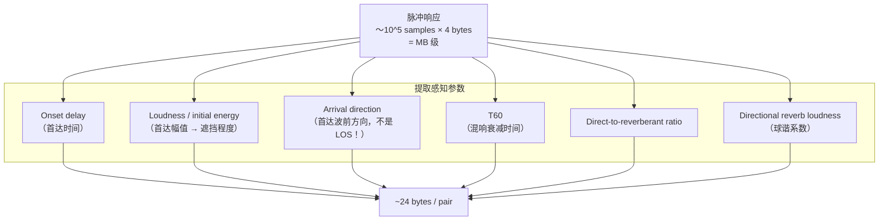
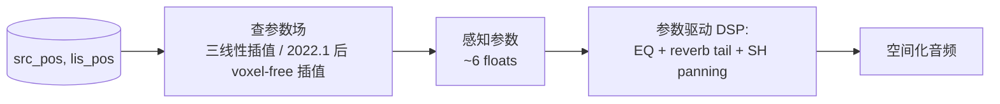
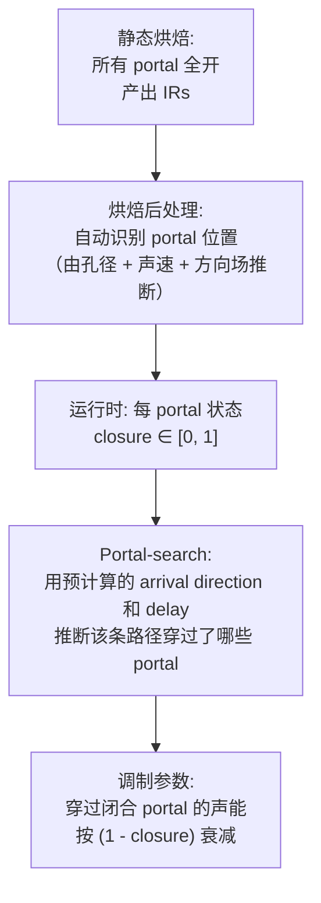
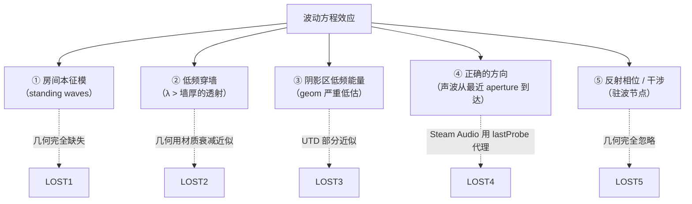
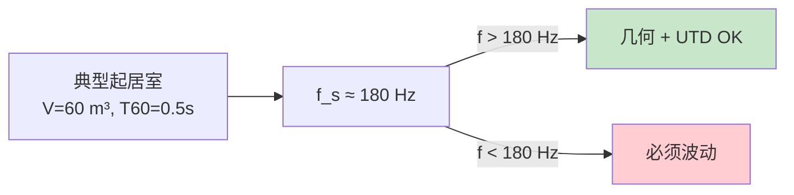
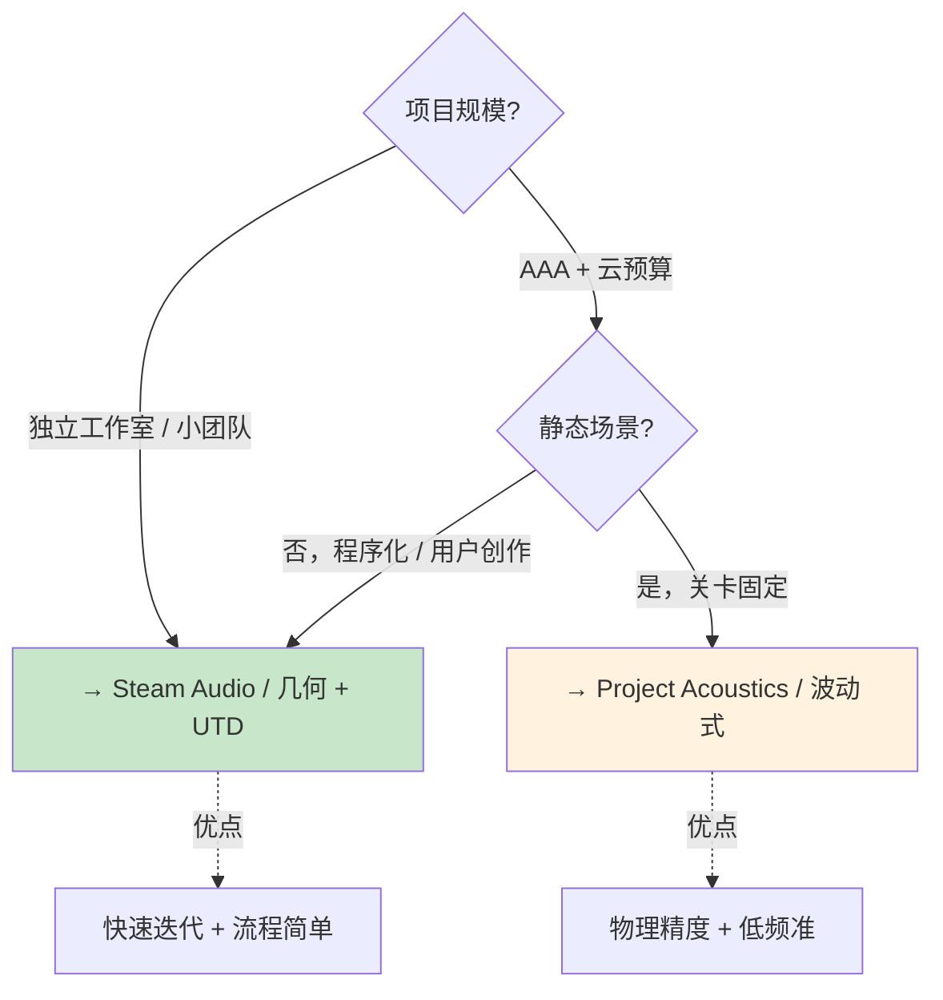

# Project Acoustics 波动式对比

Microsoft Research 的 **Project Acoustics（原 Project Triton）** 走了一条完全相反的路：**用波动方程做离线仿真，然后把每个源-听者对的冲激响应压缩成 5-6 个感知参数**。它比 Steam Audio 精确得多，但代价是云端小时级烘焙和 100 MB 级文件。本页作为几何方法的**上限对比**[^23]，让我们理解几何 + UTD 究竟丢了什么。

## 一句话定位

| 维度 | Steam Audio | Project Acoustics |
|---|---|---|
| **物理模型** | 几何声学 + UTD 代理 | 全 3D 标量波动方程 |
| **Portal 概念** | 无（隐含在探针图） | 自动检测，支持运行时闭合调制 |
| **烘焙时间** | 单机几分钟 | 云集群小时级 |
| **产物大小** | 5-20 MB | ~100 MB 每关卡 |
| **查询延迟** | < 100 μs | ~100 μs |
| **低频准确性** | 差 | 优 |
| **房间共振捕捉** | 无 | 有 |

## 波动方程烘焙：ARD 解法

### 问题
Project Acoustics 需要解 3D 标量波动方程：

$$\frac{\partial^2 p}{\partial t^2} = c^2 \nabla^2 p + f(\mathbf{x}, t)$$

在整个场景上模拟几秒钟（覆盖典型混响时间 T60），对每个源位置。

### 为什么不用 FDTD
标准 FDTD 要求**每波长至少 10 个采样点**以控制数值色散。对 500 Hz → 每 7 cm 一个网格点。100 m × 100 m × 10 m 建筑 ≈ **3 亿格子**。每时间步几毫秒计算，总耗时数天。不可行。

### ARD：Adaptive Rectangular Decomposition

Raghuvanshi & Snyder 2009 提出把复杂场景**分解为矩形子域**[^23]：


**关键原理**：

- 均匀声速下，矩形内波动方程有**解析解**（DCT 本征函数）
- 分解子域足够大，内部"零数值色散" 
- 界面上用 6 阶有限差分耦合，只有界面引入数值误差

**好处**：
- **每波长只需 3 个点**（vs FDTD 的 10），grid 省 4× 在每维 → 64× 总量
- **时间步可以用分析积分做**，大时间步也稳定
- **总体 10-100× 加速**

### ARD 每波长采样

对 500 Hz 目标：
```
FDTD:  λ/10 ≈ 7 cm
ARD:   λ/3  ≈ 23 cm      (~37× 少的格子)
```

对 75 Hz（室内模式下限）：
```
FDTD:  ≈ 46 cm
ARD:   ≈ 1.5 m
```

## 每探针存什么：感知参数

ARD 仿真对每 (source_pos, listener_pos) 输出一条**脉冲响应**。朴素存储是 GB 级。Project Acoustics 用 **Parametric Wave Field Coding** (Raghuvanshi & Snyder, TOG 2014) 把每对 IR 压缩到 ~6 个标量[^23]：



**关键假设**：虽然原始 IR 随 source/listener 位置剧烈变化，**这些感知参数随位置平滑变化**（因为绕射是渐变的）。这使得参数场可以像图像一样被**无损/有损压缩**。

### 压缩手段

- **空间上**：参数场看上去像低频图像（只在门/墙附近有梯度）→ 标准图像压缩（DCT + quantization）
- **时间上**：T60 与 decay curve 参数化为 3-5 个数
- **方向上**：arrival direction 用 SH 系数 (order 1 = 3 float)

完整游戏关卡最终 ≈ **100 MB**（Microsoft 自报）。

## 运行时解码

查询 `(source_pos, listener_pos)` → 多频段 EQ + Ambisonic：



每源 ~100 μs。和 Steam Audio 同数量级。

### 2022.1 voxel-free 插值

Project Acoustics 原先内部有个体素网格索引查询。**2022.1 版本把 voxel 改为仅调试用**，引入"直接查参数场"的新插值器。这给了对用户代码更大的灵活性[^23]。

## 动态 Portal：Raghuvanshi 2021

静态波动 bake 假设所有门开。要支持动态关门，Raghuvanshi 2021 提出了增量调制[^23]：



**创新点**：利用**已有的感知参数**（arrival direction + delay）反推 portal 穿越，不需要在每帧做几何测试。运行时开销 O(portal count) 每源，规模线性。

这篇论文把 Project Acoustics 的产品形态扩展为"静态物理精确 + 动态游戏实用"。

## 哪些物理效应只有波动方程能捕获



### ① 房间本征模
小浴室的共振频率 ~50-200 Hz。几何声学看不到；波动方程自然包含 —— 吉他手唱 bathroom 是不是有 boomy 感？wave-based 捕捉；geometric 捕捉不了。

### ④ 到达方向正确性

Steam Audio 用最后一跳 probe 方向作代理，但如果一条路径**通过两个门**，方向可能不对。波动方程直接得到首达波前方向，自然正确。

## Schroeder 频率：两类方法的分界线

一个房间的 **Schroeder 频率**定义：

$$f_s \approx 2000 \sqrt{\frac{T_{60}}{V}}$$

（V 是体积，T60 是混响时间）

- **频率 > f_s**：模态密度高，统计声学适用，几何方法 OK
- **频率 < f_s**：少数主导模态，波动必需



**实际影响**：低频 DSP 效果（枪声低音、爆炸超低频）在 Steam Audio 下会不准；对于普通对话和音乐（125 Hz-4 kHz）则 OK。

## 选型决策矩阵



## 用户场景的结论

**用户有体素网格 + SDF + 程序化可能性**：**走 Steam Audio 派（几何 + UTD）**。理由：

1. **程序化建筑** → 不能预烘焙数小时
2. **快速迭代** → 关卡改了要秒级重烘
3. **感知优先** → 普通游戏听感不依赖 < 180 Hz 模态
4. **实现人力** → 几何方法 2 千行 C++，波动方法需要团队

但可以**从 Project Acoustics 借思路**：
- **感知参数化的想法** —— 即便用几何，也把路径压缩成最少感知参数（deviation + distance + direction 就够）
- **Portal 闭合调制** —— Raghuvanshi 2021 的运行时动态机制可以移植
- **Navigable-space-adaptive 探针** —— 在探针布置上优于 Steam Audio 的死板 OBB 栅格

[^23]: [[project-acoustics-wave-based-contrast|Project Acoustics (Triton) 波动式对比]]

## Sources

| # | 标题 | Raw Note | Original |
|---|------|----------|----------|
| 23 | Project Acoustics (Triton) 波动式对比 | [[project-acoustics-wave-based-contrast]] | [Project Triton](https://www.microsoft.com/en-us/research/project/project-triton/) |
| 23 | ARD 方法 | [[project-acoustics-wave-based-contrast]] | [Raghuvanshi & Snyder 2012](https://www.microsoft.com/en-us/research/publication/adaptive-rectangular-decomposition-spectral-domain-decomposition-approach-fast-wave-solution-complex-scenes/) |
| 23 | Dynamic Portal Occlusion | [[project-acoustics-wave-based-contrast]] | [Raghuvanshi 2021](https://arxiv.org/abs/2107.11548) |
