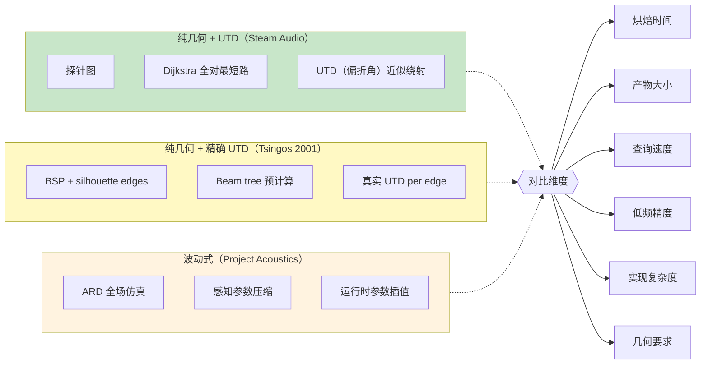
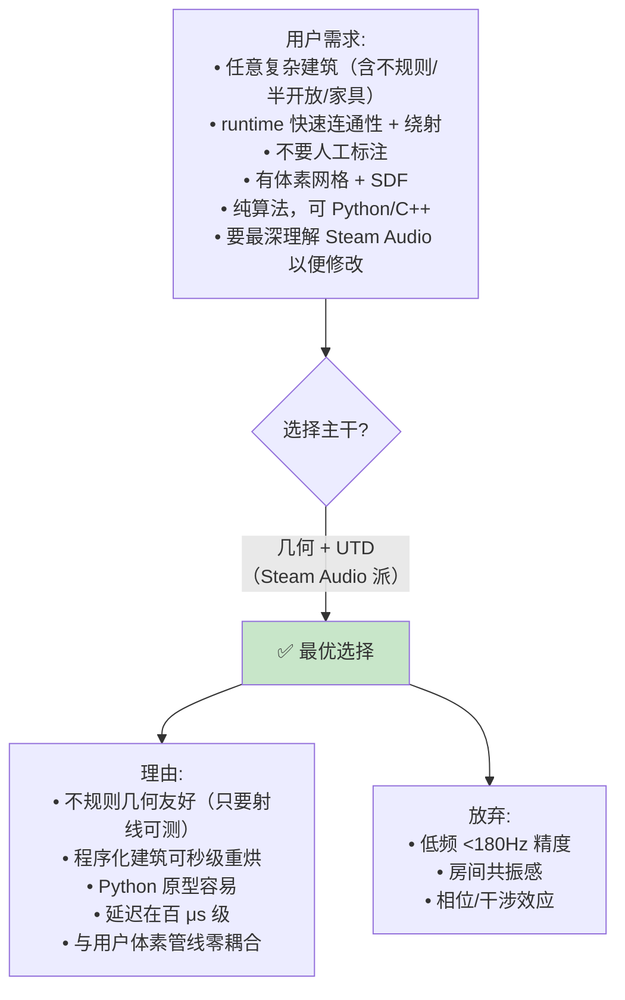
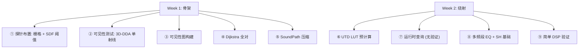
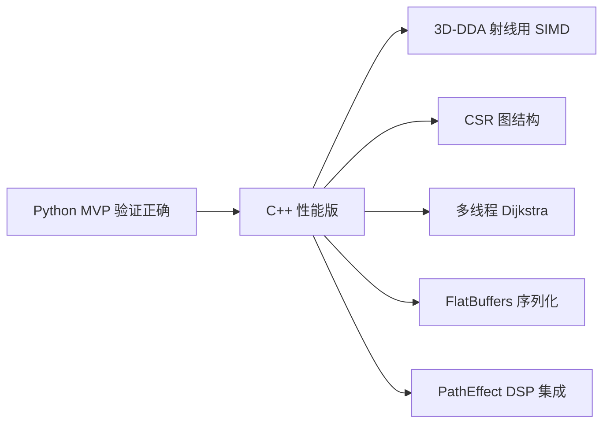
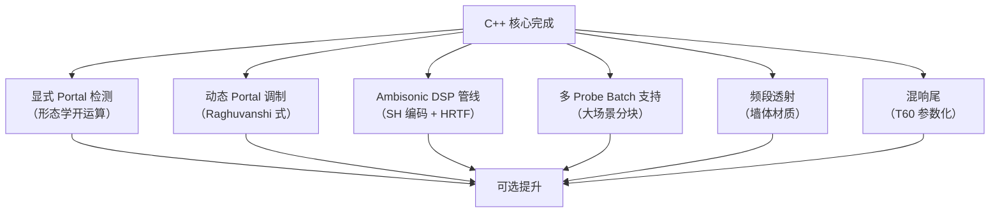
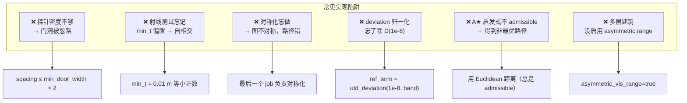
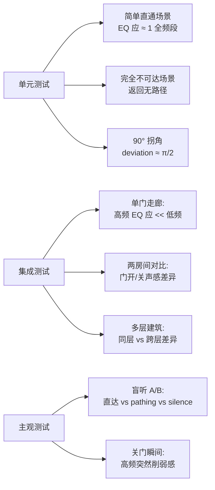

# 方法对比与原型建议

11 页的知识总结到一张决策表 + 一份 Python/C++ 原型路线。本页是给读者的"带走"页面：**如果明天就要开工，该怎么做？**

## 完整方法对比矩阵



### 定量对比

| 维度 | Steam Audio | Tsingos 2001 | Project Acoustics |
|---|---|---|---|
| 1000-探针场景烘焙时间 | 数十秒（16 线程） | ~30 分钟 | 数小时（云集群） |
| 关卡存储大小 | 5-20 MB | 10-50 MB | ~100 MB |
| 每源运行时开销 | <100 μs | ms 级（beam 查询） | ~100 μs |
| 低频（<180 Hz）准确性 | 差 | 中 | 优 |
| 高频（>2 kHz）准确性 | 良 | 良 | 良 |
| 房间共振 | 无 | 无 | 有 |
| Portal 检测 | 隐含 | 显式，手动 / silhouette | 自动 |
| 几何输入要求 | 任意（可见性可测即可） | 多边形场景 + 凸分解 | 任意（但最好水密） |
| 动态几何 | A★ 备用 | 重新 beam trace（贵） | Raghuvanshi 2021 portal 调制 |
| 代码量（C++） | ~2000 行 | ~8000 行 | 估 10000+ 行 + ARD 核心 |
| 是否开源 | ✅ Apache 2.0 | ❌ 研究代码 | ✅ MIT (ACE 工具链) |

## 用户场景的最优选择



## 原型实现路线

### 阶段 1: 最小 MVP（1-2 周）



### Python MVP 骨架

```python
# acoustic_portal_mvp.py

import numpy as np
from heapq import heappush, heappop

class VoxelScene:
    def __init__(self, occupancy, sdf, voxel_size):
        self.occupancy = occupancy   # 3D bool
        self.sdf = sdf               # 3D float
        self.voxel_size = voxel_size

    def is_occluded(self, a, b):
        """3D-DDA ray march through voxel grid."""
        # 略 - 见 wiki 4
        ...


class Probe:
    def __init__(self, pos, radius):
        self.pos = pos
        self.radius = radius


def place_probes(scene, spacing=1.5, min_clearance=0.3):
    """每 spacing 布一个探针，剔除墙缝。"""
    probes = []
    step = int(spacing / scene.voxel_size)
    shape = scene.occupancy.shape
    for z in range(0, shape[0], step):
        for y in range(0, shape[1], step):
            for x in range(0, shape[2], step):
                if scene.occupancy[z,y,x]: continue
                if scene.sdf[z,y,x] < min_clearance: continue
                pos = np.array([x, y, z]) * scene.voxel_size
                probes.append(Probe(pos, radius=spacing))
    return probes


def build_visibility_graph(scene, probes, vis_range=50.0):
    """朴素 O(N²) 构建可见性图。"""
    N = len(probes)
    adj = [[] for _ in range(N)]
    for i in range(N):
        for j in range(i):
            d = np.linalg.norm(probes[i].pos - probes[j].pos)
            if d > vis_range: continue
            if scene.is_occluded(probes[i].pos, probes[j].pos): continue
            adj[i].append((j, d))
            adj[j].append((i, d))
    return adj


def dijkstra_from(start, adj, N, path_range=100.0):
    """标准 Dijkstra，返回 parents 数组."""
    cost = [np.inf] * N
    parent = [-1] * N
    cost[start] = 0
    pq = [(0, start)]
    while pq:
        c, u = heappop(pq)
        if c > cost[u]: continue
        for (v, w) in adj[u]:
            nc = c + w
            if nc > path_range: continue
            if nc < cost[v]:
                cost[v] = nc
                parent[v] = u
                heappush(pq, (nc, v))
    return cost, parent


class SoundPath:
    __slots__ = ('first', 'last', 'after_first', 'before_last',
                 'distance', 'deviation', 'direct')
    def __init__(self):
        self.first = -1
        self.last = -1
        self.after_first = -1
        self.before_last = -1
        self.distance = 0.0
        self.deviation = 0.0
        self.direct = False


def path_from_parents(parent, start, end, probes):
    """重构路径并生成 SoundPath."""
    nodes = []
    cur = end
    while cur != -1 and cur != start:
        nodes.append(cur)
        cur = parent[cur]
    nodes.reverse()
    if not nodes: return None

    sp = SoundPath()
    sp.first = nodes[0]
    sp.last = nodes[-1]
    sp.after_first = nodes[1] if len(nodes) > 1 else -1
    sp.before_last = nodes[-2] if len(nodes) > 2 else -1

    # 计算 distance 和 deviation
    sp.distance = 0.0
    sp.deviation = 0.0
    prev = probes[start].pos
    for i, n in enumerate(nodes):
        cur_pos = probes[n].pos
        sp.distance += np.linalg.norm(cur_pos - prev)
        if i > 0 and i < len(nodes) - 1:
            prev_dir = (cur_pos - probes[nodes[i-1]].pos)
            prev_dir /= np.linalg.norm(prev_dir)
            next_dir = probes[nodes[i+1]].pos - cur_pos
            next_dir /= np.linalg.norm(next_dir)
            sp.deviation += np.arccos(np.clip(np.dot(prev_dir, next_dir), -1, 1))
        prev = cur_pos
    return sp


def bake(scene, probes):
    """全部烘焙流程。"""
    N = len(probes)
    adj = build_visibility_graph(scene, probes)

    # 全对 SoundPath
    baked_paths = {}
    for start in range(N):
        _, parent = dijkstra_from(start, adj, N)
        for end in range(N):
            if start == end: continue
            sp = path_from_parents(parent, start, end, probes)
            if sp is not None:
                baked_paths[(start, end)] = sp
    return baked_paths


# UTD 查表
def precompute_utd_lut(num_bands=6, num_angles=256):
    lut = np.zeros((num_angles, num_bands))
    for i in range(num_angles):
        angle = i * np.pi / num_angles
        for b in range(num_bands):
            lut[i, b] = utd_deviation(angle, b)
    return lut


def utd_deviation(angle, band):
    """Steam Audio 的假 UTD 公式。"""
    n = 2.0
    alpha_i = 0.0
    L = 0.05
    c = 343.0
    # 频段中心
    freqs = [(88, 177), (177, 355), (355, 710),
             (710, 1420), (1420, 2840), (2840, 5680)]
    f = 0.5 * (freqs[band][0] + freqs[band][1])
    k = 2 * np.pi * f / c
    alpha_d = alpha_i + np.pi + angle

    D0_mag = 1 / (2 * n * np.sqrt(2 * np.pi * k))

    beta1 = alpha_d - alpha_i
    beta3 = alpha_d + alpha_i

    def cot_safe(x):
        s = np.sin(x)
        if abs(s) < 1e-8: return 0.0
        return np.cos(x) / s

    def a_fn(n, beta):
        N_plus = round((np.pi + beta) / (2 * np.pi * n))
        return 2 * np.cos(np.pi * n * N_plus - beta / 2) ** 2

    def fresnel_approx(x):
        if x < 0.8:
            return np.sqrt(np.pi * x) * (1 - np.sqrt(x) / (0.7 * np.sqrt(x) + 1.2))
        else:
            return 1 - 0.8 / (x + 1.25) ** 2

    t1 = cot_safe((np.pi + beta1) / (2 * n))
    t2 = cot_safe((np.pi - beta1) / (2 * n))
    t3 = cot_safe((np.pi + beta3) / (2 * n))
    t4 = cot_safe((np.pi - beta3) / (2 * n))

    F1 = fresnel_approx(k * L * a_fn(n, beta1))
    F2 = fresnel_approx(k * L * a_fn(n, -beta1))
    F3 = fresnel_approx(k * L * a_fn(n, beta3))
    F4 = fresnel_approx(k * L * a_fn(n, -beta3))

    D = D0_mag * (t1 * F1 + t2 * F2 + t3 * F3 + t4 * F4)
    return abs(D)


# 运行时查询
def query_path(source, listener, scene, probes, baked_paths, lut):
    # 找影响探针（简化为最近 k 个）
    dists = [np.linalg.norm(source - p.pos) for p in probes]
    src_idx = np.argmin(dists)
    dists = [np.linalg.norm(listener - p.pos) for p in probes]
    lis_idx = np.argmin(dists)

    # 直接 LOS 测试
    if not scene.is_occluded(source, listener):
        return {
            'direct': True,
            'distance': np.linalg.norm(source - listener),
            'eq': np.ones(6),
        }

    # 查表
    sp = baked_paths.get((src_idx, lis_idx))
    if sp is None:
        return None  # 不可达

    # EQ
    angle_idx = int(sp.deviation / np.pi * 256)
    angle_idx = min(angle_idx, 255)
    eq = lut[angle_idx] / lut[0]

    return {
        'direct': False,
        'distance': sp.distance,
        'deviation': sp.deviation,
        'eq': eq,
    }
```

**这 ~200 行能跑通整个流水线**。性能不够好（Python + 朴素射线测试），但作为**可验证正确性的原型**够用。

### 阶段 2: C++ 性能版（2-3 周）



关键性能要点：
- **射线投射**：SIMD 化 3D-DDA，一次步进多条射线
- **图存储**：CSR 取代 vector-of-vector
- **并行**：探针数上千时 Dijkstra 每起点并行
- **SoundPath 去重**：hash 表查重复路径

预期：1000 探针场景烘焙从 Python 的 ~10 分钟 → C++ 的 ~30 秒。

### 阶段 3: 集成增强（可选，4-6 周）



优先级建议：
1. **E3 Ambisonic DSP**（否则输出参数没用）
2. **E2 动态 Portal 调制**（游戏玩法最有用）
3. **E6 混响尾**（感知上缺了很明显）
4. 其它按需

## 关键陷阱 / 错误



## 验证策略

怎么知道实现对不对？



## 最终交付形态

用户在**现有体素管线里**应该得到这些 API：

```cpp
// 烘焙时（离线工具）
acoustic::BakedScene bake_scene(
    const VoxelGrid& voxels,
    const SDFField& sdf,
    const BakeConfig& cfg);    // spacing, vis_range, etc.

acoustic::BakedScene::save(std::string_view path);

// 运行时（游戏侧）
acoustic::BakedScene scene;
scene.load(path);

// 每源每帧
acoustic::PathQueryResult result = scene.query(
    source_pos, listener_pos);
// result 包含 EQ[6], SH coeffs, distance, direction

// 喂给 DSP
audio_chain.apply_path_effect(input_buffer, result, output_buffer);
```

这套 API 和 Steam Audio 的 `IPLSimulator` + `IPLPathEffect` 基本对应，便于将来如果想切到官方 SDK 或反过来。

## 进一步阅读

- [1. 核心洞察：声学不需要显式 Portal](1.%20核心洞察：声学不需要显式%20Portal.md) — 为什么选这条路
- [2. 从体素到探针图：完整流水线](2.%20从体素到探针图：完整流水线.md) — 全景
- [3. 探针自动布置](3.%20探针自动布置.md) - [9. 运行时查询与 DSP](9.%20运行时查询与%20DSP.md) — 每步详解
- [10. 显式 Portal 检测方法](10.%20显式%20Portal%20检测方法.md) — 如果要混合架构
- [11. Project Acoustics 波动式对比](11.%20Project%20Acoustics%20波动式对比.md) — 了解上限

## Sources

汇总本项目所有主要参考源：

| # | 标题 | Raw Note |
|---|------|----------|
| 20 | Steam Audio Pathing 源码级拆解 | [[steam-audio-pathing-source-breakdown]] |
| 21 | Steam Audio 探针布置与可见性图 | [[steam-audio-probe-placement]] |
| 22 | UTD 绕射：Steam Audio vs Tsingos | [[utd-diffraction-steam-audio-vs-tsingos]] |
| 23 | Project Acoustics 波动式对比 | [[project-acoustics-wave-based-contrast]] |
| 24 | 自动声学 Portal 检测方法综述 | [[portal-detection-methods-acoustic]] |
| 25 | 运行时声学路径查询架构 | [[runtime-acoustic-path-query-architecture]] |
