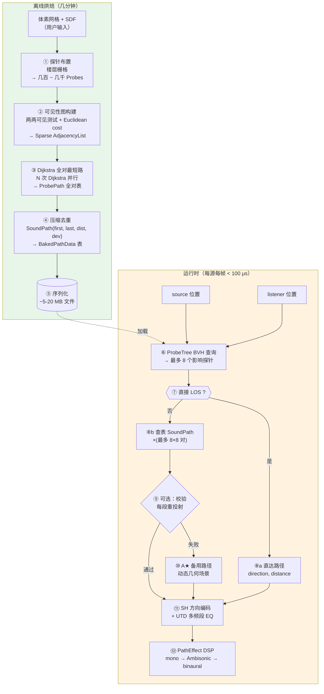
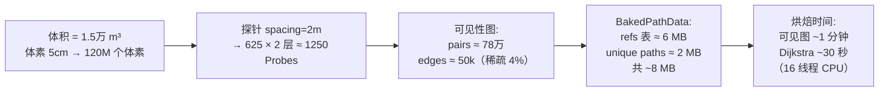
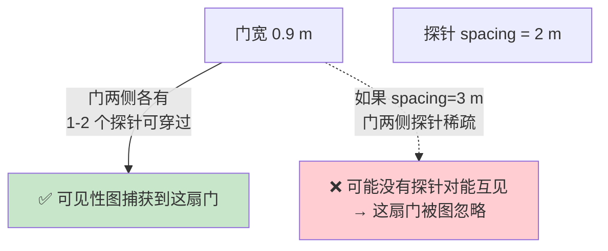
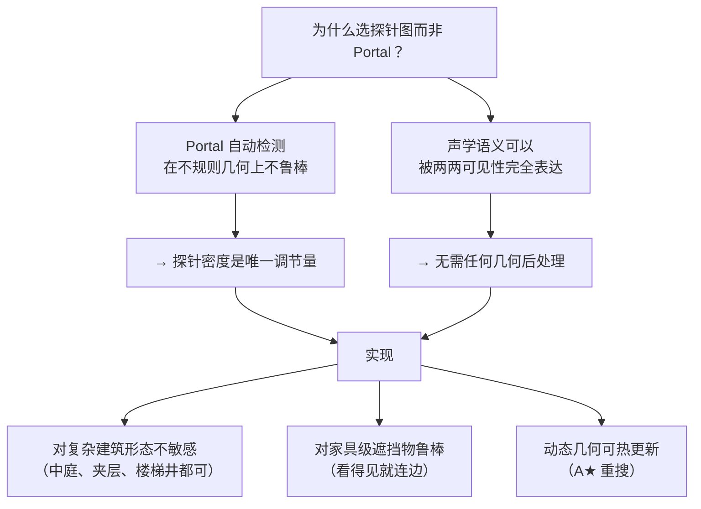

# 从体素到探针图：完整流水线

这一页把所有后续算法串成一条时间线：**从用户给定的体素网格开始，经过离线烘焙，得到可在运行时被声音系统查询的声学数据**。每一步都有独立页面详述，这里只画骨架。

## 全景图

## 按阶段对应的 wiki 页

| 步骤 | 输入 | 输出 | 详解页面 |
|---|---|---|---|
| ① 探针布置 | 体素 + SDF + OBB | `Probe[]` | [3. 探针自动布置](3.%20探针自动布置.md) |
| ② 可见性图 | Probes + 体素 | `AdjList[][]` | [4. 可见性图构建](4.%20可见性图构建.md) |
| ③-④ Dijkstra + 压缩 | 可见图 | `BakedPathData` | [5. 烘焙阶段：Dijkstra 全对最短路](5.%20烘焙阶段：Dijkstra%20全对最短路.md) |
| ④ 存储结构 | 全对路径 | `SoundPath[]` + `RefTable` | [6. SoundPath 存储结构](6.%20SoundPath%20存储结构.md) |
| ⑥-⑩ 运行时路径 | (src, lis) | `SoundPath` 列表 | [9. 运行时查询与 DSP](9.%20运行时查询与%20DSP.md) |
| ⑪ 绕射理论 | deviation 角 | EQ 系数 | [7. UTD 绕射理论](7.%20UTD%20绕射理论.md) + [8. Steam Audio 的偏折角-UTD 近似](8.%20Steam%20Audio%20的偏折角-UTD%20近似.md) |

## 数据量级参考

以一栋 50×50×6 m 的双层建筑为例：

这个量级**完全在单机几分钟内可烘焙**，文件大小足以塞进关卡包。对比 Project Acoustics 的云端数小时烘焙 + 百 MB 文件，Steam Audio 派的工程可行性是巨大的优势。

## 关键约束：探针密度

整条流水线对几何的鲁棒性**完全取决于探针密度是否足够**：

**经验法则**：`spacing ≤ min_aperture × 2`。用户场景里最小门宽 90 cm 对应 `spacing ≤ 1.8 m`，取 1.5 m 更保险。

## 设计选择的因果链

详细对比见 [12. 方法对比与原型建议](12.%20方法对比与原型建议.md)。

## Sources

| # | 标题 | Raw Note |
|---|------|----------|
| 20 | Steam Audio Pathing 源码级拆解 | [[steam-audio-pathing-source-breakdown]] |
| 25 | 运行时声学路径查询架构 | [[runtime-acoustic-path-query-architecture]] |
