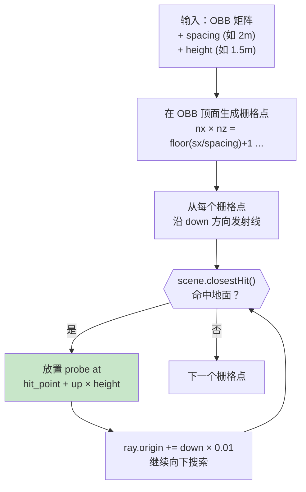
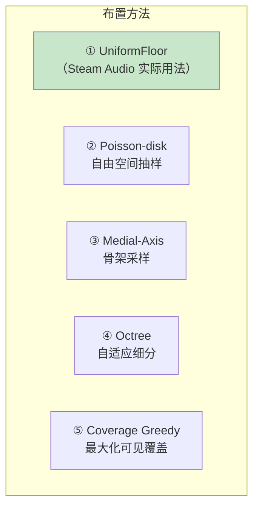
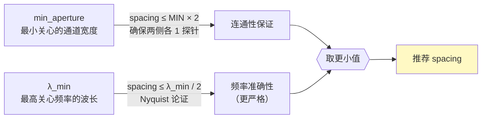
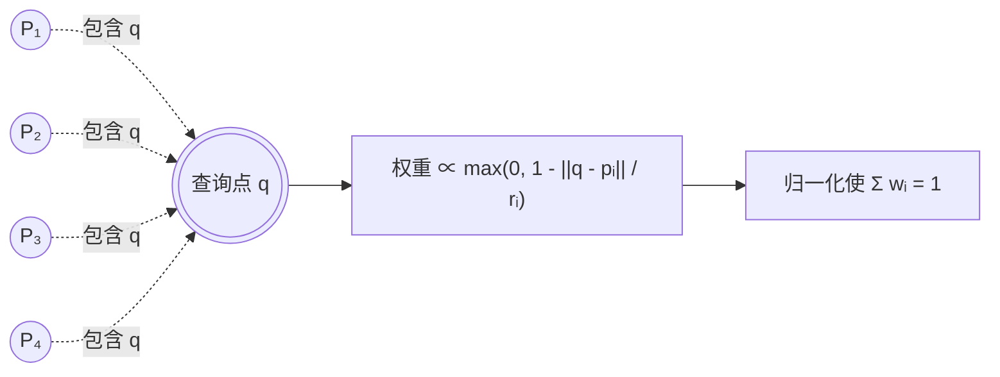

# 探针自动布置

探针是后续整条流水线的图节点。布置策略直接决定可见性图的拓扑是否能捕获真实的声学连通性。**Steam Audio 的实际做法非常朴素：在用户给定的 OBB 内，向下射线扫描，每命中一层地面就放一圈楼层栅格**[^21]。本页详述这个算法、对比更复杂的替代方案、并给出体素网格下的实现建议。

## Steam Audio 的 `UniformFloor` 算法



关键代码摘要[^21]：

```python
def generate_uniform_floor_probes(scene, obb, spacing=2.0, height=1.5):
    sx = length(obb.column_x)
    sz = length(obb.column_z)
    down = normalize(obb @ Vec4(0, -1, 0, 0))

    nx = floor(sx / spacing) + 1
    nz = floor(sz / spacing) + 1
    rx = (sx - (nx-1)*spacing) / 2   # centering residual
    rz = (sz - (nz-1)*spacing) / 2

    probes = []
    for i in range(nx):
        for j in range(nz):
            u = -0.5 + (i*spacing + rx) / sx
            v = -0.5 + (j*spacing + rz) / sz
            origin = obb @ Vec4(u, 0.5, v, 1)  # start at OBB top
            distance_remaining = obb_vertical_extent

            while distance_remaining > 0:
                hit = scene.closest_hit(Ray(origin, down),
                                        min_t=height,
                                        max_t=distance_remaining + height)
                if not hit: break

                # 放 probe 在命中点上方 height 处（耳平高度）
                probe_pos = origin + down * (hit.distance - height)
                probes.append(Probe(influence=Sphere(probe_pos, radius=spacing)))

                # 继续向下找多层楼
                origin = origin + down * (hit.distance + 0.01)   # kDownwardOffset
                distance_remaining -= (hit.distance + 0.01)

    return probes
```

### 三个值得注意的设计决定

| 决定 | 做法 | 为什么 |
|---|---|---|
| **高度偏置 `height=1.5m`** | 探针比地面高 1.5 m | 人耳约 1.5 m，让直接可见性反映听者视角 |
| **sphere radius = spacing** | 每探针影响半径等于间距 | 相邻影响球刚好相切，运行时点查能找到 ≥1 个邻居 |
| **多层向下穿透** | 命中后继续往下射 | 自动处理多层楼，`kDownwardOffset = 0.01` 防止自相交 |

## `Octree` 模式是假的

Steam Audio 的枚举声明了三种模式：

```cpp
enum class ProbeGenerationType { Centroid, UniformFloor, Octree };
```

但源码里 `ProbeGenerator::generateProbes` **对任何非 `Centroid`/`UniformFloor` 的值都抛异常**：

```cpp
throw Exception(Status::Initialization);
```

**开源版本里没有实现自适应八叉树布置**[^21]。这说明 Valve 内部可能有但未开放，或者基于验证发现"花哨的布置策略对最终音质改善甚微，均匀栅格够用"。

## 替代方案对比



| 方法 | 额外输入 | 实现复杂度 | 门洞处理 | 大开间处理 | 推荐场景 |
|---|---|---|---|---|---|
| ① UniformFloor | OBB | 低 | 靠密度 | 冗余探针 | 默认选择 |
| ② Poisson-disk | SDF | 中 | 靠 r 参数 | 稀疏 | 需要均匀密度但规避边界 |
| ③ Medial-axis | SDF + 骨架 | 高 | 自然在门中心 | 骨架稀疏 | 追求少探针多信息 |
| ④ Octree | SDF | 中高 | 自适应密化 | 自适应粗化 | 大型复杂场景 |
| ⑤ Greedy coverage | 可见性预计算 | 高 | 自动集中 | 自动稀疏 | 离线优化 |

**对于用户场景（有体素 + SDF，允许自定义附加字段）**，最值得考虑的升级是 **SDF 阈值过滤 + 均匀栅格**：

```python
def place_probes_voxel_aware(voxel_grid, sdf, spacing, min_clearance=0.3):
    """
    Uniform grid but reject probes too close to walls.
    Uses SDF to enforce acoustic sensibility (探针不能在墙缝里).
    """
    probes = []
    step = int(spacing / voxel_size)
    for z in range(0, voxel_grid.shape[0], step):
        for y in range(0, voxel_grid.shape[1], step):
            for x in range(0, voxel_grid.shape[2], step):
                if voxel_grid[z,y,x] == SOLID: continue
                if sdf[z,y,x] < min_clearance: continue  # 墙角不放
                probes.append((x*voxel_size, y*voxel_size, z*voxel_size))
    return probes
```

这在保持 O(N) 简单性的同时，避免了楼层射线投射这一步（体素本身就告诉你哪里是自由空间），也自动剔除了墙缝里的无用探针。

## 密度的定量准则

探针间距决定整个系统对几何细节的分辨率：



**例子**：
- 感兴趣频率上限 4 kHz → λ_min ≈ 8.5 cm → Nyquist 要求 spacing ≤ 4 cm
- 最小门宽 90 cm → 连通性要求 spacing ≤ 1.8 m
- **Steam Audio 默认 2 m** —— 妥协：连通性差强人意，频率不 Nyquist。但对游戏感知足够。

实际上声学 Portal 系统不需要 Nyquist 级密度 —— **探针是图节点**而不是波场采样点。连通性才是硬约束。

## 影响半径与权重

`Probe` 结构体只有一个字段：

```cpp
struct Probe { Sphere influence; };   // center + radius
```

影响半径决定**一个查询点被多少个探针"看到"**，继而决定运行时插值的邻域大小。Steam Audio 硬编码 `kMaxProbesPerBatch = 8`[^20]，即任何查询点最多取 8 个邻居探针加权。



实际权重计算在 `ProbeNeighborhood::calcWeights(point)`（源码未直接读取）。经验做法是**反距离加权**或**反距离平方加权**，均归一化。

## 总结：用户场景的推荐配置

```yaml
probe_placement:
  method: "voxel_aware_uniform"   # 结合体素 SDF 的简化版 UniformFloor
  spacing: 1.5                    # meters, 配合最小门宽 0.9m
  min_clearance: 0.30             # SDF > 0.3m 才放 (避开墙缝)
  influence_radius: 2.0           # 略大于 spacing, 保证重叠
  height_above_floor: null        # 体素场景下不需要, 直接用 SDF 阈值
  vertical_layers: "auto"         # 按楼层连通分量自动检测
```

连接到下一步 [4. 可见性图构建](4.%20可见性图构建.md)。

[^20]: [[steam-audio-pathing-source-breakdown|Steam Audio Pathing 源码级拆解]]
[^21]: [[steam-audio-probe-placement|Steam Audio 探针布置与可见性图]]

## Sources

| # | 标题 | Raw Note | Original |
|---|------|----------|----------|
| 20 | Steam Audio Pathing 源码级拆解 | [[steam-audio-pathing-source-breakdown]] | [probe_generator.cpp](https://raw.githubusercontent.com/ValveSoftware/steam-audio/master/core/src/core/probe_generator.cpp) |
| 21 | Steam Audio 探针布置与可见性图 | [[steam-audio-probe-placement]] | [Steam Audio Guide](https://valvesoftware.github.io/steam-audio/doc/capi/guide.html) |
