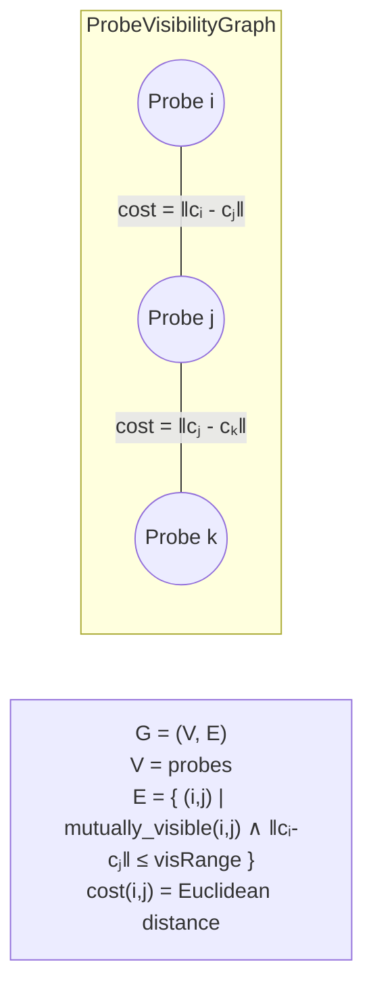
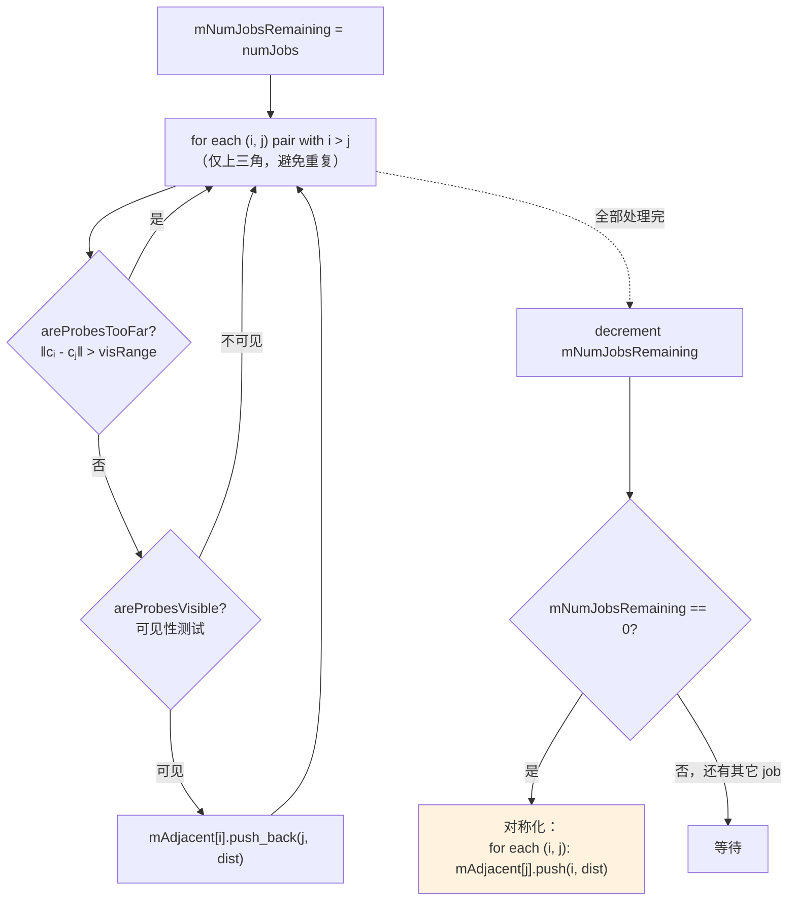
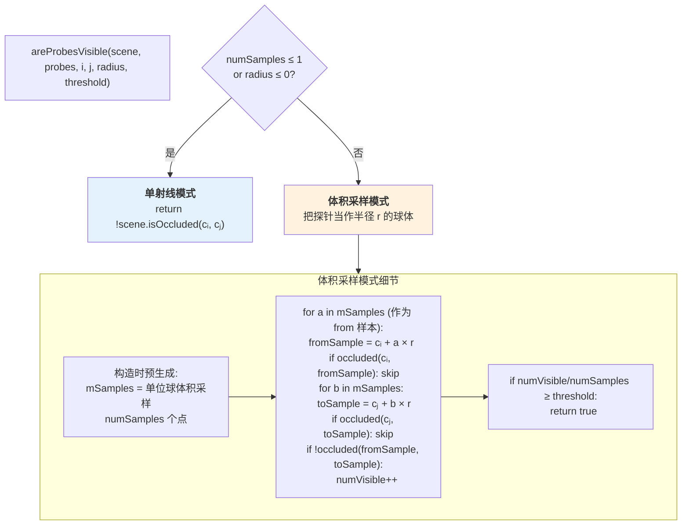
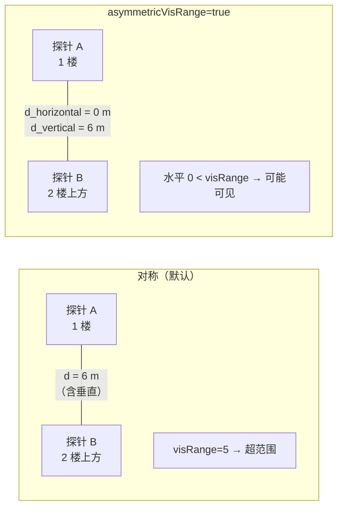
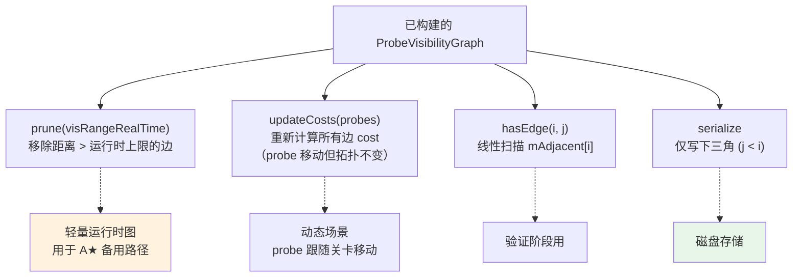

# 可见性图构建

可见性图是**整个系统里声学连通性的唯一载体**。探针只是点，路径表只是它的衍生物，真正编码"建筑里哪里能听见哪里"的就是这张图。本页详述 Steam Audio 的构建算法、两种可见性测试模式、以及体素网格场景下的优化建议。

## 图的数学定义



数据结构[^21]：

```cpp
struct AdjacencyListEntry { int index; float cost; };

class ProbeVisibilityGraph {
    vector<vector<AdjacencyListEntry>> mAdjacent;   // 稀疏邻接表
    // mAdjacent[i] 存所有与 i 互相可见的 probes + 它们的 Euclidean 距离
};
```

注意：**edge cost 仅是空间距离**，没有任何材质惩罚、没有角度惩罚、没有频率相关项。所有"声学意义"都在图结构本身（哪些对存在边）和后续 SoundPath 的 deviation 里。

## 构建算法



**并行粒度**：整个构建过程用 `JobGraph` 把邻接表的行拆成 N 个 job，每 job 处理若干 `i`，遍历所有 `j < i`。最后一个完成的 job 负责对称化（通过 atomic `mNumJobsRemaining` 计数）[^21]。

**复杂度**：O(N²/2) 对 × O(ray_cost) 每对。对 1000 探针约 50 万对，单射线版本每对 ~10 μs，总计 ~5 秒；体素化 ~64-样本模式则扩大到分钟级。

## 可见性测试的两种模式

`ProbeVisibilityTester` 的构造参数 `numSamples` 决定模式：



### 两种模式的权衡

| 维度 | 单射线模式 | 体积采样模式 |
|---|---|---|
| 每对射线数 | 1 | 最多 numSamples² |
| 对窄通道的鲁棒性 | 差（可能错过） | 好 |
| 误报（透墙） | 几乎没有 | 略高 |
| 烘焙耗时 | 秒级（1000 probes） | 分钟级 |
| 适用场景 | 粗糙预览 / 大场景 | 正式烘焙 |

**`threshold` 的精妙之处**：代码里对 `numVisible` 的除数是 `mSamples.size()`（样本数），不是 `mSamples.size()²`（总样本对数）[^21]。这意味着**只要有任意一个 from 样本对应的若干 to 样本通过，就可能达到阈值** —— 是一个**非常宽容**的判定。实际上这个设定是有意的："大部分方向能穿过就算可见"。

## 不对称可见范围

多层建筑需要"水平可联通、垂直不可联通"的特殊处理。`areProbesTooFar` 支持：

```cpp
Vector3f disp = probes[i].center - probes[j].center;
if (asymmetric) {
    disp -= dot(disp, mDown) * mDown;   // 去除垂直分量
}
return (disp.length() > visRange);
```



这个技巧让你可以设置 `visRange = 30 m`，然后同一楼层 30 m 内的探针都能连边，但竖直方向不会错误地跨楼层连接（除非它们真能看见对方）。

## 为体素场景优化：3D-DDA 射线行走

Steam Audio 的 `scene.isOccluded(a, b)` 对三角网格要走 BVH。**体素网格场景下有个直接的胜利：3D-DDA**（Amanatides & Woo 1987），复杂度 O(max(Δx, Δy, Δz))，**每步只是一次数组索引**。

```python
def voxel_occluded(voxel_grid, a, b):
    """Amanatides-Woo 3D-DDA ray traversal."""
    dir = b - a
    length = norm(dir)
    dir = dir / length

    # 当前体素
    ix, iy, iz = int(a.x), int(a.y), int(a.z)

    # 每轴方向
    step_x = 1 if dir.x > 0 else -1
    step_y = 1 if dir.y > 0 else -1
    step_z = 1 if dir.z > 0 else -1

    # 参数化距离到下一个体素边界
    t_max_x = ((ix + (step_x > 0)) - a.x) / dir.x
    t_max_y = ...  # 类推
    t_delta_x = step_x / dir.x   # 每穿越一个体素增加的 t
    ...

    t = 0
    while t < length:
        if voxel_grid[iz, iy, ix] == SOLID:
            return True   # occluded
        # 前进到下一个体素
        if t_max_x < t_max_y and t_max_x < t_max_z:
            ix += step_x; t = t_max_x; t_max_x += t_delta_x
        elif t_max_y < t_max_z:
            iy += step_y; t = t_max_y; t_max_y += t_delta_y
        else:
            iz += step_z; t = t_max_z; t_max_z += t_delta_z
    return False
```

**性能**：对 5cm 体素跨 20 m 路径约 400 步，每步 ~5 ns → 每次 isOccluded 约 2 μs。比三角网格 BVH 快 ~5×。

对于 1000 探针的烘焙：

| 模式 | 射线数 | 预估总时 |
|---|---|---|
| 单射线 | ~500k | 1 秒 |
| 16 采样 | ~500k × 256 = 128M | 5 分钟 |
| 64 采样 | ~500k × 4096 = 2G | 很慢 |

**推荐：单射线足够**，因为探针密度保证了冗余 —— 一个门洞被多对探针覆盖，就算某一对单射线误判，其它对会补上。体积采样在密度不足或追求顶级质量时才启用。

## 图的修改与查询

Steam Audio 的 `ProbeVisibilityGraph` 支持几个后续操作：



**双范围策略**：
- `visRange` 烘焙时 —— 宽（如 50 m），让图足够密以容纳长距离最短路
- `visRangeRealTime` 加载后 —— 窄（如 10 m），减少运行时 A★ 的搜索空间

两阶段 `prune` 让烘焙期的完整路径不受运行时图稀疏化影响 —— `BakedPathData` 已经把最终路径存好了，运行时的小图只在验证和备用 A★ 时用。

## 序列化的技巧

**只写下三角** `j < i`：节省一半磁盘。加载时对称补齐。对 1000 探针稀疏图（每节点均 20 邻居）：
- 下三角边数：约 10,000
- 每边 4 字节 index + 4 字节 cost = 8 字节
- 总计约 80 KB（压缩前）

这是整个烘焙产出里最小的部分。真正的大头在 BakedPathData，见 [6. SoundPath 存储结构](6.%20SoundPath%20存储结构.md)。

## 参数建议总结

| 参数 | 默认 | 用户场景推荐 | 说明 |
|---|---|---|---|
| `numSamples` | 1 | 1 (快速) / 16 (高质) | 射线数 |
| `radius` | = spacing | = spacing | 探针球半径 |
| `threshold` | 0.1 - 0.5 | 0.3 | 可见采样分数阈值 |
| `visRange` | 50 m | 50 m | 烘焙可见范围 |
| `visRangeRealTime` | 10 m | 10 m | 运行时图可见范围 |
| `pathRange` | 100 m | 80 m | Dijkstra 最长累计距离 |
| `asymmetricVisRange` | false | **true**（多层建筑） | 启用水平/垂直分离 |
| `down` | (0,-1,0) | (0,-1,0) | 重力方向 |

[^20]: [[steam-audio-pathing-source-breakdown|Steam Audio Pathing 源码级拆解]]
[^21]: [[steam-audio-probe-placement|Steam Audio 探针布置与可见性图]]

## Sources

| # | 标题 | Raw Note |
|---|------|----------|
| 20 | Steam Audio Pathing 源码级拆解 | [[steam-audio-pathing-source-breakdown]] |
| 21 | Steam Audio 探针布置与可见性图 | [[steam-audio-probe-placement]] |
