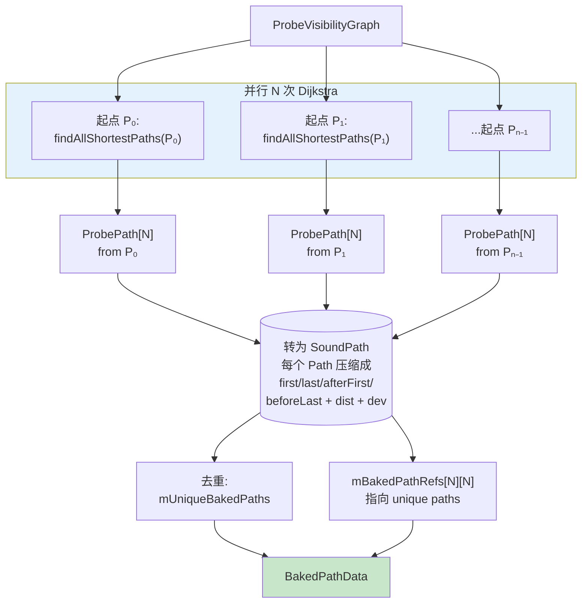
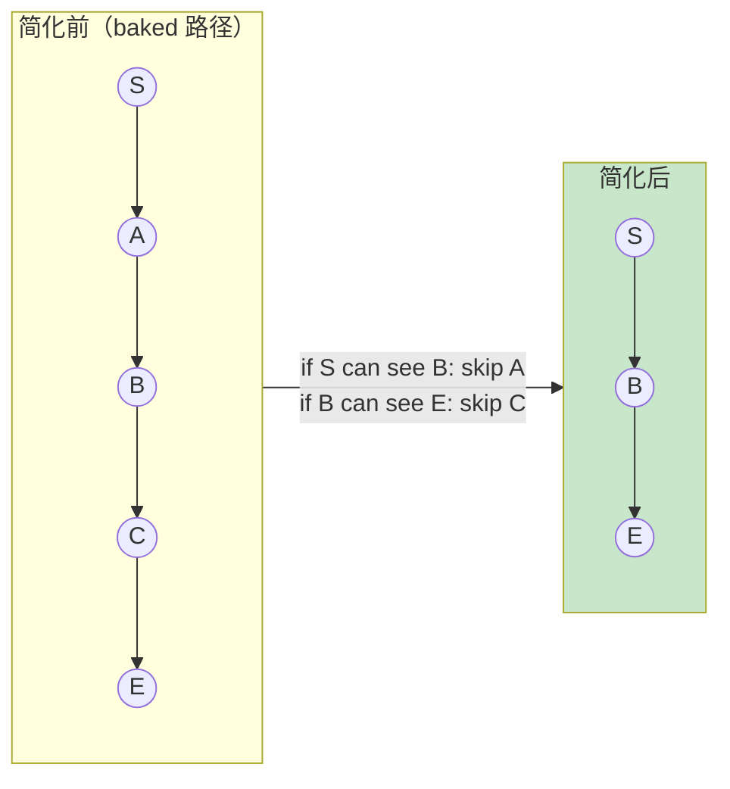
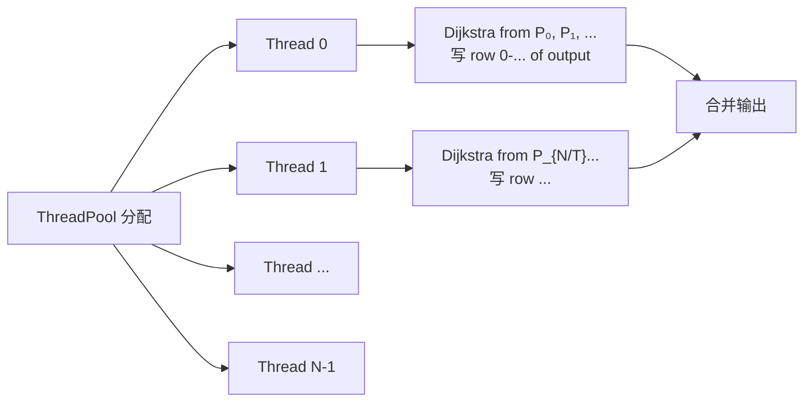
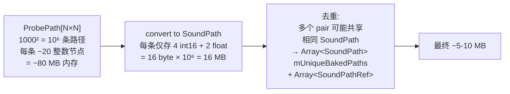

# 烘焙阶段：Dijkstra 全对最短路

有了可见性图后，烘焙的核心计算是**对每个探针作为起点跑一次 Dijkstra**。`N` 个探针就是 `N` 次 Dijkstra，每次得到从该起点到所有其它探针的最短路 + 路径节点序列。N 条路径保存为结构化的 `ProbePath`，随后去重压缩到 `SoundPath`。本页解剖这个过程的算法细节。

## 算法全貌



## Dijkstra 的具体实现

`PathFinder::findAllShortestPaths` —— 标准优先队列 Dijkstra + `pathRange` 截断[^20]：

```python
def find_all_shortest_paths(scene, probes, vis_graph, start, path_range):
    N = probes.num_probes()
    costs = [INFINITY] * N
    parents = [-1] * N
    costs[start] = 0

    pq = PriorityQueue()   # min-heap, 见下
    pq.push((start, 0))

    while not pq.empty():
        u, _ = pq.pop_min()
        for (v, edge_cost) in vis_graph.mAdjacent[u]:
            new_cost = costs[u] + edge_cost
            if new_cost > path_range:      # 截断
                continue
            if new_cost < costs[v]:
                costs[v] = new_cost
                parents[v] = u
                pq.push((v, new_cost))

    # 重构每个终点的路径
    paths = []
    for i in range(N):
        path = reconstruct(parents, start, i)
        paths.append(path)
    return paths


def reconstruct(parents, start, end):
    nodes = []
    current = end
    while current != start and current != -1:
        nodes.append(current)
        current = parents[current]
    nodes.reverse()
    return ProbePath(start, end, nodes)
```

### 关键细节

| 设计 | 代码里的实现 | 为什么 |
|---|---|---|
| **优先队列** | `std::priority_queue<PriorityQueueEntry>` | 标准 min-heap，不支持 decrease-key，所以用**延迟删除**（一个节点可能被 push 多次，每次 pop 后检查是否过期） |
| **min-heap 技巧** | `operator<` 实现成 `lhs.cost > rhs.cost` | 把默认 max-heap 变成 min-heap |
| **路径范围截断** | `if (newCost > pathRange) continue;` | 控制 BakedPathData 大小，远距离 probes 不存 SoundPath |
| **per-thread 状态** | `mCosts(numThreads, N)`, `mParents(numThreads, N)` | 多个 Dijkstra 可并行，无需锁 |

### 为什么不用更高级的算法

| 算法 | 复杂度 | 不用的原因 |
|---|---|---|
| **Dijkstra** | O(E log V) | 当前选择，够用 |
| **Contraction Hierarchies** | O(log V) 查询，O(V log² V) 预处理 | 游戏探针数 V ~ 10³-10⁴，CH 的启动成本超过省下的时间 |
| **A★** | 近乎 O(V) | 用于**单对**查询；烘焙是全对，Dijkstra 更合适 |
| **Floyd-Warshall** | O(V³) | 密集图情景，但这里图稀疏，O(V·E·logV) = Dijkstra × N 更快 |

对 1000 探针，稀疏图 ~20 邻居/点，单次 Dijkstra ~20 μs，全对 ~20 ms。再加 16 线程并行，**几乎是瞬间完成**。真正的开销在可见性图构建（射线投射）而非 Dijkstra。

## 运行时的 A★

运行时如果 baked path 被动态几何挡住，需要找备用路径。这时用 **A★**：

```python
def find_shortest_path_astar(scene, probes, vis_graph, start, end):
    # A★ = Dijkstra + Euclidean heuristic
    def h(v):
        return (probes[v].center - probes[end].center).length()

    costs = [INFINITY] * N
    costs[start] = 0
    pq = PriorityQueue()
    pq.push((start, 0 + h(start)))   # f = g + h

    while not pq.empty():
        u, f = pq.pop_min()
        if u == end: break
        for (v, edge_cost) in vis_graph.mAdjacent[u]:
            new_cost = costs[u] + edge_cost
            if new_cost < costs[v]:
                costs[v] = new_cost
                parents[v] = u
                pq.push((v, new_cost + h(v)))

    return reconstruct(parents, start, end)
```

Euclidean 启发式是**可采纳（admissible）的** —— 它从不高估真实距离（空间两点的直线就是最短可能距离）—— 所以 A★ 仍然返回真正的最短路。实际比 Dijkstra 节省大量 pop 数，适合运行时单对查询。

## 路径简化：去除冗余转弯

烘焙时的图用 `visRange = 50 m`，运行时图用 `visRangeRealTime = 10 m`（稀疏化节省内存）。这导致 baked path 可能**在运行时图里变得锯齿** —— 某些中间节点在稀疏图里失去了邻居。`simplifyPath` 用**祖父节点跳跃**修正：



```python
def simplify_path(scene, parents, start, end, real_time_vis):
    current = end
    while current != start:
        parent = parents[current]
        grandparent = parents[parent] if parent != start else start
        if grandparent == start or visible(parent, grandparent):
            # 检查 current 直接到 grandparent 是否可见
            if visible(current, grandparent):
                parents[current] = grandparent   # 跳过 parent
                # 不前进，看能否继续跳
                continue
        current = parents[current]
```

**"可见"可以是图里的边存在，也可以是实时射线检测**（`realTimeVis=true`）。后者对动态几何更鲁棒但更贵。

## 并行策略

`ThreadPool` 分配起点：thread i 负责一组起点 probes，各自跑自己的 Dijkstra，写到 `mParents(threadIndex, ...)` 和 `mCosts(threadIndex, ...)` 对应行。



**内存安全**：每个线程完全独立的 `mParents` 行 + `mCosts` 行 + `mPriorityQueue[thread]`。唯一的共享只读访问是 `vis_graph`，无需锁。

## 烘焙产物：ProbePath[N][N] → SoundPath

Dijkstra 的直接输出是 N×N 的 `ProbePath`（每一对的完整节点序列）。这个规模太大，需要压缩：



SoundPath 是关键的压缩设计，详见 [6. SoundPath 存储结构](6.%20SoundPath%20存储结构.md)。

## 烘焙代价总结

以 1000 探针、16 线程为例：

| 阶段 | 单线程耗时估计 | 16 线程 |
|---|---|---|
| 可见性图构建（单射线） | 5 秒 | < 1 秒 |
| 可见性图构建（16 采样体积） | 5 分钟 | 30 秒 |
| Dijkstra 全对 | 20 秒 | 2 秒 |
| SoundPath 压缩去重 | 1 秒 | 1 秒 |
| 序列化 | 1 秒 | 1 秒 |
| **总计（体积模式）** | **~6 分钟** | **~40 秒** |
| **总计（单射线）** | **~30 秒** | **~6 秒** |

对比 Project Acoustics 的 **数小时级**云端烘焙，这个速度适合**关卡迭代期**频繁重烘。

[^20]: [[steam-audio-pathing-source-breakdown|Steam Audio Pathing 源码级拆解]]

## Sources

| # | 标题 | Raw Note | Original |
|---|------|----------|----------|
| 20 | Steam Audio Pathing 源码级拆解 | [[steam-audio-pathing-source-breakdown]] | [path_finder.cpp](https://raw.githubusercontent.com/ValveSoftware/steam-audio/master/core/src/core/path_finder.cpp) |
