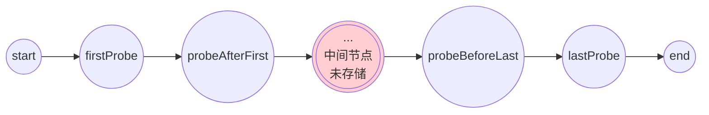
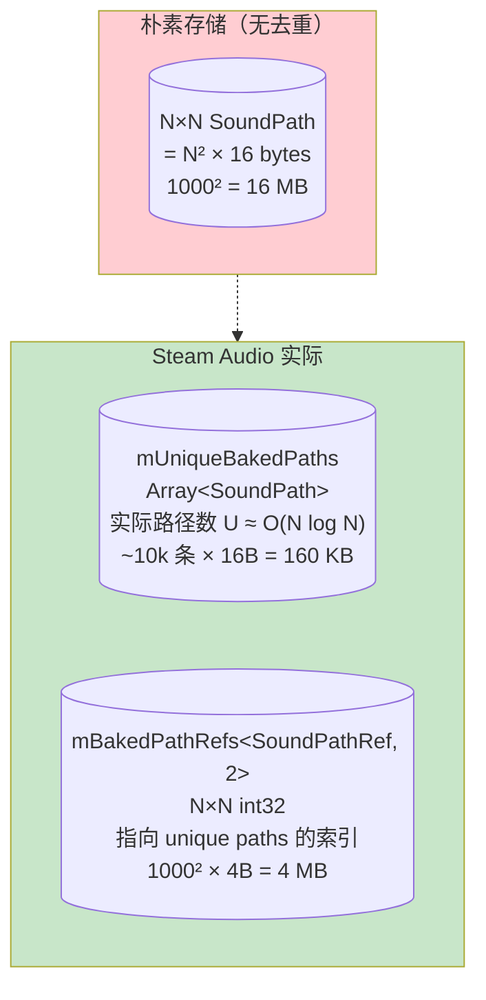
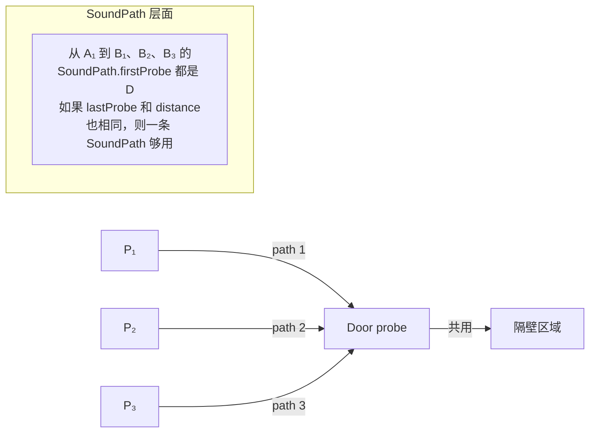

# SoundPath 存储结构

全对最短路有 N² 条；每条平均 20 个节点；如果朴素保存，1000 探针要 80 MB。Steam Audio 把每条路径压缩到 **16 字节**，加去重后整个烘焙产物 ~5 MB[^20]。这一页拆解这个压缩是怎么做到的，以及它失去/保留了什么。

## SoundPath 结构体

```cpp
struct SoundPath {
    int16_t firstProbe;         // 路径中第二个节点（起点旁）
    int16_t lastProbe;          // 路径中倒数第二个节点（终点旁）
    int16_t probeAfterFirst;    // 第三个节点（如果有）
    int16_t probeBeforeLast;    // 倒数第三个节点（如果有）
    bool    direct;             // 是否直接 LOS
    float   distanceInternal;   // firstProbe 到 lastProbe 之间的路径长度
    float   deviationInternal;  // firstProbe 到 lastProbe 之间的累积转弯角
};  // ~16 bytes
```

**注意**：起点和终点 probe 的索引**不存在 SoundPath 里**。它们由上下文（`mBakedPathRefs[start][end]`）的索引提供。SoundPath 只存**中间信息**。

## 为什么只存 4 个中间节点？



两个设计动机：

### ① 运行时只需要"端点方向"

Steam Audio 的运行时 DSP 需要这几个信息：
1. **路径总长度**（distance attenuation）— 已存 `distanceInternal` + 两端到 first/last 的距离
2. **路径总偏折角**（UTD 衰减）— 已存 `deviationInternal` + 两端接合角
3. **虚拟声源位置**（SH 方向）— 需要 `lastProbe` 的方向 + 总长度
4. **端点附近的局部几何**（接合角计算）— 需要 `firstProbe`、`probeAfterFirst`、`probeBeforeLast`、`lastProbe`

**中间节点在运行时用不到** —— 它们只决定了 distance 和 deviation 两个标量，这两个标量已经在烘焙时预计算好了。

### ② 需要重构时可以懒加载

偶尔需要完整节点链（如验证阶段的逐段 occlusion 检查）。Steam Audio 提供 `reconstructProbePath`[^20]：

```python
def reconstruct_probe_path(sound_path, start, end, baked_data):
    """通过链式查表重建完整路径节点。"""
    nodes = [start]
    current_sp = sound_path
    current_start = start
    while True:
        nodes.append(current_sp.firstProbe)
        if current_sp.firstProbe == current_sp.lastProbe:
            break  # 只有 1 个中间节点
        if current_sp.probeAfterFirst == current_sp.probeBeforeLast:
            nodes.append(current_sp.probeAfterFirst)
            break
        # 递归：从 probeAfterFirst 到 probeBeforeLast 查子路径
        sub_sp = baked_data.lookup_shortest_path(
            current_sp.probeAfterFirst,
            current_sp.probeBeforeLast)
        current_sp = sub_sp
        current_start = sub_sp.firstProbe
        # 累积

    nodes.append(current_sp.lastProbe)
    nodes.append(end)
    return nodes
```

本质上，一条长链被分段存储：**每条 SoundPath 记住两端的"口子"** + 距离和偏折 + 中间段的递归入口。如果想还原全链，就递归查表。

## 去重：Array<SoundPath> + 引用表



```cpp
struct SoundPathRef {
    int32_t index;   // 0 = invalid path; >0 = 索引到 mUniqueBakedPaths
};

class BakedPathData {
    Array<SoundPath> mUniqueBakedPaths;      // 去重后的路径集
    Array<SoundPathRef, 2> mBakedPathRefs;   // N×N 引用表
    ...
};
```

查询：
```cpp
SoundPath BakedPathData::lookupShortestPath(int start, int end) {
    SoundPathRef ref = mBakedPathRefs(start, end);
    if (ref.index == 0) return SoundPath();   // invalid
    return mUniqueBakedPaths[ref.index];
}
```

两次数组访问，O(1) 查询，O(1) 内存拷贝（16 字节）。

### 为什么 unique paths ≈ O(N log N)？

实际去重率很高，因为**很多对探针共享相同的最短路形状**：



经验上稀疏图的 unique path 数大约是 `N × log(N)` 到 `N × avg_degree`。对 1000 探针约 5k-20k 条。

## 完整存储预算

1000 探针典型场景：

| 数据 | 字节数 | 占比 |
|---|---|---|
| `mBakedPathRefs` (N² × 4) | 4,000,000 | 67% |
| `mUniqueBakedPaths` (~10k × 16) | 160,000 | 3% |
| `ProbeVisibilityGraph` 边（~50k × 8） | 400,000 | 7% |
| `ProbeArray` (1000 × 16) | 16,000 | < 1% |
| 其它元数据 | ~50,000 | 1% |
| **合计** | **~4.6 MB** | 100% |

**N=5000 探针**（大型关卡）：refs 表会炸到 100 MB，这是 Steam Audio 的**规模上限警戒线**。想进一步扩大，得分 batch 或改用 Contraction Hierarchies。

## 权衡：压缩保留了什么、丢了什么

| 语义 | 是否保留 |
|---|---|
| 路径总长度 | ✅ 精确 |
| 路径总偏折角（→ UTD EQ） | ✅ 精确 |
| 到达方向（取最后一跳） | ✅ 精确 |
| 中间节点是哪些 | ⚠️ 仅首/末两跳 + 递归重构可得 |
| 每段的具体几何 | ❌ 丢失（只知道累积量） |
| 每段的材质/透射属性 | ❌ 未存（Steam Audio 整体就不存材质） |

**丢失的中间几何**在运行时不需要 —— 声学感知只关心总能量和主方向。但如果后续想做**频带-per-segment 透射**（走三扇不同材质的门，每扇衰减不同），这个架构就不够了 —— 得扩展 SoundPath 存每段的累积衰减谱。

## 序列化的 FlatBuffers

Steam Audio 用 FlatBuffers（`.fbs`）做序列化[^20]。好处：
- **零拷贝读取** —— 加载时 mmap 文件，直接转指针，不反序列化
- **前向兼容** —— 字段可加可隐（旧代码读新文件，未知字段忽略）

`baked_reflection_data.fbs` 和类似文件定义 schema。运行时加载就是 `mmap(file) → cast to Serialized::BakedPathingData*`。启动延迟 < 10 ms。

## 用户场景的适配建议

假设用户想在 C++ 自研一个精简版：

```cpp
// 推荐最小数据结构
struct SoundPath {
    uint16_t firstProbe, lastProbe;       // 注：uint16_t 够 65535 探针
    uint16_t afterFirst, beforeLast;
    float distance;                        // 路径总长
    float deviation;                       // 总偏折角（弧度）
    // 可选扩展：
    // uint8_t transmissionBandIndex;      // 透射材质类别
};

struct BakedPathData {
    uint32_t numProbes;
    std::vector<SoundPath> uniquePaths;    // 去重池
    std::vector<int32_t> refs;             // N×N 大小，row-major
    // 按 refs[src * N + lst] 查询

    // 可见性图用 CSR 格式（比 vector<vector> 更 cache 友好）
    std::vector<uint32_t> adjOffsets;      // 长度 N+1
    std::vector<uint32_t> adjIndices;
    std::vector<float>    adjCosts;
};
```

CSR（Compressed Sparse Row）对图的内循环 cache 友好，比 `vector<vector<>>` 的双层间接访问快 2-3×。详见 [9. 运行时查询与 DSP](9.%20运行时查询与%20DSP.md)。

[^20]: [[steam-audio-pathing-source-breakdown|Steam Audio Pathing 源码级拆解]]

## Sources

| # | 标题 | Raw Note | Original |
|---|------|----------|----------|
| 20 | Steam Audio Pathing 源码级拆解 | [[steam-audio-pathing-source-breakdown]] | [path_data.h](https://raw.githubusercontent.com/ValveSoftware/steam-audio/master/core/src/core/path_data.h) |
