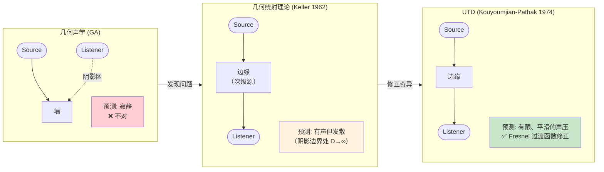
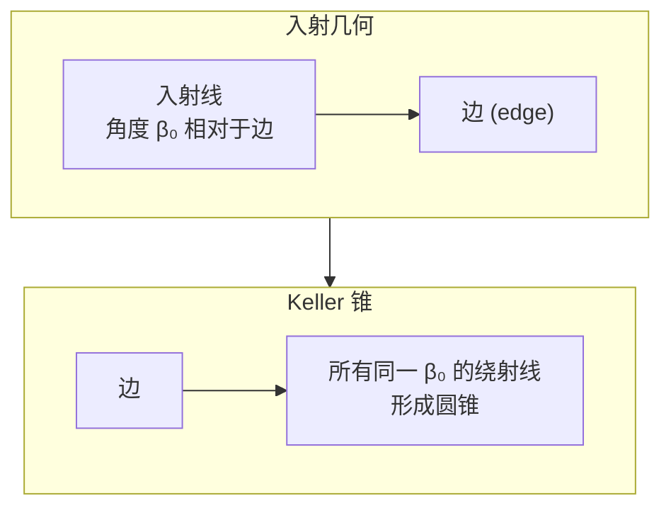
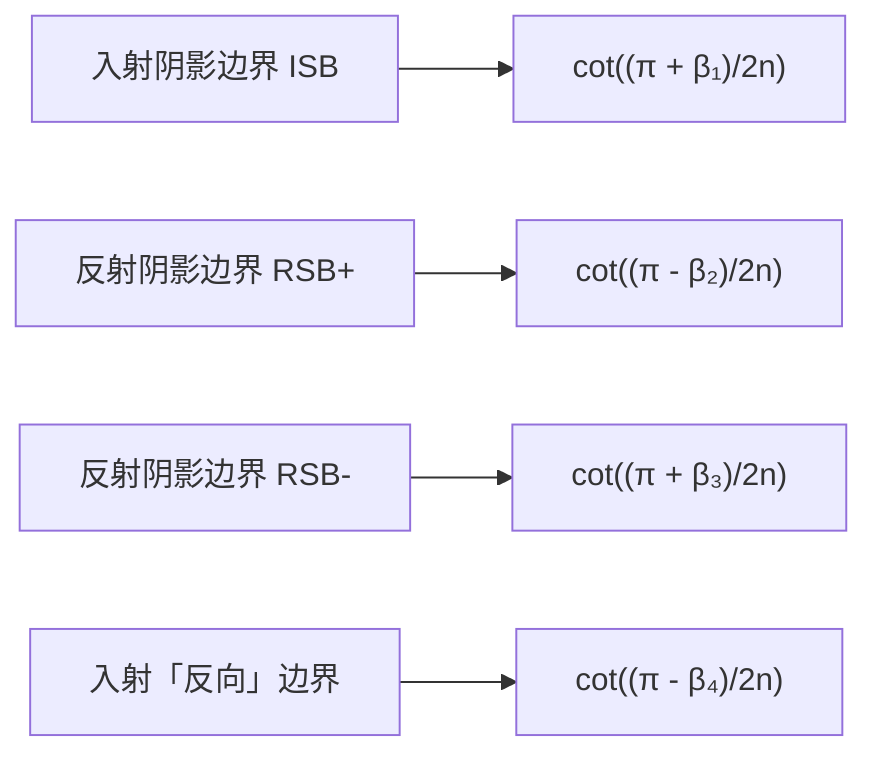
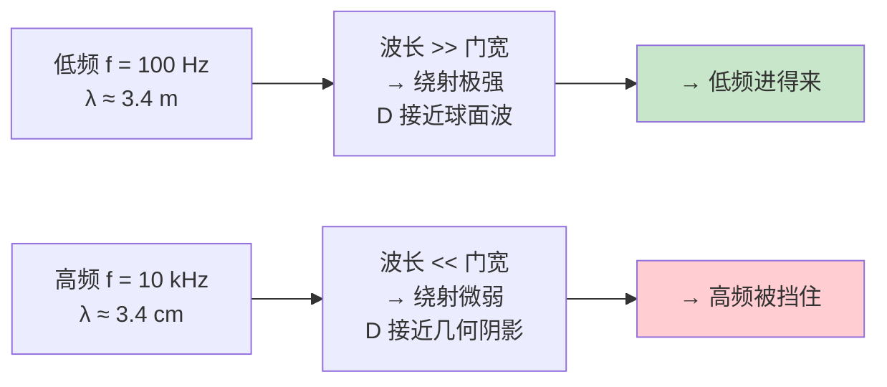
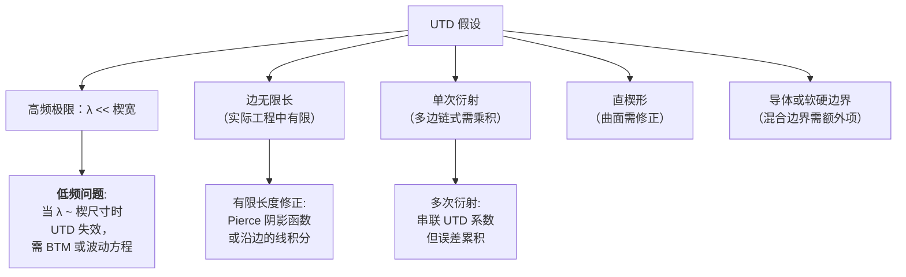

# UTD 绕射理论

声音遇到边缘会绕过去 —— 这就是为什么你在门外仍然听得到屋里的对话。几何声学 (GA) 只追射线，预测绕角后完全寂静，明显错误。**UTD (Uniform Theory of Diffraction)** 修正这一点，把边缘当作次级声源，给出一个频率相关的绕射系数 `D`，让声场在阴影区也有合理的响应[^22]。本页解释 UTD 的物理、公式和局限，为后续理解 Steam Audio 的"假 UTD"做铺垫。

## 为什么需要 UTD



## Keller 锥：绕射的几何约束

当一条入射声线击中一个直边，绕射声线不是任意方向，而是**分布在一个以边为轴的圆锥面上** —— Keller 锥。锥的半角等于入射线与边的夹角 `β₀`（镜面反射原理的推广）。



物理含义：**只有沿 Keller 锥方向的绕射才"存在"**。锥之外的方向是禁止的。这给绕射一个非常特殊的几何约束 —— 不是各向同性辐射。

## UTD 衍射系数公式

标准的 UTD 楔形（wedge of exterior angle `nπ`）衍射系数[^22]：

$$D = \frac{-e^{-j\pi/4}}{2n\sqrt{2\pi k}\,\sin\beta_0} \sum_{m=1}^{4} \cot\!\left(\frac{\pi \pm \beta_m}{2n}\right)\, F(kLa_m(\beta_m))$$

其中：

| 符号 | 含义 |
|---|---|
| `k = 2πf/c` | 波数（与频率成正比） |
| `n` | 楔形外角系数（`nπ` = 楔外角，half-plane 对应 n=2） |
| `β₀` | 入射线与楔边的夹角 |
| `φ, φ'` | 入射/衍射在楔横截面内的方位角 |
| `L` | 距离参数 `ss'/(s+s')`，球面波修正 |
| `F(x)` | Fresnel 过渡函数（见下） |
| `cot(...)` | 四个余切项对应**四条阴影/反射边界** |
| `a(β) = 2 cos²(πnN - β/2)` | N± 是最接近 πn 的整数（由 β 与 πn 的差决定） |

### 四个余切项的物理意义

每个 cotangent 对应 `D` 场的一条**间断线**：



在每条边界**穿越时** cotangent 无穷大 → Fresnel 过渡函数 `F(kLa)` 也同时趋近于特殊值，两者相乘保持有限且平滑。这正是 UTD 对 GTD 的关键修正。

### Fresnel 过渡函数

$$F(x) = 2j\sqrt{x}\,e^{jx} \int_{\sqrt{x}}^{\infty} e^{-j\tau^2}\,d\tau$$

远场（`x` 大）时 `F→1`（过渡不再影响），近场（`x` 小）时 `F→0` 平滑至零。Steam Audio 的实现用分段近似[^22]：

```python
def fresnel_approx(x):
    if x < 0.8:
        return (sqrt(pi*x) * (1 - sqrt(x)/(0.7*sqrt(x) + 1.2))
                * exp(1j*pi/4 * sqrt(x/(x+1.4))))
    else:
        return (1 - 0.8/(x+1.25)**2) * exp(...)
```

典型游戏音频精度下足够。

## 频率依赖性

这是 UTD 最重要的感知特征：



定量上，`|D| ∝ 1/√(k·L) ∝ 1/√f`。高频衍射系数幅值以 -3 dB/倍频程下降。这给出**阴影区自然的低通响应** —— 这正是人耳对"隔墙传来的声音"的感知印象。

## UTD 的局限



**在游戏里最大的问题是 (L3) 多次衍射**：声音绕过两个门，每个门贡献一个 UTD 系数，相乘就是总衰减。实际做会发现误差累积到不可接受，所以高阶衍射通常截断到 1-2 阶。

## BTM：更精确但更贵

**Biot-Tolstoy-Medwin** 方法不用几何近似，而是把衍射场表示为沿边的**时域线积分**：

$$p_{\text{diff}}(t) = -\frac{c}{4\pi} \int_{\text{edge}} H(t - \tau(s))\, \frac{\cos(\ldots)}{\sin(\ldots)}\, ds$$

### UTD vs BTM

| 维度 | UTD | BTM |
|---|---|---|
| 物理精度 | 高频 OK，低频退化 | 全频段精确 |
| 有限边处理 | 需要额外修正 | 天然处理（积分限） |
| 楔形任意角 | 需要 n 参数 | 任意角度都可 |
| 计算量 | 一个复数公式 | 沿边数值积分，10× 以上 |
| 时域 / 频域 | 频域 | 时域（本质是卷积核） |
| 游戏实用性 | ✅ 实用 | ❌ 太贵 |

Steam Audio 选 UTD；Project Acoustics 用波动方程（相当于所有效应都"免费"，但烘焙巨贵）。

## Tsingos 2001 的"真 UTD Pipeline"

作为对比，看看"物理正确" UTD 是怎么做的[^22]：

```mermaid
flowchart TD
    subgraph OFFLINE["离线预计算"]
        BSP[场景 BSP 树]
        EDGES[从多边形提取直边 silhouette edges]
        SOURCE[源位置发射光束]
        BEAM["光束追踪:<br/>反射 + 透射 + 衍射<br/>每次遇边生成次级光束"]
        PRUNE[按能量剪枝]
        TREE[Beam Tree]
    end

    subgraph RUNTIME["运行时"]
        LIS[listener 位置]
        LOOKUP["在 Beam Tree 中定位<br/>包含 listener 的叶 beam"]
        RECON["重构 source → edge₁ → edge₂ → lis 路径"]
        UTD_EVAL["per edge 真实 UTD 公式<br/>用真实 n, β₀, L, φ, φ&#39;"]
        IR[合成 impulse response]
    end

    OFFLINE --> RUNTIME
    BSP --> EDGES --> SOURCE --> BEAM --> PRUNE --> TREE
    LIS --> LOOKUP --> RECON --> UTD_EVAL --> IR

    style OFFLINE fill:#e3f2fd
    style RUNTIME fill:#fff3e0
```



对比 Steam Audio 的做法：**Tsingos 的每一条边都有真实几何参数**。Steam Audio 用"路径总弯角"作代理量，完全丢掉了每条边的身份。这是精度换性能的极致选择。

下一页 [8. Steam Audio 的偏折角-UTD 近似](8.%20Steam%20Audio%20的偏折角-UTD%20近似.md) 详解这个代理量怎么用。

## 参数快速参考

```python
# 游戏应用常用的 UTD 参数
n = 2.0           # 半平面（flat edge） - 大多数门框近似如此
beta0 = pi/2      # 声线垂直入射（近似）
L_typical = 1.0   # 米，源-边和边-听者都 ~1m
k = 2*pi*f/343    # c=343 m/s at 20°C

# 频段典型值
bands = [
    (125, 250),    # 低频
    (250, 500),
    (500, 1000),
    (1000, 2000),
    (2000, 4000),
    (4000, 8000),  # 高频
]
```

[^22]: [[utd-diffraction-steam-audio-vs-tsingos|UTD 绕射：Steam Audio vs Tsingos]]

## Sources

| # | 标题 | Raw Note | Original |
|---|------|----------|----------|
| 22 | UTD 绕射：Steam Audio vs Tsingos | [[utd-diffraction-steam-audio-vs-tsingos]] | [Tsingos SIGGRAPH 2001](https://pixl.cs.princeton.edu/pubs/Tsingos_2001_MAI/index.php) |
| 22 | UTD 公式实现细节 | [[utd-diffraction-steam-audio-vs-tsingos]] | [MDPI UTD review](https://www.mdpi.com/2073-8994/12/4/654/xml) |
