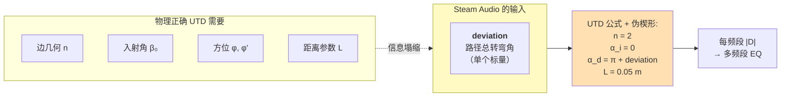
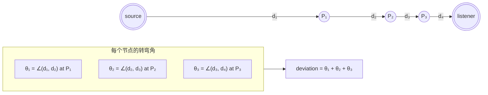
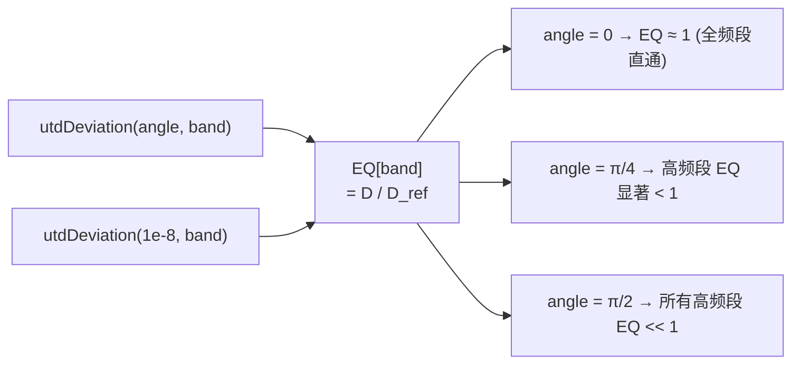
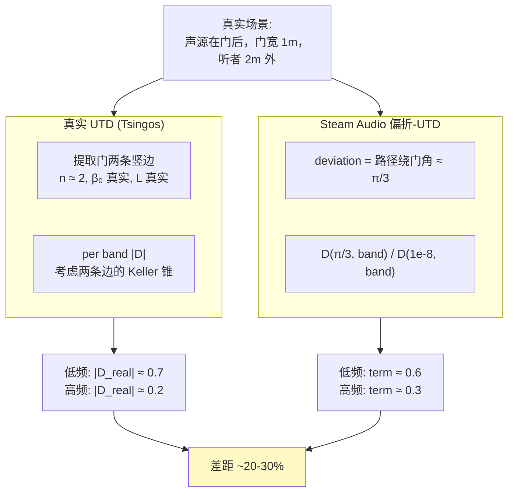
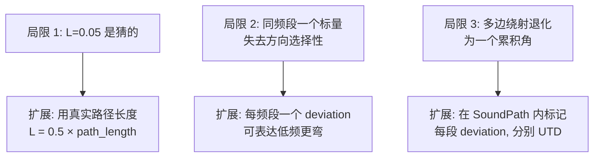

# Steam Audio 的偏折角-UTD 近似

上一页 [7. UTD 绕射理论](7.%20UTD%20绕射理论.md) 解释了物理正确的 UTD 需要每条边的几何信息。**Steam Audio 用一个标量 —— 路径总偏折角 —— 替代全部几何**，喂给 UTD 公式时填入伪造的楔形参数。结果是精度粗但运行期便宜到可忽略的绕射近似。本页拆解这个"假 UTD"怎么定义、怎么实现、以及它为什么在游戏里够用[^22]。

## 核心思想：把几何折叠成一个角度



## 偏折角 deviation 的计算

`SoundPath::deviation` 是**路径上每个探针处的转弯角之和**[^22]：

$$\text{deviation} = \sum_{i=1}^{m-1} \angle(\vec{d}_{i-1 \to i},\; \vec{d}_{i \to i+1})$$



### 存储拆分

`SoundPath` 里 `deviationInternal` 只覆盖 **firstProbe 到 lastProbe** 之间的累积角（烘焙时就算好了，是常量）。

运行时 `deviation()` 函数再加上**两端接合角**：

```python
def deviation_runtime(sound_path, source, listener, probes):
    result = sound_path.deviationInternal   # 预存的中间段

    first = probes[sound_path.firstProbe].center
    after = probes[sound_path.probeAfterFirst].center if sound_path.probeAfterFirst >= 0 else None
    before = probes[sound_path.probeBeforeLast].center if sound_path.probeBeforeLast >= 0 else None
    last = probes[sound_path.lastProbe].center

    # 起点接合角: source → first → after
    if after is not None:
        d1 = unit(first - source)
        d2 = unit(after - first)
        result += angle_between(d1, d2)

    # 终点接合角: before → last → listener
    if before is not None:
        d1 = unit(last - before)
        d2 = unit(listener - last)
        result += angle_between(d1, d2)

    # 单中间探针的特殊情况
    if after is None and before is None:
        # path: source → firstProbe(=lastProbe) → listener
        d1 = unit(first - source)
        d2 = unit(listener - first)
        result += angle_between(d1, d2)

    return result
```

**直观解释**：deviation 就是"这条路径从一端看到另一端，一共掰了多少度"。一条直线路径 deviation ≈ 0；一个 90° 拐角 deviation ≈ π/2；两个连续 90° 拐角 deviation ≈ π。

## DeviationModel::utdDeviation 的代码

`deviation.cpp` 里的实际实现[^22]：

```cpp
// core/src/core/deviation.cpp (simplified)
float DeviationModel::utdDeviation(float angle, int band) {
    const float n = 2.0f;        // 半平面楔形
    const float alpha_i = 0.0f;  // 入射角固定为零
    const float L = 0.05f;       // 固定距离参数 5cm
    const float c = 343.0f;      // 声速

    float alpha_d = alpha_i + PI + angle;   // "衍射角" = π + 偏折

    // 取该频段中心频率
    float f = (Bands::kLowCutoffFrequencies[band]
             + Bands::kHighCutoffFrequencies[band]) / 2;
    float lambda = c / f;
    float k = 2 * PI / lambda;

    // 标准 UTD 系数
    complex D0 = exp(complex(0, -PI/4)) / (2 * n * sqrt(2*PI*k));

    float beta1 = alpha_d - alpha_i;     // = PI + angle
    float beta3 = alpha_d + alpha_i;     // = PI + angle
    // beta2 == beta1, beta4 == beta3

    // 四个余切项
    float t1 = 1.0 / tan((PI + beta1) / (2 * n));
    float t2 = 1.0 / tan((PI - beta1) / (2 * n));
    float t3 = 1.0 / tan((PI + beta3) / (2 * n));
    float t4 = 1.0 / tan((PI - beta3) / (2 * n));

    // a(n, β, N) with N± chosen per β crossings of πn
    float a1 = a_function(n, beta1, N_plus);
    // ... similar for a2, a3, a4

    // Fresnel 过渡函数
    complex F1 = fresnel_transition(k * L * a1);
    complex F2 = fresnel_transition(k * L * a2);
    complex F3 = fresnel_transition(k * L * a3);
    complex F4 = fresnel_transition(k * L * a4);

    complex D = D0 * (t1*F1 + t2*F2 + t3*F3 + t4*F4);
    return abs(D);   // 标量幅值
}
```

**所有几何参数都是常量**：`n`、`alpha_i`、`L` 写死。唯一变量是 `angle`（由上层传入）和 `band`（频段索引）。

## 如何用到每频段 EQ

`calcEQForPaths` 使用 `utdDeviation` 生成每频段衰减[^20]：

```python
def calc_eq_for_paths(paths, weights, num_bands, deviation_model):
    ref_term = [deviation_model.utd_deviation(1e-8, b) for b in range(num_bands)]

    eq_gains = [0] * num_bands
    for path, weight in paths:
        dev = path.deviation
        for b in range(num_bands):
            term = deviation_model.utd_deviation(dev, b) / ref_term[b]
            eq_gains[b] += weight * overall_gain * term

    # Normalize gain vs EQ shape
    normalize(eq_gains)
    return eq_gains
```

### 归一化步骤的意义

`D(1e-8, band)` ≈ **接近直线时的 UTD 值**（几乎无偏折，但不为 0 避免除零）。用它作除数的效果：



这让 EQ 代表**相对于直线路径**的衰减比例，而不是绝对幅值。直线路径时所有频段都是 1.0（不改变信号）；弯曲越厉害，高频段越衰减。

## 与真实 UTD 的精度差距



**粗粒度上的一致性**：两者都呈现"低频更通透，高频更被阻"的趋势，差异在于具体衰减比例。对感知是可以接受的（±3 dB 在 Schroeder 频率以上听感上很小）。

## 为什么 Valve 选择这个妥协

### 原因一：完全无几何依赖

真 UTD 需要**提取 silhouette edge**，这对任意几何 / 非 Manhattan 场景很头疼。Steam Audio 直接跳过这一步。

### 原因二：运行期超便宜

真 UTD 每路径要**多次复数运算**（四个 cot、四个 Fresnel）。Steam Audio 把每 (angle, band) 的 D 值**预计算成 LUT**：

```cpp
// 预计算 256 个角度 × 6 个频段 = 1536 浮点表
static float kUtdLUT[256][6];

// 构造时填充
for (int a = 0; a < 256; a++) {
    float angle = a * PI / 256;
    for (int b = 0; b < 6; b++) {
        kUtdLUT[a][b] = utdDeviation(angle, b);
    }
}

// 运行时查表 + 插值
float lookup_utd(float angle, int band) {
    float idx = angle / PI * 256;
    int i0 = (int)idx, i1 = i0 + 1;
    float t = idx - i0;
    return lerp(kUtdLUT[i0][band], kUtdLUT[i1][band], t);
}
```

每路径每频段 = 一次查表一次插值 = **几纳秒**。64 路径 × 6 频段 / 源 = 384 查表 ≈ 2 μs。完全忽略不计。

### 原因三：感知验证 OK

Half-Life: Alyx 在 2020 发布，玩家普遍反馈声学沉浸感优秀。这个"够用"的近似经受住了最严格的 VR 沉浸场景考验。

## 实现这个近似的最小代码

```cpp
// ~200 行即可复刻

struct DeviationModel {
    float utd_deviation(float angle, int band) const {
        const float n = 2.0f, L = 0.05f, c = 343.0f;
        float f_center = 0.5f * (LOW[band] + HIGH[band]);
        float k = 2 * PI * f_center / c;
        float alpha_d = PI + angle;  // alpha_i = 0

        // 四个 cot 项 + 四个 Fresnel transition
        float beta1 = alpha_d, beta3 = alpha_d;
        float t1 = cot_safe((PI + beta1) / (2*n));
        // ... 重复 4 次
        float a1 = 2 * sqr(cos(PI*n - beta1/2));
        // ... 重复 4 次
        complex F1 = fresnel_approx(k * L * a1);
        // ... 重复 4 次

        complex D0 = exp(complex(0, -PI/4)) / (2*n*sqrt(2*PI*k));
        complex D = D0 * (t1*F1 + t2*F2 + t3*F3 + t4*F4);
        return abs(D);
    }
};
```

+ 一个 256 × 6 的 LUT 预计算 = 完整的绕射模型。对用户场景，这是可以直接复用的代码。

## 局限与可扩展点



**用户场景的建议**：照搬 Steam Audio 的做法开始。如果后续发现感知不够，优先级：
1. 先把 `L` 换成**路径长度相关** —— 真实物理里 L 正比于源-边距离
2. 再考虑每频段独立 deviation —— 如果路径在低频和高频体验差别大

## 和真实物理做一次标定

如果想校准这个近似，可以：
1. 选几个典型场景（门、走廊、L 拐角）做离线 FDTD/ARD 波动仿真
2. 提取每场景的 source→listener 多频段衰减
3. 和当前近似的 EQ 对比，调整 L 或 deviation 定义
4. 把校准结果作为文档化参数

Project Acoustics 就是这样做的，只是它把校准推到极端：**整场景都用波动仿真**，不做几何近似。这是下下页 [11. Project Acoustics 波动式对比](11.%20Project%20Acoustics%20波动式对比.md) 的主题。

[^20]: [[steam-audio-pathing-source-breakdown|Steam Audio Pathing 源码级拆解]]
[^22]: [[utd-diffraction-steam-audio-vs-tsingos|UTD 绕射：Steam Audio vs Tsingos]]

## Sources

| # | 标题 | Raw Note | Original |
|---|------|----------|----------|
| 20 | Steam Audio Pathing 源码级拆解 | [[steam-audio-pathing-source-breakdown]] | [deviation.cpp](https://raw.githubusercontent.com/ValveSoftware/steam-audio/master/core/src/core/deviation.cpp) |
| 22 | UTD 绕射：Steam Audio vs Tsingos | [[utd-diffraction-steam-audio-vs-tsingos]] | [path_data.cpp](https://raw.githubusercontent.com/ValveSoftware/steam-audio/master/core/src/core/path_data.cpp) |
