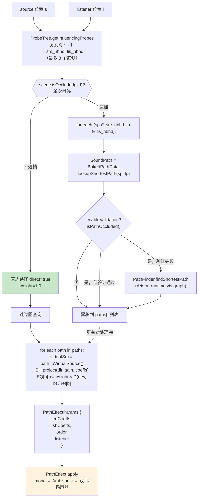
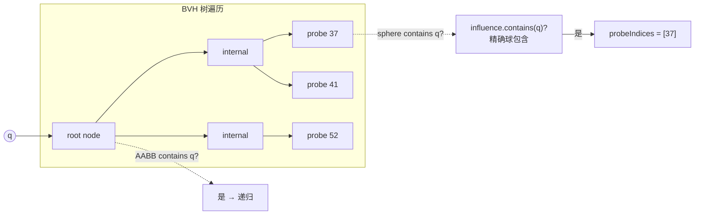
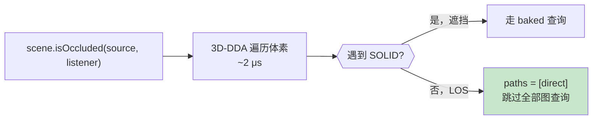
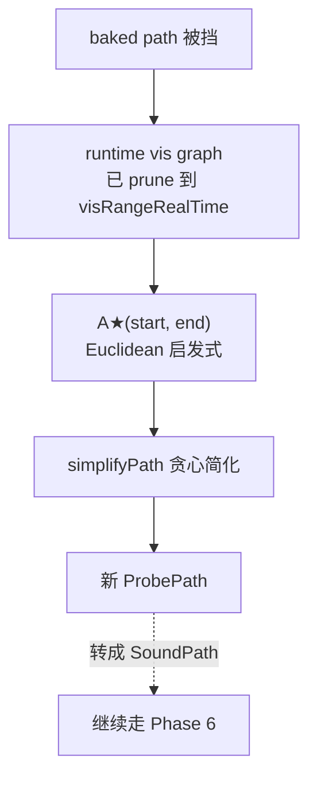
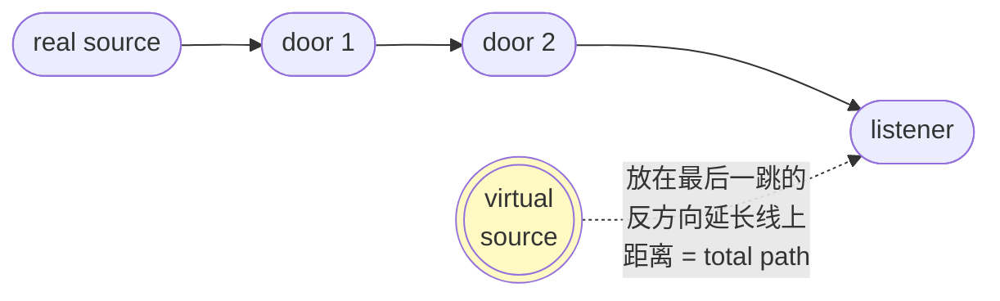
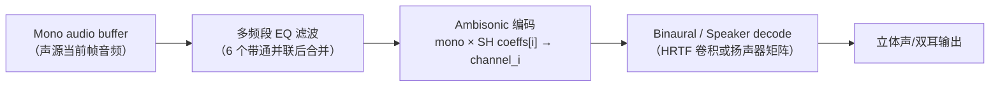
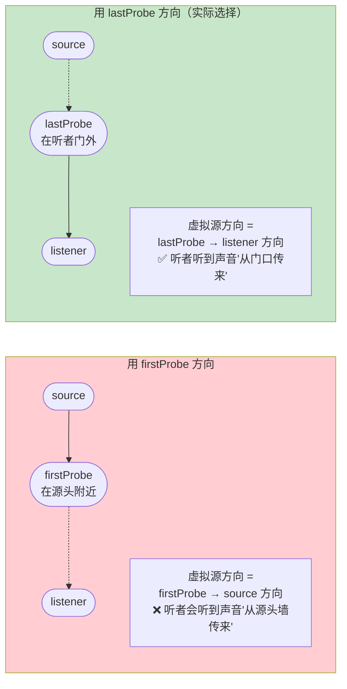

# 运行时查询与 DSP

烘焙好 `BakedPathData` 后，运行时要做的事是：**给定 source 和 listener 的世界坐标，在 < 100 μs 内返回可直接喂给音频管线的参数（距离、方向、EQ）**。本页展开完整的查询流水线，包括 LOS 快速路径、路径查表、可选验证、备用 A★、以及最终的 SH + EQ DSP 应用[^25]。

## 完整查询流水线



## Phase 1: 探针邻域查找

`ProbeTree` 是探针影响球的 BVH。`getInfluencingProbes(point)` 返回所有**影响球包含 point 的探针**（最多 `kMaxProbesPerBatch = 8` 个）[^20]：



**复杂度**：BVH 高度 O(log N)，每个内部节点一次 AABB 测试（3 次浮点比较）。对 1000 探针 ~10 级深，几 μs 内完成。

### 权重计算

`ProbeNeighborhood::calcWeights(point)` 按影响球内距离计算权重（具体公式见 Steam Audio 实现，常见做法是反距离）：

```python
def calc_weights(point, probe_centers, probe_radii):
    raw = []
    for c, r in zip(probe_centers, probe_radii):
        d = norm(point - c)
        raw.append(max(0, 1 - d / r))
    total = sum(raw)
    return [w / total for w in raw]
```

## Phase 2: 直接 LOS 早退



**这是最关键的性能优化**。大多数游戏场景里大多数源要么离听者很近，要么直接可见。单射线早退把这些 case 挡在图机制之外，直接返回。

## Phase 3: 路径查表

对每对 `(sp, lp)`（至多 8×8 = 64 对）：

```cpp
SoundPath BakedPathData::lookupShortestPath(int start, int end) {
    SoundPathRef ref = mBakedPathRefs(start, end);
    if (ref.index == 0) return SoundPath();   // invalid
    return mUniqueBakedPaths[ref.index];
}
```

**两次数组访问** = O(1) 查询[^20]。对 1000 探针的 N×N refs 表 4 MB，对 CPU cache 一次冷启动 miss + 后续热访问。Total: sub-μs 每对。

## Phase 4（可选）：验证

如果启用 `enableValidation`，对每条 baked path 做**逐段射线检查**：

```python
def is_path_occluded(sound_path, scene, probes):
    # 路径节点序列 = [start, firstProbe, probeAfterFirst, ..., probeBeforeLast, lastProbe, end]
    current = end_probe
    prev = sound_path.lastProbe if not sound_path.direct else start_probe
    while current != start:
        if scene.isOccluded(probes[current].center, probes[prev].center):
            return True
        # 链式向后查：上一跳
        sub_path = baked.lookup_shortest_path(start, prev)
        current = prev
        prev = sub_path.lastProbe
    return False
```

**这一步非常贵** —— 可能做几十次射线。通常只在动态几何场景（门刚被炸开）或调试阶段开启。

## Phase 5（可选）：A★ 备用

如果验证失败 + `findAlternatePaths` 开启，在运行时可见图上跑 A★（见 [5. 烘焙阶段：Dijkstra 全对最短路](5.%20烘焙阶段：Dijkstra%20全对最短路.md) 的 A★ 小节）：



## Phase 6: SH 方向编码

对每条有效路径，计算**虚拟声源位置**：

```python
def to_virtual_source(sound_path, source, listener, probes):
    if sound_path.direct:
        return source

    total_dist = sound_path.distance(probes, source, listener)
    last_center = probes[sound_path.lastProbe].center
    last_direction = unit(listener - last_center)
    # 虚拟源在"真实源方向"上，距离听者 = 总路径长
    return listener - last_direction * total_dist
```



这个虚拟源位置**骗听觉系统**：声音像来自 `V` 方向、距离 `total_dist`（不是直线距离）。空间感由 SH 方向编码 + 距离衰减的配合产生。

### SH 投影累积

```python
def project_sh(paths, weights, order, listener, distance_atten_model):
    coeffs = [0] * (order+1)**2
    for path, w in paths:
        v_src = to_virtual_source(path, source, listener, probes)
        dist = norm(v_src - listener)
        direction = unit(v_src - listener)
        gain = w * distance_atten_model.evaluate(dist)
        sh = spherical_harmonics_basis(direction, order)  # (order+1)² floats
        for i in range(len(sh)):
            coeffs[i] += gain * sh[i]
    return coeffs
```

**多路径的非相干叠加**：各路径的 SH 系数按能量加和（权重已包含距离衰减）。典型 order=1 → 4 通道 Ambisonic；order=3 → 16 通道。

## Phase 7: 多频段 EQ 累积

并行于 SH 的是 EQ 计算（见 [8. Steam Audio 的偏折角-UTD 近似](8.%20Steam%20Audio%20的偏折角-UTD%20近似.md)）：

```python
def calc_eq(paths, weights, num_bands=6):
    ref = [utd_deviation(1e-8, b) for b in range(num_bands)]  # 缓存
    eq = [0.0] * num_bands
    overall_gain = sum(weights)   # 归一化分离
    for path, w in paths:
        dev = path.deviation(probes, source, listener)
        for b in range(num_bands):
            term = utd_deviation(dev, b) / ref[b]
            eq[b] += w * overall_gain * term
    # 归一化
    return normalize_eq(eq)
```

输出是 **per-band 线性增益**（如 6 频段 → 6 个 float）。

## Phase 8: PathEffect DSP 应用

Steam Audio 的 `PathEffect::apply` 把上述参数作用到音频信号[^20]：



EQ 作用在 mono 信号上（各频段增益线性相加），再用 SH 系数展开到多通道 Ambisonic（每通道 = mono × 对应 SH 系数），最后解码到扬声器布局或双耳。

## 延迟预算

对 32 并发源，60 Hz 音频 tick：

| 阶段 | 每源 | 总共 (32 源) |
|---|---|---|
| ProbeTree × 2 | ~1 μs | 32 μs |
| scene.isOccluded (LOS) | ~2 μs (体素) | 64 μs |
| 64 对路径查表 | ~2 μs | 64 μs |
| Validation（可选） | ~100 μs | 3.2 ms |
| A★ 备用（罕见） | ~50 μs | 可忽略 |
| SH + EQ 累积 | ~5 μs | 160 μs |
| PathEffect.apply (DSP) | ~20 μs | 640 μs |
| **合计（无验证）** | **~30 μs** | **~1 ms** |
| **合计（验证开启）** | **~130 μs** | **~4.2 ms** |

游戏音频线程典型预算 5-10 ms/tick。**无验证模式有充裕空间支持上百并发源；验证模式下 32 源是安全上限**。

## CSR 图存储的 cache 优化

Steam Audio 用 `vector<vector<AdjacencyListEntry>>` 存可见性图 —— 内层 vector 的数据可能在堆上零散分布。A★ 内循环要读 `mAdjacent[u]` 的所有邻居，cache miss 成本不小。

自研可以改用 **CSR（Compressed Sparse Row）** 格式：

```cpp
struct VisGraphCSR {
    uint32_t num_probes;
    std::vector<uint32_t> offsets;      // 长度 N+1, offsets[i] = 起始位置
    std::vector<uint32_t> indices;      // 邻居索引（连续）
    std::vector<float>    costs;        // 边权重（并行 indices）
};

// A★ 内循环
for (uint32_t i = g.offsets[u]; i < g.offsets[u+1]; i++) {
    uint32_t v = g.indices[i];
    float edge_cost = g.costs[i];
    // ...
}
```

连续内存 = 预取友好。对 50k 边图 A★ 可从 50 μs → 20 μs。

## 虚拟源方向的"最后一跳"直觉

为什么选 lastProbe 方向而不是 firstProbe 方向？



听觉系统对**最后到达波的方向**最敏感（Haas 效应），所以把虚拟源放在最后一跳的方向符合感知。

## 多源同时查询的并行化

每个源的 Phase 1-5 完全独立（只读 BakedPathData），可以并行。实践：

```cpp
// 音频线程的渲染调用
for (auto& source : active_sources) {
    // 每帧一个源一次查询，结果送入其 PathEffect
    PathEffectParams p = query_path(source.pos, listener.pos);
    source.path_effect->apply(input_buffer, output_buffer, p);
}
```

查询部分可放到 task pool，DSP 应用部分保留在音频线程。Steam Audio 不做这个（单线程足够），但自研若支持上百源可以这样扩展。

## 支持动态门（Raghuvanshi 2021 扩展）

想让开关门影响 EQ，可以在 Phase 7 添加：

```python
def adjust_eq_for_dynamic_portals(eq, path, portals, closed_states):
    portal_list = identify_portals_on_path(path, portals)
    for p in portal_list:
        closure = closed_states[p.id]   # [0, 1]
        for b in range(num_bands):
            # 高频随闭合更严重衰减
            band_penalty = 1 + 3 * (b / num_bands)
            eq[b] *= (1 - closure) ** band_penalty
    return eq
```

要求有**静态 Portal 列表**（可由 [10. 显式 Portal 检测方法](10.%20显式%20Portal%20检测方法.md) 的形态学开运算生成）+ 运行时每 portal 的 `closed` 状态。

[^20]: [[steam-audio-pathing-source-breakdown|Steam Audio Pathing 源码级拆解]]
[^25]: [[runtime-acoustic-path-query-architecture|运行时声学路径查询架构]]

## Sources

| # | 标题 | Raw Note | Original |
|---|------|----------|----------|
| 20 | Steam Audio Pathing 源码级拆解 | [[steam-audio-pathing-source-breakdown]] | [path_simulator.cpp](https://raw.githubusercontent.com/ValveSoftware/steam-audio/master/core/src/core/path_simulator.cpp) |
| 25 | 运行时声学路径查询架构 | [[runtime-acoustic-path-query-architecture]] | [api_path_effect.cpp](https://raw.githubusercontent.com/ValveSoftware/steam-audio/master/core/src/core/api_path_effect.cpp) |
