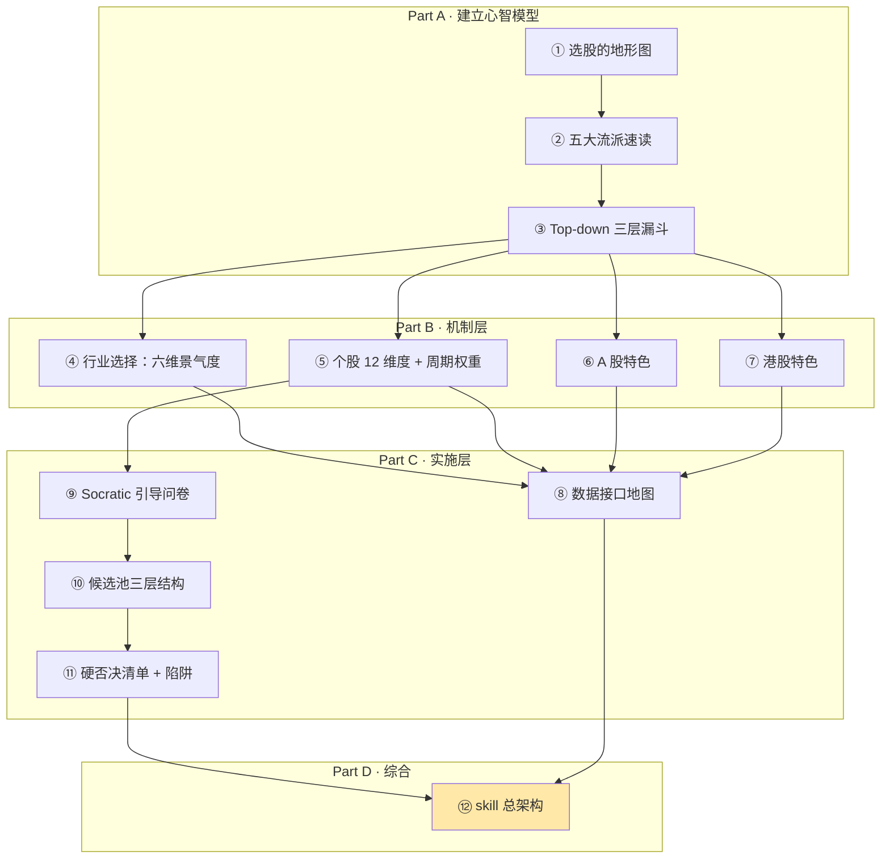
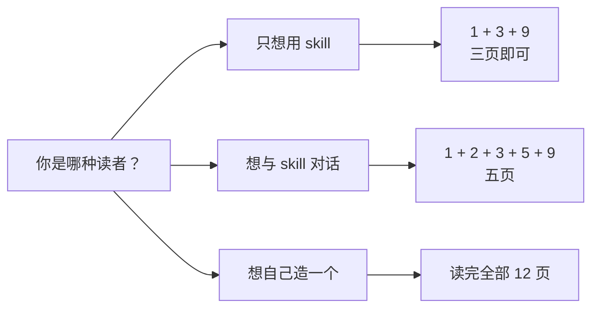
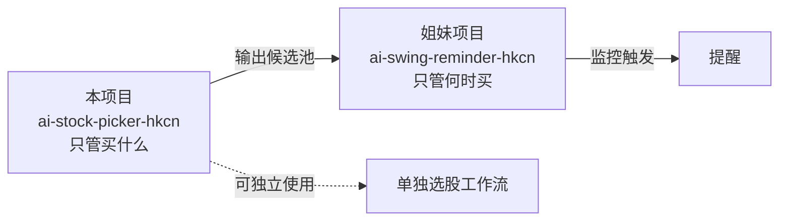

# AI 辅助选股助手（A 股 + 港股）— 总览

> 本 wiki 是"用 skill 帮我选股"这套方案在 A+HK 市场的完整方法论与技术栈。
> 面向**新手友好**读者：不要求懂量化模型、不需要会写回测代码，但读完能**与 skill 用自然语言讨论选股**、
> 判断每条推荐的理由是否靠谱、并在需要时和 skill 调整偏好。

## 知识地图

## 页面目录

### Part A · 建立心智模型（读完能开始对话）

- [1. 选股的地形图](wiki/1.%20选股的地形图.md) — 五条分岔、Top-down vs Bottom-up、skill 骨架
- [2. 五大流派速读](wiki/2.%20五大流派速读.md) — 价值/成长/质量/红利/动量 + Magic Formula + CANSLIM
- [3. Top-down 三层漏斗](wiki/3.%20Top-down%20三层漏斗.md) — 宏观→行业→个股→硬否决→候选池

### Part B · 机制层（想深入的读者继续）

- [4. 行业选择：六维景气度](wiki/4.%20行业选择：六维景气度.md) — 华宝三维 + 北向 + 估值 + 政策 + RPS + 一致预期
- [5. 个股 12 维度 + 周期权重](wiki/5.%20个股%2012%20维度体系%20%2B%20周期权重.md) — 每维五段式 + 周期×维度矩阵 + 流派×维度交叉
- [6. A 股特色](wiki/6.%20A%20股特色.md) — 涨跌停板/ST/退市/北向/龙虎榜/注册制
- [7. 港股特色](wiki/7.%20港股特色.md) — T+0/卖空 20%/南下/老千股/AH 双柜台

### Part C · 实施层（想落地 skill 的读者）

- [8. 数据接口地图](wiki/8.%20数据接口地图.md) — AkShare + Tushare + 富途 + Qlib Alpha158 所有 153 个公式
- [9. Socratic 引导问卷](wiki/9.%20Socratic%20引导问卷.md) — 15 题 Cold Start + stock-profile.yaml 完整字段
- [10. 候选池三层结构](wiki/10.%20候选池三层结构.md) — 核心/观察/候选 + 升降级规则 + 输出五要素
- [11. 硬否决清单 + 价值/动量陷阱](wiki/11.%20硬否决清单%20%2B%20价值、动量陷阱.md) — A 股 10 条 + HK 9 条 + Beneish M-Score

### Part D · 综合

- [12. skill 总架构](wiki/12.%20skill%20总架构.md) — 输入→画像→数据→打分→输出 + 端到端追踪 + 目录结构

## 三种阅读路径

## 覆盖范围（key_questions → pages）

| 关键问题 | 由以下页面解答 |
|----------|---------------|
| KQ1 选股方法论总览（五流派） | [1. 选股的地形图](wiki/1.%20选股的地形图.md) · [2. 五大流派速读](wiki/2.%20五大流派速读.md) |
| KQ2 行业选择判断体系 | [3. Top-down 三层漏斗](wiki/3.%20Top-down%20三层漏斗.md) · [4. 行业选择：六维景气度](wiki/4.%20行业选择：六维景气度.md) |
| KQ3 个股 12 维度 + 周期权重 | [5. 个股 12 维度 + 周期权重](wiki/5.%20个股%2012%20维度体系%20%2B%20周期权重.md) |
| KQ4 A/HK 特色因子对比 | [6. A 股特色](wiki/6.%20A%20股特色.md) · [7. 港股特色](wiki/7.%20港股特色.md) |
| KQ5 数据实现地图 | [8. 数据接口地图](wiki/8.%20数据接口地图.md) |
| KQ6 Socratic 引导问卷设计 | [9. Socratic 引导问卷](wiki/9.%20Socratic%20引导问卷.md) |
| KQ7 候选池输出格式 | [10. 候选池三层结构](wiki/10.%20候选池三层结构.md) |
| KQ8 硬否决 + 陷阱清单 | [11. 硬否决清单 + 价值/动量陷阱](wiki/11.%20硬否决清单%20%2B%20价值、动量陷阱.md) |
| 全局视角 | [12. skill 总架构](wiki/12.%20skill%20总架构.md) |

## 本 wiki 的核心发现

- **中国版美林时钟准确率 73%**（改良版以货币+信用周期代替产出缺口+通胀）—— 远优于传统版 40%
- **Qlib Alpha158 实为 153 个因子**（非 158），且不含基本面 —— 需自扩展
- **华宝三维景气度**用同比增速的**环比变化**（二阶导数）捕捉行业边际拐点
- **港股卖空比例 20% 上限**是监管硬规则，达到即暂停卖空
- **min(Capacity, Tolerance)** 是 C1-C5 适当性管理的核心原则
- **Beneish M-Score 在 A 股阈值需本土化至 -1.89~-2.0**，TATA 最敏感
- **Top-down 是 A+HK 主路径**，因用户自然语言查询天然就是 Top-down 形式

## 与姐妹项目 ai-swing-reminder-hkcn 的关系

本项目**独立于**姐妹项目工作，但共享 `raw/` 下的数据源、回测框架、合规红线等基础笔记。

## 质量说明

- **总页面数**：12
- **总参考来源数**：14 个新 + 5 个复用 = 19 个 raw（详见 `{wiki_root}/raw/sources.yaml` id 26-32, 34-47）
- **最后更新**：2026-04-28
- **目标读者**：新手可懂 + 能与 skill 对话
- **合规提示**：本 wiki 和产出的 skill 均仅供学习参考，**不构成任何投资建议**
