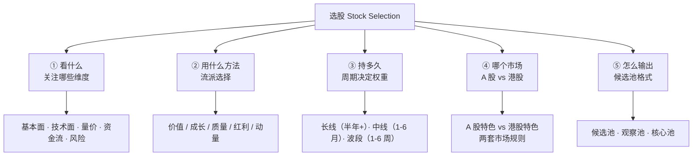
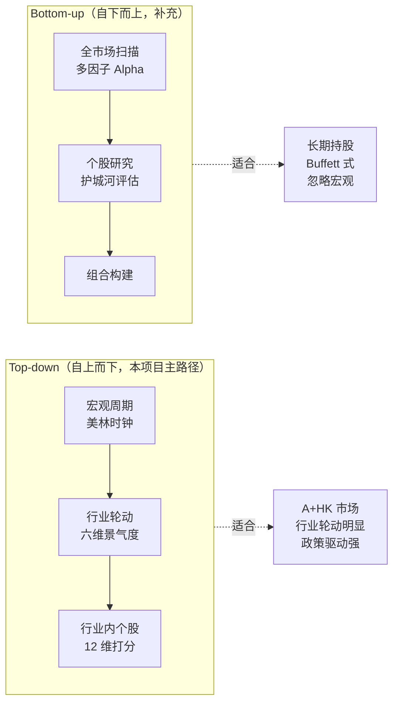
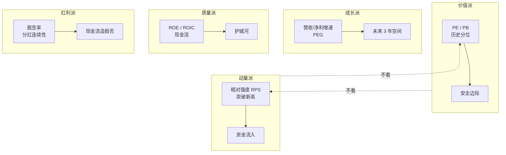
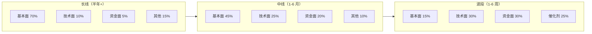
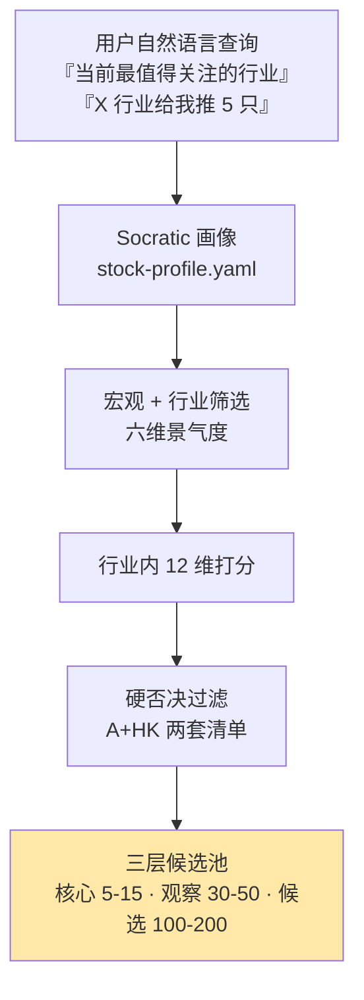

# 选股的地形图

选股（Stock Selection）和择时（Market Timing）是两个独立的量化问题。本项目的 skill **只解决"买什么"**，不解决"何时买"。在深入任何具体方法之前，这一页先把"选股应该关注哪些方面"的完整空间摊开来给你看——这样你在与 skill 对话时，心里有地图。

## 选股的五条分岔

每一条分岔都会深刻改变 skill 的输出。**没有统一答案**——答案由你的「画像」决定。

## 自上而下 vs 自下而上

**为什么本 skill 以 Top-down 为主**？因为你的典型自然语言查询就是 Top-down：

- "**当前最值得关注的行业**是什么" → 先判行业
- "**消费行业里**给我推 5 只长线股" → 先锁定行业再选股

这是 Top-down 的原生入口。Bottom-up 的"全市场打分排序"对新手不友好，且在 A 股政策市中容易跑偏[^34][^36]。

## 五大流派的"关注维度"各不相同

这是最容易被新手忽视的事实：**价值派和动量派看的根本不是同一张表**。

一个不加选派的「多因子打分」，结果是价值因子和动量因子互相抵消，**没得分最高，没得分最低，全在中间**——这是新手 skill 最容易踩的坑。因此 skill 必须先通过 Socratic 问卷推断你的流派倾向，再激活对应维度的权重。

## 周期决定一切

**同一只股票，在不同周期下应不应该买是两个完全不同的问题**。skill 启动时会问你选择哪个周期，然后激活对应的权重矩阵（详见 [5. 个股 12 维度体系 + 周期权重](5.%20个股%2012%20维度体系%20%2B%20周期权重.md)）。

## A 股 vs 港股：不是"同一个市场说不同语言"

| 维度 | A 股 | 港股 |
|------|------|------|
| 交易制度 | T+1 | T+0 |
| 涨跌幅 | ±10% / ±20% / ±30% | 无限制 |
| 个人融券 | 50 万门槛 | 港股通不支持，需本地券商 |
| 特色信号 | 北向资金、龙虎榜 | 南下资金、卖空比例 |
| 独有地雷 | ST/退市/面值退 | 老千股/仙股 |

**同一套选股规则直接套两个市场是错的**。详见 [6. A 股特色](6.%20A%20股特色.md) 和 [7. 港股特色](7.%20港股特色.md)。

## skill 输出形态：Top-down 四步

这就是 skill 的骨架。本 wiki 的剩余页面把每一步拆开讲清楚。

## 阅读路径建议

- **只想用 skill、不关心原理**：读完这页 + [3. Top-down 三层漏斗](3.%20Top-down%20三层漏斗.md) + [9. Socratic 引导问卷](9.%20Socratic%20引导问卷.md) 就够了
- **想与 skill 讨论推荐理由**：加读 [2. 五大流派速读](2.%20五大流派速读.md) + [5. 个股 12 维度体系](5.%20个股%2012%20维度体系%20%2B%20周期权重.md)
- **想自己造一个 skill**：读完全部 12 页

[^34]: [[china-merrill-clock-industry-rotation|中国版美林投资时钟]] · [原文](https://finance.sina.com.cn/roll/2021-02-24/doc-ikftpnny9346839.shtml)
[^36]: [[dynamic-multifactor-alpha-model-ashare|动态情景多因子 Alpha 模型（A 股实证）]] · [原文](https://j519lee.blog.csdn.net/article/details/117508587)

## Sources

| # | Title | Raw Note | Original |
|---|-------|----------|----------|
| 34 | 中国版美林投资时钟 | [[china-merrill-clock-industry-rotation]] | [link](https://finance.sina.com.cn/roll/2021-02-24/doc-ikftpnny9346839.shtml) |
| 36 | 动态情景多因子 Alpha 模型 | [[dynamic-multifactor-alpha-model-ashare]] | [link](https://j519lee.blog.csdn.net/article/details/117508587) |
