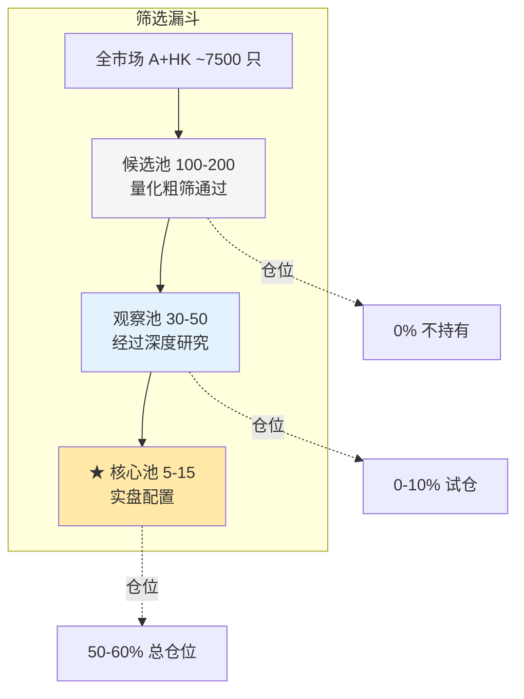
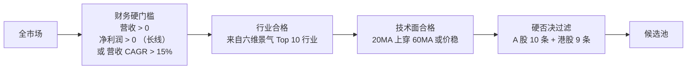
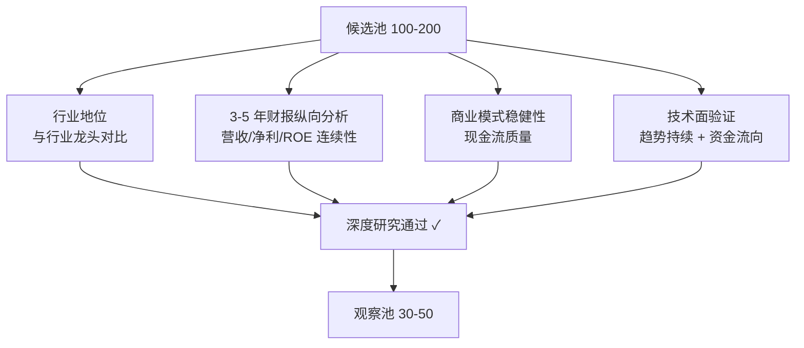
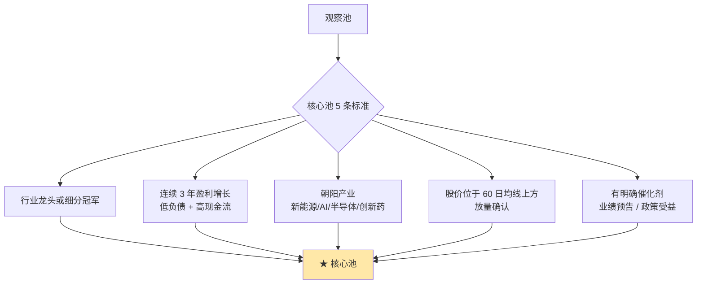
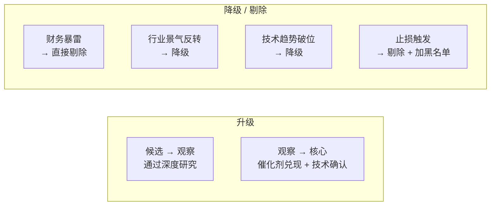
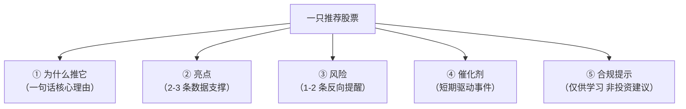
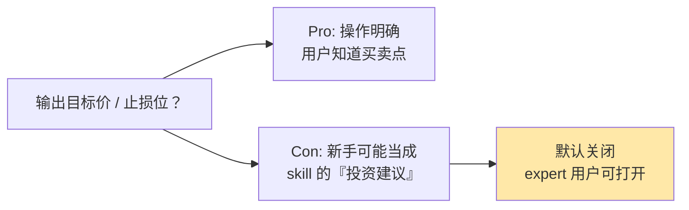
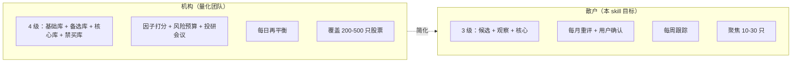
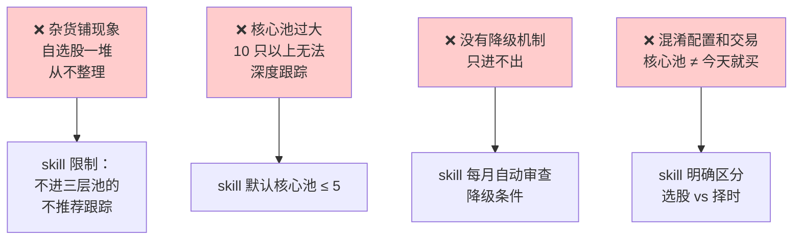
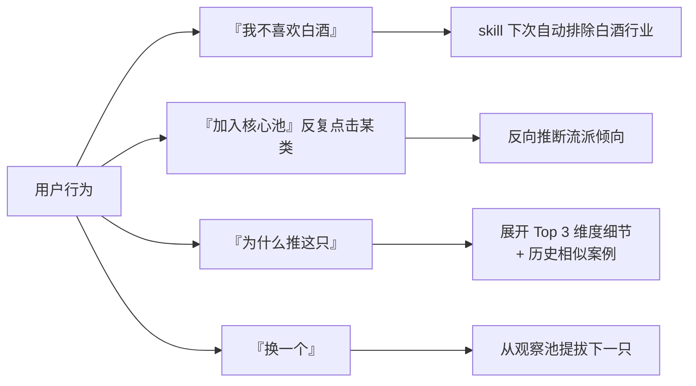

# 候选池三层结构

skill 的输出**不是一个简单的 Top-N 排行榜**。经过打分排序后，候选股票按"入场优先级"分成三层：核心池、观察池、候选池。这套三层结构来自专业机构的真实工作流，核心解决两个问题：**（1）新手如何避免"自选股变杂货铺"；（2）何时该升降级一只股票**。这一页把机构的四层体系简化为散户版三层，以及 skill 如何在输出中自然呈现。

## 三层池总架构



**关键原则**：不是所有的候选池股票都值得买——候选池是"**值得跟踪**"，核心池才是"**值得买**"[^42]。

## 三层定位对比

| 层级 | 数量 | 门槛 | 跟踪深度 | 仓位分配 |
|------|:---:|------|---------|---------|
| **△ 候选池** | 100-200 | 量化粗筛 | 月度审查 | 0% |
| **○ 观察池** | 30-50 | 深度研究 | 周度审查 | 0-10%（试仓） |
| **★ 核心池** | 5-15 | 最高标准 | 日度跟踪 | 50-60% |

## 各层的筛选标准

### 候选池：量化粗筛



**候选池的本质**：所有**没有明显问题**的股票集合。门槛低，数量多。

### 观察池：深度研究



### 核心池：实盘配置标准



## 升降级规则（量化机制）



### 降级的明确触发条件

| 触发条件 | 动作 |
|---------|------|
| 季报营收/净利 QoQ < -10% | 核心池 → 观察池 |
| 单日跌幅 > -8% 且无明显利空 | 观察池 → 候选池 |
| 连续 2 个月北向净流出 > 10% | 核心池 → 观察池 |
| 命中硬否决任一条 | **直接剔除 + 加入黑名单 6 个月** |
| 季报被出具非标审计意见 | **直接剔除** |

**6 个月黑名单**：避免用户反复纠结已出问题的股票。6 个月后可重新评估。

## 新手友好的输出设计

skill 每次输出候选池时，**每只股票的呈现结构**必须包含五要素：



缺少 ③ 和 ⑤ 是新手 skill 最容易犯的错——**只讲好听的，不讲风险**，结果用户追高被套。

## 输出示例：完整的核心池推荐

```
┌──────────────────────────────────────────────────────┐
│  本周候选池 · 2026-04-28                             │
│  基于 profile: 质量+成长 · 长线周期 · A 股为主        │
│                                                      │
│  ★ 核心池（建议重点关注 5 只）                        │
│  ──────────────────────────────────────────────────  │
│  1. 宁德时代（300750）  得分 87/100                   │
│     ★ 为什么推它: 新能源龙头 + 技术护城河             │
│                                                      │
│     ○ 亮点                                           │
│       D3 质量: ROE 连续 5 年 > 20%                   │
│       D4 护城河: 全球动力电池份额 37%                 │
│       D2 成长: 营收 CAGR 45%                         │
│                                                      │
│     ⚠ 风险                                           │
│       D1 估值: 历史分位 82%（偏贵）                  │
│       D5 动量: RSI 78（短期偏热）                    │
│                                                      │
│     ⏰ 催化剂: Q2 装机量创新高（预计 5-15 披露）       │
│                                                      │
│     ℹ 本推荐仅供学习参考，非投资建议                   │
│  ──────────────────────────────────────────────────  │
│  2. ... (4 只核心池其余股票，结构相同)                │
│                                                      │
│  ○ 观察池（5-10 只，等待催化剂）                      │
│  ──────────────────────────────────────────────────  │
│  6. 宁波银行（002142）  得分 72/100                  │
│     等待: 不良率拐点 + 息差企稳                       │
│     已观察周数: 3 周                                  │
│                                                      │
│  △ 储备池（10-20 只，保持关注）                       │
│  ──────────────────────────────────────────────────  │
│  16. 药明康德（603259）                              │
│      待观察: 海外订单复苏                             │
└──────────────────────────────────────────────────────┘
```

## 展示层的取舍

### 要不要输出目标价 / 止损位？



**默认关闭**。原因：
1. 新手易把 skill 输出当成"承诺"，追高被套后归罪于 skill
2. 选股 skill 不等于择时 skill，不该越位
3. 合规风险——给出具体价位可能触及"投资建议"监管

**高阶用户**可在 `profile.yaml` 里设 `show_target_price: true` 打开。

### 详细度三档

| 档位 | 对象 | 显示内容 |
|------|------|---------|
| `newbie` | 新手（默认） | 得分 + Top 3 维度 + 亮点/风险/催化（一段话） |
| `intermediate` | 中级 | + 全部 12 维度得分 + 同行业横向比较 |
| `expert` | 专业 | + 因子 IR / 行业中性化后分数 / 历史回测 |

## 机构 vs 散户的取舍



**简化的关键**：砍掉"禁买库"（合并到黑名单），机构 4 级变散户 3 级。保留核心的升降级逻辑[^42]。

## 散户常见错误



## 与 skill 对话的约束



这就是 "**Socratic 引导 + 候选池**" 交互的完整闭环——画像驱动推荐，反馈更新画像，形成良性循环。

## 关键结论

1. **三层池 ≠ 排行榜**——优先级分层是为了避免"自选股杂货铺"
2. **降级规则必须量化**——否则只进不出
3. **每只推荐含五要素**——缺一不可（核心理由 · 亮点 · 风险 · 催化剂 · 合规）
4. **目标价默认关闭**——合规与"越位择时"双重考虑
5. **核心池 ≤ 5**（新手）—— 跟不过来就等于没跟

[^42]: [[stock-pool-tier-design-core-watch-candidate|选股分层（核心池/观察池/候选池）体系设计]]

## Sources

| # | Title | Raw Note | Original |
|---|-------|----------|----------|
| 42 | 选股分层体系设计 | [[stock-pool-tier-design-core-watch-candidate]] | — |
