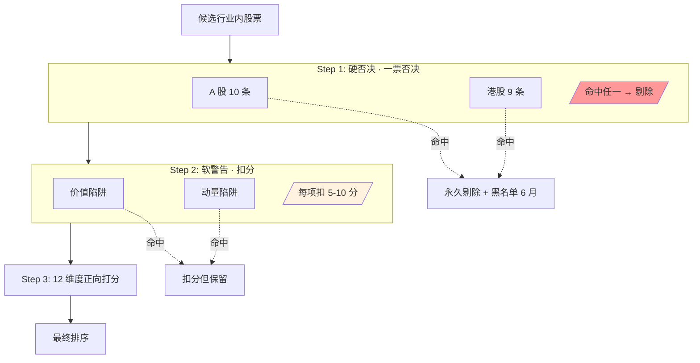
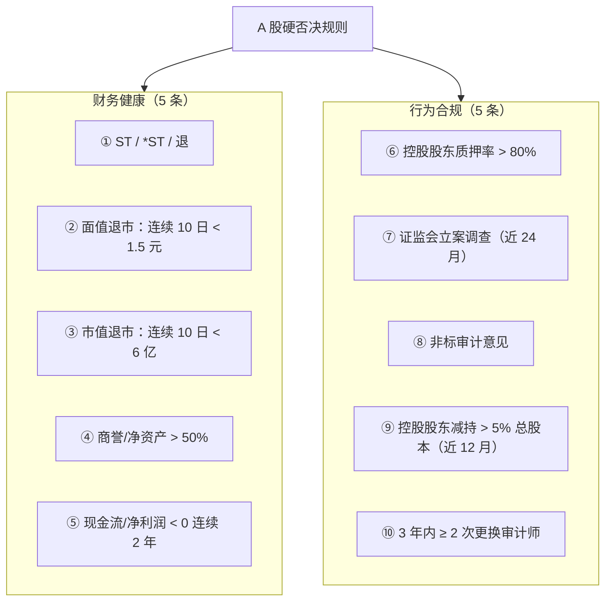
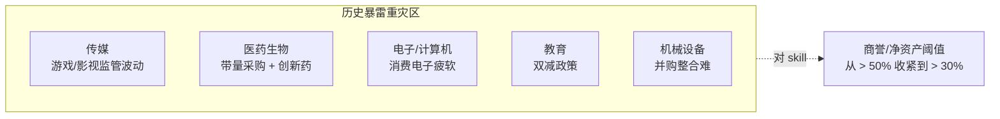
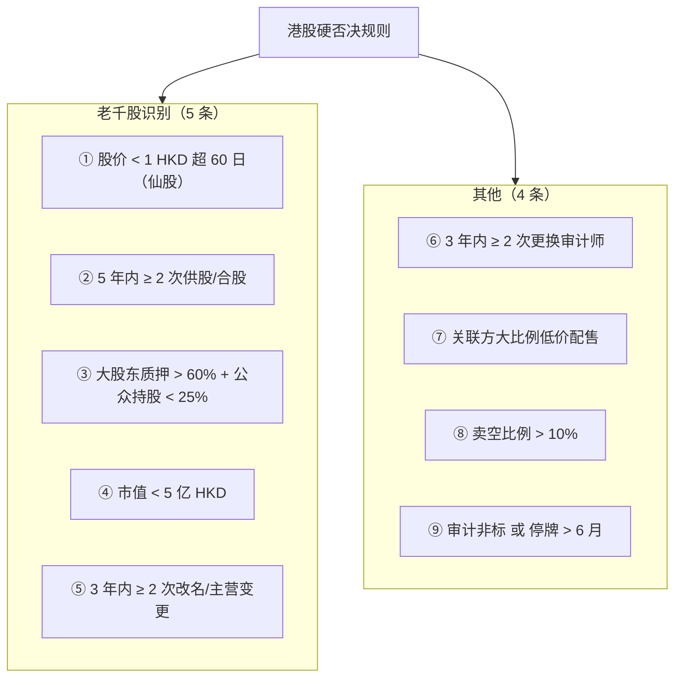
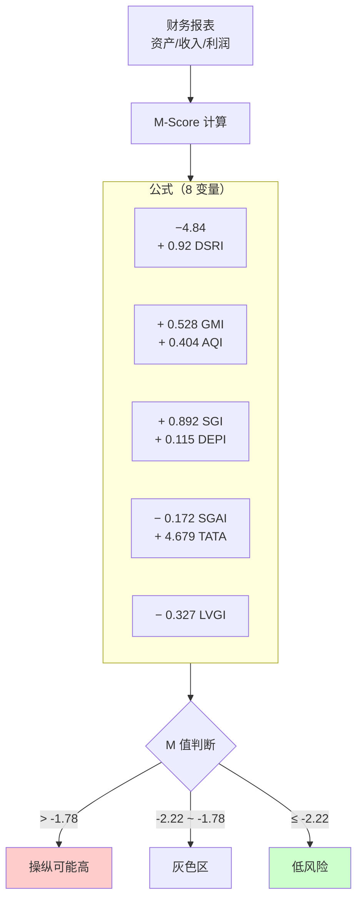
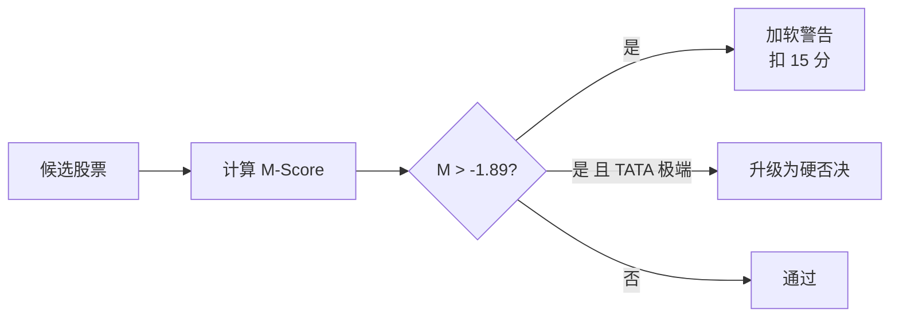
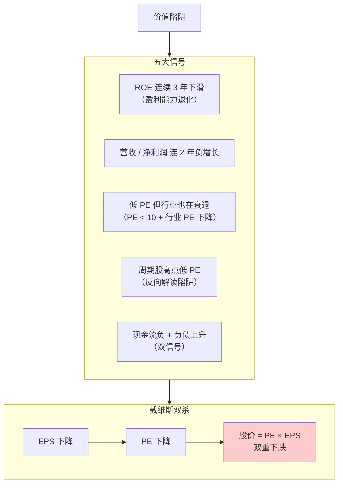
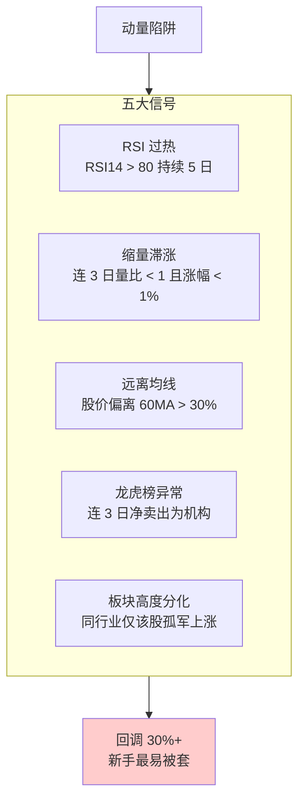
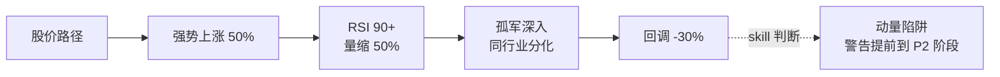
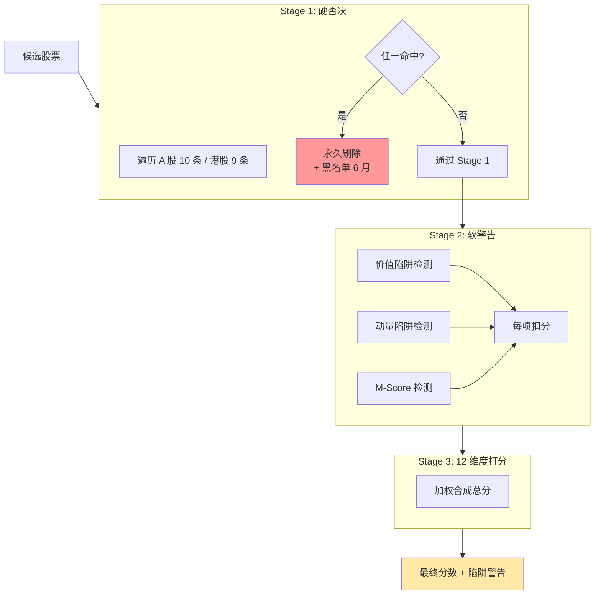

# 硬否决清单 + 价值/动量陷阱

选股打分再高，**只要踩到一条硬否决就立即剔除**——这是候选池的第一道门。这一页把 A 股 10 条 + 港股 9 条硬否决规则列成可落地的 checklist（每条带阈值和数据接口），并用 Beneish M-Score 量化财务造假识别。尾部的价值陷阱和动量陷阱是软警告（扣分但不剔除），但新手最容易栽在这两类陷阱里。

## 打分前的过滤漏斗



**硬否决和软警告必须分两步**：若合并，"高分股票踩雷"会因为其他维度分高而被错误留在池子里。硬否决是一票否决，不讨价还价。

## A 股硬否决 10 条



### 规则表（带数据接口）[^45]

| 规则 | 阈值 | AkShare 接口 |
|------|------|-------------|
| ① ST/*ST | 名称含 "ST" / "*ST" / "退" | `stock_zh_a_spot_em` |
| ② 面值退风险 | 连续 10 日收盘 < 1.5 元 | `stock_zh_a_hist` |
| ③ 市值退风险 | 连续 10 日总市值 < 6 亿 | `stock_zh_a_spot_em` |
| ④ 商誉过高 | 商誉/净资产 > 50% | `stock_sy_em` |
| ⑤ 现金流恶化 | 经营现金流/净利润 < 0 连 2 年 | `stock_financial_*_em` |
| ⑥ 质押过高 | 控股股东质押率 > 80% | `stock_gpzy_pledge_ratio_em` |
| ⑦ 立案调查 | 近 24 月证监会立案 | `stock_notice_report` + 关键词 |
| ⑧ 审计非标 | 非"标准无保留意见" | `stock_notice_report` |
| ⑨ 大股东减持 | 近 12 月累计 > 5% 总股本 | `stock_gdfx_holding_detail_em` |
| ⑩ 审计师更换 | 3 年内 ≥ 2 次 | `stock_notice_report` |

### 高商誉行业加倍警惕



## 港股硬否决 9 条



**港股比 A 股多**的是老千股识别——A 股有强制退市和面值退，港股没有等价机制，所以仙股生态长期存在[^40]。

## Beneish M-Score：量化财务造假识别



### 八变量含义

| 变量 | 含义 | 作用 |
|------|------|------|
| **DSRI** | 应收账款 / 收入的同比变化 | 收入提前确认信号 |
| **GMI** | 毛利率恶化 | 基本面下行掩饰 |
| **AQI** | 非流动资产（非 PP&E）占比 | 费用资本化 |
| **SGI** | 收入增长压力 | 业绩压力 |
| **DEPI** | 折旧率放缓 | 利润虚增 |
| **SGAI** | 销管费用变化 | 成本隐藏 |
| **TATA** | **总应计项/总资产（权重最高）** | **对 A 股最敏感** |
| **LVGI** | 杠杆变化 | 财务压力 |

### A 股适用性[^45]

- **阈值本土化**：原版 -1.78 → A 股建议 **-1.89 ~ -2.0**
- **TATA 最敏感**：A 股造假公司最常见的异常
- **局限**：中国会计准则差异 + 关联方交易 + 资金占用 + 体外循环不反映在 8 指标中
- **使用建议**：不单独使用，配合 Altman Z-score、Ohlson O-score、现金流/净利润匹配、审计意见类型

### 集成到 skill



## 价值陷阱识别（软警告）



### 典型案例

**视源股份**：ROE 2019 年 38.38% → 2025 年 7.65%（6 年连跌）[^45]。即使 PE 分位已经很低，基本面持续恶化，股价始终不振。

### skill 检测规则

```python
# 伪代码
def is_value_trap(stock):
    score = 0
    if declining_roe_for_3_years(stock): score += 1
    if negative_growth_for_2_years(stock): score += 1
    if low_pe_in_declining_industry(stock): score += 1
    if cyclical_stock_at_peak_low_pe(stock): score += 1
    if negative_cf_and_rising_debt(stock): score += 1
    return score >= 2  # 命中 2 条以上 → 价值陷阱软警告
```

## 动量陷阱识别（软警告）



### 典型动量陷阱



## 硬否决 vs 软警告的完整 skill 流程



## 输出时的"排雷提示"文案

每只推荐股必须含**与亮点同等显眼**的风险字段：

```
宁德时代（300750）
  ★ 得分 87/100

  ○ 亮点
    - ROE 连续 5 年 > 20%
    - 新能源全球龙头（份额 37%）
    - Q2 装机量创新高

  ⚠ 风险（不容忽视）
    - D1 估值：分位 82%（偏贵）
    - 商誉/净资产 8%（低风险但需监控）
    - 海外市场政策不确定性
    - 主要客户集中度 > 40%

  ℹ 本分析仅供学习参考，非投资建议。
```

**新手阅读偏差**：只看亮点容易追高，**风险字段必须与亮点同等显眼**——不要放在页脚小字。

## 硬否决表（速查）

| 市场 | 硬否决条目 |
|------|----------|
| **A 股** | ST/*ST · 面值退 · 市值退 · 商誉>50% · 现金流恶化 · 质押>80% · 立案调查 · 审计非标 · 大股东减持>5% · 审计师频换 |
| **港股** | 仙股 · 频繁供股合股 · 质押>60% + 公众<25% · 市值<5 亿 · 频繁改名 · 审计师频换 · 低价关联配售 · 卖空>10% · 审计非标/长停牌 |
| **双市场通用** | Beneish M-Score > -1.89 且 TATA 极端 |

## 与 12 维度的关系

硬否决是 **D11 风险维度** 的"硬化"版本——详见 [5. 个股 12 维度体系 + 周期权重](5.%20个股%2012%20维度体系%20%2B%20周期权重.md)。

[^40]: [[hk-market-specifics-t0-short-selling-southbound|港股市场特色机制]]
[^45]: [[stock-picker-hard-veto-and-soft-warnings|选股硬否决清单（A+HK）与 Beneish M-Score]]

## Sources

| # | Title | Raw Note | Original |
|---|-------|----------|----------|
| 40 | 港股市场特色机制 | [[hk-market-specifics-t0-short-selling-southbound]] | — |
| 45 | 硬否决清单 + M-Score | [[stock-picker-hard-veto-and-soft-warnings]] | — |
