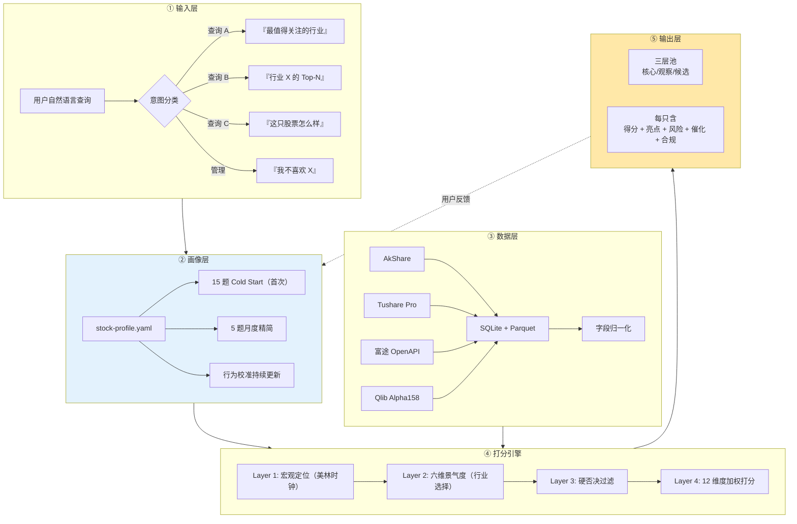
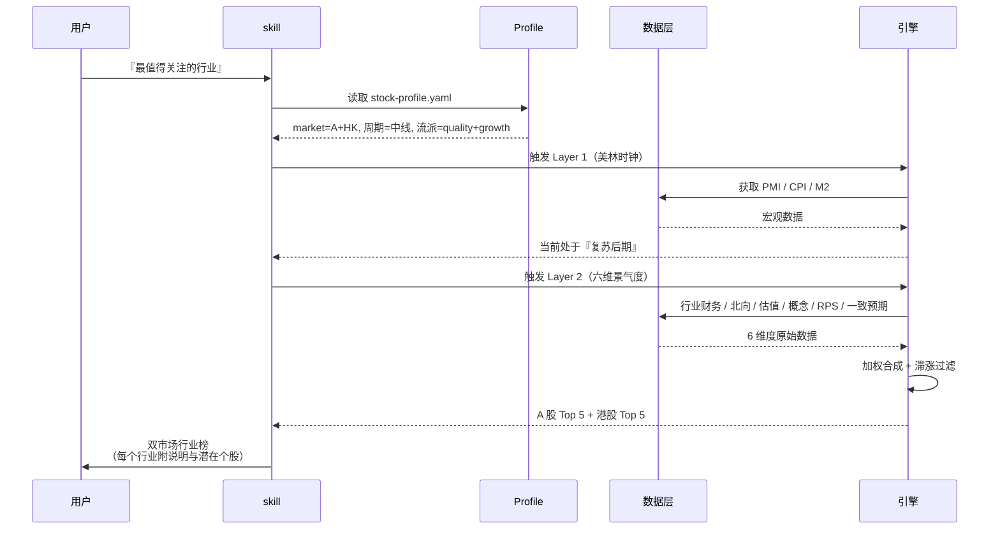
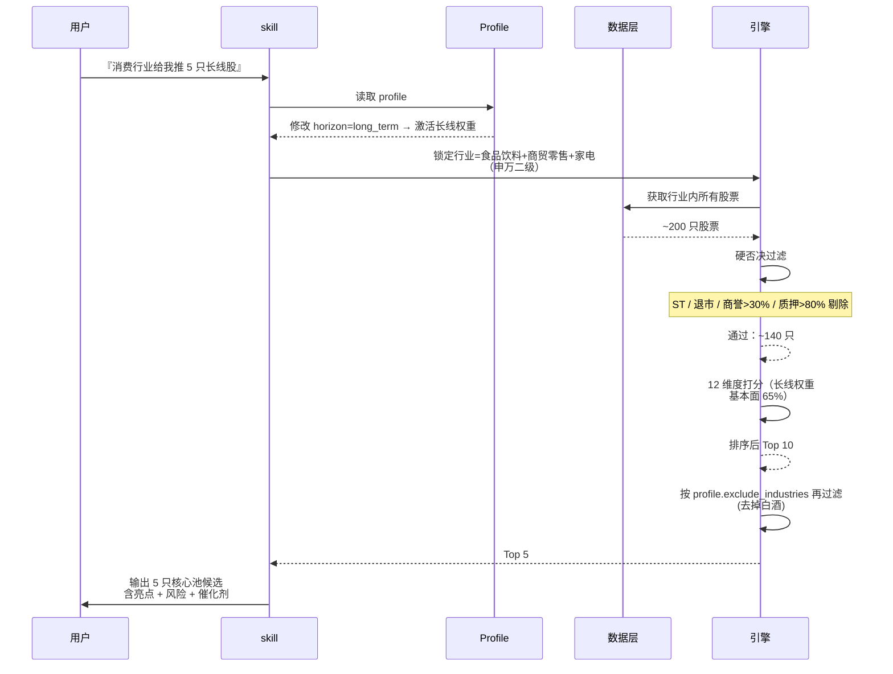
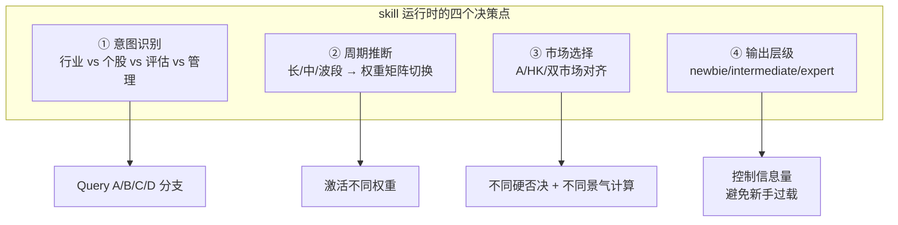
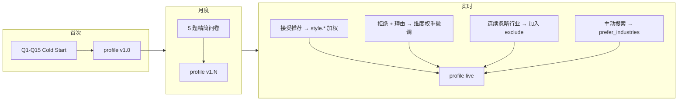
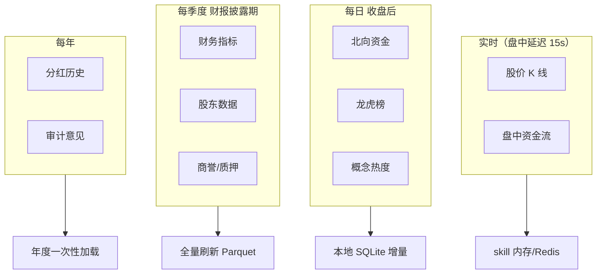
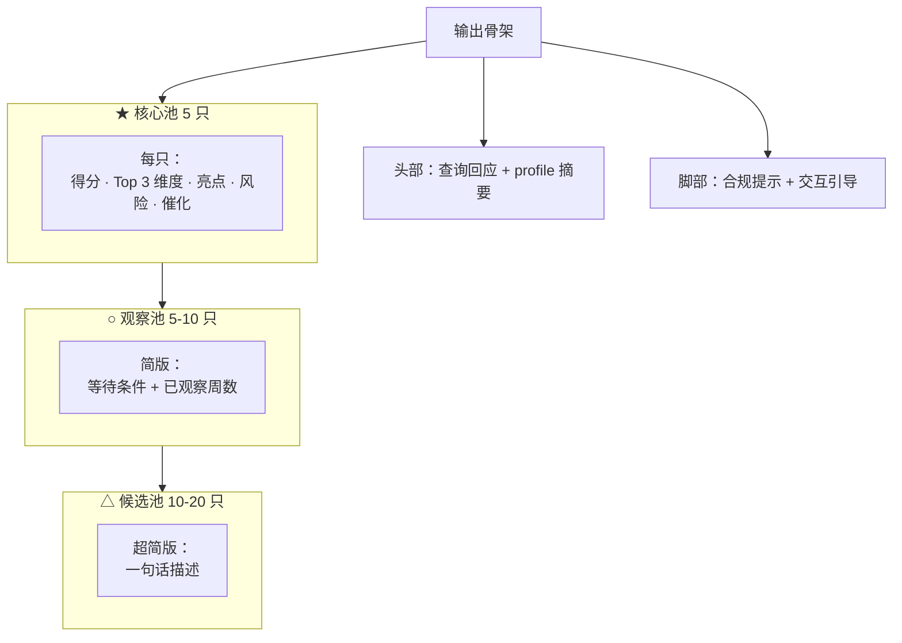
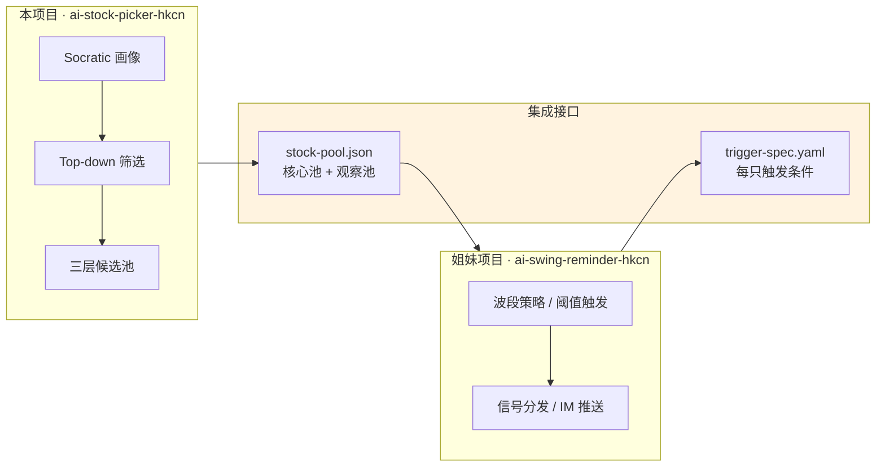
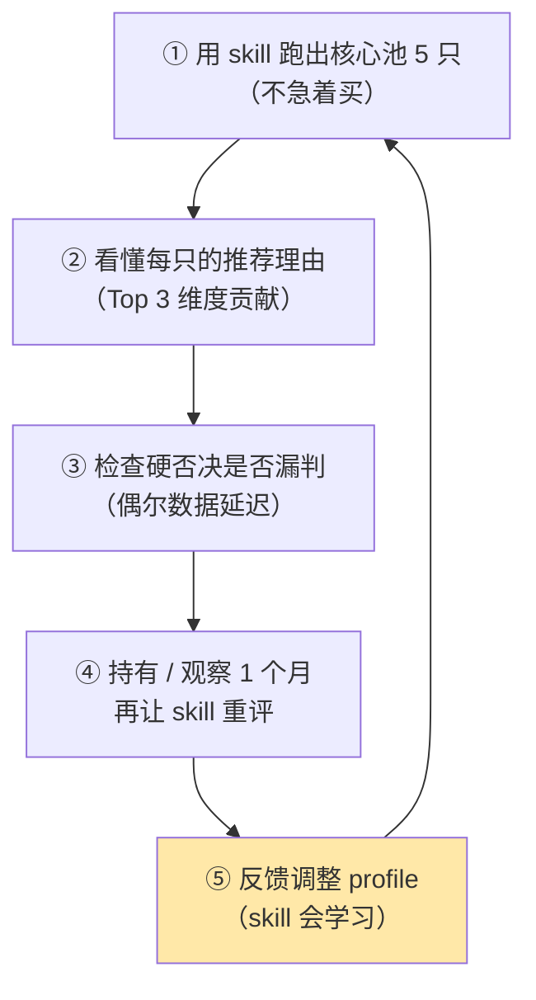
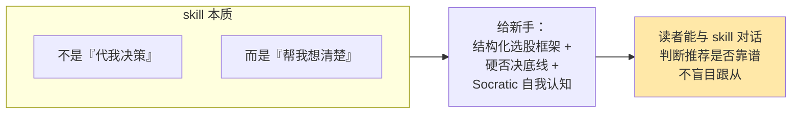

# skill 总架构

把前 11 页串起来，这一页给 skill 一张「**可实现的总装图**」：输入层（用户自然语言）→ 画像层（profile）→ 数据层（多源缓存）→ 打分层（12 维 + 硬否决）→ 输出层（三层池 + 五要素）。所有决策点、数据依赖、更新机制一次看全。读完这页你能开始造 skill。

## 总架构图



## 两种典型查询的端到端追踪

### 查询 A：「当前最值得关注的行业是哪些」



### 查询 B：「消费行业给我推 5 只长线股」



## 四个关键决策点



## Profile 的"活"机制



**关键设计**：
- **冷启动版本号 1.0**，每次月度问卷后增 0.1
- **行为校准不改版本号**，只改字段（低幅度 ±0.05）
- **重大事件触发 cold start 刷新**（用户资产变化、退休、市场危机）

## 数据更新频率



## 输出规范



**新手模式** 默认只显示核心 5 + 观察池简版。**高级模式** 可展开所有细节。

## 与姐妹项目 ai-swing-reminder 的集成



**解耦设计**：
- **本 skill 只输出候选池**（不涉及买卖时点）
- **姐妹 skill 消费候选池 + 监控触发条件**
- 两者通过文件/DB 通信，**可独立使用**

## skill 的目录结构（建议）

```
ai-stock-picker-hkcn/
├── SKILL.md                       # 主 runbook
├── scripts/
│   ├── cold_start.py              # Cold Start 问卷
│   ├── monthly_review.py          # 月度精简
│   ├── query_industry.py          # 查询 A
│   ├── query_stocks.py            # 查询 B
│   └── update_profile.py          # 行为校准
├── engine/
│   ├── data_hub.py                # 数据层
│   ├── veto_rules.py              # 硬否决
│   ├── scoring.py                 # 12 维打分
│   ├── industry_prosperity.py     # 六维景气
│   └── merrill_clock.py           # 宏观
├── references/                    # skill 运行时读入 context
│   ├── dimensions.yaml            # 12 维度定义
│   ├── veto_rules.yaml            # 硬否决规则
│   ├── style_matrix.yaml          # 流派 × 维度权重
│   └── period_weights.yaml        # 周期权重矩阵
├── assets/
│   ├── hk_short_sell_scraper.py   # 港股卖空抓取
│   └── lao_qian_blacklist.json    # 老千股黑名单
└── .profile/
    └── stock-profile.yaml         # 用户画像（动态）
```

## 关键参数汇总（skill 的"常量表"）

| 参数 | 默认值 | 依据 |
|------|-------|------|
| 候选池大小 | 100-200 | 散户可跟踪上限 |
| 观察池大小 | 30-50 | 深度研究上限 |
| 核心池大小 | 5-15 | 实盘聚焦 |
| Cold Start 题数 | 15 | < 10 分钟完成 |
| 月度精简题数 | 5 | 低负担 |
| 硬否决规则总数 | 19 (A 10 + HK 9) | |
| 商誉硬否决阈值 | 50% | 安信策略[^45] |
| 质押硬否决阈值 | 80% | 经济日报[^45] |
| 港股卖空硬否决 | > 10% | 风险保护 |
| M-Score A 股阈值 | -1.89 | 本土化[^45] |
| 行业滞涨过滤 | 90 日涨幅 > 20% | 华宝[^44] |
| 行为校准幅度 | ±0.05 | 避免震荡 |
| 黑名单持续 | 6 个月 | 避免重复纠结 |
| 核心池推荐数量（默认） | 5 | 新手上限 |

## 对新手的落地五步



**最容易的错误**：跳过 Layer 0 画像直接 Layer 3 打分 → 推荐完全不符合风险偏好。

## 最终小结



**skill 不承诺收益，承诺结构化**——这是它与"股神"的最大区别。读完这 12 页，你已经掌握 skill 的全部内部运作；下一步是去造一个（或者使用本项目产出的 skill）。

## 扩展方向（如果用户想自己造）

- **本 skill 不涉及**：组合构建（Markowitz/Risk Parity）、仓位管理、止损止盈策略
- **可以叠加的扩展**：
  - 回测框架（Qlib）
  - 实盘对接（富途 OpenAPI，港股）
  - 研报自动生成（TradingAgents-CN 框架）
  - 宏观预警（美林时钟自动监测）

## 到这里结束了

感谢读到这里。如果你是新手，现在你已经有完整的心智模型与 skill 使用指南。如果你是开发者，所有 12 页都可以直接作为 skill 的 references 目录。

最后提醒：**投资有风险，选股 skill 的输出仅供学习参考，绝不构成投资建议**。

[^44]: [[industry-prosperity-three-dim-framework|A 股行业景气度三维扫描]] · [原文](http://epaper.mrjjxw.com/shtml/mrjjxw/20250909/255331.shtml)
[^45]: [[stock-picker-hard-veto-and-soft-warnings|选股硬否决清单（A+HK）与 Beneish M-Score]]
[^47]: [[socratic-questionnaire-stock-profile-design|Socratic 引导问卷设计]]

## Sources

| # | Title | Raw Note | Original |
|---|-------|----------|----------|
| 44 | A 股行业景气度三维扫描 | [[industry-prosperity-three-dim-framework]] | [link](http://epaper.mrjjxw.com/shtml/mrjjxw/20250909/255331.shtml) |
| 45 | 硬否决清单 + M-Score | [[stock-picker-hard-veto-and-soft-warnings]] | — |
| 47 | Socratic 引导问卷设计 | [[socratic-questionnaire-stock-profile-design]] | — |
