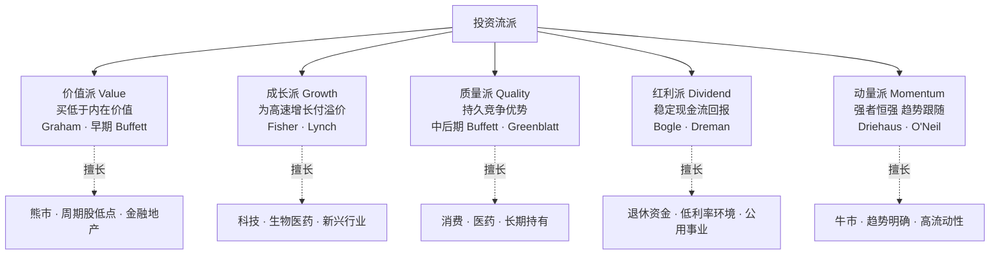
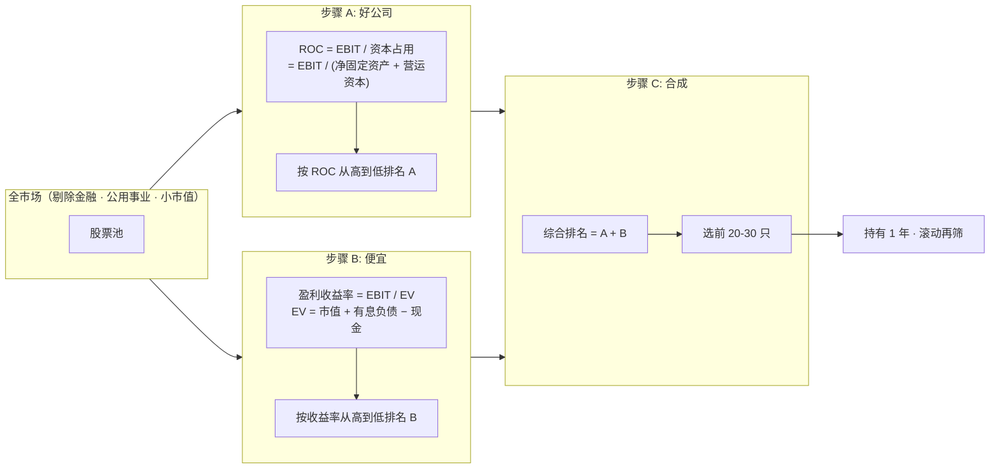
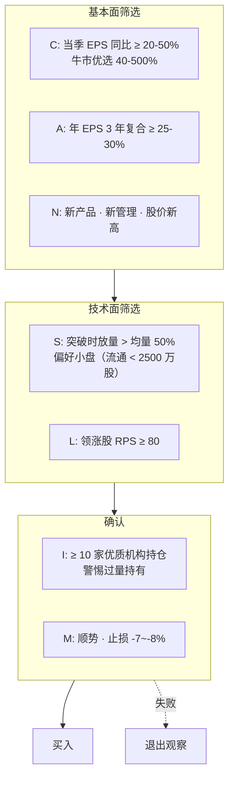
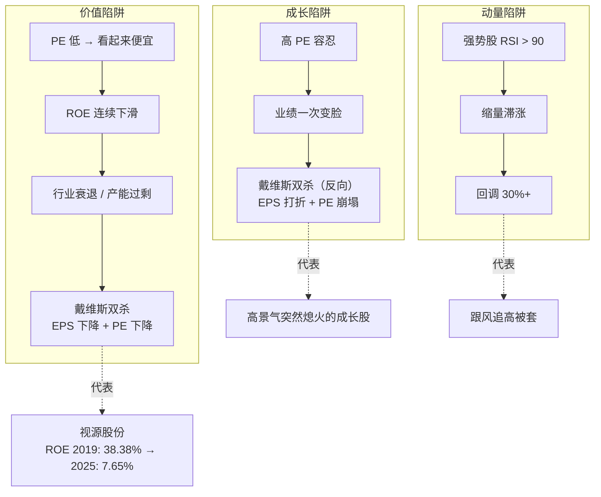
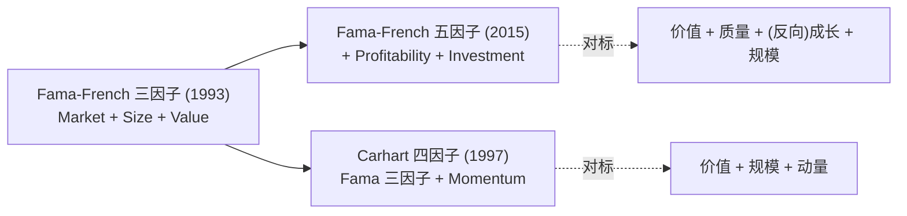
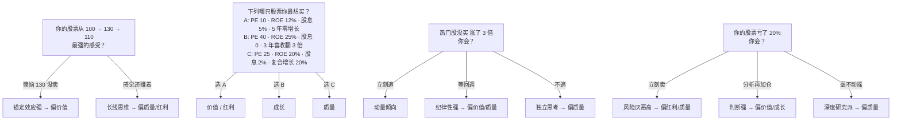

# 五大流派速读

投资世界里「流派」不是标签，是**看世界的坐标系**。价值派眼里的好股票是"便宜"，动量派眼里的好股票是"强势"，这两种人对同一张财报看到的是不同的数字。这一页给你五派的完整对照，以及一个可以立刻用的工具：**根据你对四个场景的反应，反推你属于哪一派**。

## 流派全景图

## 关键指标对照表

每一派看的指标集合几乎不重叠。

| 维度 | 价值 | 成长 | 质量 | 红利 | 动量 |
|------|:---:|:---:|:---:|:---:|:---:|
| PE / PB 分位 | ★★★ | ★ | ★★ | ★★ | - |
| 营收/净利增速 | ★ | ★★★ | ★★ | ★ | ★ |
| ROE / 毛利率 | ★★ | ★★ | ★★★ | ★★ | ★ |
| 市场份额 / 护城河 | ★★ | ★★ | ★★★ | ★ | - |
| 股息率 / 派息率 | ★★ | ★ | ★★ | ★★★ | - |
| 相对强度 RPS | - | ★ | - | - | ★★★ |
| 技术形态突破 | - | ★ | - | - | ★★★ |
| 资金流 / 北向 | ★ | ★★ | ★ | ★ | ★★★ |

★ 个数就是维度权重的直觉映射。`-` 不是"不看"，是"不作为主要决策依据"。

## 两个机械公式流派（可以立即用）

### Greenblatt 神奇公式（Magic Formula）

Joel Greenblatt 的名著《股市稳赚》提出的"好公司 + 便宜"机械选股法[^43]。

**为什么用 EBIT 而不是净利润？为什么用 EV 而不是市值？** ——为了消除资本结构（负债高低）和税率差异，让不同公司能横向比较。净利润会被利息支出和税率扭曲。

**历史业绩**（1988-2004 美股，Greenblatt 书中披露）：年化 **30.8%**，远超标普 500 同期 ~12%[^43]。

**A 股适用性**：需剔除 ST、次新股；本土化可调阈值；回测依然有效但波动大。工具：理杏仁、同花顺 iFinD。

### O'Neil CANSLIM（成长+动量融合派）

威廉·欧奈尔在《笑傲股市》中提出的七要素法则，被美国个人投资者协会评为最稳定的选股系统之一[^43]。

**关键点**：
- 辅助指标——营收 ≥ 25%、ROE > 17%、每股现金流/EPS > 20%
- **止损铁律 -7~-8%**：单次最大亏损不超过买价 8%，这是 O'Neil 体系的核心纪律

## 每派的陷阱（新手最容易栽的地方）

**戴维斯双杀**（Davis Double Kill）是选股最凶险的反模式：EPS 下降 → PE 下降 → 股价 = PE × EPS 双重下跌。反过来"戴维斯双击"（EPS 上升 + PE 上升）是成长股的理想路径[^45]。

## Fama-French 因子模型：流派的学术化

学术界把流派"因子化"：Fama 教授等人在 2015 年五因子模型中确认了**价值**（HML）、**质量**（RMW）、**投资保守度**（CMA，相当于反向成长）、**规模**（SMB）、**市场**（MKT）五个因子——**但没有动量**[^43]。

**为什么五因子不含动量**？Fama 认为动量缺乏基于风险的合理解释，且套利成本高。但实证显示动量因子独立存在（Carhart 模型），因此后来者多在 FF5 基础上叠加动量。

## A 股各派有效性（实证结论）

- **价值**：银行、煤炭板块有效
- **红利**：中证红利指数近年跑赢大盘
- **成长**：集中在新能源、半导体、AI
- **动量**：短期有效，但涨跌停制度扭曲
- **质量**：消费、医药板块长期稳定

详细的 A 股八大因子体系与 IR 加权方法见 [5. 个股 12 维度体系](5.%20个股%2012%20维度体系%20%2B%20周期权重.md)。

## 流派自测（Socratic 题源）

skill 的引导问卷不会直接问你"你是哪一派"（新手答不出），而是**通过情景反推**。这里给你四道最核心的判别题[^47]：

**skill 最终推断出的不是单一派别**，而是一个权重向量：`{value: 0.6, growth: 0.7, quality: 0.8, dividend: 0.3, momentum: 0.4}`，让不同维度按此权重组合激活（细节见 [9. Socratic 引导问卷](9.%20Socratic%20引导问卷.md)）。

## 对本 skill 的映射

每一派决定 12 维度的权重组合——这是连接流派层（本页）到维度层（[5. 个股 12 维度体系](5.%20个股%2012%20维度体系%20%2B%20周期权重.md)）的桥梁。新手用 skill 时，**流派是隐性的**——你只需回答场景题，维度权重自动就位。

[^43]: [[five-investment-styles-canslim-magic-formula|五大投资流派 · CANSLIM · Magic Formula]]
[^45]: [[stock-picker-hard-veto-and-soft-warnings|选股硬否决清单（A+HK）与 Beneish M-Score]]
[^47]: [[socratic-questionnaire-stock-profile-design|Socratic 引导问卷设计]]

## Sources

| # | Title | Raw Note | Original |
|---|-------|----------|----------|
| 43 | 五大投资流派 + CANSLIM + Magic Formula | [[five-investment-styles-canslim-magic-formula]] | [link](https://wiki.mbalib.com/zh-tw/CANSLIM%E9%80%89%E8%82%A1%E6%96%B9%E6%B3%95) |
| 45 | 选股硬否决清单 + Beneish M-Score | [[stock-picker-hard-veto-and-soft-warnings]] | — |
| 47 | Socratic 引导问卷设计 | [[socratic-questionnaire-stock-profile-design]] | — |
