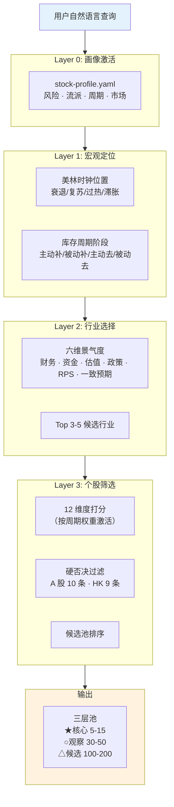
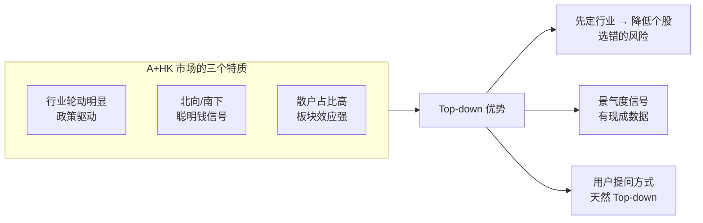
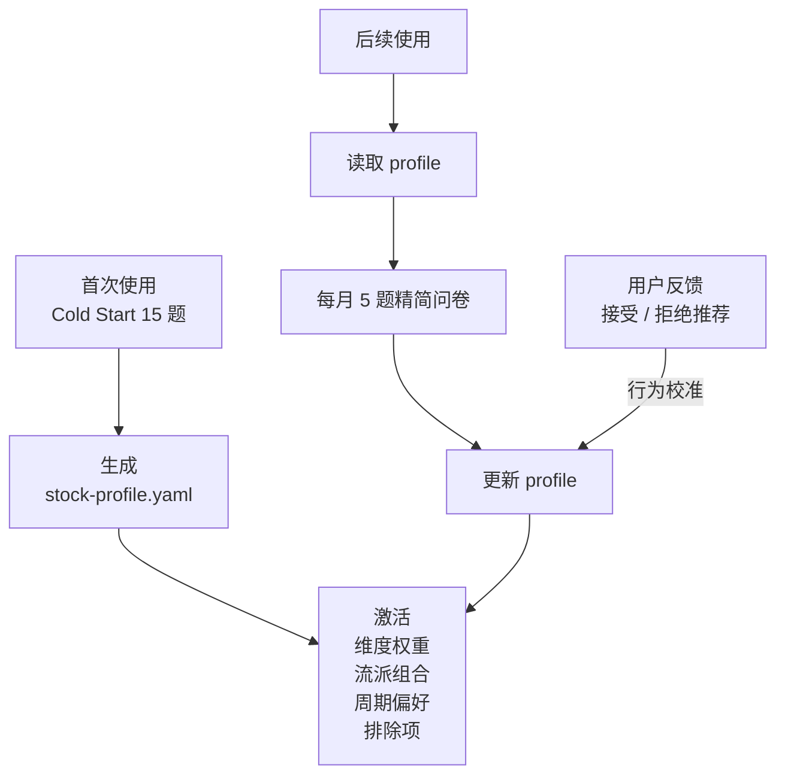
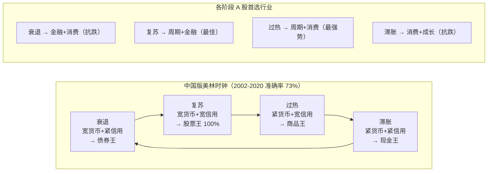
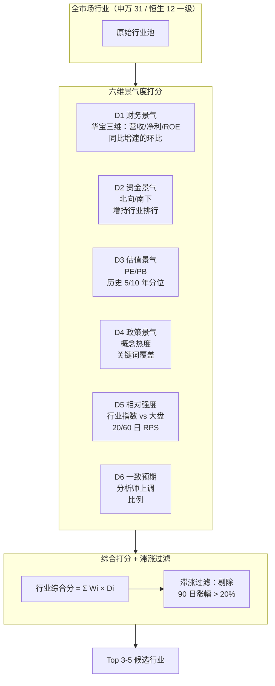
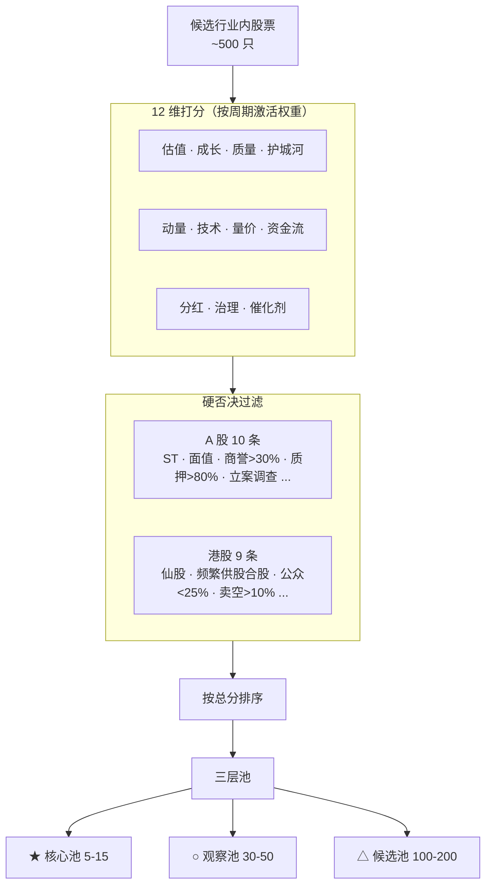
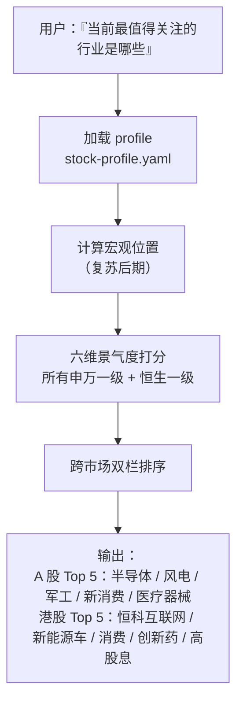
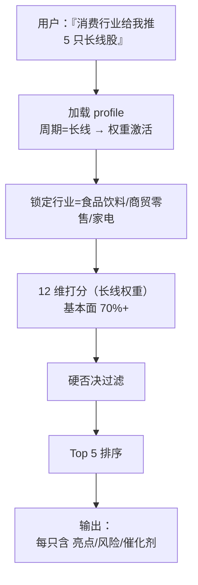
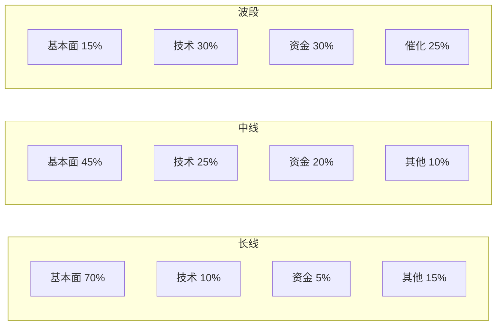
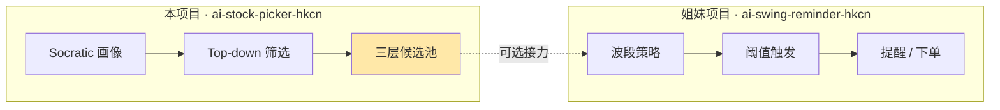

# Top-down 三层漏斗

Top-down（自上而下）是本 skill 的主流程，因为它直接对应你的自然语言查询模式："**当前最值得关注的行业是什么**"、"**X 行业给我推 5 只**"。这一页把从用户一句话到最终候选池的完整管线画出来——全 skill 的运行逻辑就这张图。

## 四步漏斗总图



每一层都在**把问题缩小一个量级**：全市场 ~7500 只 → 候选行业对应 ~500 只 → 硬否决后 ~200 只 → 最终核心池 5-15 只。

## 为什么 Top-down 适合 A+HK



**美股用 Top-down 效果有限**，因为美股行业轮动比中国小、政策驱动弱；但在 A+HK，政策文件、供给侧改革、行业规划都能直接改变某个行业整体估值中枢——这种情况下，先定行业比先找牛股更可靠[^34][^44]。

## Layer 0: 画像激活（skill 的"记忆"）



画像不是一次问完就锁死的。每次你接受或拒绝某只推荐（例：拒绝白酒股），skill 都会**反向推断**更新你的偏好向量。这是 skill 与静态"风险测评问卷"的关键区别——问卷是死的，画像是活的（细节见 [9. Socratic 引导问卷](9.%20Socratic%20引导问卷.md)）[^47]。

## Layer 1: 宏观定位（给行业判断提供坐标）

这一层回答"现在是什么季节"。中国版美林时钟的四阶段：



**关键修正**：美国传统美林时钟在中国**准确率只有 40%**。原因：中国货币政策多目标、政策干预强（2015 资金市、2016 供给侧）。泽平宏观改良版以"货币周期 + 信用周期"代替"产出缺口 + 通胀"，准确率升至 **73%**[^34]。skill 使用改良版。

## Layer 2: 行业选择（本 skill 最核心的创新）



**华宝三维景气度**的巧思是用「**同比增速的环比增长率**」作为指标——这是二阶导数，捕捉边际拐点[^44]。举例：

```
Q1 营收同比 +5%
Q2 营收同比 +12%   → 环比变化 +7pp（景气加速）✓
Q3 营收同比 +10%   → 环比变化 -2pp（景气减速）✗
```

关键在于**正负号**而非绝对数值——方向对了就算"处于景气区间"。2025 中期实证排名：机场航运、军工电子、风电设备居前[^44]。

**滞涨景气板块**（涨幅小 + 景气高）性价比最高：机场航运、饮料制造、保险、医药商业。

详见 [4. 行业选择：六维景气度](4.%20行业选择：六维景气度.md)。

## Layer 3: 个股筛选（打分 + 否决）



硬否决和打分是**两个独立阶段**，不能合并：
- **硬否决是"一票否决"**——ST 股再便宜也不要
- **打分是"加权组合"**——多维度叠加得出分数

细节分别见 [11. 硬否决清单](11.%20硬否决清单%20%2B%20价值%2F动量陷阱.md) 和 [5. 个股 12 维度体系](5.%20个股%2012%20维度体系%20%2B%20周期权重.md)。

## 两种查询的端到端示例

### 查询 A：「当前最值得关注的行业是哪些」



### 查询 B：「消费行业给我推 5 只长线股」



## 周期切换改变权重

同一个人、同一套 profile，**周期不同，12 维度权重完全不同**：



skill 启动时问一句"你想选长/中/波段？"，剩下的权重自动切换。

## 与 ai-swing-reminder-hkcn 的关系



**本项目**只管"买什么"（选股）——输出候选池。
**姐妹项目**只管"何时买"（择时）——接收候选池 + 输出触发提醒。

两者可以联动也可以独立。本 skill 不假设你一定要用择时项目。

## 对新手的落地建议

1. **先用 skill 跑出核心池 5 只**，不急着买
2. **看懂每只的推荐理由**（12 维哪几维贡献最大）
3. **检查硬否决是否漏判**（偶尔会有数据延迟）
4. **持有 / 观察 1 个月**，再让 skill 重新评估
5. **反馈调整 profile**（skill 会学习你的拒绝理由）

**最容易的错误**：跳过 Layer 0 画像，直接跑 Layer 3 打分。结果是推荐完全不符合你的风险偏好——"给长线爱好者推了个一周妖股"。

[^34]: [[china-merrill-clock-industry-rotation|中国版美林投资时钟]] · [原文](https://finance.sina.com.cn/roll/2021-02-24/doc-ikftpnny9346839.shtml)
[^44]: [[industry-prosperity-three-dim-framework|A 股行业景气度三维扫描]] · [原文](http://epaper.mrjjxw.com/shtml/mrjjxw/20250909/255331.shtml)
[^47]: [[socratic-questionnaire-stock-profile-design|Socratic 引导问卷设计]]

## Sources

| # | Title | Raw Note | Original |
|---|-------|----------|----------|
| 34 | 中国版美林投资时钟 | [[china-merrill-clock-industry-rotation]] | [link](https://finance.sina.com.cn/roll/2021-02-24/doc-ikftpnny9346839.shtml) |
| 44 | A 股行业景气度三维扫描 | [[industry-prosperity-three-dim-framework]] | [link](http://epaper.mrjjxw.com/shtml/mrjjxw/20250909/255331.shtml) |
| 47 | Socratic 引导问卷设计 | [[socratic-questionnaire-stock-profile-design]] | — |
