# 行业选择：六维景气度

"当前最值得关注的行业是什么" 是本 skill 最核心的查询之一。这一页把这个问题拆成六个可量化的维度，每一维都有明确的数据来源、计算方法和在 AkShare 里的接口。skill 最终给出的"Top 3-5 候选行业"就是这六维综合打分的结果。

## 六维总览

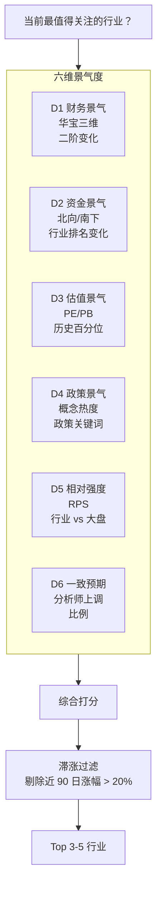

六维之间**互相验证**：任何单维信号都可能噪声，但多维同向才真可信。

## D1 财务景气：华宝三维（二阶变化捕捉拐点）

华宝证券提出的"三维扫描"用**同比增速的环比增长率**（数学上是二阶导数）来捕捉行业景气度的**边际拐点**[^44]。

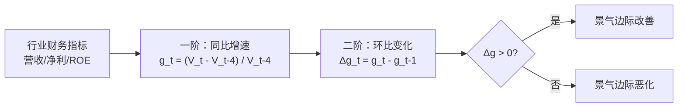

### 为什么要看二阶导数

一阶（同比增速）告诉你"现在增长几何"。
二阶（环比变化）告诉你"增长在加速还是减速"。

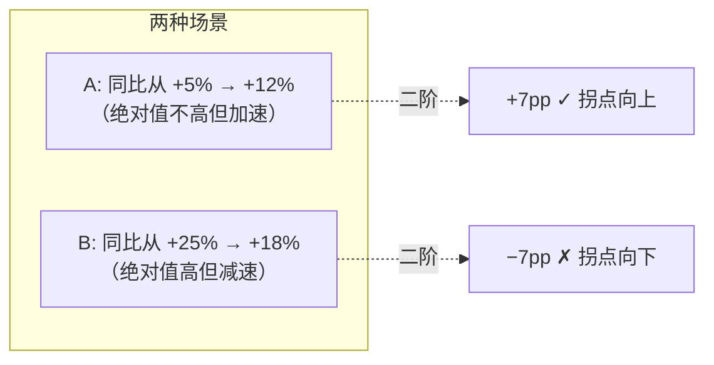

**股价提前反映拐点**，所以二阶信号比一阶快。2025 中期实证：

| 维度 | 景气行业数 (/90) | TOP 行业 |
|------|:---:|------|
| 营业收入 | **43** | 军工装备 · 服装家纺 · 风电设备 · 军工电子 · 生物制品 |
| 净利润 | **36** | 旅游及酒店 · 机场航运 · 光伏设备 · 软件开发 |
| ROE | **36** | 房地产 · 机场航运 · 旅游及酒店 · 影视院线 |
| **综合** | — | **机场航运 · 军工电子 · 军工装备 · 风电设备 · 贵金属** |

**阈值是方向性的**：Δg > 0 即"处于景气区间"，不需要绝对数值门槛。

### 华宝三维的实证结论

1. 三维**均为有效正向指标**——指标值高 → 下期财报前收益率高[^44]
2. "行业景气度改善越明显，则股票市场价格表现越好"——景气与股价**同向变动**
3. **滞涨景气板块性价比最高**：过去 90 日涨幅相对较小 + 综合景气排名居前（2025 中期案例：机场航运、饮料制造、保险、医药商业）

## D2 资金景气：北向 + 南下的聪明钱

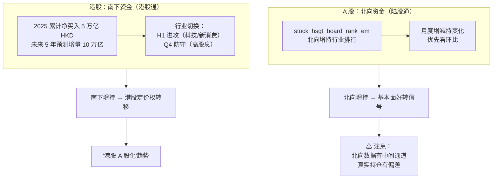

**北向资金的信号强度**：2026 年 Q1 末重仓 TOP3 —— 电力设备（5120 亿）、电子（3749 亿）、有色金属（1746 亿）；加仓方向是 AI 算力、商业航天、存储芯片[^40]。skill 不看持仓绝对值（滞后），**只看月度/周度净流入行业排名变化**。

**南下资金的特质**：2025 年上半年进攻（科技、新消费），四季度转守（高股息）——呈现明显的季节切换。skill 可以把南下视为港股的"行业景气度加速器"[^40]。

## D3 估值景气：历史分位

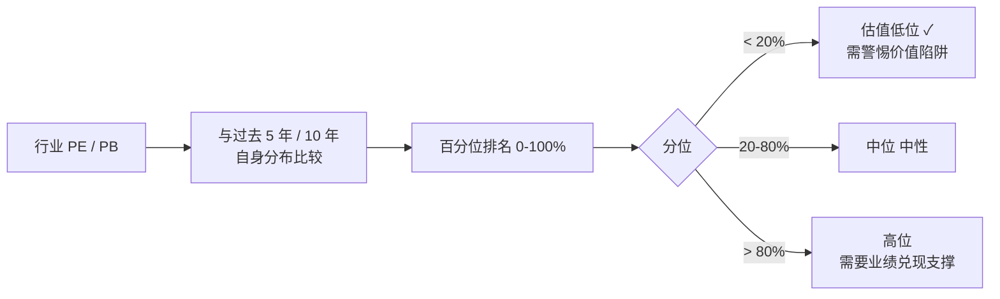

**两个常见误区**：

1. **绝对 PE 不等于便宜/贵**——周期股顶点时 PE 很低（分母高），谷底时 PE 很高（分母低）。看分位数才能正确判断。
2. **行业间不能横向比 PE**——银行天然 5-10、白酒天然 20-40、科技天然 30-100。比较必须在同行业内做。

## D4 政策景气：热度与关键词

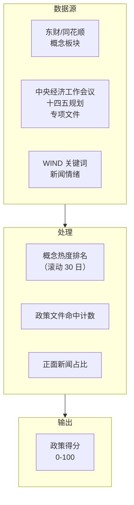

**新手可操作代理**：直接看**同花顺/东财近 3 个月涨幅前 50 的概念**——这是市场共识的"政策受益+热点"列表。但要**排除纯炒作**（需要叠加 D1 财务景气验证）。

## D5 相对强度 RPS

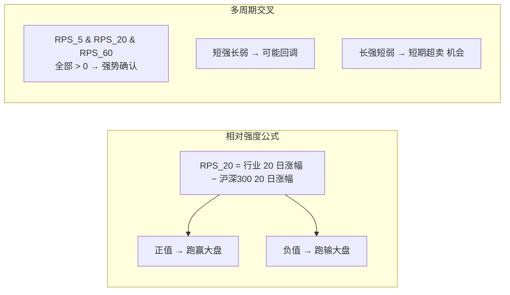

**CANSLIM 的 L 要素**（欧奈尔）要求 **RPS ≥ 80**（百分位）才算领涨股[^43]。本 skill 给行业用的是**行业指数 RPS**，个股层面同样逻辑在 [5. 个股 12 维度](5.%20个股%2012%20维度体系%20%2B%20周期权重.md) 的动量维度再用一次。

## D6 一致预期：分析师共识

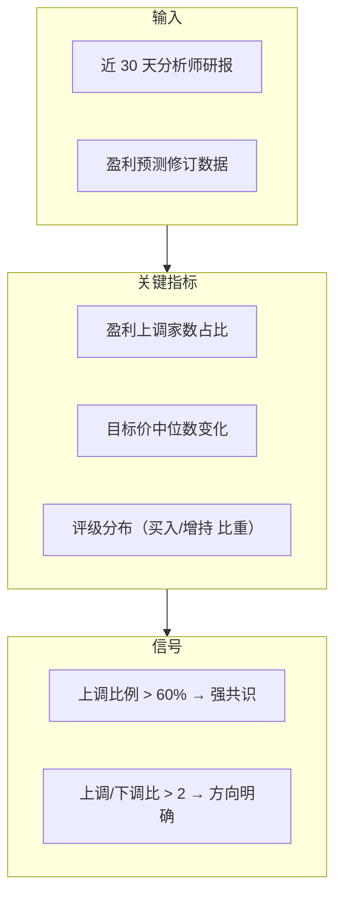

**局限**：分析师预期**滞后于股价**（信息公开度高，博弈多）。更有用的是**预期变化率**而非绝对值——"上调" > "已经预测很高"。

**数据源**：
- Tushare Pro `report_rc`（付费，最全）
- 东财研报（免费但抓取限流）
- AkShare `stock_report_disclosure`（元数据）

## 综合打分 + 滞涨过滤

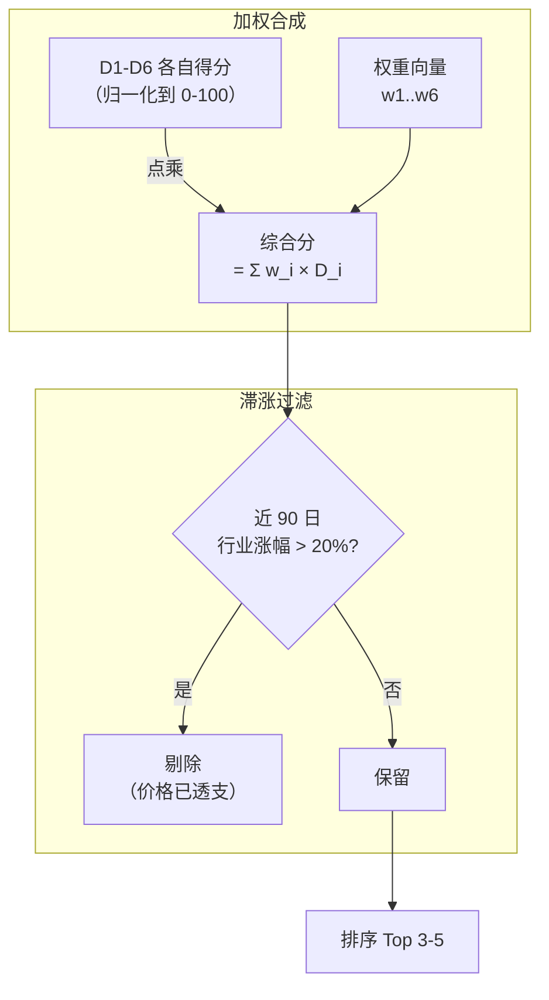

### 权重建议（可根据 profile 调整）

| 维度 | 长线建议权重 | 中线建议权重 | 波段建议权重 |
|------|:---:|:---:|:---:|
| D1 财务 | 30% | 20% | 10% |
| D2 资金 | 20% | 25% | 30% |
| D3 估值 | 20% | 15% | 5% |
| D4 政策 | 10% | 15% | 20% |
| D5 RPS | 10% | 15% | 25% |
| D6 一致预期 | 10% | 10% | 10% |

权重不是绝对——核心是**"长线重基本面，波段重资金与动量"**的大方向。

## 滞涨景气为什么最值钱

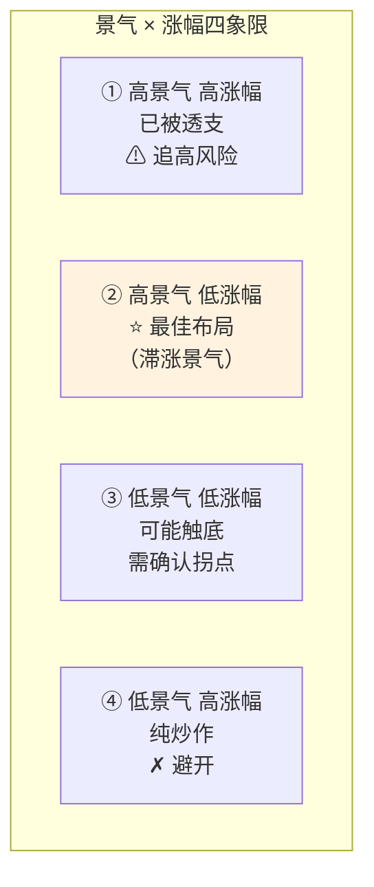

**Q2 象限是 skill 要重点推送给你的行业**。2025 中期实例：机场航运、饮料制造、保险、医药商业[^44]。

## A+HK 双市场对齐

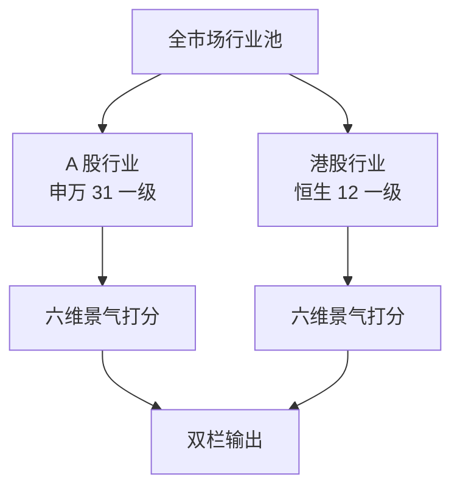

**重要提醒**：A+HK 行业分类体系不同（申万 vs 恒生），不要简单合并排名[^38]。例：腾讯在恒生归"资讯科技业"，但在 A 股可能归"传媒"或"计算机应用"——跨市场比较需要到二三级行业精匹配。

详细对应表见 [6. A 股特色](6.%20A%20股特色.md) 和 [7. 港股特色](7.%20港股特色.md)。

## 数据接口速查

| 维度 | AkShare 接口 | 说明 |
|------|------------|------|
| D1 财务景气 | `stock_financial_analysis_indicator` | 需按行业聚合 |
| D2 北向资金 | `stock_hsgt_board_rank_em` | 每日更新 |
| D2 南下资金 | `stock_hsgt_hist_em` | symbol="港股通" |
| D3 估值分位 | `stock_board_industry_summary_ths` | 同花顺行业 PE/PB |
| D4 政策概念 | `stock_board_concept_name_em` | 概念板块列表 |
| D5 RPS | `stock_zh_index_daily` + `stock_board_industry_hist_em` | 指数日线 |
| D6 一致预期 | `stock_report_disclosure` + Tushare `report_rc` | 合并去重 |

完整接口清单与字段归一化方法见 [8. 数据接口地图](8.%20数据接口地图.md)。

## 输出示例

```
┌────────────────────────────────────────────────────────┐
│  本周行业榜单（2026-04-28）                            │
│                                                        │
│  ★ A 股 Top 5                                          │
│  1. 半导体设备      90/100  ★★★★★                     │
│     · D1 财务 ✓  D2 北向 +★  D5 RPS 82                 │
│     · 政策：大基金三期                                 │
│                                                        │
│  2. 军工电子        87/100  ★★★★                      │
│  3. 新消费（新茶饮）85/100  ★★★★                      │
│  4. 医疗器械        82/100  ★★★                       │
│  5. 光伏设备        78/100  ★★★                       │
│                                                        │
│  ★ 港股 Top 5                                          │
│  1. 恒生科技（互联网）91/100                           │
│  2. 新能源车        86/100                             │
│  3. 创新药          82/100                             │
│  ...                                                   │
│                                                        │
│  ⚠ 已过滤：白酒（涨幅 28%）· 新能源车（涨幅 35%）      │
└────────────────────────────────────────────────────────┘
```

[^34]: [[china-merrill-clock-industry-rotation|中国版美林投资时钟]] · [原文](https://finance.sina.com.cn/roll/2021-02-24/doc-ikftpnny9346839.shtml)
[^38]: [[industry-classification-a-hk-shenwan-citic-hangseng|A+HK 行业分类体系对比]]
[^40]: [[hk-market-specifics-t0-short-selling-southbound|港股市场特色机制]]
[^43]: [[five-investment-styles-canslim-magic-formula|五大投资流派 · CANSLIM · Magic Formula]]
[^44]: [[industry-prosperity-three-dim-framework|A 股行业景气度三维扫描]] · [原文](http://epaper.mrjjxw.com/shtml/mrjjxw/20250909/255331.shtml)

## Sources

| # | Title | Raw Note | Original |
|---|-------|----------|----------|
| 34 | 中国版美林投资时钟 | [[china-merrill-clock-industry-rotation]] | [link](https://finance.sina.com.cn/roll/2021-02-24/doc-ikftpnny9346839.shtml) |
| 38 | A+HK 行业分类体系对比 | [[industry-classification-a-hk-shenwan-citic-hangseng]] | — |
| 40 | 港股市场特色机制 | [[hk-market-specifics-t0-short-selling-southbound]] | — |
| 43 | 五大投资流派 + CANSLIM + Magic Formula | [[five-investment-styles-canslim-magic-formula]] | — |
| 44 | A 股行业景气度三维扫描 | [[industry-prosperity-three-dim-framework]] | [link](http://epaper.mrjjxw.com/shtml/mrjjxw/20250909/255331.shtml) |
