# 个股 12 维度体系 + 周期权重

行业选好之后，skill 在候选行业内用 12 个维度对每只股票打分。这一页把每个维度拆成 **What / Why / How / Trap / Data** 五段式——新手不需要懂因子模型就能看懂"为什么这只得分高"。末尾有周期权重矩阵和 5 派×12 维的交叉表，这两张表就是 skill 的评分心脏。

## 12 维度全景

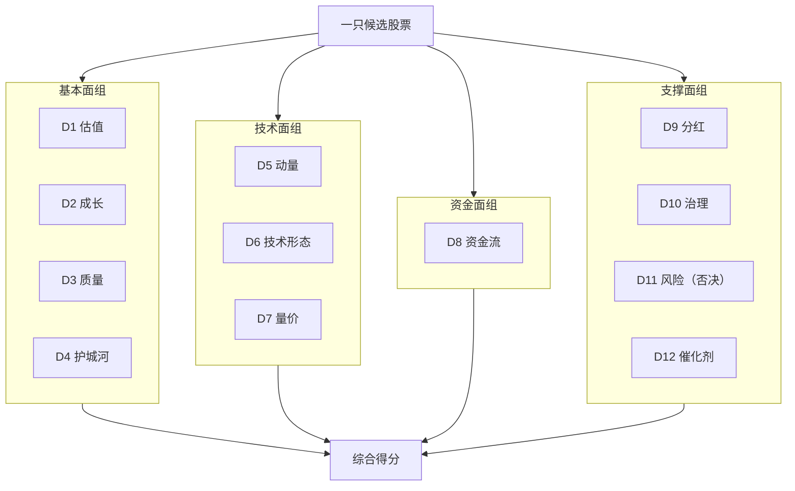

**D11（风险）是特殊维度**——它不参与加分，而是做**一票否决**。详见 [11. 硬否决清单](11.%20硬否决清单%20%2B%20价值%2F动量陷阱.md)。

## 维度卡片（每维五段式）

### D1 估值（Valuation）

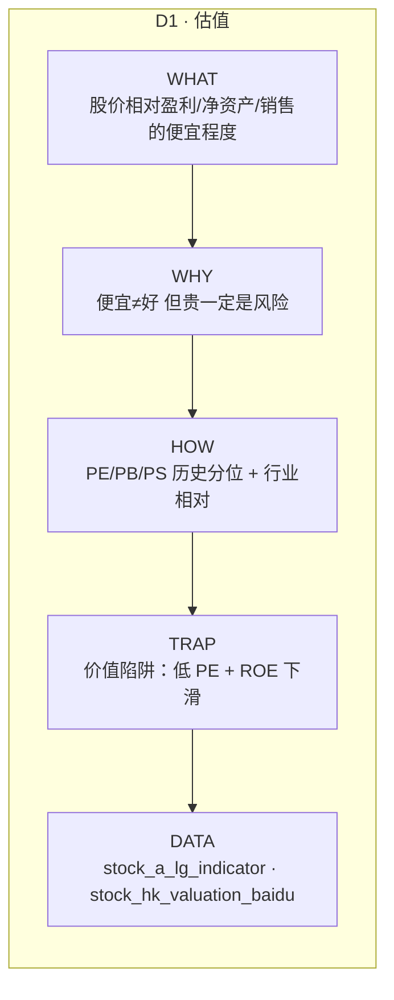

**选 PE 还是 PB？**

- 成熟 + 轻资产 + 弱周期 → PE（消费、医药）
- 重资产 + 强周期 → PB（银行、地产、周期）
- 成长期未盈利 → PS（早期 SaaS、生物医药）

### D2 成长（Growth）

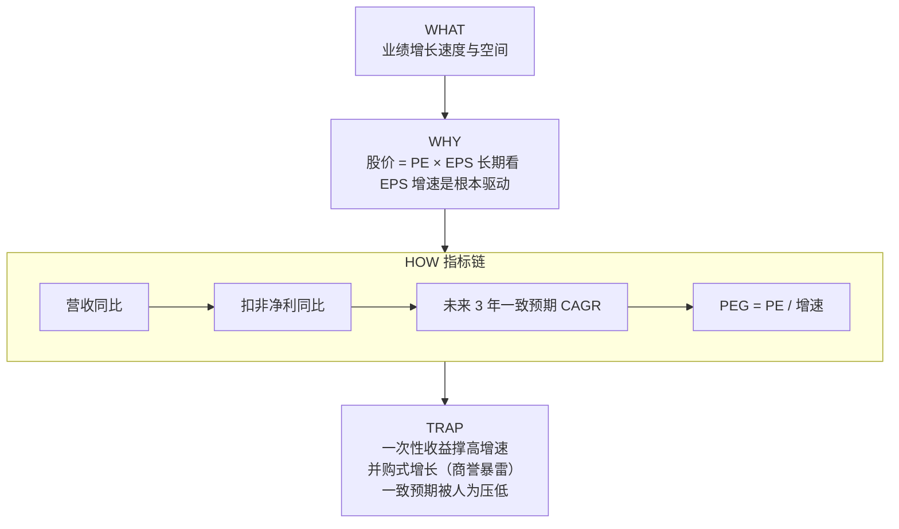

CANSLIM 标准[^43]：当季 EPS ≥ 20%，年化 3 年 ≥ 25-30%。

### D3 质量（Quality）

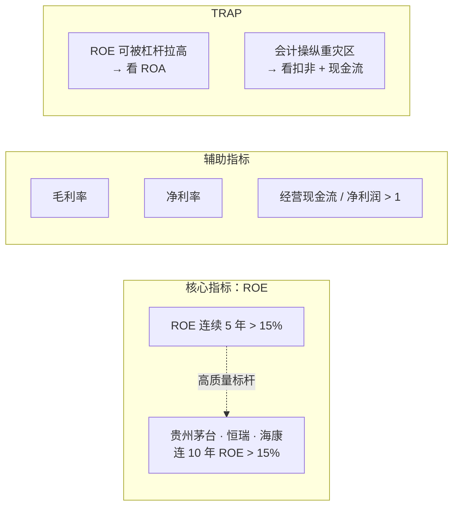

**为什么看现金流/净利润**？净利润是会计数字，现金流是真金白银。两者背离就是造假信号（见 [11. 硬否决清单](11.%20硬否决清单%20%2B%20价值%2F动量陷阱.md) 的 Beneish M-Score）。

### D4 护城河（Moat）

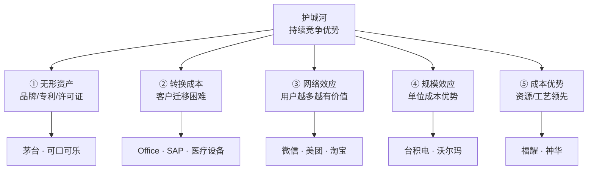

**新手可操作代理**（无需财务分析）：
- 连续 10 年 ROE > 15%
- 连续 10 年毛利率稳定或上升
- 行业份额 CR3 > 50% 且稳定

**陷阱**：新兴行业的"护城河"多是时间短的先发优势，不一定持久。

### D5 动量 / 趋势（Momentum）

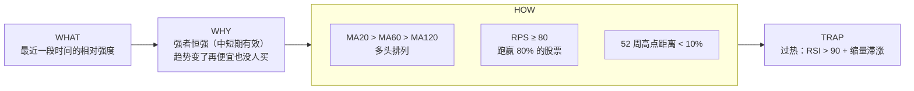

### D6 技术形态（Pattern）& D7 量价（Volume-Price）

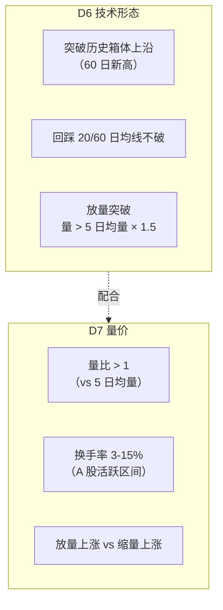

**对新手 skill 的关键设计**：默认**不展示技术细节**，只标注 "技术面 ✓ / ✗ / 谨慎" 三档。深度用户可打开详细视图。

**板块归一化陷阱**[^39]：同样是"突破年线 + 放量"，主板的 +10% 和创业板的 +20% 含义完全不同。skill 计算动量/突破时必须按板块分开。

**Qlib Alpha158 覆盖了 D5-D7 的大部分技术面因子**（153 个公式）[^35]——详见 [8. 数据接口地图](8.%20数据接口地图.md)。

### D8 资金流（Money Flow）—— A 股特色

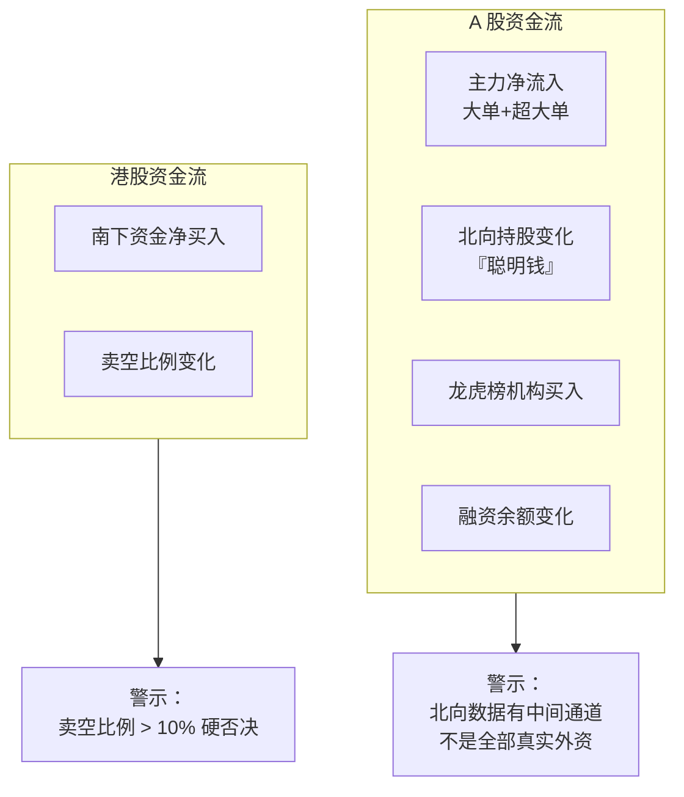

### D9 分红（Dividend）

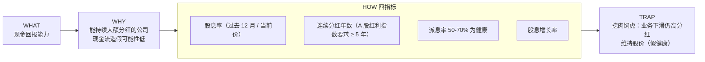

### D10 治理（Governance）— 否决项列表

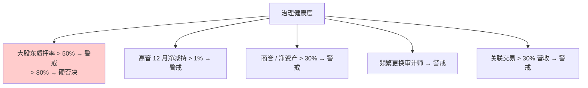

所有 D10 阈值来源于证监会披露 + 雪球/财联社案例研究[^45]。

### D12 催化剂（Catalysts）

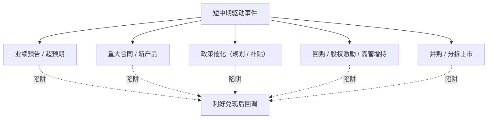

## 周期 × 维度权重矩阵（skill 的核心参数）

skill 运行时根据用户选的周期**自动切换权重**：

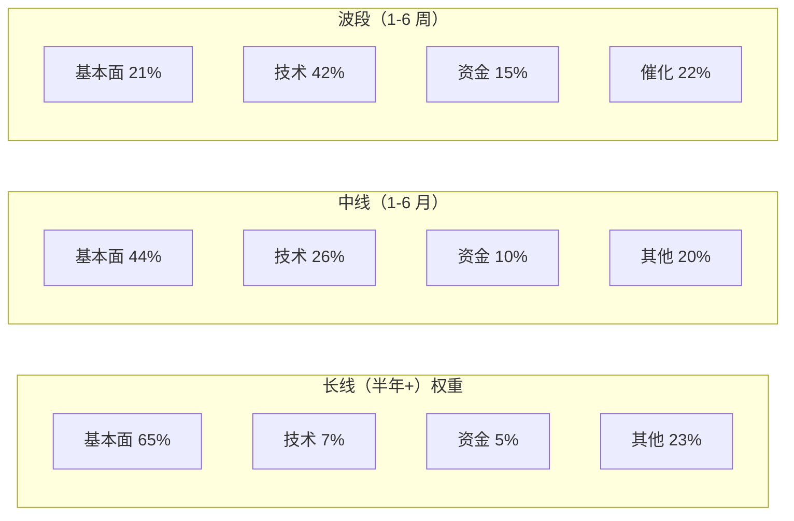

### 完整权重表

| 维度 | 长线 | 中线 | 波段 |
|------|:---:|:---:|:---:|
| D1 估值 | 15% | 12% | 5% |
| D2 成长 | 15% | 12% | 8% |
| D3 质量 | 20% | 12% | 5% |
| D4 护城河 | 15% | 8% | 3% |
| D5 动量 | 3% | 10% | 15% |
| D6 技术 | 2% | 8% | 12% |
| D7 量价 | 2% | 8% | 15% |
| D8 资金流 | 5% | 10% | 15% |
| D9 分红 | 10% | 5% | 2% |
| D10 治理 | 8% | 5% | 3% |
| D11 风险 | 否决 | 否决 | 否决 |
| D12 催化 | 5% | 10% | 17% |
| **合计** | **100%** | **100%** | **100%** |

这组权重**不是定律**——skill 根据 profile 做二阶调整（例：红利派用户自动把 D9 权重 +10%）。

## 流派 × 维度交叉表（流派如何激活权重）

如果用户被推断为"**质量 + 成长**"混合画像，skill 会在基础周期权重之上，再把 D3/D2/D4 的权重乘以 1.2-1.5。

| 维度 | 价值 | 成长 | 质量 | 红利 | 动量 |
|------|:---:|:---:|:---:|:---:|:---:|
| D1 估值 | ★★★ | ★ | ★★ | ★★ | - |
| D2 成长 | ★ | ★★★ | ★★ | ★ | ★ |
| D3 质量 | ★★ | ★★ | ★★★ | ★★ | ★ |
| D4 护城河 | ★★ | ★★ | ★★★ | ★ | - |
| D5 动量 | - | ★ | - | - | ★★★ |
| D6 技术 | - | ★ | - | - | ★★★ |
| D7 量价 | - | ★ | - | - | ★★★ |
| D8 资金流 | ★ | ★★ | ★ | ★ | ★★★ |
| D9 分红 | ★★ | ★ | ★★ | ★★★ | - |
| D10 治理 | ★★ | ★★ | ★★★ | ★★★ | ★ |
| D11 风险 | ★★★ | ★★★ | ★★★ | ★★★ | ★★ |
| D12 催化 | ★ | ★★ | ★ | ★ | ★★★ |

## A 股多因子实证（八大因子 + IR 加权）

华宝证券的"动态情景多因子"模型是 A 股最成熟的实证之一[^36]：

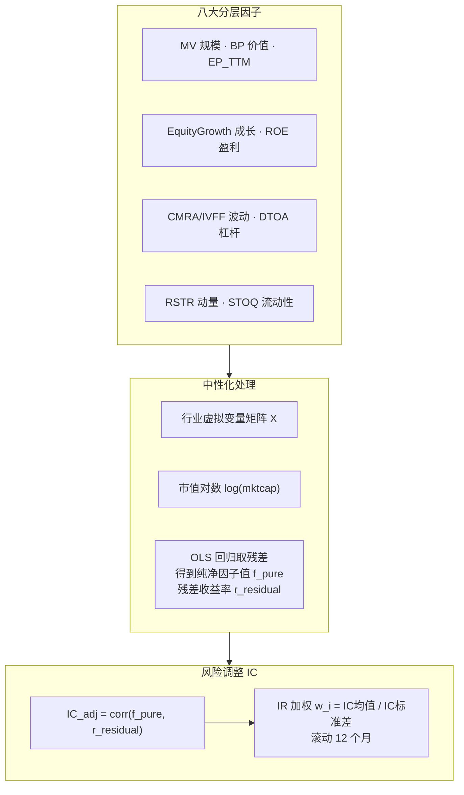

**为什么要做行业+市值双中性化**？A 股如果不去掉行业和市值偏倚，任何因子都会被"小盘股效应"污染——看起来有效，实际上只是在捕捉"小盘溢价"[^36]。

**IR 加权为什么优于等权**：过去 12 月 IC 均值/标准差同时考虑**有效性**和**稳定性**——一个偶尔很强但飘的因子，IR 会低；一个稳定贡献的因子，IR 会高。

## 示例：一张完整的评分卡

```
宁德时代（300750）· 长线周期 · 质量派画像
────────────────────────────────────────────
得分  权重   维度          数据
92  × 20% = 18.4   D3 质量     ROE 22% 连 5 年
90  × 15% = 13.5   D4 护城河   全球份额 37%
88  × 15% = 13.2   D2 成长     营收 CAGR 45%
60  × 15% =  9.0   D1 估值     分位 82% ⚠
75  × 10% =  7.5   D9 分红     股息 0.8% 稳定
...
────────────────────────────────────────────
  综合得分: 87 / 100
  硬否决: ✓ 全部通过
  等级:    ★ 核心池候选
```

skill 只显示 **Top 3 得分贡献维度 + 主要风险**，避免信息过载（见 [10. 候选池三层结构](10.%20候选池三层结构.md)）。

## 数据实现

全部 12 维度在 AkShare / Tushare / Qlib 上的落地接口见 [8. 数据接口地图](8.%20数据接口地图.md)。

核心结论：
- **AkShare 覆盖 ~85%** 维度（免费）
- **Tushare Pro 补一致预期和北向历史**（200 元/年）
- **Qlib Alpha158** 提供 D5-D7 技术面的 153 个开源因子

[^35]: [[qlib-alpha158-factor-definitions|Qlib Alpha158 因子完整定义（源码级）]]
[^36]: [[dynamic-multifactor-alpha-model-ashare|动态情景多因子 Alpha 模型（A 股实证）]] · [原文](https://j519lee.blog.csdn.net/article/details/117508587)
[^39]: [[a-share-market-mechanics-price-limit-st-delisting|A 股市场机制：涨跌停/ST/退市/注册制]]
[^43]: [[five-investment-styles-canslim-magic-formula|五大投资流派 · CANSLIM · Magic Formula]]
[^45]: [[stock-picker-hard-veto-and-soft-warnings|选股硬否决清单（A+HK）与 Beneish M-Score]]
[^46]: [[12-dimension-stock-picking-framework|个股 12 维度选股体系]]

## Sources

| # | Title | Raw Note | Original |
|---|-------|----------|----------|
| 35 | Qlib Alpha158 因子完整定义 | [[qlib-alpha158-factor-definitions]] | [link](https://raw.githubusercontent.com/microsoft/qlib/main/qlib/contrib/data/loader.py) |
| 36 | 动态情景多因子 Alpha 模型 | [[dynamic-multifactor-alpha-model-ashare]] | [link](https://j519lee.blog.csdn.net/article/details/117508587) |
| 39 | A 股市场机制 | [[a-share-market-mechanics-price-limit-st-delisting]] | — |
| 43 | 五大投资流派 + CANSLIM | [[five-investment-styles-canslim-magic-formula]] | — |
| 45 | 硬否决清单 + M-Score | [[stock-picker-hard-veto-and-soft-warnings]] | — |
| 46 | 12 维度选股体系 | [[12-dimension-stock-picking-framework]] | — |
