# A 股特色

A 股不是美股的廉价版——它有**自己的交易制度、资金信号和退市规则**。直接搬美股选股逻辑到 A 股会栽在涨跌停板归一化、ST 识别、北向"聪明钱"这几道坎上。这一页把你必须知道的 A 股特殊机制梳理成一张地图，并给出在选股中怎么用它们。

## A 股六大独有机制

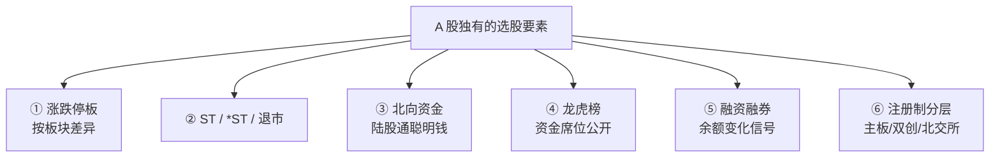

每一项都**改变了因子的意义或有效性**。下面逐一展开。

## 机制 1：涨跌停板（按板块分层）

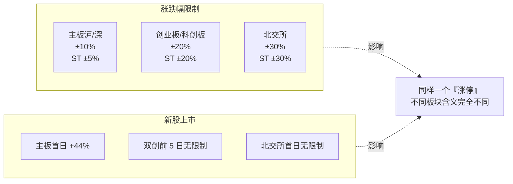

### 对选股因子的意义

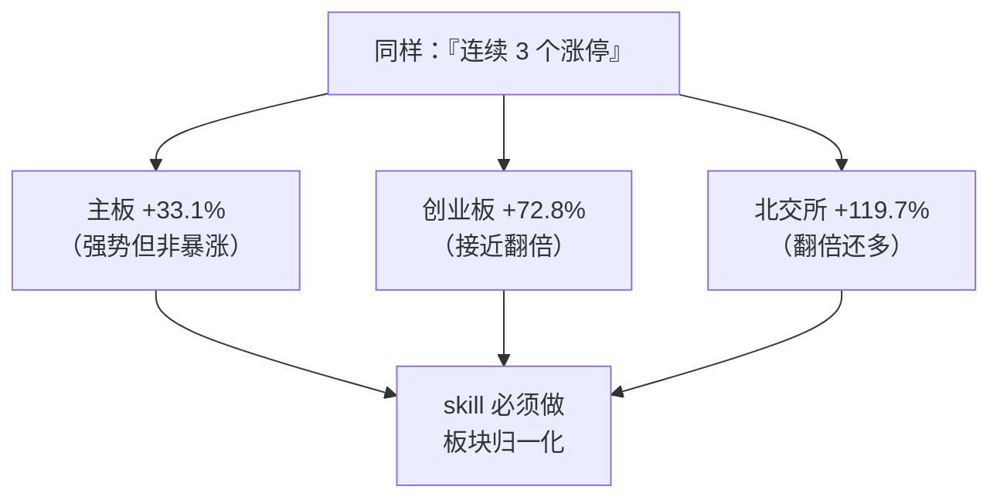

**归一化规则**[^39]：

| 因子 | 主板 | 创业板/科创板 | 北交所 |
|------|:---:|:---:|:---:|
| "涨停"阈值 | +9.8%~10% | +19.8%~20% | +29.8%~30% |
| "连板"意义 | 强 | 中（涨停跌停都易） | 弱（波动大） |
| "光头阳线"实体 | > 5% | > 10% | > 15% |

否则跨板块比较会得到"北交所股票动量最强"这种错误结论。

## 机制 2：ST / *ST / 退市（选股第一道硬门）

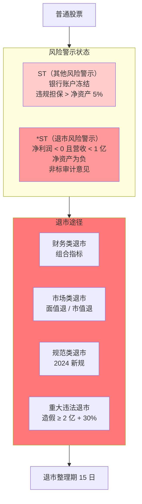

### 2024 退市新规关键变化[^39]

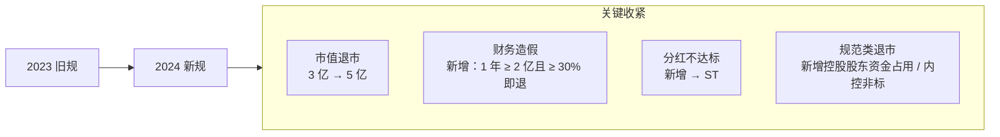

### 面值退 / 市值退阈值

- **面值退**：连续 **20 日** 收盘价 **< 1 元**
- **市值退**：连续 **20 日** 总市值 **< 5 亿**

**skill 的预警红线**：当股价连续 10 日低于 1.5 元，或市值连续 10 日低于 6 亿，就要提前加入硬否决。不要等真正触发退市才剔除——等那时候再卖已来不及[^45]。

## 机制 3：北向资金（陆股通的"聪明钱"效应）

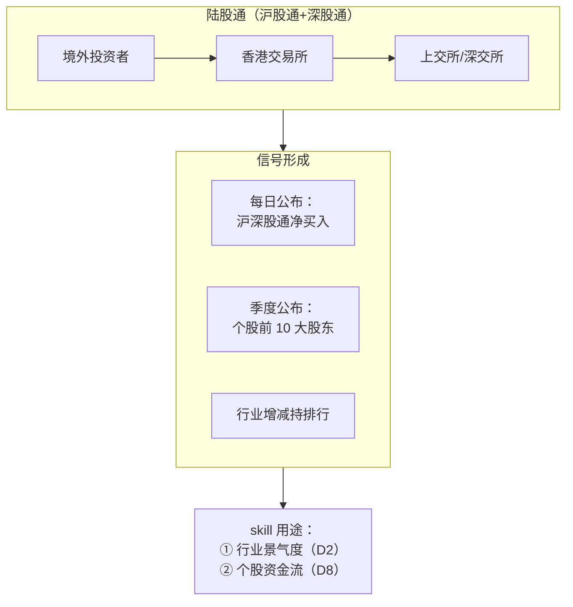

### 北向资金的三种用法

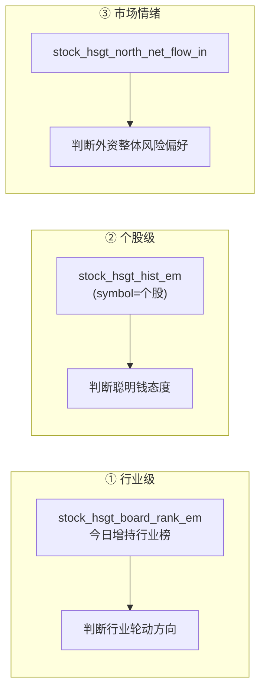

### 2026 Q1 末真实数据案例[^40]

| 行业 | 持仓市值 | 占比 | 核心标的 |
|------|---------|------|---------|
| **电力设备（新能源）** | 5120 亿元 | ~20% | 宁德时代（3058 亿元） |
| **电子（半导体）** | 3749 亿元 | 14.5% | 中际旭创、北方华创 |
| **有色金属** | 1746 亿元 | 6.7% | 紫金矿业、天齐锂业 |

**加仓方向**：AI 算力（光模块"三杰"单季加仓 230+ 亿）、商业航天、存储芯片、可控核聚变。

**减仓方向**：消费电子（-321 亿）、非银金融（-314 亿）、汽车、传统银行。

### 使用北向数据的两个陷阱

1. **中间通道污染**：并非所有"北向资金"都是真外资——部分是内地通过香港通道的资金，有些是托管通道反向买卖。**绝对值不可靠，变化率更有效**。
2. **数据延迟**：北向数据每日更新，但机构行业分析要等**季报披露**。skill 用日频北向做行业判断时，要与月度趋势对照，避免单日噪声。

## 机制 4：龙虎榜（A 股特色的资金席位公开制度）

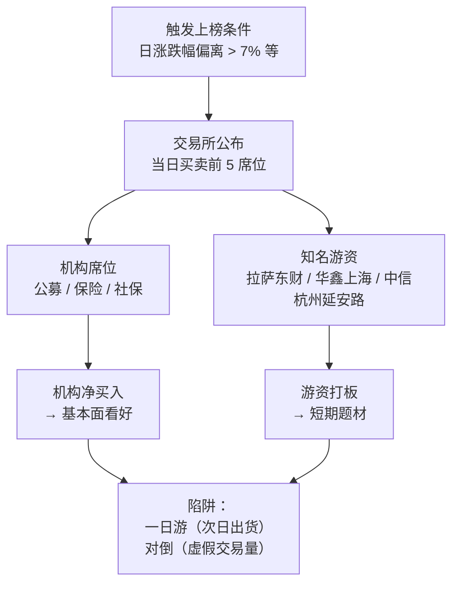

### 对 skill 的使用策略

- **机构净买入 + 龙虎榜上榜** → D8 资金流加分
- **连续 3 日游资打板 + 净卖出机构** → 警示标记（短期过热）
- **跟买知名游资** → **skill 默认不建议**（游资策略快进快出，散户跟买常套在高位）

### AkShare 接口

| 接口 | 用途 |
|------|------|
| `stock_lhb_detail_em` | 龙虎榜详情 21 字段，含上榜后 N 日涨跌幅 |
| `stock_lhb_jgmmtj_em` | 机构买卖统计 |
| `stock_lhb_stock_detail_em` | 个股席位明细 |
| `stock_sina_lhb_ggtj` | 个股最近 5/10/30/60 天上榜统计 |

## 机制 5：融资融券余额（A 股杠杆信号）

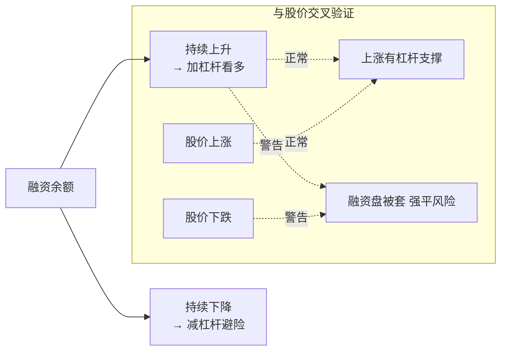

**A 股个人融资融券门槛**：50 万资产 + 20 日日均，远高于美股的"Level 2"。所以融资余额本质上代表**成熟投资者 + 大户**的态度——比散户更有信息优势。

## 机制 6：注册制分层

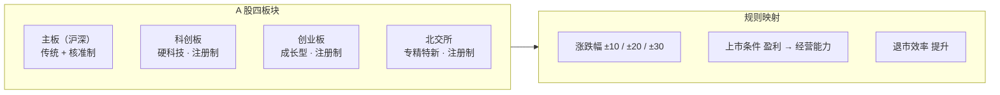

**2023-02-17 全面注册制**之后，上市条件从"持续盈利"改为"持续经营能力"——意味着**科创板/创业板有未盈利上市**的公司。这对传统 PE 估值完全失效，必须用 PS/DCF 或行业相对估值。

**skill 的应对**：对注册制板块（尤其未盈利股票），自动切换估值方法到 PS 或"用户只看质量+成长+资金流"。

## AH 两地上市与 AH 溢价

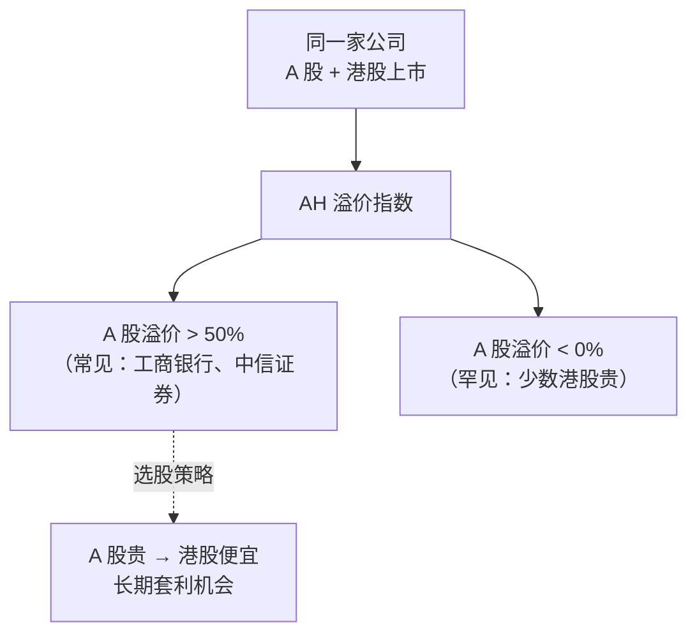

**不要天真套利**：AH 溢价长期存在的原因是**流动性溢价 + 制度差异 + 境内人民币稀缺**，不会简单回归。但当溢价达到历史 95% 分位时，做多港股 H 是统计上合理的操作。

## 对 skill 输出的影响

当用户查询 A 股时，每只推荐股必须包含：

```
贵州茅台（600519）
  板块: 主板 · 非 ST · 非退市风险
  市值: 1.9 万亿
  ────────────────────────────────
  北向持仓: 35.2 亿 股（前十大股东）
  近 30 日北向变化: +2.1 亿
  龙虎榜上榜: 近 30 日 0 次
  融资余额: 稳定
  ────────────────────────────────
  注：A 股 T+1 · 单日最大涨跌幅 ±10%
  AH 溢价: A 股贵 H 股 -8%（贴水）
```

港股对应的信息见 [7. 港股特色](7.%20港股特色.md)。

[^39]: [[a-share-market-mechanics-price-limit-st-delisting|A 股市场机制：涨跌停/ST/退市/注册制]]
[^40]: [[hk-market-specifics-t0-short-selling-southbound|港股市场特色机制]]
[^41]: [[akshare-stock-picker-interfaces-comprehensive|AkShare 选股数据接口全集]]
[^45]: [[stock-picker-hard-veto-and-soft-warnings|选股硬否决清单 + Beneish M-Score]]

## Sources

| # | Title | Raw Note | Original |
|---|-------|----------|----------|
| 39 | A 股市场机制 | [[a-share-market-mechanics-price-limit-st-delisting]] | — |
| 40 | 港股市场特色机制 | [[hk-market-specifics-t0-short-selling-southbound]] | — |
| 41 | AkShare 选股数据接口全集 | [[akshare-stock-picker-interfaces-comprehensive]] | — |
| 45 | 硬否决清单 + M-Score | [[stock-picker-hard-veto-and-soft-warnings]] | — |
