# 港股特色

港股不是"无涨跌幅的 A 股"。**T+0 回转、公开融券、南下聪明钱、老千股生态、同股不同权**——每一项都彻底改变了选股逻辑。2025 年南下资金突破 5 万亿港元后，港股定价权正从外资向内地资金转移，但老千股生态依旧存在，**对新手是雷区**。这一页把港股独有的五件事讲清楚，以及 skill 怎么用它们。

## 港股五大独有机制

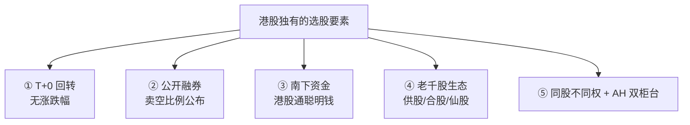

## 机制 1：T+0 + 无涨跌幅限制

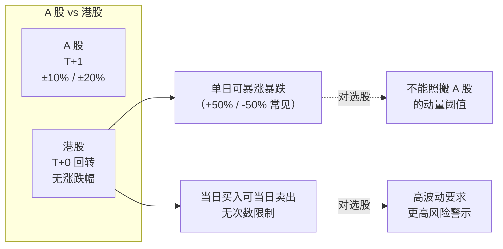

**交收周期**：虽然交易是 T+0，但资金与股票**实际交收在 T+2**。

### 对 skill 动量因子的意义

A 股的 "连 3 板"（+33.1%）在港股可能**一天就完成**——动量因子的时间窗口要缩短。**skill 对港股自动把 D5 动量的计算窗口从 20 日缩到 10 日，MA 从 60/20 改为 30/10**。

## 机制 2：公开融券 + 卖空比例监控

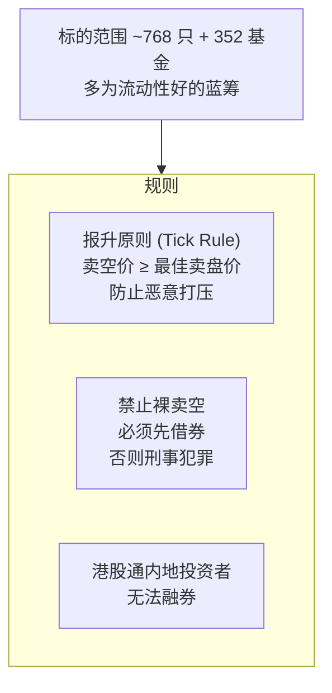

### 卖空比例：选股的强信号

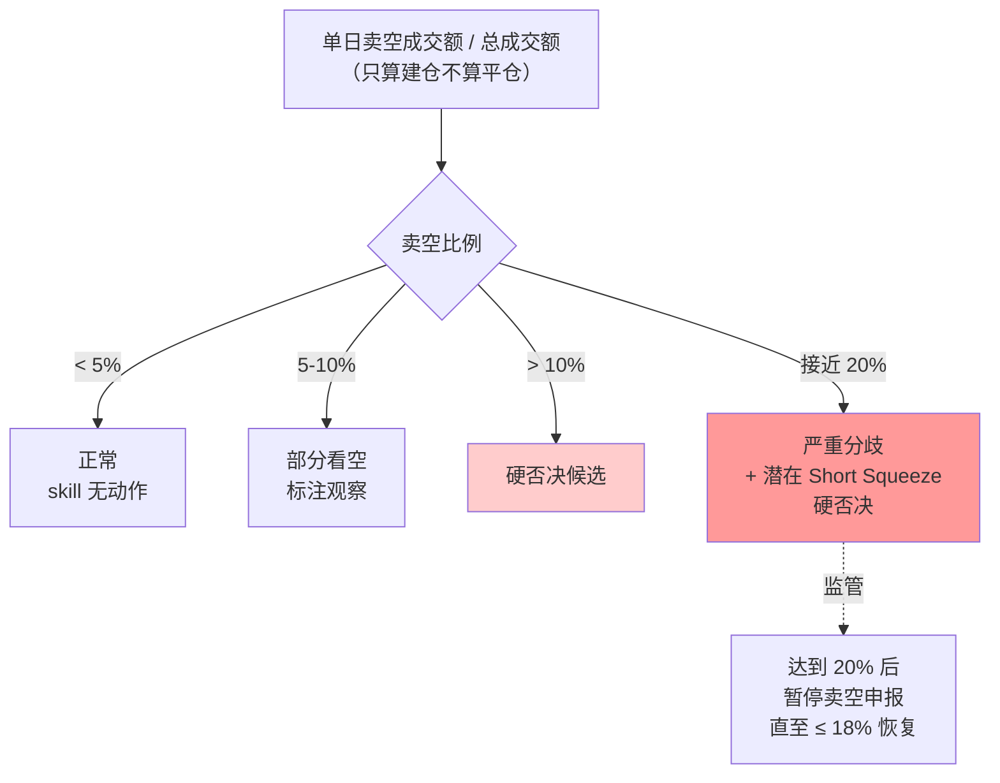

**为什么 > 10% 就硬否决**？卖空集中代表**专业机构判断该股将下跌**——外资机构做空的信息优势通常高于散户，跟做空比跟做多更有效。Short Squeeze 虽然可能带来暴涨，但那是博弈行为不是选股[^40]。

## 机制 3：南下资金 —— 港股定价权转移

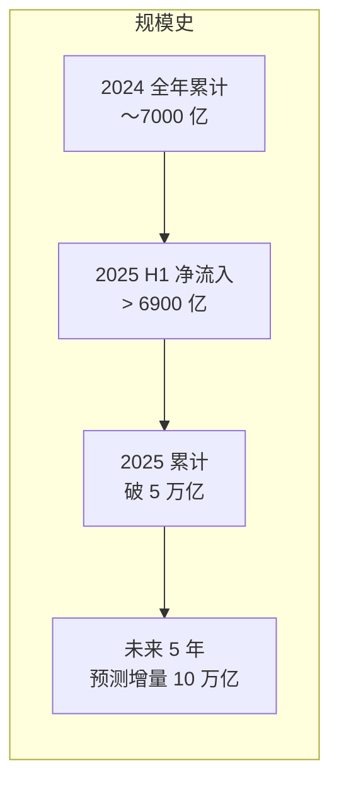

### 2025 南下行业配置变化[^40]

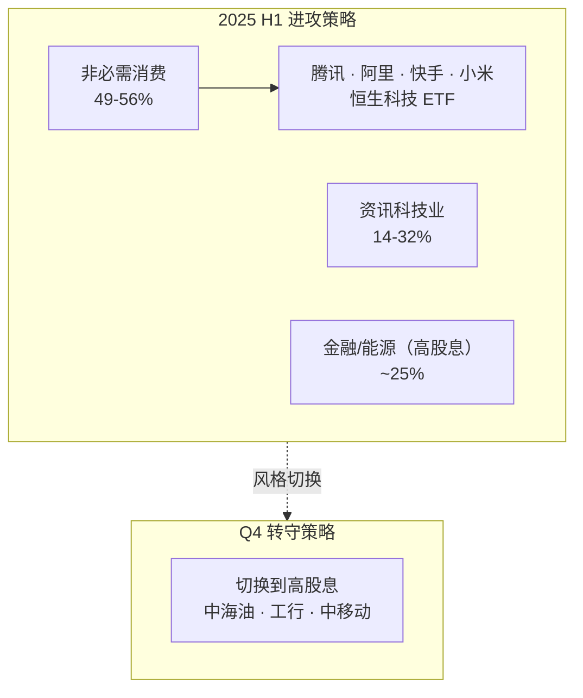

### 对 skill 的使用方式

| 时间尺度 | 数据 | 解读 |
|---------|------|------|
| **日度** | 南下净买入总额 | 市场情绪 |
| **周度** | 行业增持排名变化 | 轮动方向 |
| **月度** | 个股持股变化 | 长线判断 |
| **季度** | 前十大股东 | 定价权转移 |

**"港股 A 股化"趋势**：南下占比高的股票（腾讯、美团、小米），定价逻辑开始跟着 A 股资金面走——不再完全是外资主导。这对 skill 是好消息：**A 股和港股的估值逻辑正在收敛**。

## 机制 4：老千股生态（港股选股的雷区）

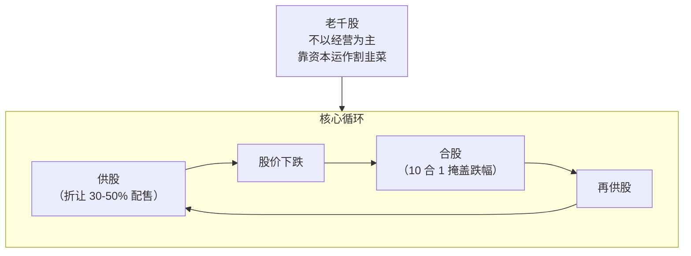

### 老千股八项识别清单[^40]

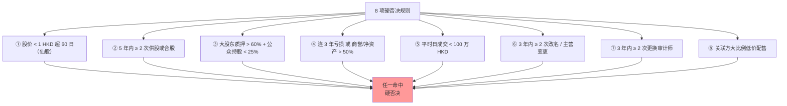

**为什么港股老千股比 A 股多**？
1. 港交所上市门槛低（历史原因）
2. 无面值退市制度
3. 港交所过去对供股、合股监管宽松（2018 年后收紧但存量仍多）
4. 做空和操纵工具多，小盘股容易被玩坏

### 老千股生态的 skill 设计

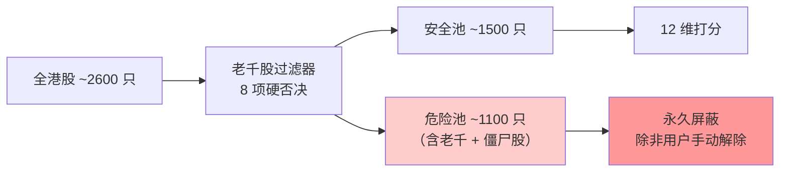

**新手建议**：除非你有极强的研究能力，**永远不要碰港股仙股**。宁可错过 10 个妖股机会，也不要踩一次老千。

## 机制 5：同股不同权 + AH 双柜台

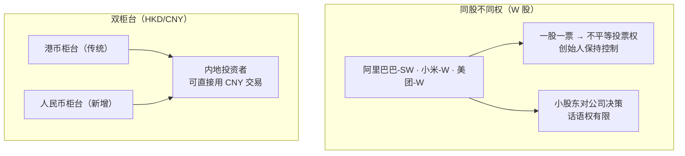

### 对 skill 的意义

- **W 股是港股科技主力**：skill 不应因"同股不同权"而扣分，否则会错过腾讯以外几乎所有互联网龙头
- **但治理风险要提示**：创始人离任、管理层内斗时，小股东维权渠道有限
- **AH 双柜台套利**：理论上 HKD/CNY 柜台价格会因汇率偏离短暂失衡，但对新手 skill 不建议引导套利

## AH 溢价

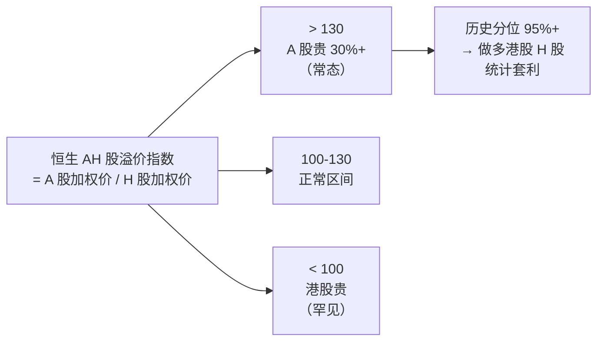

**为什么 A 股长期溢价于 H 股**？
1. 流动性溢价（A 股流通盘更活跃）
2. 境内人民币资产稀缺
3. 散户占比高推高估值
4. 资本管制（QDII 额度有限）

**长期回归的可能性低**——这是制度性差异，不是错误定价。但**极端点可以操作**。

## skill 对港股的特殊流程

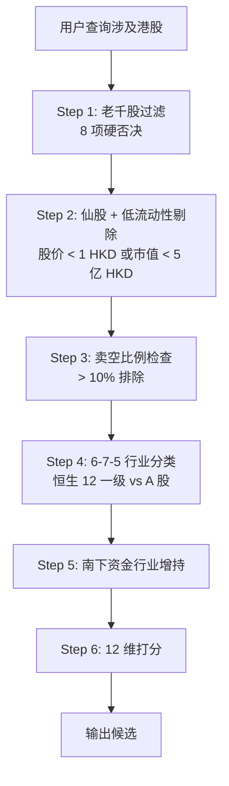

注意 **前三步是港股专属的过滤**，比 A 股多做的工作——这是港股生态复杂性的代价。

## 数据接口

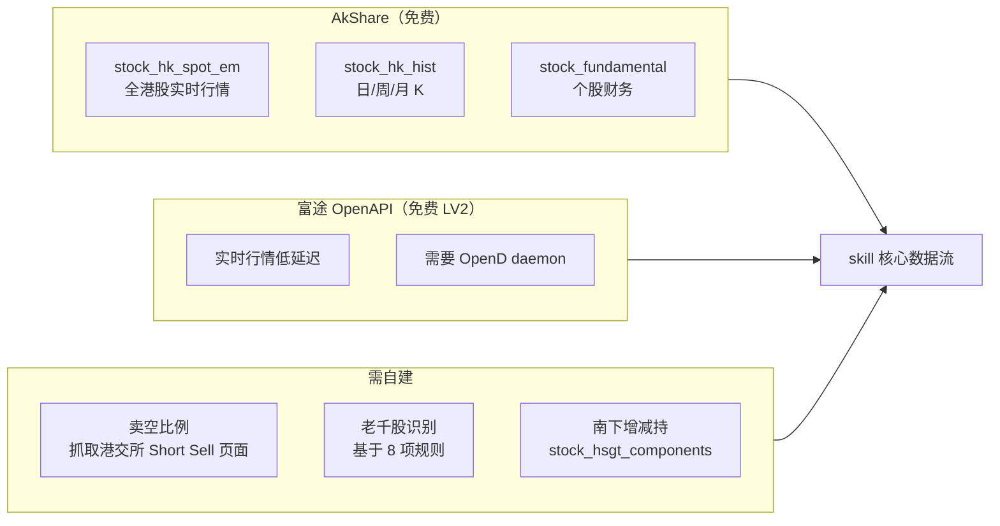

**港股字段坑**：不同接口中 PE 可能是"市盈率" / "PE(TTM)" / "PE(静态)"——skill 必须做字段归一化[^41]。

## 输出示例

```
腾讯控股（00700.HK）
  板块: 主板 · 恒生科技成分 · 同股不同权（W 股）
  市值: 3.2 万亿 HKD
  ────────────────────────────────
  南下持仓占流通: 18.5%
  近 30 日南下变化: +0.8%
  卖空比例（近 20 日均值）: 4.2% ✓
  老千股 8 项检查: 全部通过 ✓
  ────────────────────────────────
  AH 对标: 无 A 股（仅港股）
  交易: T+0 · 无涨跌幅
  注: 同股不同权 → 管理层控制稳固
```

[^40]: [[hk-market-specifics-t0-short-selling-southbound|港股市场特色机制（T+0 / 做空 / 老千股 / 南下）]]
[^41]: [[akshare-stock-picker-interfaces-comprehensive|AkShare 选股数据接口全集]]

## Sources

| # | Title | Raw Note | Original |
|---|-------|----------|----------|
| 40 | 港股市场特色机制 | [[hk-market-specifics-t0-short-selling-southbound]] | — |
| 41 | AkShare 选股数据接口全集 | [[akshare-stock-picker-interfaces-comprehensive]] | — |
