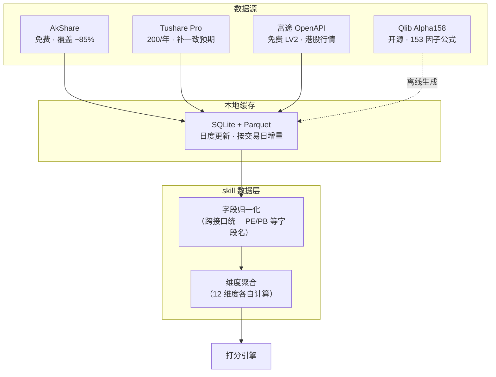
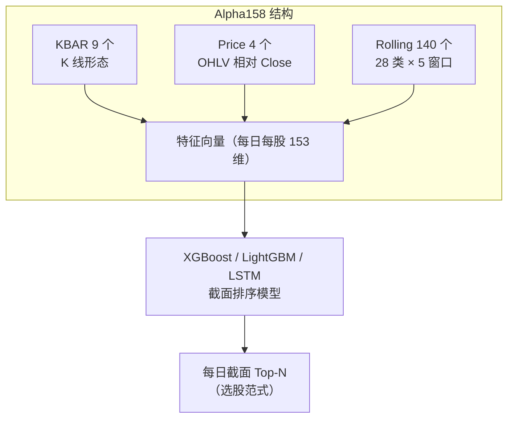
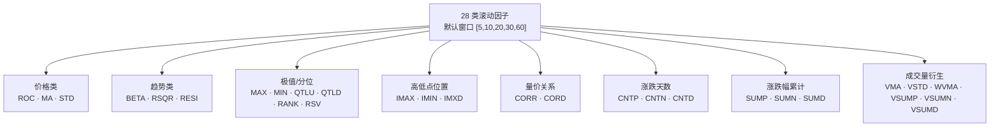
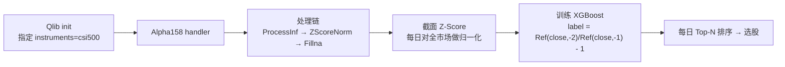
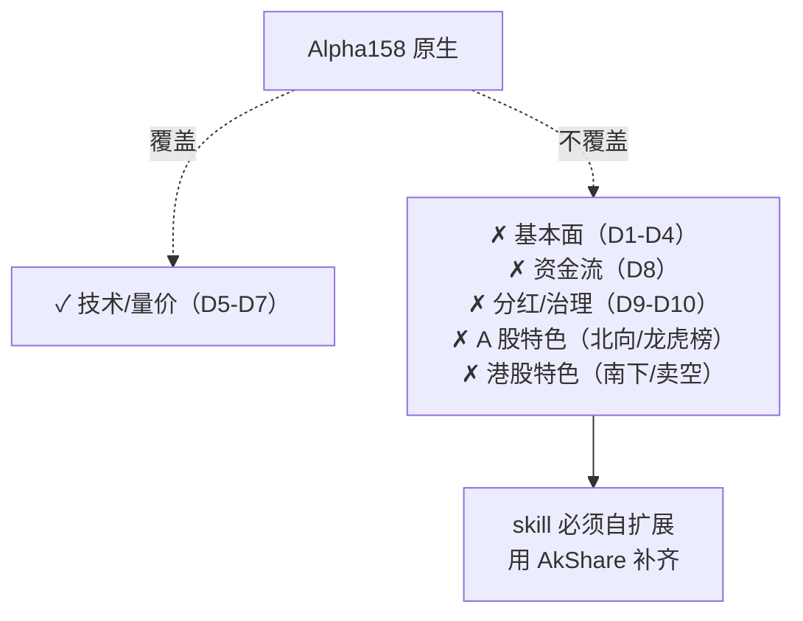
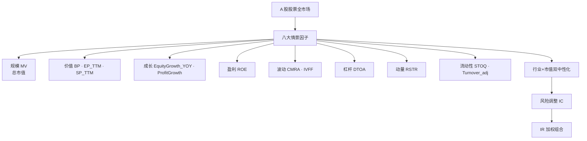
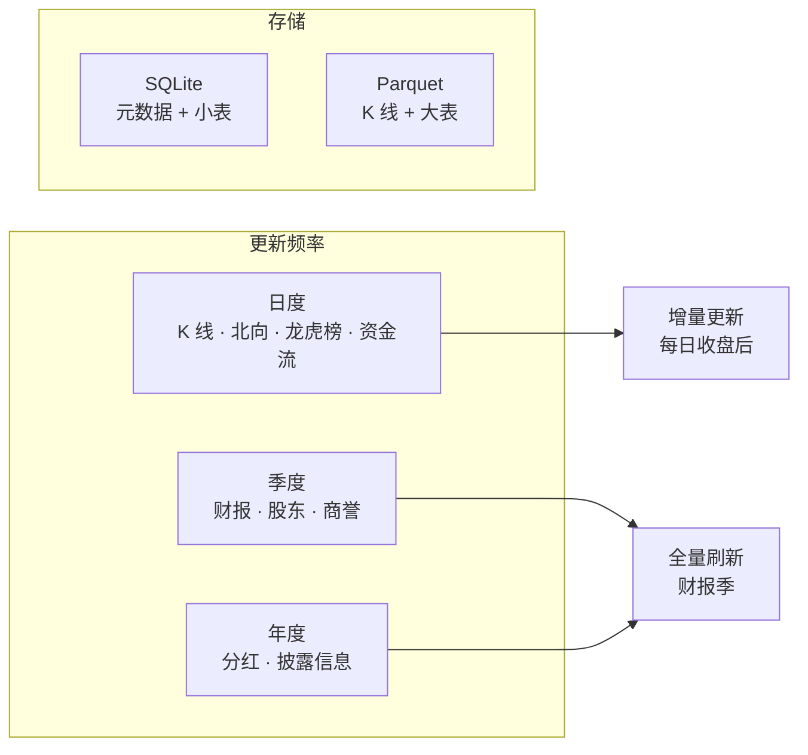

# 数据接口地图

skill 要工作，必须把 12 维度 × A/HK 两市场 的每一个指标，落到一个具体的 API 调用和字段上。这一页把所有需要的接口按"维度-市场-接口-字段"四列组织，再加上 Qlib Alpha158 的 153 个开源因子如何接入。读完这页你能直接动手写 skill 的数据层。

## 数据层总架构



## 主推数据组合

| 数据源 | 成本 | 用途 |
|--------|------|------|
| **AkShare** | 免费 | 全部维度基础数据（~85%）|
| **Tushare Pro** | 200 元/年 | 一致预期、北向历史、港股日线 |
| **富途 OpenAPI** | 免费 LV2 | 港股行情（需 OpenD daemon） |
| **Qlib Alpha158** | 免费 | D5-D7 技术面 153 因子 |

**为什么不直接用 Tushare 做主力**？Tushare 免费档 120 积分只有不复权日线；2000 积分的数据才够用；港股日线单独 1000 元/年——对新手不友好。AkShare 虽然稳定性稍差，但覆盖和免费度最高[^41]。

## 12 维度 × 市场 × 接口（全景查找表）

### 基本面组（D1-D4）

| 维度 | 市场 | AkShare 接口 | 关键字段 |
|------|:---:|------------|---------|
| D1 估值 | A | `stock_a_lg_indicator` | PE / PB / PS / 股息率 |
| D1 估值 | HK | `stock_hk_valuation_baidu` | PE / PB |
| D2 成长 | A | `stock_financial_analysis_indicator` | 营收 YoY / 扣非净利 YoY |
| D2 成长 | HK | `stock_financial_hk_analysis_indicator_em` | 营收增长率 / 净利增长率 |
| D2 一致预期 | A | Tushare `report_rc` | 分析师预测 EPS |
| D3 质量 | A | `stock_financial_analysis_indicator` | ROE / ROA / 毛利率 / 净利率 |
| D3 质量 | HK | `stock_financial_hk_analysis_indicator_em` | ROE / 毛利率 |
| D4 护城河 | A/HK | 长序列 ROE（需本地合成） | 连续 10 年 ROE > 15% 的标记 |

### 技术面组（D5-D7）

| 维度 | 市场 | AkShare 接口 | 用途 |
|------|:---:|------------|------|
| D5-D7 基础 K 线 | A | `stock_zh_a_hist` | OHLCV · 前复权 |
| D5-D7 基础 K 线 | HK | `stock_hk_hist` | OHLCV · 前复权 |
| D5 RPS | A/HK | `stock_zh_index_daily` + 个股 K | 自算相对强度 |
| 技术指标 | 通用 | **Qlib Alpha158 公式** | 153 个因子（本页后述） |

### 资金面（D8）

| 维度 | 市场 | AkShare 接口 | 关键用途 |
|------|:---:|------------|---------|
| D8 主力净流入 | A | `stock_individual_fund_flow` | 大单+超大单 |
| D8 行业资金 | A | `stock_board_industry_fund_flow_rank_em` | KQ2 行业选择核心 |
| D8 北向 - 行业 | A | `stock_hsgt_board_rank_em` | 增持行业排行 |
| D8 北向 - 个股 | A | `stock_hsgt_hist_em` | 历史净买入 |
| D8 龙虎榜 | A | `stock_lhb_detail_em` | 21 字段含后续 N 日涨跌 |
| D8 龙虎榜 - 个股 | A | `stock_lhb_stock_detail_em` | 营业部明细 |
| D8 南下 | HK | `stock_hsgt_components` | 南下成分股 |
| D8 卖空比例 | HK | 抓取港交所 `Short Sell` 页面 | 需自建 |

### 支撑面（D9-D12）

| 维度 | 市场 | AkShare 接口 | 用途 |
|------|:---:|------------|------|
| D9 分红 | A | `stock_dividend_cninfo` | 分红历史 / 派息率 |
| D10 质押 | A | `stock_gpzy_pledge_ratio_em` | 控股股东质押率 |
| D10 商誉 | A | `stock_sy_em` | 商誉 / 净资产 |
| D10 股东 | A | `stock_gdfx_holding_detail_em` | 前十大股东 / 减持 |
| D11 ST 状态 | A | `stock_zh_a_spot_em` | 名称含 "ST" 筛选 |
| D11 立案调查 | A | `stock_notice_report` + 关键词 | 证监会公告 |
| D12 公告 | A | `stock_notice_report` | 业绩预告 / 合同 / 回购 |
| D12 概念 | A | `stock_board_concept_name_em` | 政策概念 |

### 宏观景气（行业选择辅助）

| 指标 | 接口 | 说明 |
|------|------|------|
| PMI | `macro_china_pmi_yearly` | 月度 |
| CPI | `macro_china_cpi_yearly` | 月度 |
| PPI | `macro_china_ppi_yearly` | 月度 |
| M0/M1/M2 | `macro_china_money_supply` | 月度 |
| 工业企业利润 | `macro_china_industrial_profit` | 月度 |

## Qlib Alpha158 的 153 个因子公式

Qlib 的 `Alpha158DL` 类构造 **9 KBAR + 4 Price + 140 Rolling = 153 个默认特征**[^35]。



### KBAR 9 个 K 线形态（核心）

| 因子 | 公式 | 直觉 |
|------|------|------|
| KMID | `(close-open)/open` | 实体涨跌幅 |
| KLEN | `(high-low)/open` | 总振幅 |
| KMID2 | `(close-open)/(high-low+ε)` | 实体占振幅比 |
| KUP | `(high-max(open,close))/open` | 上影相对开盘 |
| KUP2 | `(high-max(open,close))/(high-low+ε)` | 上影占振幅比 |
| KLOW | `(min(open,close)-low)/open` | 下影相对开盘 |
| KLOW2 | `(min(open,close)-low)/(high-low+ε)` | 下影占振幅比 |
| KSFT | `(2*close-high-low)/open` | 收盘偏振幅中点 |
| KSFT2 | `(2*close-high-low)/(high-low+ε)` | 收盘位置占振幅比 |

### Rolling 28 类（× 5 窗口 = 140）



### 关键公式举例

| 名称 | 公式 | 用途 |
|------|------|------|
| `ROC{d}` | `Ref(close, d) / close` | d 日反向涨幅 |
| `MA{d}` | `Mean(close, d) / close` | 均线偏离 |
| `STD{d}` | `Std(close, d) / close` | d 日波动率 |
| `RSV{d}` | `(close-Min(low,d))/(Max(high,d)-Min(low,d)+ε)` | KDJ 的 RSV |
| `CORR{d}` | `Corr(close, Log(volume+1), d)` | 价量相关性 |
| `WVMA{d}` | `Std(|pctchg|*vol, d) / Mean(|pctchg|*vol, d)` | 波动加权量的波动 |

完整公式见 `qlib-alpha158-factor-definitions.md`[^35]。

### Alpha158 的用法范式



**关键**：Alpha158 是**截面选股因子**，每日对全市场做横切面归一化——这与时序预测涨跌的择时因子完全不同。本 skill 使用 Alpha158 做 **D5-D7 技术面打分**的基础，但**不用其做买卖时点判断**（那是姐妹项目 ai-swing-reminder 的事）。

## Alpha158 的局限 —— 必须自扩展



**另一个坑**：Alpha158 **原生只支持 CN/US 市场**，港股数据需要手工 CSV→bin 做适配。对新手建议：**港股用 AkShare 原始数据自算技术指标**，不走 Qlib 全流程。

## A 股八大实证因子（中性化 + IR 加权）

华宝证券的动态情景模型在 A 股经过 2007-2017 十年回测，确认了八大有效因子[^36]：



**中性化公式**：
```
f_pure = f − b1·X − b2·log(mktcap)    （X = 行业虚拟变量矩阵）
r_residual = r − m1·X − m2·log(mktcap)
IC_adj = corr(f_pure, r_residual)
```

**IR 加权**：`w_i = IC_均值 / IC_标准差`，过去 12 个月滚动窗口。

**skill 的实现简化版**：新手 skill 不做完整的中性化回归（需要每日运行），但可以用"**行业内打分 + 市值分组打分**"的近似方法达到类似效果。

## 本地缓存策略



**AkShare 反爬策略**：
- 调用间加 1-3 秒 sleep
- 关键数据多源验证（东财 + 新浪交叉）
- 同日重复调用直接走缓存
- 敏感任务放夜间批量（3-5 AM）

## 字段归一化

**字段名冲突最常见的例子**：

| 接口 | PE 字段名 |
|------|----------|
| `stock_zh_a_spot_em` | `市盈率-动态` |
| `stock_a_lg_indicator` | `pe` |
| `stock_hk_spot_em` | `市盈率` |
| `stock_hk_valuation_baidu` | `peRatio` |

skill 必须在数据层做一层归一化，所有上层代码看到的字段都是 `pe`, `pb`, `ps`, `dividend_yield`，不暴露底层接口差异。

## 数据层代码骨架

```python
# skill 数据层的核心类（伪代码）
class StockDataHub:
    def __init__(self, cache_dir: Path):
        self.cache = LocalCache(cache_dir)

    def get_industry_prosperity(self, market: str) -> pd.DataFrame:
        """D1 财务景气（华宝三维）"""
        # 聚合行业财务数据 → 计算二阶变化

    def get_northbound_industry_rank(self) -> pd.DataFrame:
        """D2 北向增持行业排行"""
        return ak.stock_hsgt_board_rank_em(
            symbol="北向资金增持行业板块排行",
            indicator="今日"
        )

    def get_hk_short_ratio(self, symbol: str) -> float:
        """HK 卖空比例（需自抓港交所）"""
        # 从 hkex.com.hk Short Sell 页面抓取

    def get_alpha158_features(self, symbol: str) -> pd.DataFrame:
        """Qlib Alpha158 特征"""
        # 调用 Qlib handler

    def score_stock(self, symbol: str, weights: dict) -> StockScore:
        """12 维度综合打分"""
        # 集成所有数据 + 权重
```

[^35]: [[qlib-alpha158-factor-definitions|Qlib Alpha158 因子完整定义]] · [原文](https://raw.githubusercontent.com/microsoft/qlib/main/qlib/contrib/data/loader.py)
[^36]: [[dynamic-multifactor-alpha-model-ashare|动态情景多因子 Alpha 模型]] · [原文](https://j519lee.blog.csdn.net/article/details/117508587)
[^41]: [[akshare-stock-picker-interfaces-comprehensive|AkShare 选股数据接口全集]]

## Sources

| # | Title | Raw Note | Original |
|---|-------|----------|----------|
| 35 | Qlib Alpha158 因子定义 | [[qlib-alpha158-factor-definitions]] | [link](https://raw.githubusercontent.com/microsoft/qlib/main/qlib/contrib/data/loader.py) |
| 36 | 动态情景多因子 Alpha 模型 | [[dynamic-multifactor-alpha-model-ashare]] | [link](https://j519lee.blog.csdn.net/article/details/117508587) |
| 41 | AkShare 选股数据接口全集 | [[akshare-stock-picker-interfaces-comprehensive]] | — |
