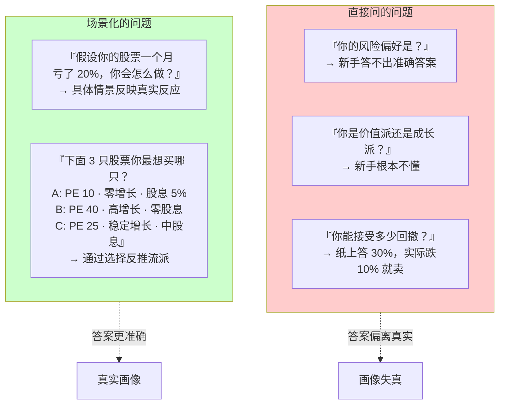
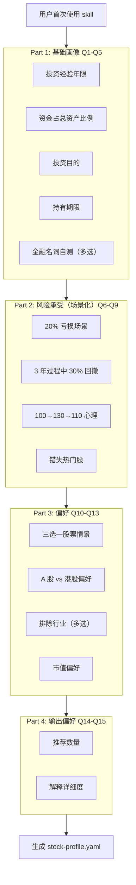
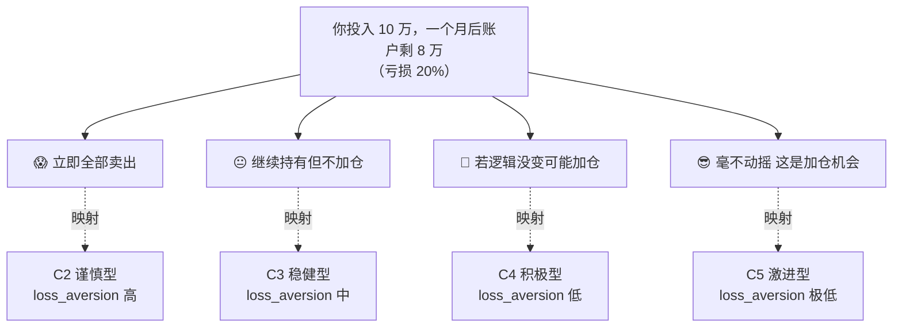
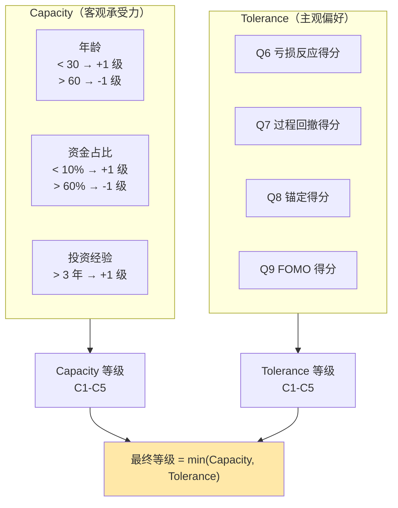
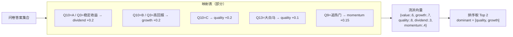
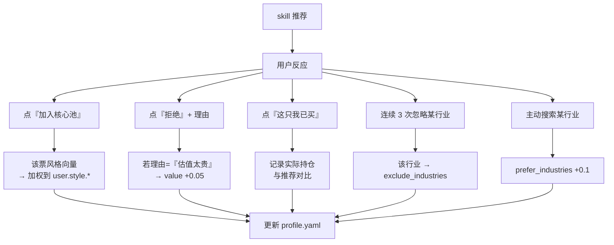
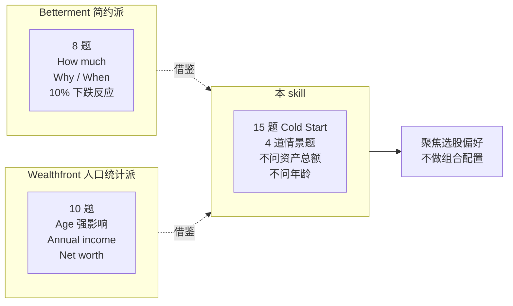
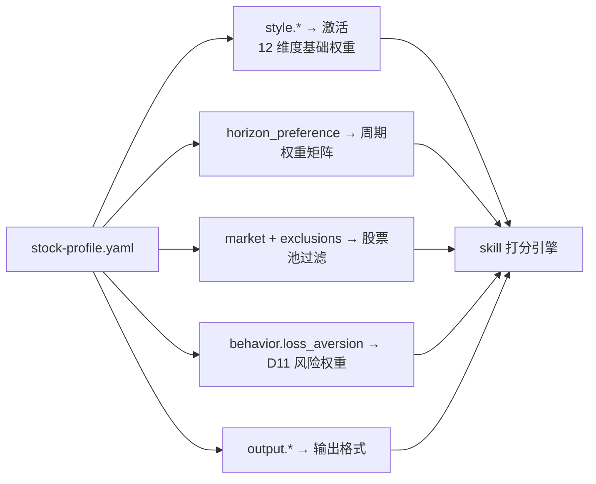

# Socratic 引导问卷

skill 不一上来就给你推股票——它先通过 15 道场景题**反推**你的流派倾向、风险承受能力和持有周期，沉淀为一份 `stock-profile.yaml`。之后每次调用 skill，都基于这份画像激活不同的维度权重。这一页讲清楚：**为什么要 Socratic 而不是直接问、问哪些题、怎么从答案里推出参数、怎么在后续使用中反向校准**。

## 为什么要 Socratic 而不是直接问



行为金融学（Kahneman-Tversky Prospect Theory）早已证实：**人们对损失的情绪反应远强于同等收益**（损失厌恶系数 ~2-3）[^47]。纸面问卷无法捕捉这种情绪，场景题可以。

## 15 道 Cold Start 问卷总览



**总时长**：约 5-8 分钟。这是新手能承受的上限——Betterment / Wealthfront 等 robo-advisor 的经验：**超过 10 分钟放弃率显著上升**[^47]。

## 核心场景题详解

### Q6 · 20% 亏损场景（最关键的单题）



**为什么用"一个月亏 20%"而不是"亏 10%"**？`-10%` 对于新手"只是波动"，`-20%` 已经触碰心理红线——能真正区分用户反应的只有痛苦区间。

### Q8 · 100→130→110 心理（识别锚定效应）

```mermaid
flowchart LR
    PATH["股价路径：100 → 130 → 110"]

    PATH --> R1["懊恼 130 没卖<br/>→ 锚定在最高点"]
    PATH --> R2["感觉还赚着<br/>→ 锚定在成本"]
    PATH --> R3["关注未来走势<br/>→ 不锚定"]

    R1 -.对选股.-> T1["偏价值派<br/>倾向卖在"合理"价位"]
    R2 -.对选股.-> T2["偏质量/红利派<br/>关注绝对收益"]
    R3 -.对选股.-> T3["长线思维<br/>偏质量派"]
```

### Q10 · 三选一股票（直接映射流派）

| 选项 | 特征 | 推断流派 |
|------|------|---------|
| A | PE 10 · ROE 12% · 股息 5% · 5 年零增长 | 价值 / 红利 |
| B | PE 40 · ROE 25% · 股息 0 · 3 年营收翻 3 倍 | 成长 |
| C | PE 25 · ROE 20% · 股息 2% · 复合增长 20% | 质量（GARP）|

**设计细节**：三个选项**总分数相同**（PE × ROE × 股息率大致相近），差异只在**偏好向量**上——避免有"标准答案"的错觉。

## 从答案到参数：双维度判定

证监会 C1-C5 测评方法论的核心：**同时测量 Capacity（客观）和 Tolerance（主观），取较小者**[^37]。



**为什么取较小者**？
- Capacity 高、Tolerance 低 = 有钱但见跌就慌 → 按 Tolerance
- Capacity 低、Tolerance 高 = 没钱但嘴上激进 → 按 Capacity

## 从答案到流派权重



**skill 不给用户看"你是质量派"的标签**——这会引发"自证偏差"（用户看到标签后硬把自己往这个方向套）。skill 只用向量驱动维度权重。

## stock-profile.yaml 完整字段设计

```yaml
# ========================================
# Stock Profile v1.0
# 由 Cold Start 问卷生成；行为校准持续更新
# ========================================

user:
  first_use_date: 2026-04-28
  last_update: 2026-04-28
  version: 1.0

# 风险承受（C1-C5 对标）
risk:
  level: C3
  capacity: C4
  tolerance: C3
  final: C3                       # min(capacity, tolerance)
  max_drawdown_tolerance: 0.20
  loss_aversion: 2.5              # Prospect Theory 系数

# 投资目标
goal:
  primary: steady_growth          # capital_preservation/steady_growth/aggressive_growth/income
  horizon: medium                 # short_term / medium / long_term
  liquidity_need: low
  target_return_annual: 0.15

# 流派倾向（推断得分，非用户自选）
style:
  value: 0.6
  growth: 0.7
  quality: 0.8
  dividend: 0.3
  momentum: 0.4
  dominant: [quality, growth]
  weighting_profile: blended_growth

# 持有周期偏好
horizon_preference:
  long_term: 0.6                  # 核心池占比
  mid_term: 0.3
  swing: 0.1

# 市场偏好
market:
  a_share: 0.7
  hk: 0.3
  exclude_boards: []              # e.g., [北交所]
  exclude_industries: []
  prefer_industries: []

# 硬性排除
exclusions:
  moral: [tobacco]
  industry_blacklist: []
  stock_blacklist: []

# 筛选偏好
preferences:
  market_cap: [large, mid]
  st_tolerance: false
  new_listing_max_age_days: 180
  min_market_cap_hkd: 5e9
  min_market_cap_cny: 5e9

# 行为特征
behavior:
  overconfidence: low             # low/mid/high
  anchor_on_entry: true
  reaction_to_20pct_drop: hold    # panic_sell/hold/add

# 输出偏好
output:
  pool_size_core: 5
  pool_size_watch: 15
  pool_size_candidate: 30
  show_target_price: false        # 新手建议关闭
  show_stop_loss: true
  detail_level: newbie            # newbie/intermediate/expert
  preferred_language: zh-CN

# skill 交互偏好
interaction:
  weekly_review: true
  socratic_frequency: monthly
  alert_channel: none             # 本 skill 不做提醒
```

## 行为校准：让 profile "活起来"

问卷是死的，**画像必须持续更新**。每次 skill 输出推荐后，收集用户反馈：



**关键设计**：行为校准的更新幅度要**小**（每次 ±0.05 左右）。如果每次反馈就大改，画像会在两次推荐间剧烈震荡。

## 日常精简版问卷（5 题）

每月或每次重大市场变动后触发：

```
1. 最近你的风险偏好有变化吗？（更保守 / 不变 / 更激进）
2. 本月行情你最想买的行业是哪个？（或"跟 skill 推荐"）
3. 过去 1 个月你对 skill 的哪条推荐印象最深（好或不好）？
4. 你对持有期望是？（短线变多 / 不变 / 长线变多）
5. 本周有想加入黑名单的股票或行业吗？
```

这 5 题覆盖了 profile 最容易随时间变化的字段。

## 问卷设计的 6 条原则

1. **场景化优于直接问**——"20% 亏损怎么办" > "你风险偏好是什么"
2. **不要诱导答案**——选项顺序打乱，不要从"保守"到"激进"单调排列
3. **避免"权威答案"**——不要让用户觉得某个选项是"正确的"
4. **合规**——必须包含"投资有风险，本 skill 仅供学习"
5. **非 KYC 金融**——本 skill 非持牌机构，问卷只驱动"推荐"而非"销售产品"
6. **隐私**——问卷结果仅本地存储 `stock-profile.yaml`

## 与姐妹项目 Robo-Advisor 设计的取舍



- **不问资产总额**（隐私）
- **不问年龄**（避免"年轻=激进"偏见）
- **强化情景化问题**（Q6-Q9 四题核心）
- 本 skill **不做组合配置**，只做选股——问题更聚焦个股偏好

## 与 12 维度的联动



下一步进入 [10. 候选池三层结构](10.%20候选池三层结构.md) 看输出格式。

[^37]: [[c1-c5-investor-suitability-assessment|A 股风险承受能力测评 C1-C5]]
[^47]: [[socratic-questionnaire-stock-profile-design|Socratic 引导问卷设计]]

## Sources

| # | Title | Raw Note | Original |
|---|-------|----------|----------|
| 37 | A 股风险承受能力测评（C1-C5） | [[c1-c5-investor-suitability-assessment]] | — |
| 47 | Socratic 引导问卷设计 | [[socratic-questionnaire-stock-profile-design]] | — |
