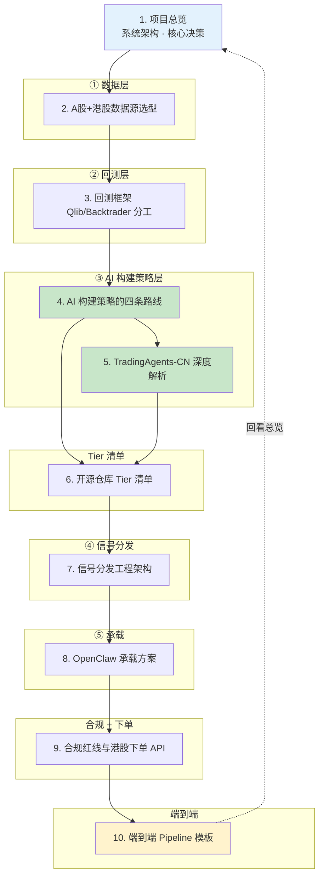
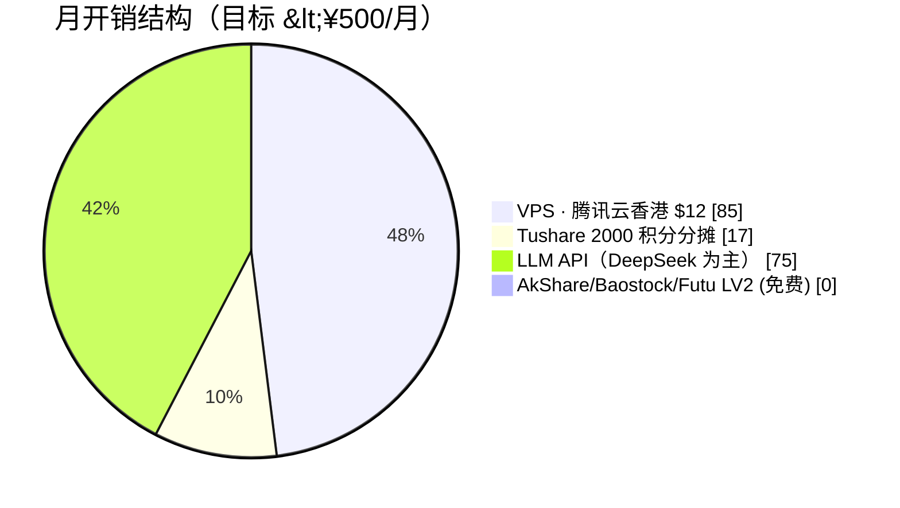
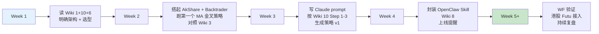

# AI 辅助波段交易助手（A 股 + 港股） — 总览

> 用 AI 帮自己设计波段策略，阈值触发时推送提醒（A 股）或人工确认后下单（港股），承载在 OpenClaw 上 7×24 运行。
>
> 面向 **中级量化用户**：懂基础回测、懂 pandas / 因子 / 夏普，目标是能**做出架构决策 + fork 合适仓库 + 写 Claude prompt**。

---

## 知识地图

---

## 页面目录

### 入门（先读这两页）

- [1. 项目总览与系统架构](wiki/1.%20项目总览与系统架构.md) — 五层架构 + 三条核心决策 + 月开销预算
- [10. 端到端 Pipeline 模板](wiki/10.%20端到端%20Pipeline%20模板.md) — 7 步从自然语言偏好到上线提醒

### 基础设施（数据 / 回测 / 仓库）

- [2. A 股 + 港股数据源选型](wiki/2.%20A股%20%2B%20港股数据源选型.md) — AkShare / Tushare / Baostock / Futu / Longbridge 对比
- [3. 回测框架 Qlib 与 Backtrader 的分工](wiki/3.%20回测框架%20Qlib%20与%20Backtrader%20的分工.md) — 双轨选型理由
- [6. 开源仓库 Tier 清单](wiki/6.%20开源仓库%20Tier%20清单.md) — Tier-1/2/3 分级 + fork 策略

### AI 构建策略（核心）

- [4. AI 构建策略的四条路线](wiki/4.%20AI%20构建策略的四条路线.md) — LLM 规则 / RL / Multi-Agent / 因子挖掘对比矩阵
- [5. TradingAgents-CN 深度解析](wiki/5.%20TradingAgents-CN%20深度解析.md) — 最接近目标的现成仓库 + 集成模式

### 工程落地

- [7. 信号分发工程架构](wiki/7.%20信号分发工程架构.md) — 轮询 / 去重 / 多源确认 / 三级预警
- [8. OpenClaw 承载方案](wiki/8.%20OpenClaw%20承载方案.md) — SKILL.md / Cron / VPS / 持久化
- [9. 合规红线与港股下单 API](wiki/9.%20合规红线与港股下单%20API.md) — A 股 2024 新规 + Futu/Longbridge/Tiger 对比 + 半自动下单

---

## 覆盖的关键问题

| Key Question | 由以下页面解答 |
|---|---|
| Q1 · A 股 + 港股数据 API 全景 | [2. 数据源选型](wiki/2.%20A股%20%2B%20港股数据源选型.md) |
| Q2 · 回测框架选型 | [3. 回测框架分工](wiki/3.%20回测框架%20Qlib%20与%20Backtrader%20的分工.md) |
| **Q3 · AI 构建策略四路线（核心）** | [4. 四路线](wiki/4.%20AI%20构建策略的四条路线.md) + [5. TradingAgents-CN](wiki/5.%20TradingAgents-CN%20深度解析.md) |
| Q4 · 开源仓库深度清单 | [6. Tier 清单](wiki/6.%20开源仓库%20Tier%20清单.md) |
| Q5 · 策略→信号→提醒工程架构 | [7. 信号分发](wiki/7.%20信号分发工程架构.md) |
| Q6 · OpenClaw 承载方案 | [8. 承载方案](wiki/8.%20OpenClaw%20承载方案.md) |
| Q7 · 合规 + 港股下单 | [9. 合规 + 港股 API](wiki/9.%20合规红线与港股下单%20API.md) |
| Q8 · 端到端完整工作流 | [10. Pipeline 模板](wiki/10.%20端到端%20Pipeline%20模板.md) |

---

## 三条最重要的结论

**结论 1 · TradingAgents-CN 是 2025-2026 最接近目标的现成仓库**

- 24.6k star / 5.2k fork / Apache-2.0
- A + HK + US 三市场，Qwen/DeepSeek 优先，Docker 5 分钟部署
- **但它不做触发推送** —— 在本架构里是『周末研报生成器』而非『信号源』
- ⚠️ v2.0 将闭源，需锁定 v1.x 维护

**结论 2 · 主推『路线 A（LLM 规则生成）+ 路线 C（Multi-Agent 辅助）』**

- 路线 A：Claude 当 pair-quant，写策略代码 → 人工 review → 硬规则触发信号
- 路线 C（TradingAgents-CN）：周末对 watchlist 跑多 agent 辩论，作为『第二意见』
- 路线 B（RL）和 D（LLM 因子挖掘）对中级 + 波段场景不匹配

**结论 3 · 合规原则一句话**

> **对自己操作给出建议从古至今都合法。代替别人做决定需要持牌。让机器代替自己做决定需要报备。本项目是第一种。**

所以 A 股**只做提醒**（完全合规），港股通过 Futu OpenAPI 做**人工确认后下单**（SFC 监管，持牌券商 API 合法）。

---

## 月开销预算

合计 ≈ ¥177/月，相对 ¥500 预算有 65% 裕量。

---

## 快速入门路径

---

## 质量说明

- **总页面数**：10
- **总参考来源数**：33（项目独占 8 个新 synthesis，所有源经 `raw/sources.yaml` 注册）
- **研究 Round 数**：3+
- **最后更新**：2026-04-24
- **范围内**：日频 / 波段 / A 股 + 港股 / 开源或低价方案 / OpenClaw 承载 / 港股可选下单
- **范围外**：日内 / 高频 / A 股自动下单 / 美股 / 加密 / 期货期权 / 机构柜台

---

## 下一步（使用本 Wiki 的建议）

1. **先读 Wiki 1** 建立全局观
2. **跳到 Wiki 10** 看端到端 pipeline 如何串起来
3. 然后按自己的痛点进**具体章节深钻**：
   - 数据选型犹豫 → Wiki 2
   - 不确定用 Qlib 还是 Backtrader → Wiki 3
   - 想选一个 AI 路线 → Wiki 4 + 5
   - 不知道 fork 哪些 repo → Wiki 6
   - 信号架构问题 → Wiki 7
   - OpenClaw 部署问题 → Wiki 8
   - 合规 / 港股下单问题 → Wiki 9
