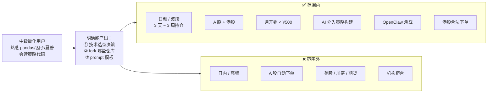
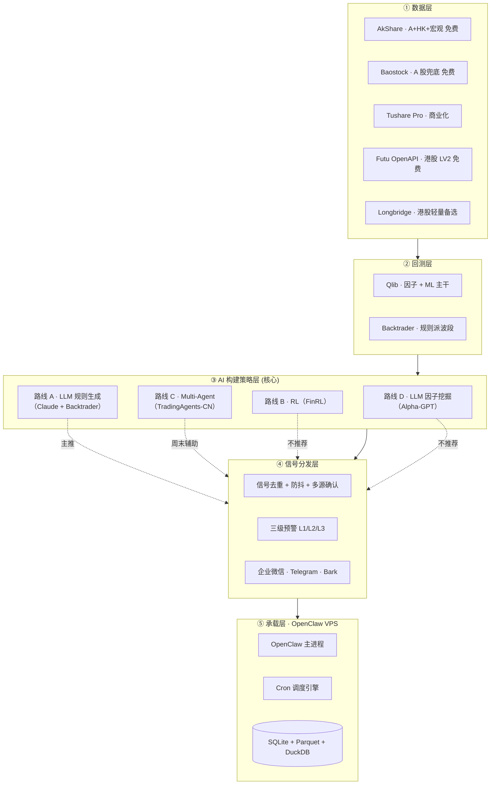
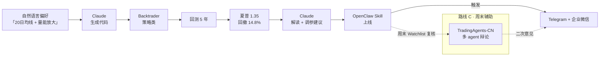
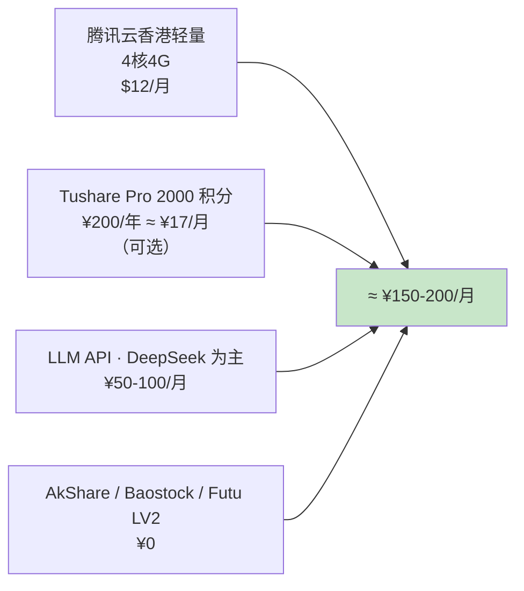
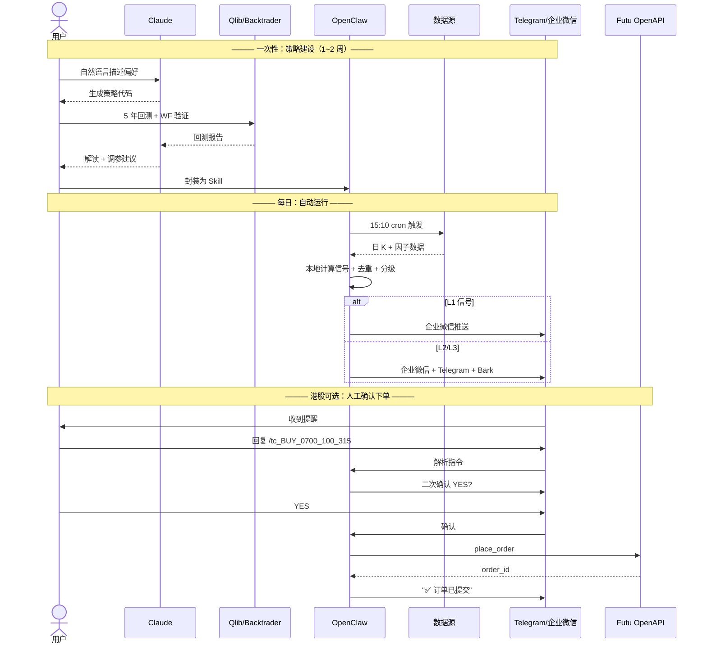

# 项目总览与系统架构

本 wiki 回答一个具体问题：**如何在 OpenClaw 上跑一个 AI 驱动的波段交易助手，覆盖 A 股与港股，A 股只发提醒、港股可选下单**。面向中级量化用户（懂回测、懂 Python、不愿从零造轮子）。

## 读者画像与研究边界

"纯提醒"在法律意义上不属于程序化交易——这是整个项目能落地的**前提合规共识**，详见 [9. 合规红线与港股下单 API](9.%20合规红线与港股下单%20API.md)。

## 五层分层架构

整个系统分五层，每层做独立选型。这张图是本 wiki 其余所有页面的地图：

每层的选型理由和对比在独立页面里展开：

| 层 | 决策页面 |
|---|---|
| ① 数据 | [2. A股+港股数据源选型](2.%20A股%20%2B%20港股数据源选型.md) |
| ② 回测 | [3. 回测框架 Qlib 与 Backtrader 分工](3.%20回测框架%20Qlib%20与%20Backtrader%20的分工.md) |
| ③ AI 路线 | [4. AI 构建策略的四条路线](4.%20AI%20构建策略的四条路线.md) + [5. TradingAgents-CN 深度解析](5.%20TradingAgents-CN%20深度解析.md) |
| ④ 信号分发 | [7. 信号分发工程架构](7.%20信号分发工程架构.md) |
| ⑤ 承载 | [8. OpenClaw 承载方案](8.%20OpenClaw%20承载方案.md) |

## 核心架构决策（3 条）

**决策 1：不做 A 股自动下单**[^32]

A 股 2024-10-08 起的《程序化交易管理规定》对散户同等适用，未报备即下单有风险。纯提醒模式合规，也天然避免 LLM 幻觉带来的资金损失。港股的 Futu / Longbridge 是持牌券商 API，通过 Telegram 人工二次确认后下单合法合规。

**决策 2：主推路线 A（LLM 规则生成），辅以路线 C（Multi-Agent）**[^28]

路线 B（强化学习）和 D（LLM 因子挖掘）在波段 + 中级用户场景下**复杂度不匹配**——过拟合风险高且学习曲线陡峭；详见 [4. AI 构建策略的四条路线](4.%20AI%20构建策略的四条路线.md)。

**决策 3：腾讯云香港轻量单节点起步**[^31]

不做双节点拆分（大陆 + 香港），单香港节点就能同时访问 Tushare Token（HTTPS）、AkShare 爬东财（有一定延迟但日频够用）、Futu OpenAPI（延迟 1-3ms）、Telegram（海外直连）、DeepSeek/Claude API（都可达）。月开销 ≈ $12。

## 月开销预算（实测落地）

对比 <¥500/月 的约束还余 60%+ 预算——这部分可以升级 Tushare 至 5000 积分解锁分钟线，或开通 Longbridge L2 行情。详细成本结构见 [10. 端到端 Pipeline 模板](10.%20端到端%20Pipeline%20模板.md)。

## 关键路径时序

从用户第一次跑到线上系统每天按时推送的完整时序：

## 本 wiki 与关键问题的对照

| Key Question | 对应页面 |
|---|---|
| Q1 数据源对比 | [2. A股+港股数据源选型](2.%20A股%20%2B%20港股数据源选型.md) |
| Q2 回测框架选型 | [3. 回测框架分工](3.%20回测框架%20Qlib%20与%20Backtrader%20的分工.md) |
| Q3 AI 四路线（核心） | [4. AI 四路线](4.%20AI%20构建策略的四条路线.md) · [5. TradingAgents-CN](5.%20TradingAgents-CN%20深度解析.md) |
| Q4 开源仓库清单 | [6. 开源仓库 Tier 清单](6.%20开源仓库%20Tier%20清单.md) |
| Q5 信号分发架构 | [7. 信号分发工程架构](7.%20信号分发工程架构.md) |
| Q6 OpenClaw 承载 | [8. OpenClaw 承载方案](8.%20OpenClaw%20承载方案.md) |
| Q7 合规 + 港股下单 | [9. 合规红线与港股下单 API](9.%20合规红线与港股下单%20API.md) |
| Q8 端到端模板 | [10. 端到端 Pipeline 模板](10.%20端到端%20Pipeline%20模板.md) |

## 一句话总结

> **用 LLM 帮自己写策略代码 + 人工 review + 历史回测 + walk-forward 验证 + OpenClaw 上线 + 提醒到 Telegram。A 股至此结束；港股在此基础上追加 Futu API 人工确认下单层。**

---

[^26]: [[stock-data-sources-cn-hk|A 股 + 港股数据源全景对比]] — synthesis
[^27]: [[backtest-frameworks-qlib-backtrader-vnpy|回测框架对比]] — synthesis
[^28]: [[ai-strategy-construction-four-routes|AI 构建策略四路线]] — synthesis
[^29]: [[open-source-repos-tier-list|开源仓库 Tier 清单]] — synthesis
[^30]: [[signal-dispatch-architecture|信号分发工程架构]] — synthesis
[^31]: [[openclaw-hosting-architecture|OpenClaw 承载方案]] — synthesis
[^32]: [[compliance-and-hk-trading-api|合规红线与港股下单 API]] — synthesis
[^33]: [[end-to-end-pipeline-template|端到端 Pipeline 模板]] — synthesis

## Sources

| # | Title | Raw Note |
|---|-------|----------|
| 26 | A股+港股数据源全景对比 | [[stock-data-sources-cn-hk]] |
| 27 | 回测框架对比 | [[backtest-frameworks-qlib-backtrader-vnpy]] |
| 28 | AI 构建策略四路线 | [[ai-strategy-construction-four-routes]] |
| 29 | 开源仓库 Tier 清单 | [[open-source-repos-tier-list]] |
| 30 | 信号分发工程架构 | [[signal-dispatch-architecture]] |
| 31 | OpenClaw 承载方案 | [[openclaw-hosting-architecture]] |
| 32 | 合规与港股 API | [[compliance-and-hk-trading-api]] |
| 33 | 端到端 Pipeline | [[end-to-end-pipeline-template]] |
