# 端到端 Pipeline 模板

把前 9 页的结论串成一条**可落地的 7 步 pipeline**。每步给 prompt 模板、代码 skeleton、避坑清单、Claude 的角色。

## 七步鸟瞰

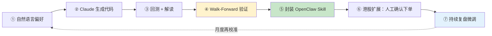

## Step 1 · 自然语言偏好描述（用户主导）

### Prompt 模板

```
我是中级量化用户，想做波段策略（持仓 3-20 日）。

【市场】A 股（300 股沪深 300 成分） + 港股（恒生科技 50）
【风格】低波动 + 趋势跟随

【偏好规则】
  - 20 日均线上方
  - 过去 5 日内首次站上 60 日均线
  - 成交量较 20 日均量放大 1.5 倍以上
  - 当日涨幅 < 7%（避免追涨）
  - RSI(14) 在 40-70 之间（不超买）

【风控】
  - 单票仓位 ≤ 10%
  - 组合最多持仓 8 只
  - 止损 -7% 硬规则
  - 止盈 +15% 或 20 日回吐到 10 日均线

【交易频率】
  - 最多每周换 2 次
  - 每笔持仓 ≥ 3 日

【目标指标】
  - 夏普 > 1.2
  - 最大回撤 < 15%
  - 年化换手率 < 400%

请基于以上偏好，生成：
1. Backtrader 策略类代码
2. 因子计算代码
3. 5 年回测脚本（用 AkShare 数据）
4. 报告输出格式
```

### 关键要点

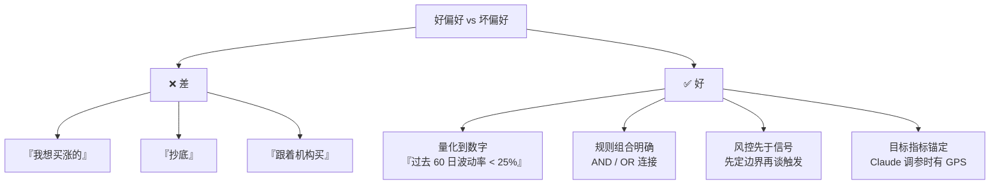

## Step 2 · Claude 生成代码

### LLM 输出样本

```python
# strategy_v1.py
import backtrader as bt

class SwingTrendStrategy(bt.Strategy):
    params = (
        ('sma_short', 20),
        ('sma_long', 60),
        ('volume_multiplier', 1.5),
        ('rsi_period', 14),
        ('rsi_low', 40),
        ('rsi_high', 70),
        ('max_positions', 8),
        ('position_size', 0.10),
        ('stop_loss', 0.07),
        ('take_profit', 0.15),
    )

    def __init__(self):
        self.sma_short = {d: bt.indicators.SMA(d.close, period=self.p.sma_short)
                          for d in self.datas}
        self.sma_long = {d: bt.indicators.SMA(d.close, period=self.p.sma_long)
                         for d in self.datas}
        self.rsi = {d: bt.indicators.RSI(d.close, period=self.p.rsi_period)
                    for d in self.datas}
        self.vol_avg = {d: bt.indicators.SMA(d.volume, period=20)
                        for d in self.datas}
        self.cross = {d: bt.indicators.CrossOver(d.close, self.sma_long[d])
                      for d in self.datas}

    def next(self):
        held = len([d for d in self.datas if self.getposition(d).size > 0])
        for d in self.datas:
            pos = self.getposition(d)
            price = d.close[0]

            # 开仓
            if not pos.size and held < self.p.max_positions:
                cond_trend    = price > self.sma_short[d][0]
                cond_breakout = self.cross[d][0] > 0      # 今日首次站上长均
                cond_volume   = d.volume[0] > self.p.volume_multiplier * self.vol_avg[d][0]
                cond_rsi      = self.p.rsi_low <= self.rsi[d][0] <= self.p.rsi_high
                cond_no_chase = d.close[0] / d.close[-1] - 1 < 0.07

                if all([cond_trend, cond_breakout, cond_volume, cond_rsi, cond_no_chase]):
                    cash = self.broker.get_value() * self.p.position_size
                    qty = int(cash / price / 100) * 100   # A 股整百股
                    if qty > 0:
                        self.buy(data=d, size=qty)

            # 止损 / 止盈
            elif pos.size > 0:
                cost = pos.price
                pnl_pct = price / cost - 1
                if pnl_pct <= -self.p.stop_loss:
                    self.sell(data=d, size=pos.size)
                elif pnl_pct >= self.p.take_profit:
                    self.sell(data=d, size=pos.size)
                elif price < self.sma_short[d][0]:
                    self.sell(data=d, size=pos.size)
```

### 人工 Review Checklist

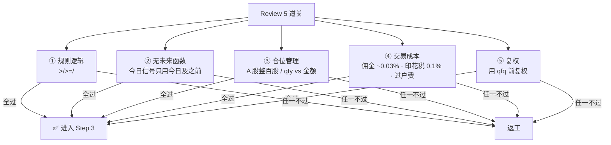

**永远不要** 直接抄 LLM 代码部署。LLM 对 T+1 / 涨跌停 / 整百股这些"看似常识"的规则容易漏。

## Step 3 · 回测 + Claude 解读

### 回测脚本骨架

```python
import backtrader as bt
import akshare as ak
import pandas as pd
from strategy_v1 import SwingTrendStrategy

def load_data(symbol, start, end):
    df = ak.stock_zh_a_hist(symbol=symbol, period="daily",
                             start_date=start, end_date=end, adjust="qfq")
    df = df.rename(columns={"日期":"date","开盘":"open","最高":"high",
                             "最低":"low","收盘":"close","成交量":"volume"})
    df["date"] = pd.to_datetime(df["date"])
    df.set_index("date", inplace=True)
    return df[["open","high","low","close","volume"]]

cerebro = bt.Cerebro()
cerebro.addstrategy(SwingTrendStrategy)

for sym in CSI300_SAMPLE:    # 30 只流动性好的
    df = load_data(sym, "20200101", "20251231")
    cerebro.adddata(bt.feeds.PandasData(dataname=df), name=sym)

cerebro.broker.setcash(1_000_000)
cerebro.broker.setcommission(commission=0.0003)

cerebro.addanalyzer(bt.analyzers.SharpeRatio, _name='sharpe', riskfreerate=0.03)
cerebro.addanalyzer(bt.analyzers.DrawDown, _name='dd')
cerebro.addanalyzer(bt.analyzers.Returns, _name='ret')
cerebro.addanalyzer(bt.analyzers.TradeAnalyzer, _name='trades')

results = cerebro.run()
strat = results[0]

print(f"Sharpe: {strat.analyzers.sharpe.get_analysis()['sharperatio']:.3f}")
print(f"Max DD: {strat.analyzers.dd.get_analysis()['max']['drawdown']:.2f}%")
print(f"Total Return: {(cerebro.broker.get_value() / 1e6 - 1) * 100:.2f}%")
```

### Prompt · 回测报告交给 Claude 解读

```
【回测报告】
- 时间范围：2020-01 到 2025-12（5 年）
- 标的：沪深 300 样本 30 只
- 总收益：68.4%
- 年化：10.9%
- 夏普：1.35 ✅
- 最大回撤：-14.8% ✅
- 胜率：52%
- 盈亏比：1.8
- 换手率：年 520% ⚠️ 超标
- 月度胜率：62%
- 最差单月：-8.2%（2022-04）

请分析：
1. 哪些 metric 超预期 / 不达标
2. 换手率超标的根本原因（调哪个参数能降）
3. -8.2% 那个月发生了什么（2022-04 上海疫情，市场剧烈下跌）
4. 参数敏感性：把 RSI 上限从 70 调到 65，模型会怎样
5. 推荐 v2 版本的 3 个改进方向
```

Claude 的典型反馈（示意）：
- "换手率高 → RSI 区间过松 → 频繁进出"
- "2022-04 -8.2% 是系统性风险，建议加大盘 regime filter"
- "RSI 70→65 会减少 30% 交易但夏普可能提高"

### 参数敏感性分析

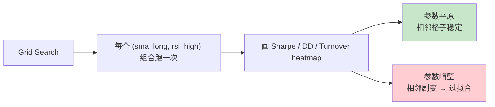

```python
# param_sweep.py
for sma_long in [50, 60, 70, 80]:
    for rsi_high in [65, 70, 75]:
        # 跑一次 backtest
        sharpe, dd, turnover = run_backtest(sma_long, rsi_high)
        # 存表
```

## Step 4 · 样本外 + Walk-Forward 验证[^33]

### 为什么不能只看总回测

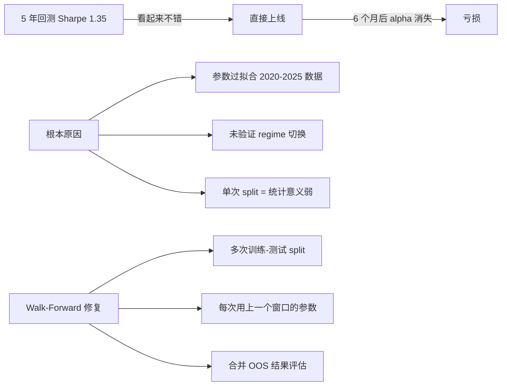

### 经典配置（本项目用）

| 项 | 值 |
|---|---|
| 训练窗（In-Sample） | 5 年 |
| 测试窗（Out-of-Sample） | 1 年 |
| 步长 | 1 年 |
| 总 cycle 数 | 6（2020-2025） |

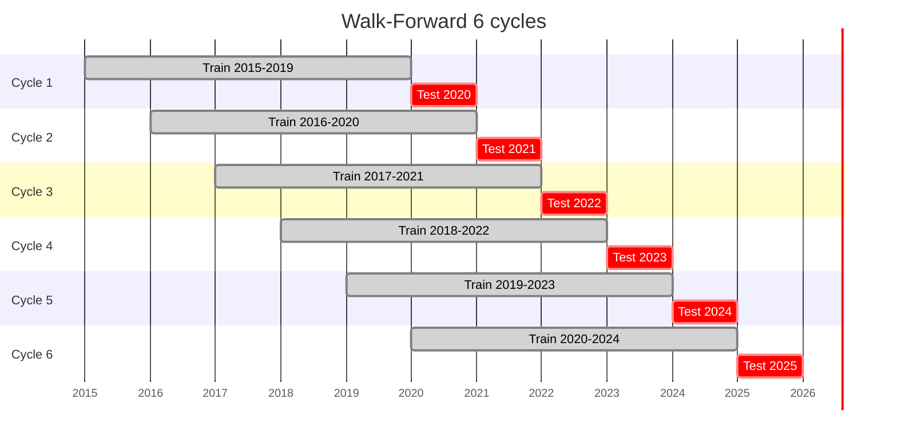

### 代码

```python
def walk_forward(data, train_years=5, test_years=1, step_years=1):
    results = []
    years = sorted(data.index.year.unique())
    start, end = years[0], years[-1]
    current = start

    while current + train_years + test_years - 1 <= end:
        train_end = current + train_years - 1
        test_start = train_end + 1
        test_end = test_start + test_years - 1

        in_sample = data[data.index.year.between(current, train_end)]
        oos       = data[data.index.year.between(test_start, test_end)]

        best_params = grid_search(in_sample)
        oos_perf    = run_backtest(oos, best_params)

        results.append({
            'train': f'{current}-{train_end}',
            'test':  f'{test_start}-{test_end}',
            'params': best_params,
            'oos_sharpe': oos_perf['sharpe'],
            'oos_ret':    oos_perf['return'],
            'oos_dd':     oos_perf['max_dd']
        })
        current += step_years

    return pd.DataFrame(results)
```

### 合格线

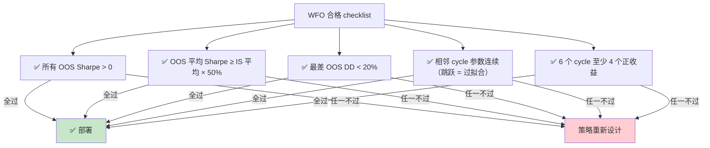

### 5 个 WFO 陷阱[^33]

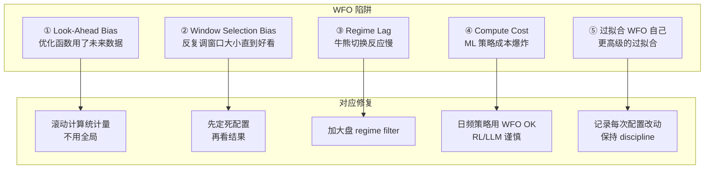

## Step 5 · 封装 OpenClaw Skill

Skill 结构已在 [8. OpenClaw 承载方案](8.%20OpenClaw%20承载方案.md) 详述。这里看**Cron 注册**：

```bash
# 完整 cron 清单（本项目）
openclaw cron add --name "a-share-daily-scan" \
  --cron "10 15 * * 1-5" --message "/ai-swing-reminder"

openclaw cron add --name "hk-daily-scan" \
  --cron "10 16 * * 1-5" --message "/ai-swing-reminder market=hk"

openclaw cron add --name "weekend-research" \
  --cron "0 10 * * 6" --message "/tradingagents-cn-watchlist-review"

openclaw cron add --name "weekly-walk-forward" \
  --cron "0 14 * * 0" --message "/ai-swing-reminder walk-forward-check"

openclaw cron add --name "daily-heartbeat" \
  --cron "59 23 * * *" --message "/heartbeat"
```

## Step 6 · 港股可选：提醒 → 确认 → 下单

已在 [9. 合规红线与港股下单 API](9.%20合规红线与港股下单%20API.md) Part 3 详述。

**关键原则重申**：
- 提醒永远**无状态**
- 下单永远**有状态 + 交互式**
- 永远**人工确认**

## Step 7 · 持续复盘 + Claude 微调

### 周报机制

每周五 20:00，Claude 接管分析：

```
【本周交易记录】
- 触发信号 15 次
- 推送 15 条 → 手动下单 8 单
- 盈利 5 单（最大 +12%）/ 亏损 3 单（最大 -8%）
- 平均持有 4 天
- 胜率 62.5%
- 本周收益 +3.2%

请分析：
1. 哪类信号质量最差（按 signal_id 分组看胜率）
2. 漏单的 7 次事后看结果怎么样（overfitting 测试）
3. 是否有新规律（周一总亏 / 尾盘总赢）
4. 下周 watchlist 调整建议
5. 参数是否该微调
```

### 月度再校准

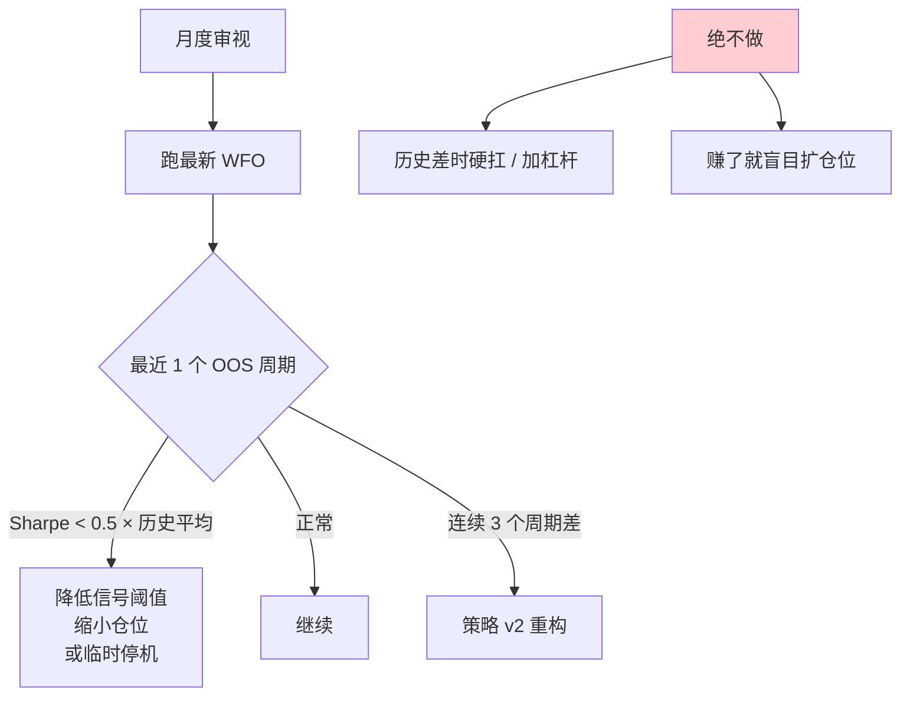

### Claude 的 5 种角色时间线

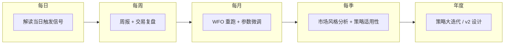

## 交付物清单（完成 Pipeline 后你拥有）

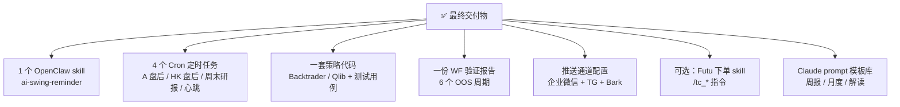

## 月开销分解

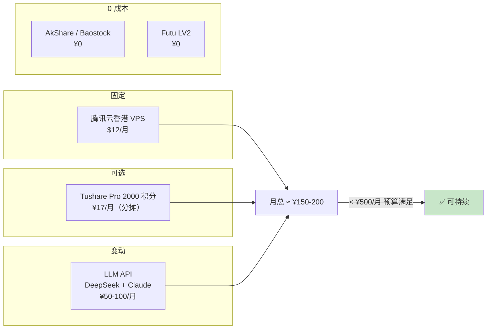

## 每一步的避坑清单总结

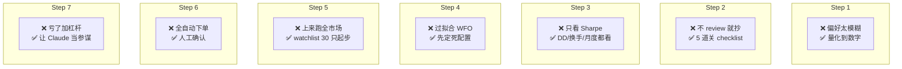

## 一句话总结

> **7 步、4 个 cron、1 个 skill、5 个 LLM 角色、¥200/月——把『AI 帮我做波段』从一个想法变成每日自动推送到手机的提醒系统。**

## 回到总览

到这里本 wiki 的所有内容已经串连。回到 [1. 项目总览与系统架构](1.%20项目总览与系统架构.md) 看整体图。

---

[^33]: [[end-to-end-pipeline-template|端到端 Pipeline 模板]] · 综合自 [QuantInsti Walk-Forward Optimization](https://blog.quantinsti.com/walk-forward-optimization-introduction/) · Qlib workflow_by_code · TradingAgents-CN 部署教程

## Sources

| # | Title | Raw Note |
|---|-------|----------|
| 33 | 端到端 Pipeline 模板 | [[end-to-end-pipeline-template]] |
