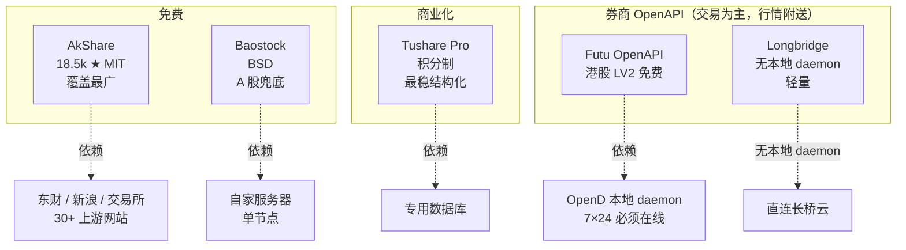
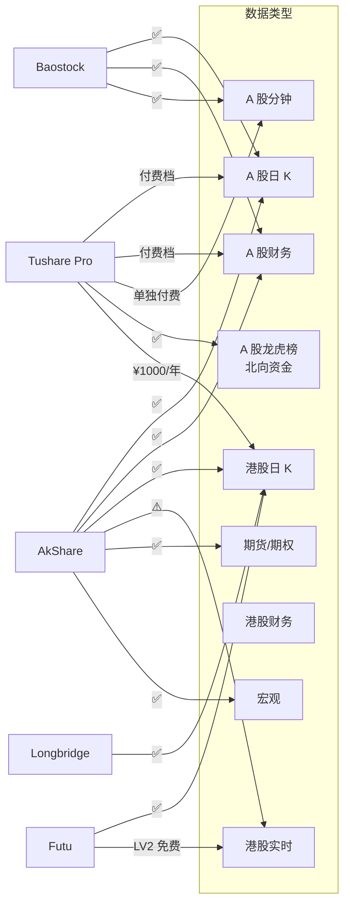
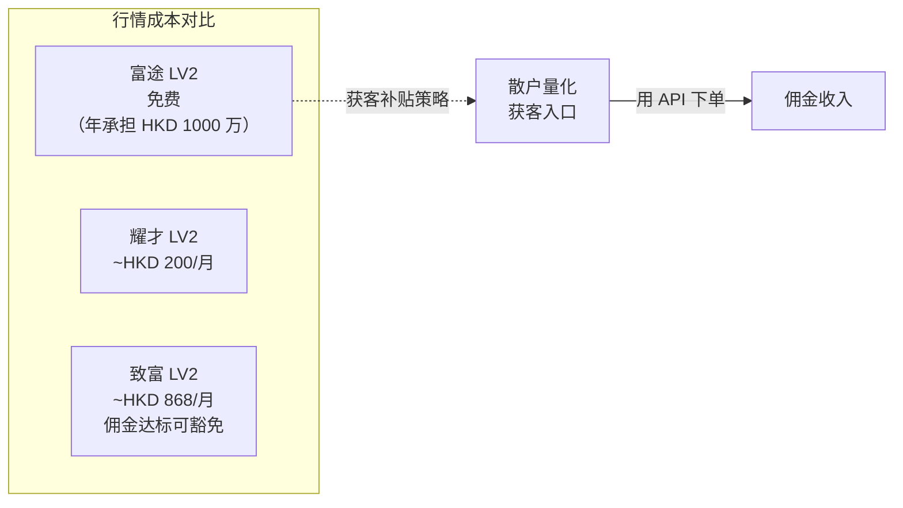
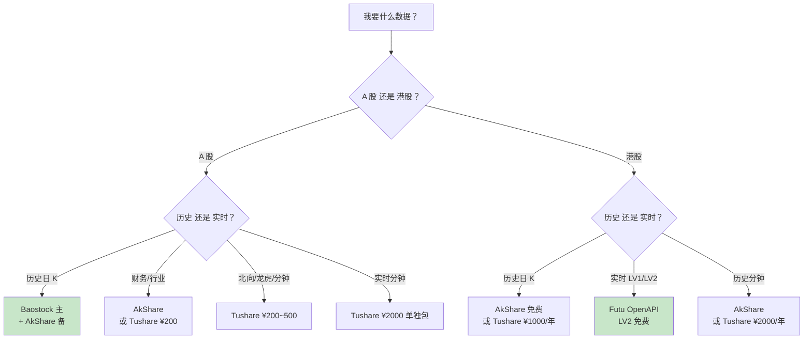
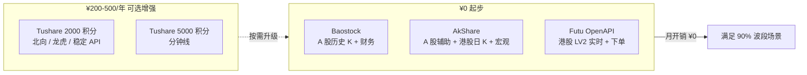
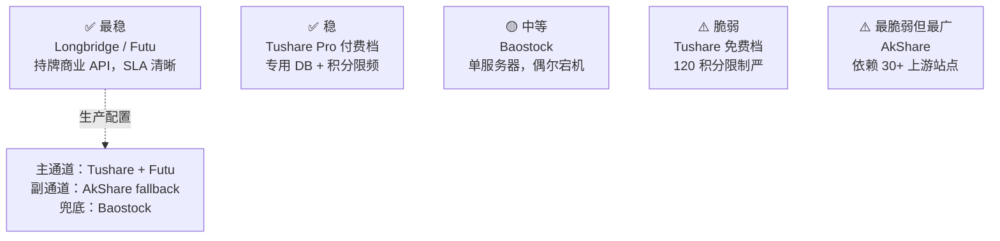
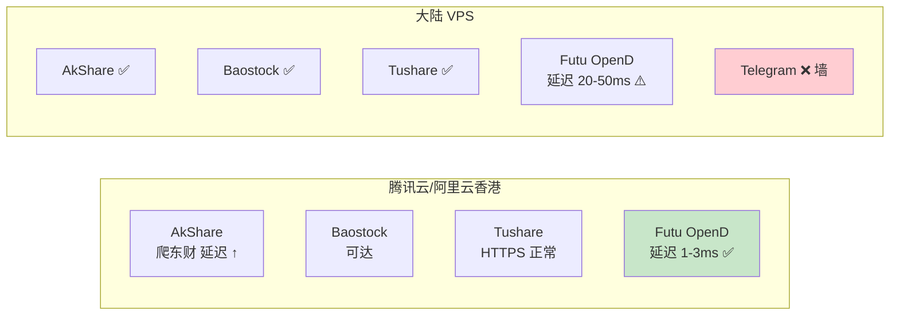

# A 股 + 港股数据源选型

数据层决定后面所有层的天花板。本页回答：**日频波段 + 双市场 + 月开销 <¥500 + 中级开发者** 场景下，用哪些 API，为什么，怎么组合。

## 五家主流开源/低价数据源的"定位一览"



核心观察：**"免费"的代价是稳定性**。AkShare 依赖 30+ 第三方站点，任何一家改版都可能断接口——README 明确写了 "some data interfaces may be removed"[^26]。

## 覆盖能力矩阵



**盲点识别**：
- Baostock 只有 A 股
- AkShare 港股实时靠爬虫延迟高（分钟级以上）
- Tushare 港股是**单独年费**（¥500 财务 / ¥1000 日线 / ¥2000 分钟）
- Futu 必须跑 OpenD daemon

## Tushare Pro 的积分-价格-权限三维表

这是最容易踩坑的一家——积分不是"充多少拿多少"，每档积分对应**不同限频 + 不同可用接口**[^26]：

| 积分 | 每分钟 | 每日上限 | 能调什么 | 等效价格/年 |
|---|---|---|---|---|
| 120 | 50 | 8000 | **仅不复权日线**，其他全锁 | ¥0（免费） |
| 2000+ | 200 | 10 万/API | 按各 API 声明的积分门槛 | ¥200 |
| 5000+ | 500 | 常规数据无限 | 大部分接口 | ¥500 |
| 10000+ | 500 | 常规无限，特色 300/min | 加送：盈利预测、筹码分布、券商金股 | ¥1000 |
| 15000+ | 500 | 特色无限 | 独占高级数据 | ¥1500 |

港股是**独立付费**（不走积分）：

| 港股数据 | 价格 | 限频 |
|---|---|---|
| 日线 + 复权 | ¥1000/年 | 500/min, 6000 行/次 |
| 分钟线（2015 起） | ¥2000/年 | 500/min, 8000 行/次 |
| 财务（2000 起） | ¥500/年 | 500/min, 10000 行/次 |
| 实时日线（全市场） | ¥1000/月 | 50/min |

**企业用户 10 倍个人价**。捐助不退款。

## Futu LV2 为什么免费（行业洼地）



富途把 LV2 当作**获客成本**，靠佣金回血。对本项目：**港股实时行情 + 交易 API 一起用 Futu 最划算**[^26]。

## 按用途选源（决策表）



## 本项目推荐组合（零到低价的最佳路径）



**月开销估算**：
- 起步：¥0
- 升级到 2000 积分：¥17/月（¥200/12）
- 升级到 5000 积分：¥42/月

完全符合 <¥500/月 约束[^26]。

## 稳定性等级（生产视角）



**推荐防御性设计**：
```python
def get_a_share_daily(symbol, start, end):
    try:
        return tushare_pro.daily(ts_code=symbol, ...)  # 主
    except Exception:
        try:
            return ak.stock_zh_a_hist(symbol=symbol, ...)  # 副
        except Exception:
            return bs.query_history_k_data_plus(symbol, ...)  # 兜底
```

## 关键字段与复权

**AkShare A 股日 K**（`ak.stock_zh_a_hist`）返回 11 列：
```
日期, 开盘, 收盘, 最高, 最低, 振幅, 涨跌幅, 涨跌额, 换手率, 成交量, 成交额
adjust 参数: ""（不复权） / "qfq"（前复权） / "hfq"（后复权）
```

**Baostock**（`query_history_k_data_plus`）字段更丰富：
```
date, code, open, high, low, close, preclose, volume, amount,
turn, tradestatus, pctChg, peTTM, pbMRQ, psTTM, pcfNcfTTM, isST
adjust: "1"=后复权 / "2"=前复权 / "3"=不复权
```

**波段策略统一用 `qfq` 前复权**——避免历史价格跳变破坏技术指标连续性。

## VPS 部署注意[^31]



**最简配置**：单节点腾讯云香港轻量（$12/月）。AkShare 爬国内网站延迟略增但日频够用，Futu 就近接入，Telegram 直通。见 [8. OpenClaw 承载方案](8.%20OpenClaw%20承载方案.md)。

## 不再考虑的源（与为什么）

| 源 | 排除理由 |
|---|---|
| JoinQuant / RiceQuant | 付费 + 封闭生态，和 Qlib/OpenClaw 整合弱 |
| Wind 个人版 | ¥6000+/年，超预算 |
| yfinance（港股） | 港股代码/复权处理怪异，中文社区踩坑多 |
| pytdx（通达信） | TCP 协议老旧，港股无覆盖 |

## 下一步

数据选完就要跑回测——见 [3. 回测框架 Qlib 与 Backtrader 的分工](3.%20回测框架%20Qlib%20与%20Backtrader%20的分工.md)。

---

[^26]: [[stock-data-sources-cn-hk|A 股 + 港股数据源全景对比]] · 综合自 AkShare GitHub、Tushare Pro 文档、富途 OpenAPI 官方文档、Longbridge 文档、Baostock 公开文档等

[^31]: [[openclaw-hosting-architecture|OpenClaw 承载方案]] — synthesis

## Sources

| # | Title | Raw Note | Original |
|---|-------|----------|----------|
| 26 | 数据源全景对比 | [[stock-data-sources-cn-hk]] | 多源 synthesis |
| 31 | OpenClaw 承载 | [[openclaw-hosting-architecture]] | 多源 synthesis |
