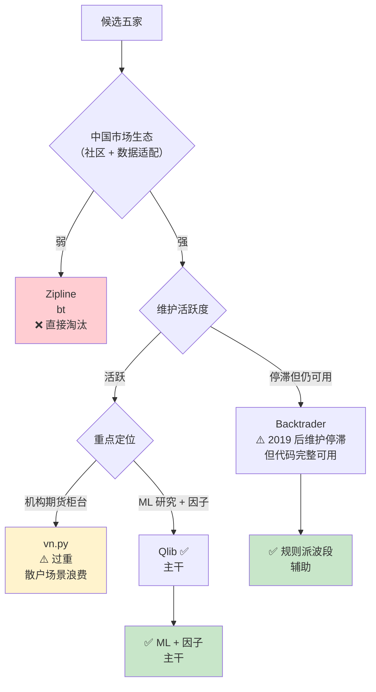
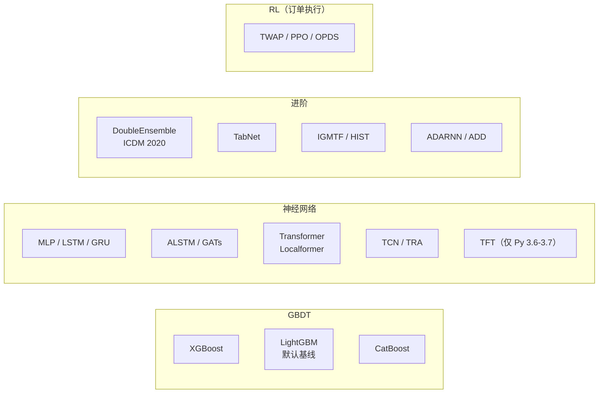
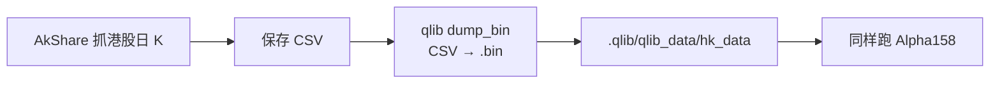
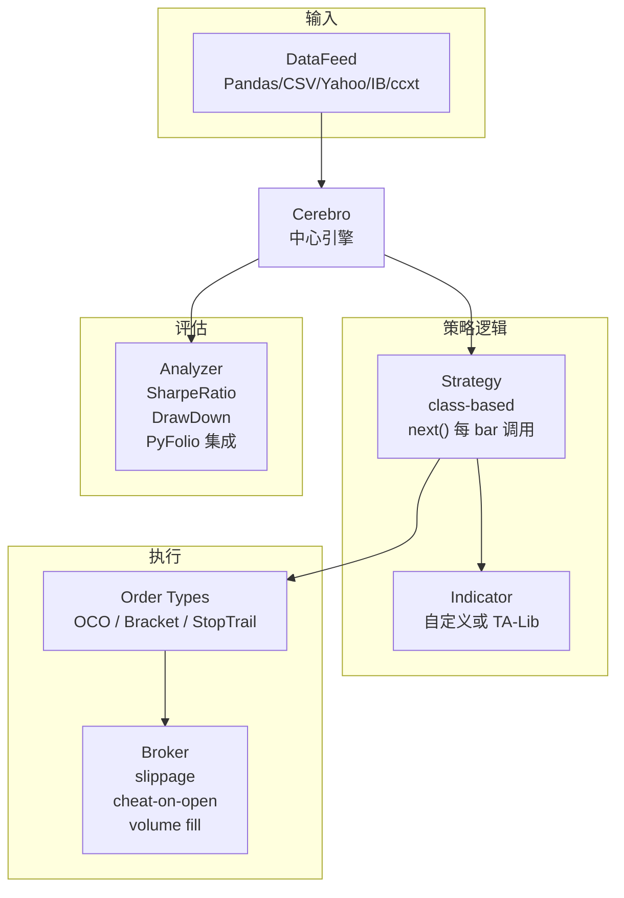
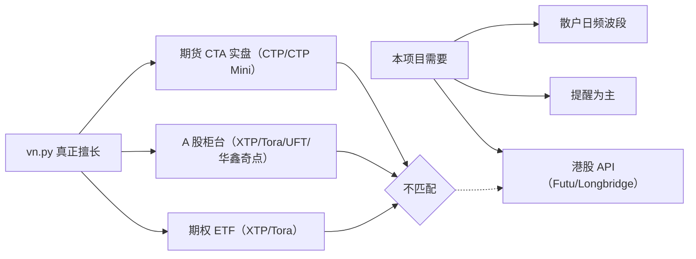
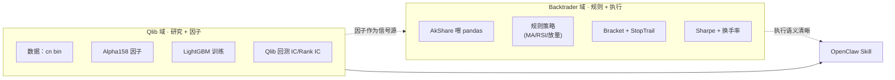
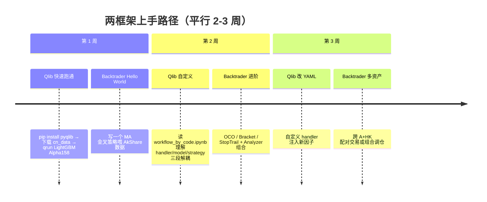

# 回测框架：Qlib 与 Backtrader 的分工

候选框架五家：**Qlib / Backtrader / vn.py / Zipline / bt**。本页论证为什么本项目选 **Qlib 做因子研究主干 + Backtrader 做规则派执行**，不选 vn.py / Zipline / bt。

## 五选二：快速筛选



## Qlib · 为什么做主干[^27]

**定位**：微软开源的**机器学习驱动量化研究平台**，41.2k star。数据→因子→模型→回测→订单执行一条龙。

### 数据性能（核心杀手锏）

Qlib 用自研 `.bin` 二进制 + ExpressionCache (+E) + DatasetCache (+D)。官方基准测试 "800 股 × 2007-2020 × 14 因子"：

| 方案 | 1 CPU 耗时 | 64 CPU |
|---|---|---|
| HDF5 | 184.4s | 8.8s |
| MySQL | 365.3s | — |
| MongoDB | 253.6s | — |
| InfluxDB | 368.2s | — |
| Qlib -E -D | 147.0s | — |
| Qlib +E -D | 47.6s | — |
| **Qlib +E +D** | **7.4s** | **4.2s** |

**单 CPU 下比 HDF5 快 25 倍，比 MongoDB 快 34 倍**[^27]。这个差异对迭代调因子是质变——20 秒级反馈 vs 几分钟/每次。

### 内置模型 Zoo



共 20+ 模型，全部可通过 YAML config 一行切换。**对本项目意义**：想试 LightGBM 就改 `class: LGBModel`；想试 LSTM 改 `class: LSTMModel`——不用重写回测代码。

### Alpha158 / Alpha360

两套预构建因子集，定义在 `qlib/contrib/data/handler.py`：
- **Alpha158** — 158 个基于 OHLCV 的衍生因子（动量、波动率、量价）
- **Alpha360** — 360 个更宽的特征空间

"Expression Engine" 语法类似 WorldQuant 的 Alpha101：
```python
# 简化示意
"Rank($volume / Mean($volume, 20))"  # 成交量排名
"($close - Min($low, 10)) / (Max($high, 10) - Min($low, 10))"  # KDJ-like
```

**本项目意义**：Alpha158 作为基线，Claude 可以在此之上增删组合——见 [4. AI 构建策略的四条路线](4.%20AI%20构建策略的四条路线.md) 路线 A。

### Qlib 港股痛点

**README 未列 HK 作为 region**，`Alpha158/360` 支持矩阵只标 US + China[^27]。



官方提供 "Converting CSV Format into Qlib Format" 脚本。**一次性适配，约 1-2 小时开发**。

## Backtrader · 为什么做辅助[^27]

**定位**：**传统事件驱动回测引擎**，灵活度之王。

### 架构



### 订单类型（优势）

- 一般单 / Target Orders
- **OCO** (One-Cancels-Other，二选一)
- **Bracket**（主单 + 止盈 + 止损 三件套）
- **StopTrail**（追踪止损）
- Future-Spot 对冲补偿

**为什么重要**：波段策略常见"买入后自动挂止损 + 止盈"的 Bracket 需求。在 Qlib 里要自己写，在 Backtrader 里一行调用。

### 中国数据适配

Backtrader 官方**零提及** akshare/tushare——中文社区自己拼：

```python
import akshare as ak
import pandas as pd
import backtrader as bt

df = ak.stock_zh_a_hist(symbol="600519", period="daily",
                         start_date="20200101", end_date="20240101",
                         adjust="qfq")
df = df.rename(columns={"日期":"date","开盘":"open","最高":"high",
                         "最低":"low","收盘":"close","成交量":"volume"})
df["date"] = pd.to_datetime(df["date"]); df.set_index("date", inplace=True)

data = bt.feeds.PandasData(dataname=df[["open","high","low","close","volume"]])
cerebro = bt.Cerebro()
cerebro.adddata(data)
```

### ⚠️ 维护状态警示

- Copyright 2015-**2024** Daniel Rodriguez
- 最近博客 **2019 年**
- GitHub 最近 commit 约 2023

**项目进入维护停滞但代码完整**。不要期待新功能，但用作成熟工具足够可靠。

## 为什么不选 vn.py[^27]

vn.py (VeighNa) 39.8k star，2025-12 发布 4.3.0，活跃度顶级。但定位不对：



**关键错配**：
- **无港股散户 Gateway**（Futu / Longbridge 都不在 gateway 列表里）
- **期货柜台**（CTP）对散户波段无用
- **重量级**：40+ 子包，事件引擎 + GUI + 多进程 RPC

vn.py 4.0 新增的 `vnpy.alpha` 模块明确写着"受 Qlib 启发"，**复刻 Alpha158**——意味着 Qlib 才是 ML 生态的源头。

### vn.py 唯一可能的未来角色

如果**未来扩展到 A 股期货 CTA 实盘**，再上 vn.py。现在不考虑。

## 为什么不选 Zipline / bt

**Zipline**：
- 原 Quantopian 开发，2020 关停后社区接手为 `zipline-reloaded`
- 美股生态为主，Pipeline API 适合多因子研究
- **中国数据几乎无生态** → 一票否决

**bt** (Philippe Morissette)：
- 轻量级，重资产配置/组合再平衡
- 适合月度调仓策略
- 不适合高频规则择时

## Qlib + Backtrader 的分工模式



**两种使用模式**：

| 场景 | 首选框架 | 说明 |
|---|---|---|
| "Alpha 因子排名 + Top-N 持仓" 多因子选股 | **Qlib** | Alpha158 + LightGBM 一条龙 |
| "MA / MACD / RSI 交叉 + 量价确认" 规则派 | **Backtrader** | 订单类型丰富，规则逻辑直观 |
| "LightGBM 对全 A 排序，每周调仓" | **Qlib** | 原生 workflow |
| "单只港股突破 + 止盈止损" | **Backtrader**（自喂 Futu） | Bracket 语义合适 |
| 跨 A+HK 配对交易 | **Backtrader** | Qlib 港股还要自适配 |

## 学习曲线（中级用户视角）



**入门门槛**：
- Qlib 中等偏高 —— YAML workflow 体系 + 表达式引擎语法要适应
- Backtrader 低 —— Python class 写策略很直观

## 常见踩坑

| 框架 | 踩坑 | 解决 |
|---|---|---|
| Qlib | 港股无 region | CSV → dump_bin 脚本 |
| Qlib | YAML 配置项多 | 先抄 `examples/benchmarks/LightGBM/workflow_config_lightgbm_Alpha158.yaml` |
| Qlib | 表达式 syntax 陌生 | 读 `qlib/contrib/data/handler.py` Alpha158 实现 |
| Backtrader | pandas 列名必须小写 | 用前 rename |
| Backtrader | `next()` 里算因子慢 | 用 `__init__` 预计算 Indicator |
| Backtrader | commission 默认 0 | `cerebro.broker.setcommission(commission=0.0003)` |

## 下一步

选完框架，核心问题是：**怎么让 AI 帮我构建策略？** 这是本 wiki 的核心——见 [4. AI 构建策略的四条路线](4.%20AI%20构建策略的四条路线.md)。

---

[^27]: [[backtest-frameworks-qlib-backtrader-vnpy|回测框架对比]] · 综合自 Qlib GitHub、Backtrader 官方站、vn.py GitHub

## Sources

| # | Title | Raw Note | Original |
|---|-------|----------|----------|
| 27 | 回测框架对比 | [[backtest-frameworks-qlib-backtrader-vnpy]] | [Qlib](https://github.com/microsoft/qlib) · [Backtrader](https://www.backtrader.com/) · [vnpy](https://github.com/vnpy/vnpy) |
