# AI 构建策略的四条路线

这是本 wiki 的**核心问题**。"AI 帮我构建策略"在 2025-2026 的含义比想象的复杂——四条路线，四种哲学，差异巨大。本页给出机制对比 + 本项目推荐路线。

## 四路线全景

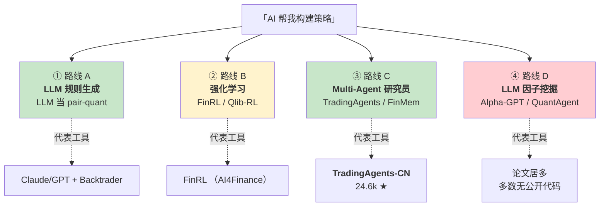

**剧透**：本项目主推 A + C，不推 B/D。每条路线的判断依据在下面展开。

## 路线 A · LLM 对话式生成规则/因子代码[^28]

**机制一句话**：LLM **不做决策**，它是"会写代码的金融顾问"。

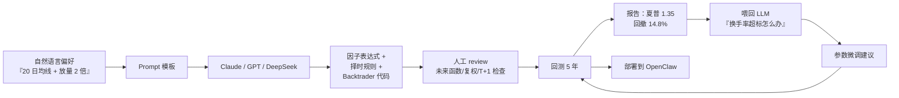

### 特点

| 维度 | 评估 |
|---|---|
| 代表 repo | 无（太通用），Claude Code + Qlib/Backtrader 组合是事实标准 |
| 数据需求 | OHLCV + 基本面（AkShare/Baostock 够用） |
| 算力 | 本地 CPU 即可，LLM 走 API |
| LLM 成本 | ¥10-50/轮迭代（调试期集中消耗） |
| 过拟合风险 | **中** — 人在环里能识别明显过拟合，仍需 walk-forward 兜底 |
| 策略可解释性 | ✅ **极高** — 规则就是人写的 |
| 中级用户可驾驭 | ✅ 最适合 |

### 为什么适合本项目

- **"中级 + 波段 + 规则派"** 和 LLM 的代码生成能力是天作之合
- 成本可控（API token 花在调试期）
- 信号可解释，出问题能 debug
- 触发逻辑是硬规则，**不依赖 LLM 推理**——生产稳定

## 路线 B · 强化学习（FinRL / Qlib-RL）[^28]

**机制一句话**：把市场当环境，Agent 学习最优动作，state→action→reward 闭环。

### FinRL 架构

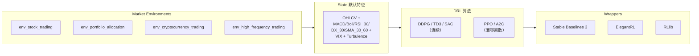

### A 股数据集成（直接支持）

| Source | A 股覆盖 |
|---|---|
| AkShare | 2015-至今，1 day |
| Baostock | 1990-12-19 至今，5 min |
| JoinQuant | 2005-至今，1 min |
| RiceQuant | 2005-至今，1 ms |
| Tushare | 至今，1 min |

FinRL 能**直接跑 A 股**无需额外工作——这一点它比 TradingAgents 原版（美股硬编码）强。

### 代表论文演进

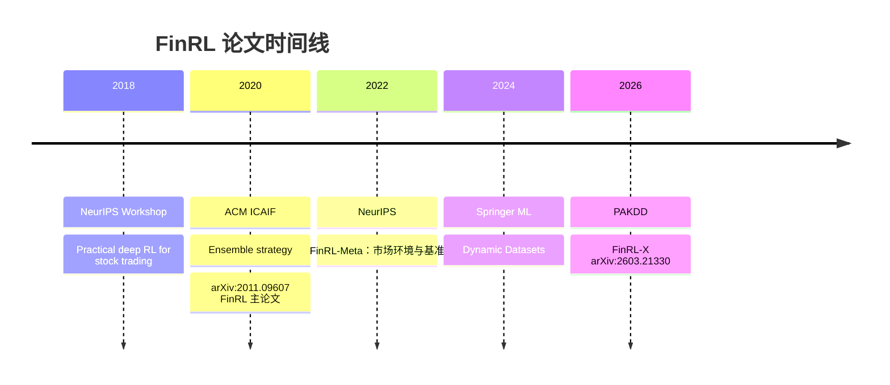

### 过拟合风险（关键）

RL 在金融是**最容易过拟合**的路径之一。DDPG 在 A 股尤其不稳；PPO 相对好些但训练成本高（CPU 单 env 2-6 小时）。**必须**：
- In-sample / out-of-sample 严格划分
- Paper trading 真金周期验证 3+ 月
- 定期 retrain（市场 regime 会变）

### 为什么本项目不主推

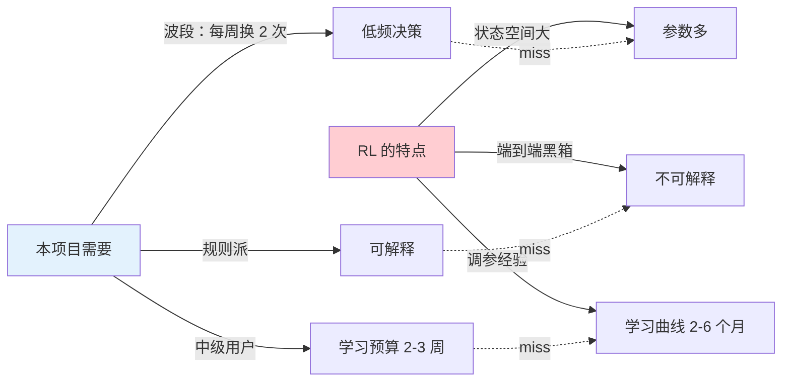

**路线 B 不是错，是对中级 + 波段场景不匹配**。如果未来想做组合优化或高频，再考虑。

## 路线 C · Multi-Agent LLM 研究员[^28]

**机制一句话**：模拟一个投行——分析师辩论、研究员站多空、交易员决策、风控把关。

### TradingAgents 架构（路线 C 代表作）

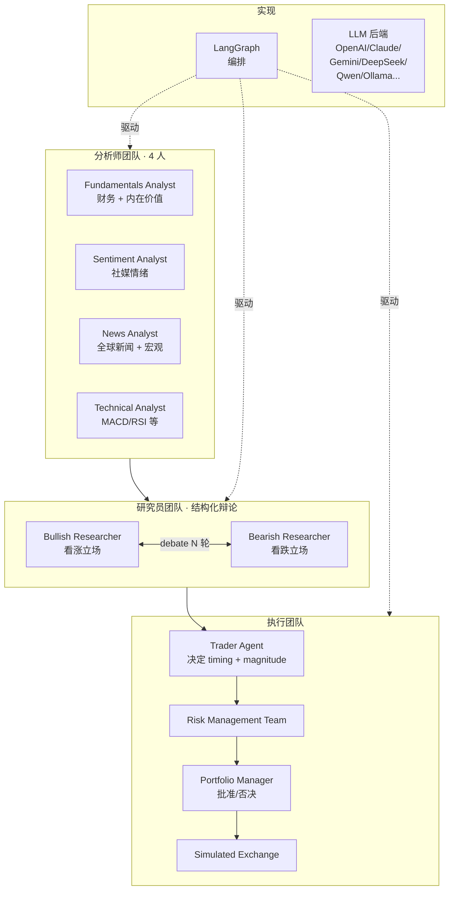

**论文**：arXiv:2412.20138 (Yijia Xiao et al., TauricResearch 2025)。

### 单次分析成本估算

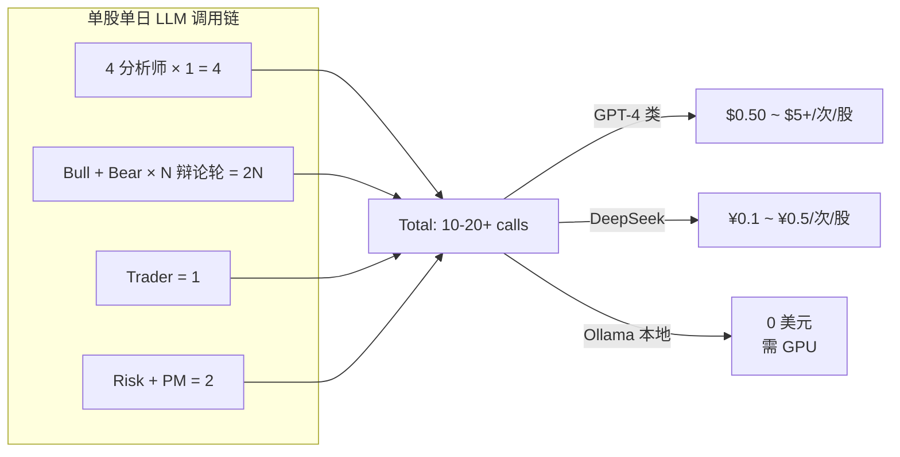

**启示**：Multi-Agent 用 **DeepSeek 或 Qwen 后端** 才能压到可接受成本。不要对全市场 4000 股每日跑——限定在 **watchlist 20-50 只 + 周/月频**。

### TradingAgents-CN（本项目近目标）

hsliuping/TradingAgents-CN 是 24.6k star 的中国本地化 fork，**关键改造**：

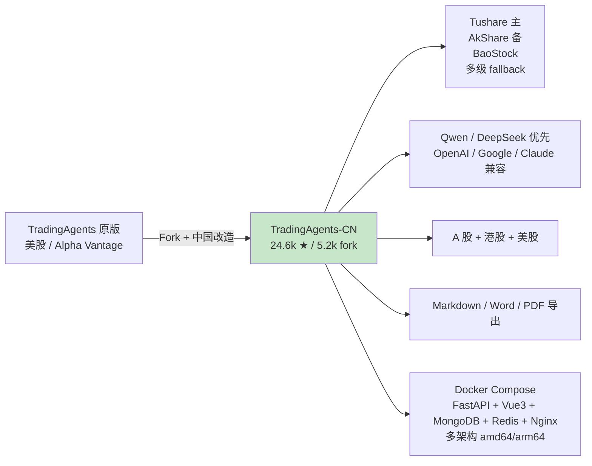

细节展开见 [5. TradingAgents-CN 深度解析](5.%20TradingAgents-CN%20深度解析.md)。

### 其它路线 C 代表

**FinMem** (arXiv:2311.13743)
- 三模块：Profiling / Memory（分层：Working/Short/Mid/Long-term）/ Decision
- 默认 Ticker TSLA（2022-06-30 ~ 2022-10-11）
- LLM: GPT-4 / HuggingFace TGI / Gemini
- 实验性质，生产价值低于 TradingAgents

**ai-hedge-fund** (virattt, 57.2k ★)
- 19 个 agent：13 投资人人格（Buffett/Graham/Munger/Burry/Lynch/...） + 6 功能（Valuation/Sentiment/Fundamentals/Technicals/Risk/PM）
- **数据层硬编码美股**，A 股改造成本 > TradingAgents-CN
- 投资人 prompt 设计可"抄过来"用

### 路线 C 的认知陷阱

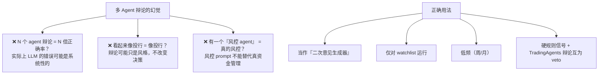

## 路线 D · LLM 因子挖掘[^28]

**机制一句话**：用 LLM 当"因子生成器"，替代传统遗传编程（gplearn / AutoAlpha）。

### 代表工作

**Alpha-GPT 1.0** (arXiv:2308.00016)
- HKUST / IDEA 团队
- EMNLP 2025 System Demonstration Track
- 人机协作的 alpha 挖掘 —— 研究员描述"想法"→ LLM 生成 alpha 表达式
- **无公开代码** ❌
- 无 IC/ICIR/Sharpe 数字

**Alpha-GPT 2.0** (arXiv:2402.09746)
- 扩展到"quantitative investment pipeline 全流程"
- Human-in-the-Loop 贯穿始终
- 标明 "Draft. Work in progress." ❌ 无代码

**FinGPT**（严格说**不是因子挖掘**，是 LLM 微调）
- LoRA 轻量微调开源 LLM，单次 < $300
- 任务：情感分析（FPB F1=0.882 > GPT-4 的 0.833）/ 股价预测 / RAG 分析
- 开源模型：HuggingFace `FinGPT/*`（Llama2 / Qwen / ChatGLM2 / Falcon / Bloom / MPT）
- **中文最好用**：`fingpt-mt_qwen-7b_lora`

### 过拟合极限风险

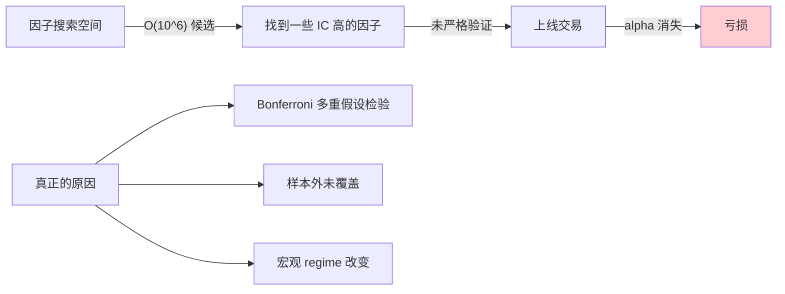

因子挖掘**最容易伪科学**。必须用：
- 严格 IC / Rank IC / ICIR 跨样本
- Walk-forward validation
- 多 regime 测试（2015 股灾 / 2018 熊市 / 2020 疫情 / 2022 熊市）

### 为什么本项目不推路线 D

- 中级用户**没有专业因子研究背景**
- 多数论文级工作**无公开代码**
- **FinGPT 可作为辅助**（新闻情感打标）而非主策略
- 波段场景**不需要**大规模因子搜索

## 四路线对比矩阵

| 维度 | A · LLM 规则 | B · RL | C · Multi-Agent | D · LLM 因子 |
|---|---|---|---|---|
| **代表工具** | Claude + Qlib/Backtrader | FinRL / Qlib-RL | **TradingAgents-CN** / FinMem | Alpha-GPT / FinGPT |
| **成熟度** | ✅ 即装即用 | ✅ 成熟 | ✅ CN 版 24.6k ★ | ❌ 大多无代码 |
| **A+HK 开箱** | ⚠️ 自接数据 | ✅ 多源 | ✅ CN 版全覆盖 | ⚠️ 自接 |
| **数据需求** | OHLCV + 基本面 | OHLCV + 技术指标 | OHLCV + 新闻 + 研报 | 海量历史因子 |
| **算力** | 🟢 CPU | 🟡 CPU 训几小时 | 🟢 纯 API 调用 | 🟡 中等 |
| **LLM token 成本** | 低（调试期） | 零 | 高（10-20 call/次） | 中 |
| **过拟合风险** | 中 | **高** | 低 | **极高** |
| **可解释性** | ✅ 高 | ❌ 黑箱 | ✅ 辩论记录 | 🟡 因子式 |
| **波段适配** | ✅ | ⚠️ 复杂度不匹配 | ✅ | 🟡 |
| **中级用户可驾驭** | ✅ | ⚠️ 需 RL 基础 | ✅ | ❌ |

## 本项目路线推荐

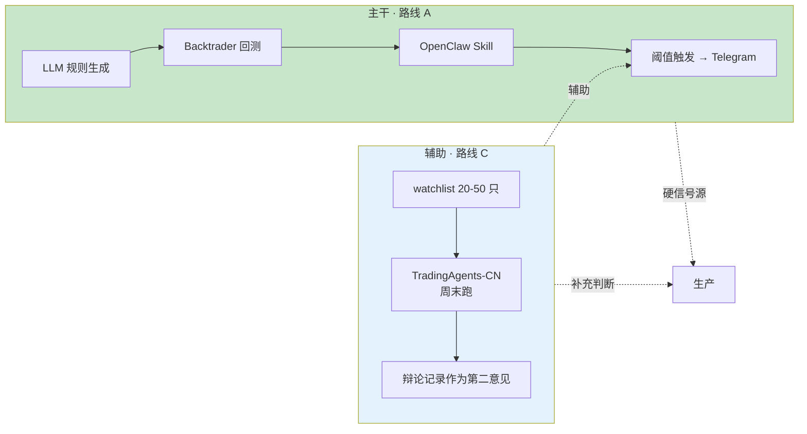

### 不选的组合 & 为什么

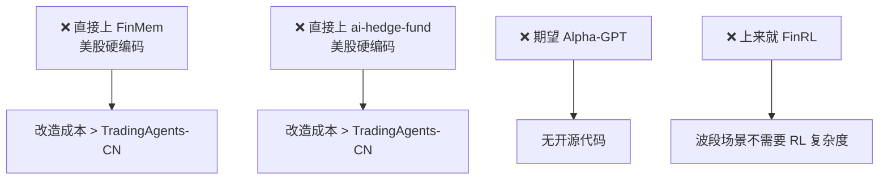

## 三个认知反直觉的 insight

**① "AI 帮我构建策略"在今天有两种截然不同的含义**

- 路线 A/C：LLM 当"顾问/分析师/程序员"，人在环里做决策 → **适合中级用户**
- 路线 B/D：AI 端到端自主训练策略 → **需要量化工程师背景**

很多初学者混淆这两种，误以为"AI 自动炒股"已经成熟。

**② TradingAgents-CN 不做触发通知**

它只出研报。所以在本项目架构里是**"周末研究员"**而不是信号源。触发要靠路线 A 的硬规则。

**③ 路线 C 的成本陷阱**

对 4000 股每天跑 TradingAgents，一天 $2000+ 的 LLM 费。**必须限定 watchlist + 低频 + 用 DeepSeek**。

## 下一步

路线 C 的落地选型是 TradingAgents-CN——深入了解见 [5. TradingAgents-CN 深度解析](5.%20TradingAgents-CN%20深度解析.md)。

所有路线用到的仓库汇总见 [6. 开源仓库 Tier 清单](6.%20开源仓库%20Tier%20清单.md)。

---

[^28]: [[ai-strategy-construction-four-routes|AI 帮构建策略四路线]] · 综合自 TradingAgents GitHub、arXiv:2412.20138、TradingAgents-CN、FinRL、FinGPT、FinMem、arXiv:2311.13743、Alpha-GPT 论文 arXiv:2308.00016 & 2402.09746、ai-hedge-fund

## Sources

| # | Title | Raw Note |
|---|-------|----------|
| 28 | AI 构建策略四路线 | [[ai-strategy-construction-four-routes]] |
