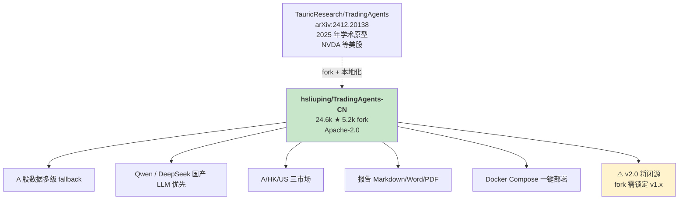
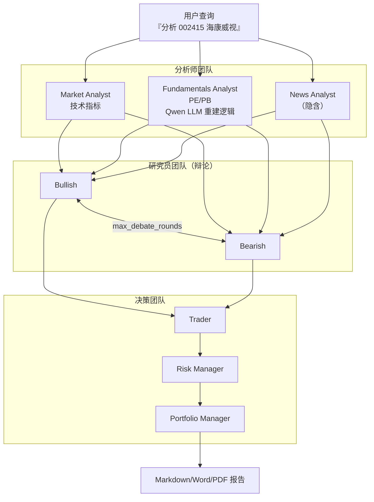
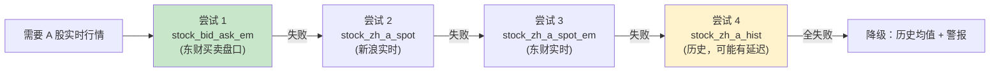
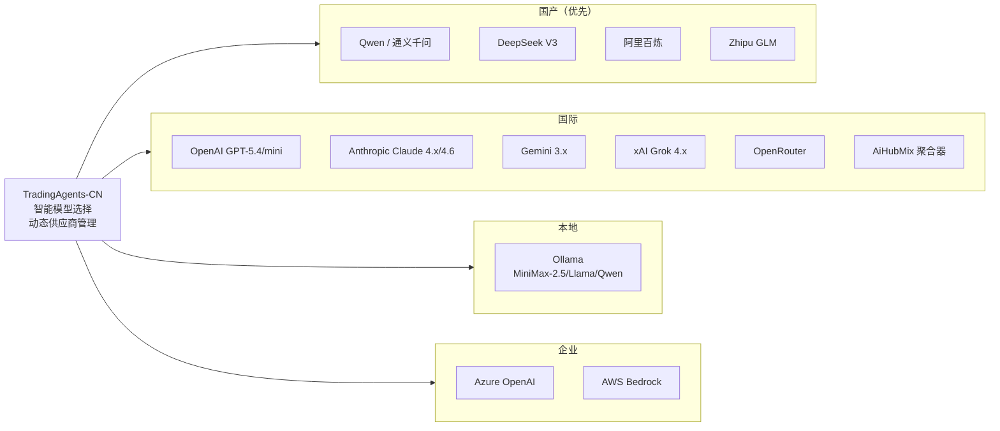
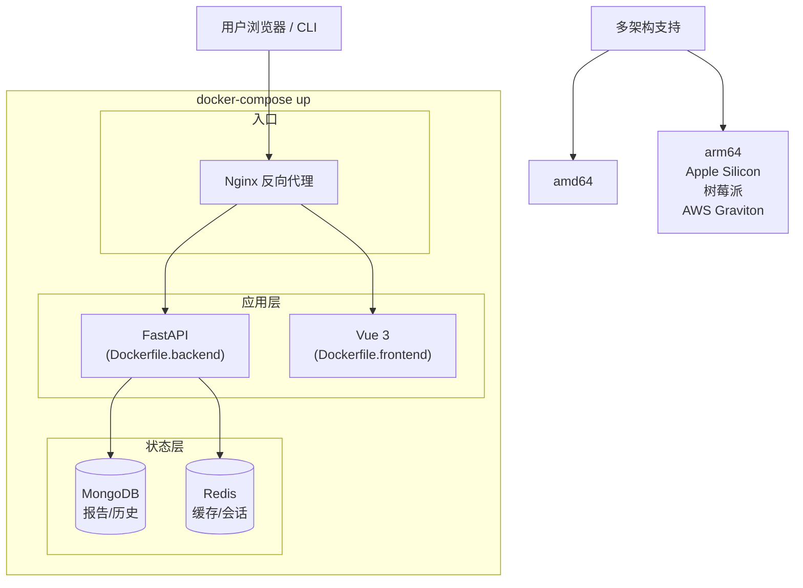
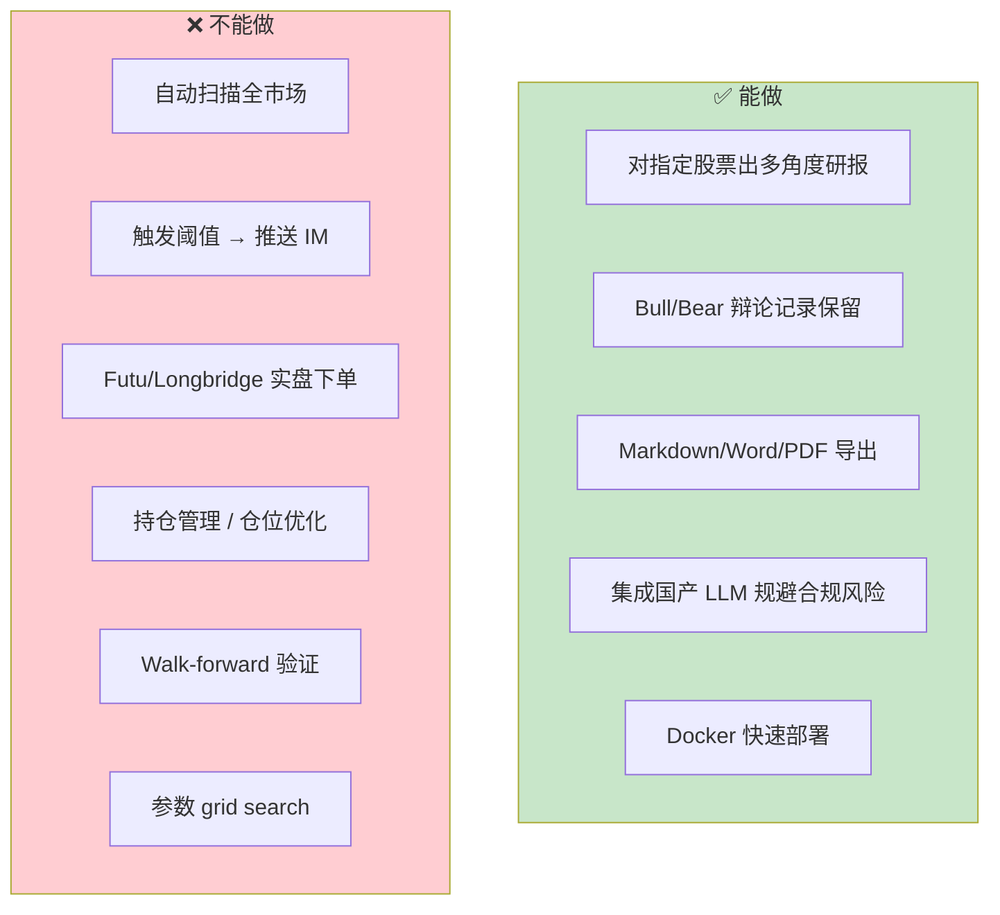
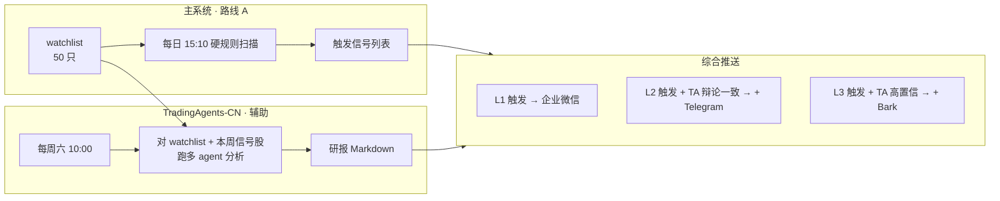
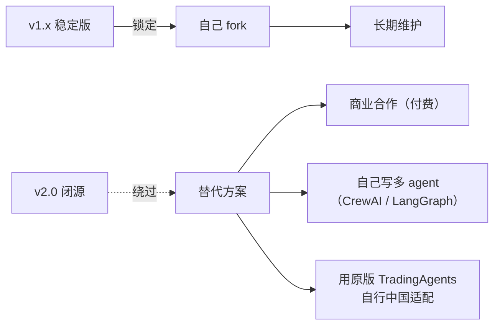

# TradingAgents-CN 深度解析

`hsliuping/TradingAgents-CN` 是整个技术选型中**最接近用户目标的现成仓库**——A 股 + 港股 + 美股三市场 + Qwen/DeepSeek 优先 + Docker 5 分钟部署 + 24.6k star / 5.2k fork。本页剖析它的机制、能力边界与**本项目的集成方式**。

## 谱系与定位

与原版的差异[^28]：
- 原版用 Alpha Vantage（美股为主），TradingAgents-CN 用 Tushare + AkShare + BaoStock 三级 fallback
- 原版 LLM 以 OpenAI/Anthropic 为主，CN 版优先国产（Qwen/DeepSeek）以规避"海外 LLM 隐私合规"担忧
- CN 版增加了 A 股特有逻辑（虽然 README 没细列，实际代码处理了 T+1 + 涨跌停 + 停牌）

## Agent 角色拓扑

README 明确提及的 agent 角色 + 推断隐含角色：

**v1.0.1 bug 修复记录**（说明项目活跃度）：
- Market Analyst 技术指标计算错误
- Fundamentals Analyst PE/PB 计算错误
- 分析循环触发 infinite loop

这些都是早期版本踩过的坑——**选择 v1.x 最新稳定版**部署而不是最初版本。

## 数据层：多级 fallback 机制

A 股实时行情的稳定性难题被 CN 版这样解决[^28]：

这种 **爬虫容错设计** 值得抄到自己的数据层。

### 数据源实际能力

| 源 | 对应调用 |
|---|---|
| **Tushare** 主 | 日 K / 财务 / 北向 (需积分) |
| **AkShare** 备 | 实时盘口 + 多级 fallback |
| **BaoStock** 补 | 免费历史 K + 财务 |

## LLM 支持清单

**本项目推荐**：**DeepSeek 作为主 LLM 后端**（成本低，中文好，`deepseek-chat` ~¥1/百万 tokens）。

## 部署架构

Docker Compose 体系——不是轻量项目：

README 宣称 **5 分钟启动**，多种 compose 文件（Hub/Nginx/ARM 变体）覆盖不同场景。

**对 OpenClaw VPS（$12/月 4核4G）的意义**：
- MongoDB + Redis + FastAPI + Vue + Nginx 全吃内存，**轻量级 4G 不够用**
- 本项目建议：TradingAgents-CN 作为**独立 compose**放在 VPS 上，和 OpenClaw 同 VPS 但资源分开跑
- 如果 VPS 只有 4G，考虑升到 8G，或把 TradingAgents-CN 部署到别的机器（比如本地 NAS）

## 报告产出样本

CN 版对**海康威视 002415** 的分析示例（从 README 示例）：
- 多空倾向度：**90%**（基于财报 + AI 业务增长潜力）
- 风险评分：**40%**（技术面多头动能强，估值低于同业）

产出格式：**Markdown / Word / PDF 三选一**，可以直接推给客户或存档。

## 能力边界（关键！）

**最关键的 gap**：TradingAgents-CN **不做触发通知** —— 所以不是本项目的"信号源"，而是"**第二意见生成器**"。

## 本项目的集成模式（推荐架构）

### 集成的 3 种模式

**模式 1 · 最轻**：只看研报
- 周末自动跑 watchlist，推 PDF 到邮箱
- 主系统仍靠路线 A 触发信号
- TradingAgents-CN 仅作**人工复核辅助**

**模式 2 · 中等**：信号交叉确认
- 路线 A 触发强信号后，立即对该股跑 TradingAgents
- 辩论若一致 bullish → 升级为 L3 推送
- 辩论若矛盾 → 降级为 L1
- 成本：每次 ¥0.5-1（DeepSeek），可以承担

**模式 3 · 重**：替换部分规则
- 让 Trader agent 直接生成信号
- 成本高（日扫描 50 只约 ¥20/天 = ¥600/月）
- **不推荐**，违反"低频 + 低成本"原则

## v2.0 闭源应对

README 明确：**"因存在盗版问题，v2.0 版本暂时不进行开源"** —— `app/` 和 `frontend/` 商用需授权。

**本项目建议**：v1.x 已足够强，锁定版本长期用。如果 v1.x 停更或 bug 堆积，考虑自己用 LangGraph 写一个精简版——核心机制（Bull/Bear debate + Portfolio Manager veto）并不复杂。

## 踩坑清单（社区反馈）

从 v1.0.1 升级说明和社区反馈提取：

| 踩坑 | 表现 | 解决 |
|---|---|---|
| 未同步数据直接跑分析 | 分析报告有数据错误 | 先按文档同步数据 |
| Market Analyst 技术指标错 | 早期版本 | 升级到 v1.0.1+ |
| Infinite loop | 某些股票进入死循环 | v1.0.1 修复 |
| LLM 成本超预期 | 默认 OpenAI 跑大池子 | 切到 DeepSeek/Qwen |
| Docker 资源占用大 | 4G VPS 卡死 | 升 8G 或分机部署 |
| PE/PB 错误（某些股） | Fundamentals Analyst 早期 bug | 升级 |

## 一句话总结

> **TradingAgents-CN 是 2025-2026 最接近本项目目标的现成 repo，但它是『周末研报生成器』而不是『日常信号源』。以路线 A 为硬信号主干，用 TA-CN 做第二意见是最佳集成模式。**

## 下一步

TradingAgents-CN 之外的其他仓库全景评估见 [6. 开源仓库 Tier 清单](6.%20开源仓库%20Tier%20清单.md)。

---

[^28]: [[ai-strategy-construction-four-routes|AI 构建策略四路线]] · 本页重点展开路线 C 的 TradingAgents-CN · 原始源包括 [hsliuping/TradingAgents-CN](https://github.com/hsliuping/TradingAgents-CN) · [TauricResearch/TradingAgents](https://github.com/TauricResearch/TradingAgents) · [arXiv:2412.20138](https://arxiv.org/abs/2412.20138) · [部署教程](https://blog.csdn.net/benshu_001/article/details/149693611)

## Sources

| # | Title | Raw Note |
|---|-------|----------|
| 28 | AI 构建策略四路线（含 TradingAgents-CN 完整细节） | [[ai-strategy-construction-four-routes]] |
