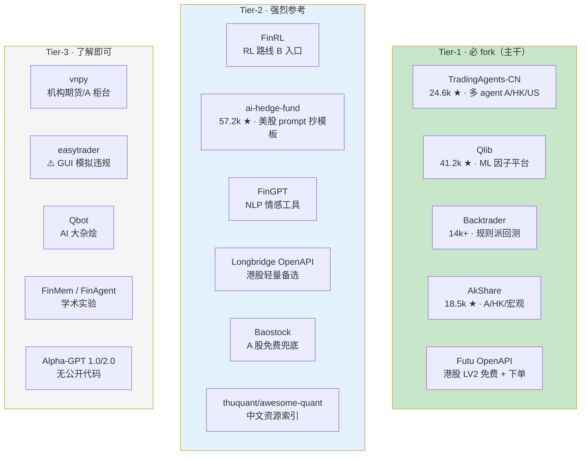
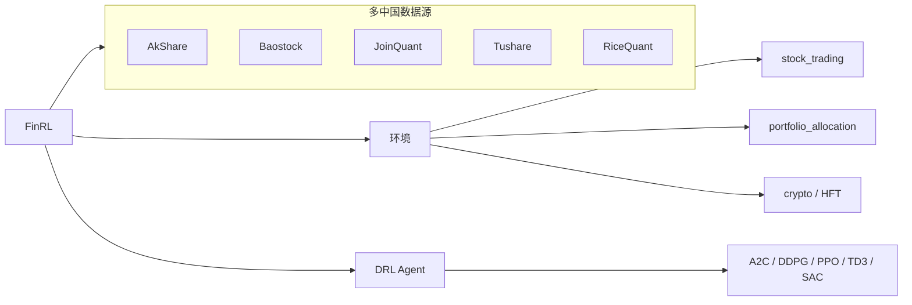
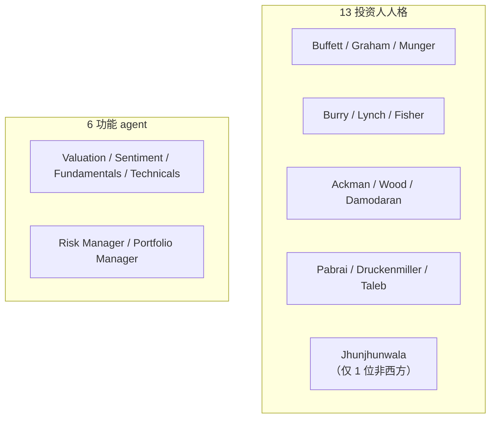
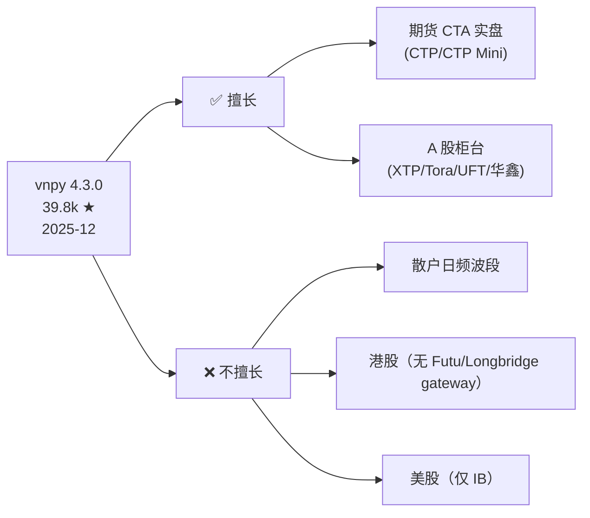
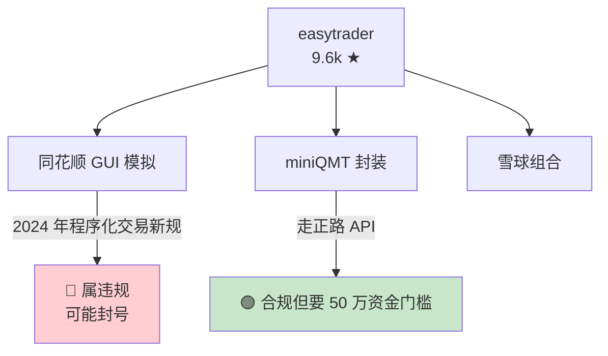
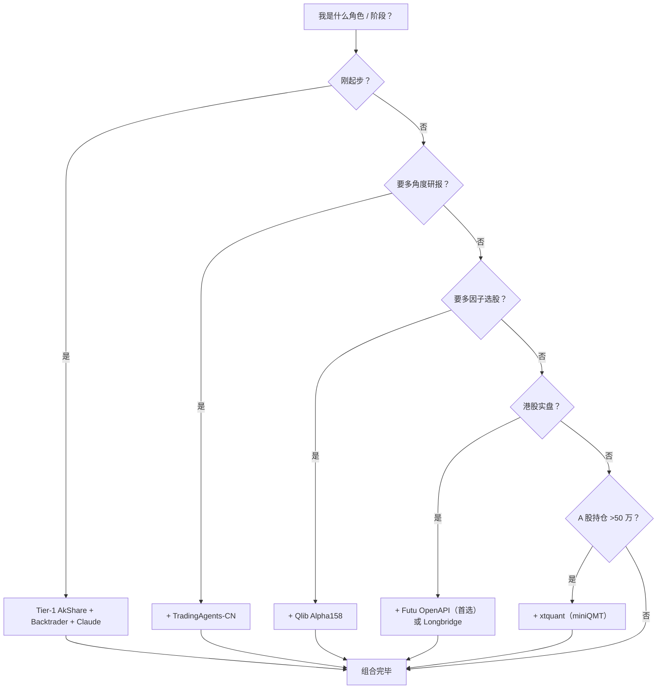
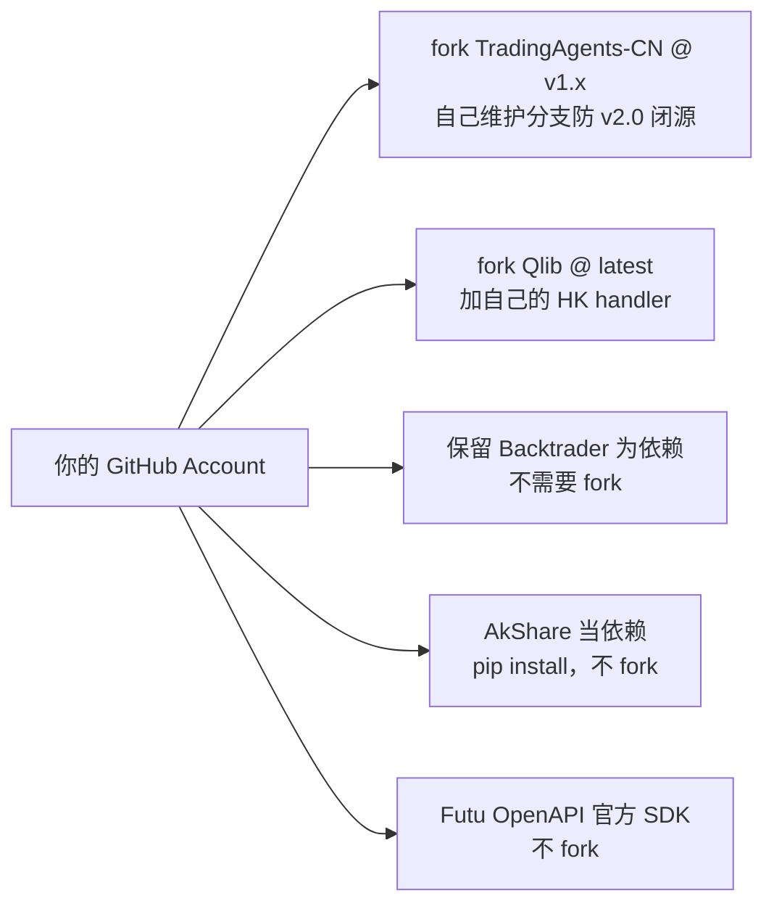
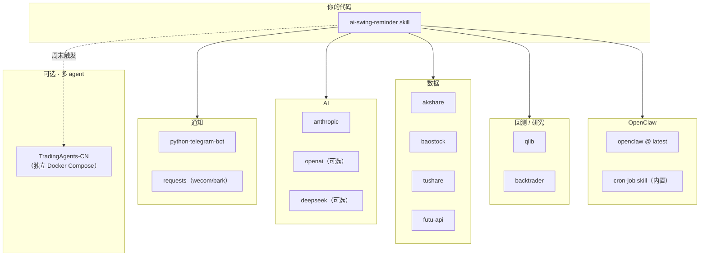

# 开源仓库 Tier 清单

本项目落地要 fork 哪些仓库？本页给出 **Tier-1（必 fork）/ Tier-2（强烈参考）/ Tier-3（了解即可）** 三级清单，附各仓库的活跃度、契合度、踩坑点。

## Tier 结构总览

## Tier-1 · 必 fork（5 个）

### 1. TradingAgents-CN

| 属性 | 值 |
|---|---|
| Stars | 24.6k / fork 5.2k |
| License | Apache-2.0（v2.0 闭源） |
| 契合度 | ★★★★★ |
| 角色 | 路线 C Multi-Agent 研究员 |
| 用法 | 周末/盘前对 watchlist 出多角度研报 |
| 踩坑 | v2.0 将闭源，锁 v1.x；Docker 吃内存 |

详见 [5. TradingAgents-CN 深度解析](5.%20TradingAgents-CN%20深度解析.md)。

### 2. Microsoft Qlib

| 属性 | 值 |
|---|---|
| Stars | 41.2k |
| License | MIT |
| 契合度 | ★★★★☆（港股需自适配） |
| 角色 | 路线 A/B/D 的 ML 基础设施 |
| 用法 | Alpha158 基线 + LightGBM 因子研究 |
| 踩坑 | 港股需 CSV → .bin 转换（一次性） |

**关键配套**：`examples/benchmarks/LightGBM/workflow_config_lightgbm_Alpha158.yaml`——直接跑的 baseline。

### 3. Backtrader

| 属性 | 值 |
|---|---|
| Stars | ~14k |
| License | GPL-3 |
| 契合度 | ★★★★☆（维护停滞但代码完整） |
| 角色 | 规则派波段策略承载 |
| 用法 | Claude 生成策略代码 → 跑这里 |
| 踩坑 | 2019 年后维护停滞；官方无中国数据源适配 |

**关键能力**：OCO / Bracket / StopTrail 订单类型——波段场景用得上。

### 4. AkShare

| 属性 | 值 |
|---|---|
| Stars | 18.5k（2026-04） |
| License | MIT |
| 活跃 | 178 releases，2026 仍每周更新 |
| 契合度 | ★★★★★ |
| 角色 | A+HK+宏观数据统一入口 |
| 踩坑 | 依赖 30+ 上游站点，稳定性风险 |

### 5. Futu OpenAPI (futu-api)

| 属性 | 值 |
|---|---|
| License | 官方 SDK |
| 契合度 | ★★★★★ |
| 角色 | 港股实时行情 + 下单 |
| 杀手锏 | **LV2 免费**（中国大陆个人） |
| 踩坑 | 必须跑 OpenD 本地 daemon 7×24 |

详见 [9. 合规红线与港股下单 API](9.%20合规红线与港股下单%20API.md)。

## Tier-2 · 强烈参考（6 个）

### FinRL（路线 B 入口）

- **优势**：A 股直接支持（5 种数据源），Stable Baselines 3 成熟
- **本项目定位**：波段 + 中级用户暂不用，**未来扩展到组合优化再引入**
- 论文演进：NeurIPS 2018→2020→2022 + Springer 2024 + PAKDD 2026

### ai-hedge-fund (virattt)

- **Stars**: 57.2k（MIT）
- **数据层硬编码美股** → 改造成本 > TradingAgents-CN
- **价值**：**13 投资人 prompt 设计可抄**到 TradingAgents-CN 里

### FinGPT

- **License**: MIT
- **角色**: NLP 辅助工具（不是主策略！）
- **中文最好用模型**: `fingpt-mt_qwen-7b_lora`
- **典型用法**: OpenClaw 的一个 sentiment skill，调 HuggingFace Inference Endpoint 对新闻打情感分

### Longbridge OpenAPI

- **优势**: 无本地 daemon，Python SDK 现代，部署比 Futu 轻
- **劣势**: 社区比 Futu 小，LV2 需付费
- **本项目定位**: Futu 的轻量替代品，或未来扩展到美股再用

### Baostock

- **License**: BSD
- **角色**: A 股免费历史数据兜底
- **限制**: 仅 A 股，不含港股/美股/期货
- **用法**: Tushare 免费档 120 积分不够用时的稳定兜底

### thuquant/awesome-quant

中文量化资源索引（清华量化组）——**80 commits，持续更新**。覆盖：
- 数据: TuShare / AkShare / Wind / JQData / pytdx / fooltrader / zvt
- 回测: Zipline / RQAlpha / QUANTAXIS / Hikyuu / pyalgotrade-cn / StarQuant
- 风险/组合: pyfolio / ffn
- ML/AI: BigQuant / finclaw

**用法**：**fork 作为参考书**，不直接 clone 代码。

## Tier-3 · 了解即可（5 个）

### vnpy (VeighNa)

**未来 A 股期货实盘再考虑**。现阶段过重。

### easytrader (shidenggui)

**本项目不推 easytrader 做下单** —— 详见 [9. 合规红线与港股下单 API](9.%20合规红线与港股下单%20API.md)。

### Qbot (Charmve)

AI + 量化大杂烩（Qlib + RL + UI 混合）——未深度验证，**参考而不依赖**。

### FinMem / FinAgent

学术级代码，实验性质 > 生产价值。适合读论文理解 Multi-Agent 架构。

### Alpha-GPT 1.0 / 2.0

**无公开代码** —— 只能读论文参考思路：
- arXiv:2308.00016（1.0, EMNLP 2025 Demo Track）
- arXiv:2402.09746（2.0, Work in Progress）

## A 股实盘 API 现状速查

**只有在持仓 >50 万时这张表才有意义**：

| 方案 | 资金门槛 | API | 合规 |
|---|---|---|---|
| **xtquant / miniQMT** | 50 万（部分 30 万） | 官方正路 | 需报备 |
| **Ptrade（恒生）** | 100 万 | Python/VBA | 需报备 |
| 机构柜台（O32/金证/华锐） | 500 万 + 私募资质 | C++/FIX | 机构级 |
| easytrader GUI | 无门槛 | GUI 模拟 | 🔴 违规 |

对本项目（纯提醒）**都不需要**。

## 选型决策表

## Fork 策略建议

## 依赖关系图

本项目完整依赖链：

## 本 wiki 涉及仓库汇总

| 页面 | 涉及仓库 |
|---|---|
| [2. 数据源](2.%20A股%20%2B%20港股数据源选型.md) | AkShare / Baostock / Tushare / Futu / Longbridge |
| [3. 回测框架](3.%20回测框架%20Qlib%20与%20Backtrader%20的分工.md) | Qlib / Backtrader / vnpy |
| [4. AI 四路线](4.%20AI%20构建策略的四条路线.md) | FinRL / TradingAgents / FinGPT / FinMem / ai-hedge-fund / Alpha-GPT |
| [5. TradingAgents-CN](5.%20TradingAgents-CN%20深度解析.md) | TradingAgents-CN |
| [8. OpenClaw](8.%20OpenClaw%20承载方案.md) | OpenClaw / ClawHub skills |
| [9. 合规 + 港股 API](9.%20合规红线与港股下单%20API.md) | Futu / Longbridge / Tiger / xtquant / easytrader |

---

[^29]: [[open-source-repos-tier-list|开源仓库 Tier 清单]] · 综合自 Qlib/FinRL/TradingAgents-CN/ai-hedge-fund/vnpy/awesome-quant/easytrader/akshare 等 GitHub README 与社区反馈

## Sources

| # | Title | Raw Note |
|---|-------|----------|
| 29 | 开源仓库 Tier 清单 | [[open-source-repos-tier-list]] |
