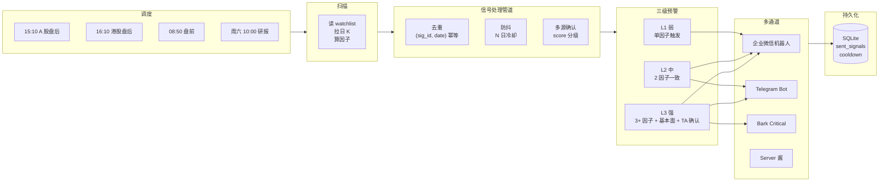
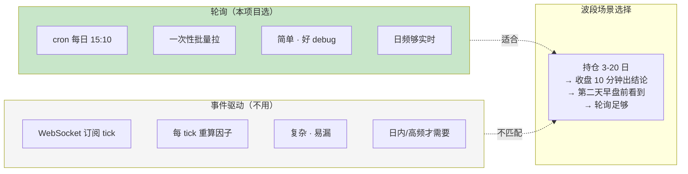
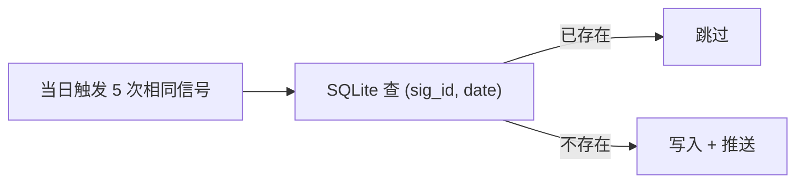
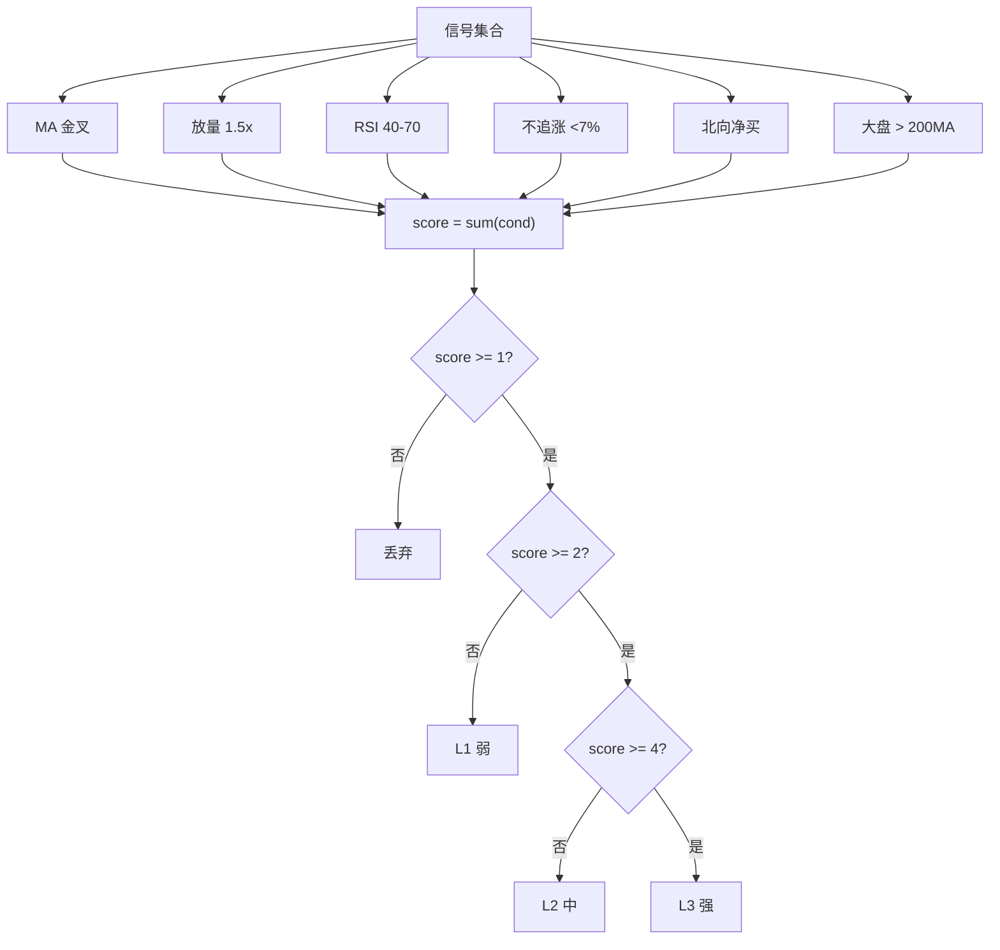
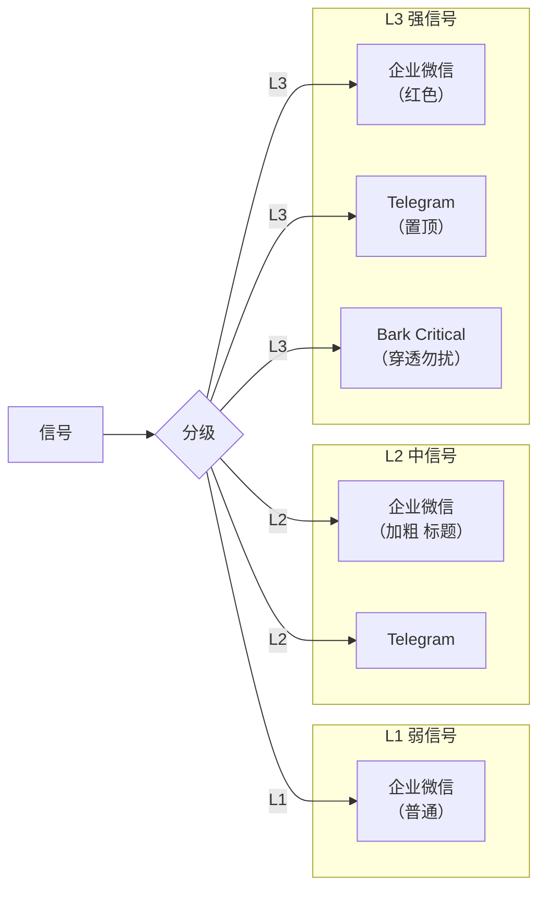
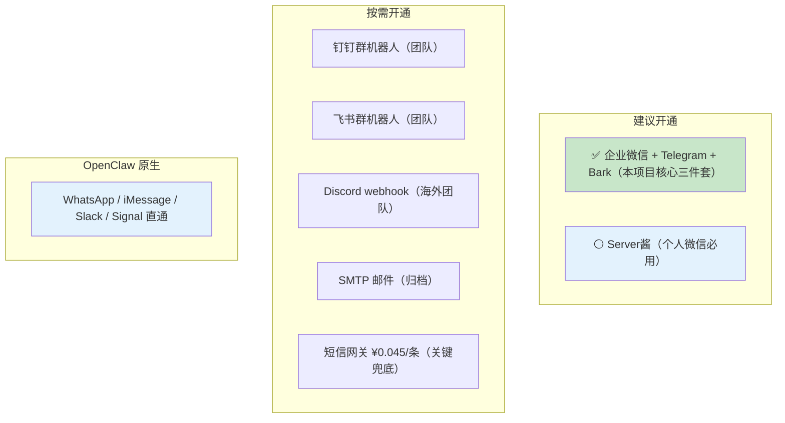
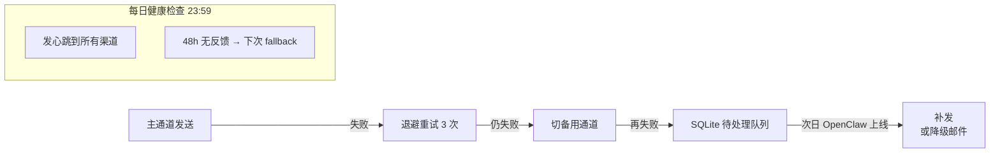

# 信号分发工程架构

策略跑完产出"600519 触发 MA20 突破"——怎么从 Python 变量变成你手机上一条有用的提醒？本页解决 **信号处理 + 推送渠道 + 三级预警 + 可靠性**。

## 整体数据流



## 轮询 vs 事件驱动：为什么选轮询



## 双层 Cron 设计

```mermaid
gantt
    title 典型工作日时间线（Asia/Shanghai）
    dateFormat HH:mm
    axisFormat %H:%M

    section A 股
    08:50 盘前观察 :done, 08:50, 5m
    09:15-09:25 集合竞价 :active, 09:15, 10m
    09:30-11:30 上午 :12:00, 120m
    13:00-15:00 下午 :13:00, 120m
    15:10 盘后扫描 :crit, 15:10, 10m

    section 港股
    09:30-12:00 上午 :09:30, 150m
    13:00-16:00 下午 :13:00, 180m
    16:10 盘后扫描 :crit, 16:10, 10m
```

### 各 cron 的用途

| Cron | 时间 | 任务 |
|---|---|---|
| 盘前观察 | 08:50 Mon-Fri | 昨夜公告 + 北向资金 + 美股影响 |
| A 股扫描 | 15:10 Mon-Fri | 收盘日 K → 波段信号 → 推送 |
| 港股扫描 | 16:10 Mon-Fri | 港股收盘日 K → 波段信号 → 推送 |
| 周末研报 | 10:00 Sat | TradingAgents-CN 对 watchlist 多 agent 分析 |
| 心跳 | 23:59 Every | 健康检查，所有渠道发一条"OK" |

## 信号处理管道（去重 + 防抖 + 多源确认）

### 去重：幂等层



**代码**[^30]：
```python
class SignalDeduper:
    def __init__(self, db_path):
        self.conn = sqlite3.connect(db_path)
        self.conn.execute('''CREATE TABLE IF NOT EXISTS signals
            (sig_id TEXT, date TEXT, PRIMARY KEY (sig_id, date))''')

    def should_send(self, sig_id: str, date: str) -> bool:
        cur = self.conn.execute(
            'SELECT 1 FROM signals WHERE sig_id=? AND date=?', (sig_id, date))
        if cur.fetchone():
            return False
        self.conn.execute('INSERT INTO signals VALUES (?, ?)', (sig_id, date))
        self.conn.commit()
        return True

# sig_id 例: "MA20_breakout_600519_20261010"
```

### 防抖：冷却期

同一标的同一信号类型，N 日内只触发一次——避免"连续 3 天都突破"造成推送疲劳：

```python
def in_cooldown(symbol: str, signal_type: str, cooldown_days: int = 5) -> bool:
    last = get_last_trigger(symbol, signal_type)  # SQLite
    return last and (today - last).days < cooldown_days
```

### 多源确认：score 分级



## 三级预警架构



## 推送渠道全维度对比

### 国内 IM：企业微信群机器人[^30]

**API**:
```http
POST https://qyapi.weixin.qq.com/cgi-bin/webhook/send?key=XXX
{
  "msgtype": "markdown",
  "markdown": {
    "content": "### 盘后信号提醒\n**600519** 贵州茅台\n- 突破 20 日高\n- 成交量放大 2 倍"
  }
}
```

**限频（重要！）**:
- **每机器人每分钟 20 条**，超限返回 `errcode=45009`
- Markdown 最长 **4096 字节 UTF-8**
- 文本最长 **2048 字节**

**避坑**:
- `<font color="info">` 颜色标签受限
- webhook URL 写环境变量，勿硬编码
- 可后台配 IP 白名单

**指数退避重试模板**：
```python
def send_with_retry(url, data, max_retries=3):
    for i in range(max_retries):
        r = requests.post(url, json=data, timeout=10)
        if r.status_code == 200 and r.json().get('errcode') == 0:
            return True
        time.sleep(2 ** i)
    return False
```

### 海外 IM：Telegram Bot

**API**：
```http
POST https://api.telegram.org/bot<TOKEN>/sendMessage
{
  "chat_id": -1001234567890,
  "text": "*600519* 贵州茅台触发信号\n价格 1850",
  "parse_mode": "MarkdownV2"
}
```

**Token 获取**：与 `@BotFather` 对话 `/newbot`，Token 格式 `123456:ABC-DEF...`。

**限频**（实践经验）:
- 同一 chat 每秒 1 条
- 全局每秒 30 条
- 群里每分钟 20 条

**Parse mode**：`Markdown` / `MarkdownV2` / `HTML`

**推荐库**：
| 库 | 风格 |
|---|---|
| `python-telegram-bot` | 最成熟 |
| `aiogram` | 纯 async |
| `pyrogram` | MTProto 底层（bot + user 账号） |

**注意**：Telegram 在中国大陆**需代理**访问——这是为什么 OpenClaw VPS 放香港而不是大陆[^30]。

### iOS 专属：Bark

**API（URL 即 API）**:
```bash
curl https://api.day.app/<KEY>/<TITLE>/<BODY>?level=critical&sound=call
```

**特色**:
- `level=critical` —— **穿透 iOS 勿扰模式**
- `level=timeSensitive` —— Focus 模式可见
- `sound=call` —— 重复响铃 30 秒
- `ciphertext` 加密推送
- 可 **self-host**（`bark-server` Docker）

**本项目用法**：L3 强信号的"必须看见"通道。

### 国内移动：Server 酱

目标：**个人微信** / 企业微信 / 钉钉群 / 飞书群 / 手机 App

**API**:
```http
POST https://sctapi.ftqq.com/<SendKey>.send
{"title": "...", "desp": "..."}
```

**层级**：免费版每月约 500 次；Turbo 版付费扩展通道

**用法**：**个人微信 push 的最方便路径**（个人微信不开放 bot API）

### 其他



## 渠道矩阵（按用户场景）

| 用户场景 | 主 | 副 | L3 专用 |
|---|---|---|---|
| 中国大陆 + iOS | **企业微信** | Server 酱 | **Bark Critical** |
| 中国大陆 + Android | **企业微信** | PushPlus / Server 酱 | Server 酱 + 钉钉 |
| 大陆 + 海外 | **Telegram (代理)** + 企业微信 | Server 酱 | Bark |
| OpenClaw 已接 IM | **OpenClaw 原生 WhatsApp/iMessage** | Telegram | Bark |

## 生产级 Notifier 代码骨架

完整分级 + 去重 + 防抖 + 重试的代码[^30]：

```python
# notifier.py
import os, time, sqlite3, requests
from datetime import datetime, date
from dataclasses import dataclass
from typing import Literal

@dataclass
class Signal:
    symbol: str          # "600519.SH" / "0700.HK"
    signal_id: str       # "ma20_breakout" / "volume_surge_2x"
    level: Literal[1, 2, 3]
    title: str
    body: str            # Markdown
    score: int           # 多源确认 score
    extra: dict = None

class Notifier:
    def __init__(self, config: dict, db_path: str):
        self.cfg = config
        self.db = sqlite3.connect(db_path)
        self._init_db()

    def _init_db(self):
        self.db.execute('''CREATE TABLE IF NOT EXISTS sent_signals
            (sig_id TEXT, symbol TEXT, date TEXT, level INT, ts TEXT,
             PRIMARY KEY (sig_id, symbol, date))''')

    def _dedup_ok(self, sig: Signal) -> bool:
        today = date.today().isoformat()
        row = self.db.execute(
            "SELECT 1 FROM sent_signals WHERE sig_id=? AND symbol=? AND date=?",
            (sig.signal_id, sig.symbol, today)).fetchone()
        return row is None

    def _cooldown_ok(self, sig: Signal, days: int = 5) -> bool:
        row = self.db.execute(
            "SELECT MAX(date) FROM sent_signals WHERE sig_id=? AND symbol=?",
            (sig.signal_id, sig.symbol)).fetchone()
        if not row[0]: return True
        last = datetime.strptime(row[0], "%Y-%m-%d").date()
        return (date.today() - last).days >= days

    def _mark_sent(self, sig: Signal):
        self.db.execute(
            "INSERT OR REPLACE INTO sent_signals VALUES (?,?,?,?,?)",
            (sig.signal_id, sig.symbol, date.today().isoformat(),
             sig.level, datetime.now().isoformat()))
        self.db.commit()

    def _telegram(self, sig: Signal):
        token, chat_id = self.cfg['telegram']['token'], self.cfg['telegram']['chat_id']
        requests.post(f"https://api.telegram.org/bot{token}/sendMessage",
            json={"chat_id": chat_id,
                  "text": f"*{sig.title}*\n{sig.body}",
                  "parse_mode": "Markdown"}, timeout=10)

    def _wecom(self, sig: Signal):
        url = self.cfg['wecom']['webhook']
        for attempt in range(3):
            r = requests.post(url, json={
                "msgtype": "markdown",
                "markdown": {"content": f"### {sig.title}\n{sig.body}"}}, timeout=10)
            if r.status_code == 200 and r.json().get('errcode') == 0:
                return
            time.sleep(2 ** attempt)

    def _bark_critical(self, sig: Signal):
        key = self.cfg['bark']['key']
        requests.get(f"https://api.day.app/{key}/{sig.title}/{sig.body}",
                     params={"level": "critical" if sig.level == 3 else "timeSensitive",
                             "sound": "call" if sig.level == 3 else "default"},
                     timeout=10)

    def dispatch(self, sig: Signal, force: bool = False):
        if not force:
            if not self._dedup_ok(sig) or not self._cooldown_ok(sig):
                return False

        if sig.level >= 1: self._wecom(sig)
        if sig.level >= 2: self._telegram(sig)
        if sig.level >= 3: self._bark_critical(sig)

        self._mark_sent(sig)
        return True
```

## 故障兜底设计



## 推送消息模板

```markdown
📈 **0700.HK 腾讯控股** 触发突破信号 `L2`

**行情**
- 当前价：315.40 (+2.1%)
- 日内量能：2.3× 20 日均量
- RSI(14)：58

**信号**
- ✅ 突破 60 日均线
- ✅ 量能放大 >1.5×
- ✅ RSI 未超买

**建议**
- 仓位建议：8%（组合当前 45%）
- 止损：310 (-1.7%)
- 止盈：340 (+7.8%) 或 20 日回吐
- 有效期：30 分钟

[⬇️ 港股下单]
/tc_BUY_0700_100_315
/tc_IGNORE
```

触发的 `/tc_*` 交互模式见 [9. 合规红线与港股下单 API](9.%20合规红线与港股下单%20API.md)。

## 下一步

信号设计完后要"塞进 OpenClaw"跑起来——见 [8. OpenClaw 承载方案](8.%20OpenClaw%20承载方案.md)。

---

[^30]: [[signal-dispatch-architecture|信号分发工程架构]] · 综合自 [Telegram Bot API](https://core.telegram.org/bots/api) · [Bark GitHub](https://github.com/Finb/Bark) · [Server 酱](https://sct.ftqq.com/) · 企业微信机器人 API 文档

## Sources

| # | Title | Raw Note |
|---|-------|----------|
| 30 | 信号分发工程架构 | [[signal-dispatch-architecture]] |
