# OpenClaw 承载方案

策略 + 信号 + 通知层都想好了，**最后一公里**是怎么让它 7×24 在线自动跑。本页解决 **Skill 机制 + Cron 调度 + 数据持久化 + VPS 选型**。

## OpenClaw 的角色与边界

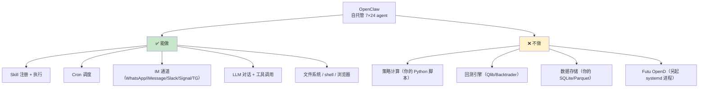

**核心理解**：OpenClaw 是**一个壳 + 调度器 + IM 出口**。真正的策略逻辑在你自己写的 Python scripts 里，OpenClaw 负责"到点调起来"+"把结果推到 IM"。

## SKILL.md 格式（本项目核心）[^31]

### 完整示例

```markdown
---
name: ai-swing-reminder
description: 扫描 watchlist 的波段信号，触发时推送提醒。关键词：盘后扫描、每日信号、波段提醒
version: 0.1.0
user-invocable: true
metadata: {"openclaw":{"requires":{"bins":["python3"],"env":["AKSHARE_OK","WECOM_WEBHOOK","TELEGRAM_BOT_TOKEN","TELEGRAM_CHAT_ID"]},"primaryEnv":"AKSHARE_OK"}}
---

# 波段提醒 Skill

## 用户调用方式
- `/ai-swing-reminder` → 立即扫描当前日
- `/ai-swing-reminder backtest --symbol 600519` → 单股票回测
- `/ai-swing-reminder update-watchlist --add 300750` → 维护池
- Cron: 每日 15:10 / 16:10 自动运行

## 步骤（扫描模式）
1. 读 watchlist: `cat {baseDir}/references/watchlist.md`
2. 扫描: `python3 {baseDir}/scripts/daily_scan.py --watchlist {baseDir}/references/watchlist.md --params {baseDir}/references/strategy-params.yaml --output /tmp/signals-$(date +%Y%m%d).json`
3. 推送: `python3 {baseDir}/scripts/notify.py --input /tmp/signals-$(date +%Y%m%d).json --channels wecom,telegram`
4. 汇报：扫描总数 / 触发数 / 推送渠道 / 耗时

## 错误处理
- 数据源失败：AkShare 失败 fallback Baostock（A 股）/ Futu OpenAPI（港股）
- 企业微信失败：Server 酱 fallback
- 失败写 /tmp/openclaw-errors-$(date +%Y%m%d).log
```

### Frontmatter 字段清单

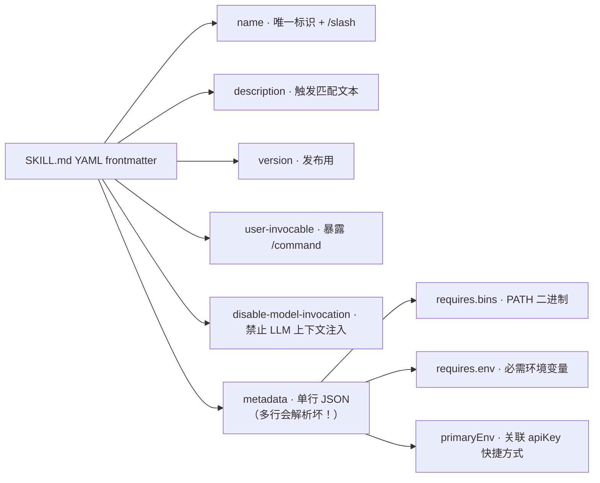

**关键踩坑**：`metadata` 必须**单行 JSON**，加换行就炸。

## Skill 目录结构（规范）

```
~/.openclaw/skills/ai-swing-reminder/
├── SKILL.md                # 唯一必需文件
├── scripts/                # 被执行（不读入 context）
│   ├── daily_scan.py
│   ├── backtest_strategy.py
│   ├── walk_forward.py
│   └── notify.py
├── references/             # 按需被 agent 读入 context
│   ├── watchlist.md
│   ├── strategy-params.yaml
│   └── prompt-templates.md
└── assets/                 # 不入 context（模板/静态）
    └── signal-template.md
```

### 三种目录的区别

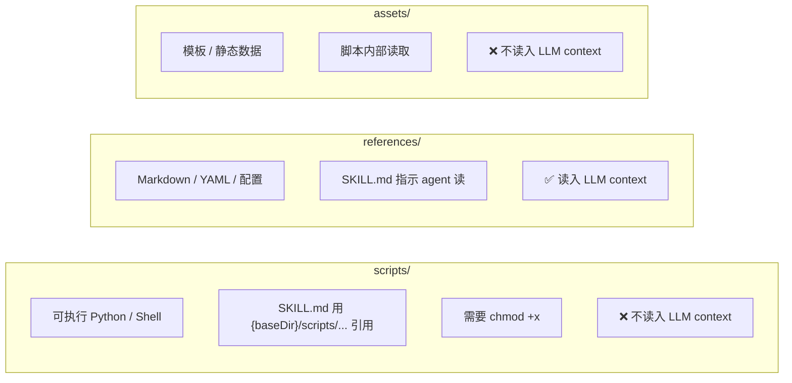

## Skill 加载优先级

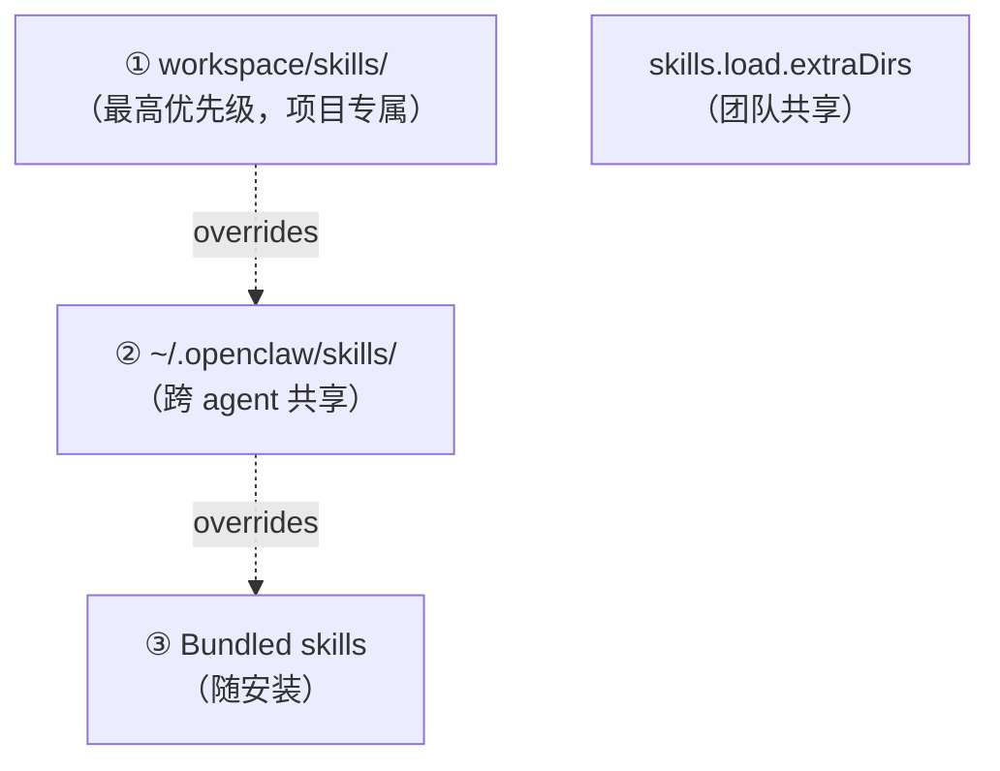

## Secrets 管理

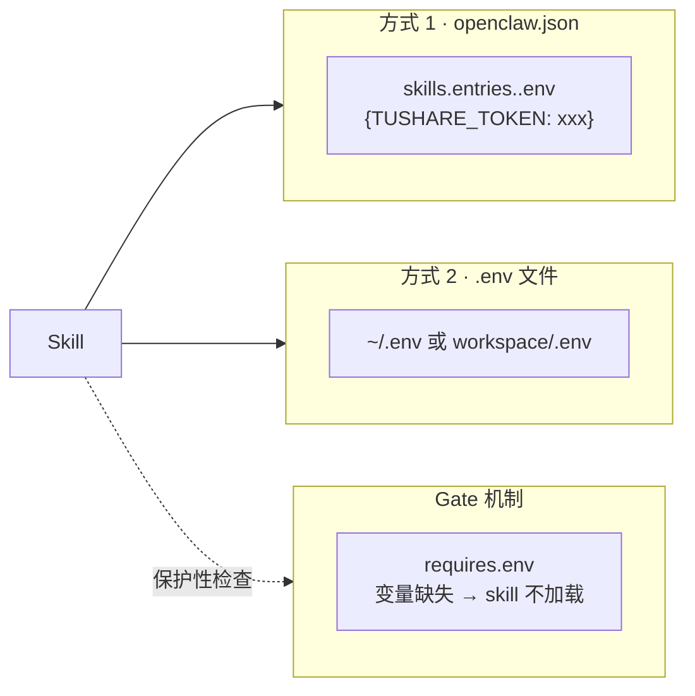

**openclaw.json 示例**：
```json
{
  "skills": {
    "entries": {
      "ai-swing-reminder": {
        "enabled": true,
        "env": {
          "TUSHARE_TOKEN": "your-token",
          "TELEGRAM_BOT_TOKEN": "123:ABC",
          "WECOM_WEBHOOK": "https://qyapi.weixin.qq.com/..."
        }
      }
    }
  }
}
```

## Cron 调度引擎[^31]

### 启用内置 cron skill

```bash
claw skill enable cron-job
# 或
clawhub install cron-job
```

### 添加任务

```bash
# A 股盘后扫描
openclaw cron add \
  --name "a-share-daily-scan" \
  --cron "10 15 * * 1-5" \
  --channel wecom,telegram \
  --message "/ai-swing-reminder market=a-share"

# 港股盘后扫描
openclaw cron add \
  --name "hk-daily-scan" \
  --cron "10 16 * * 1-5" \
  --message "/ai-swing-reminder market=hk"

# 周末研报
openclaw cron add \
  --name "weekend-research" \
  --cron "0 10 * * 6" \
  --message "/tradingagents-cn-watchlist-review"

# 每日心跳
openclaw cron add \
  --name "daily-heartbeat" \
  --cron "59 23 * * *" \
  --message "/heartbeat"
```

### Cron 存储

```
~/.openclaw/cron/
├── jobs.json                        # 任务定义
└── runs/
    ├── a-share-daily-scan.jsonl     # 执行日志
    ├── hk-daily-scan.jsonl
    └── ...
```

**日志排错**：`jsonl` 格式，每行一条执行记录（时间戳 + 状态 + 输出）。

### 独立会话 vs 主会话

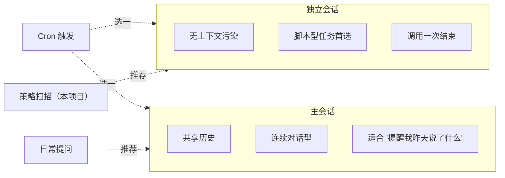

**本项目所有 cron 用独立会话**——脚本跑完就退，不污染对话。

## 数据持久化选型[^31]

### 需求分解

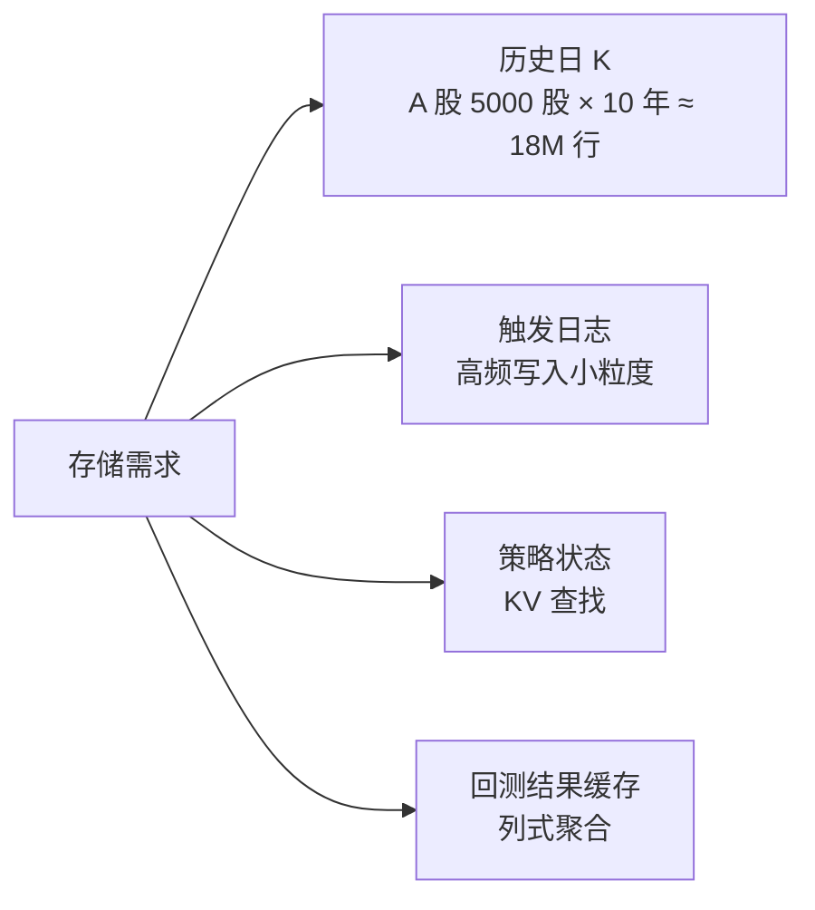

### 三方案对比

| 维度 | **SQLite** | **Parquet (pyarrow)** | **DuckDB** |
|---|---|---|---|
| 安装 | Python 自带 | `pip install pyarrow` | `pip install duckdb` |
| 架构 | 行式，文件级 | 列式，文件级 | 列式，进程内 |
| 事务 | ✅ ACID | ❌ | ✅ |
| 频繁写入 | ✅ | ❌（append 需 rewrite） | ✅ |
| 分析性能 | 🟡 | ✅✅ | ✅✅✅ |
| 时序 rolling | 🟡 | 依赖 Python | ✅ 原生 |
| 压缩率 | 中 | **最优** | 读 Parquet |
| 适合规模 | GB 级 | TB 级 | TB 级 |

### 混合架构（本项目推荐）

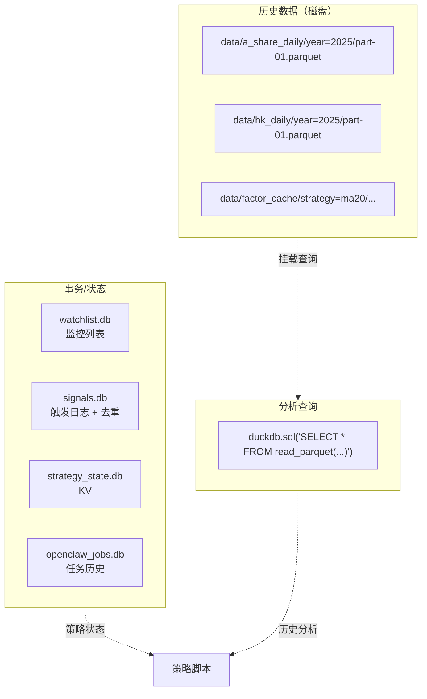

**核心理念**：**事务 用 SQLite，历史 用 Parquet，分析 用 DuckDB 读 Parquet**。

## VPS 选型（关键！）[^31]

### 数据源与 IP 地域约束

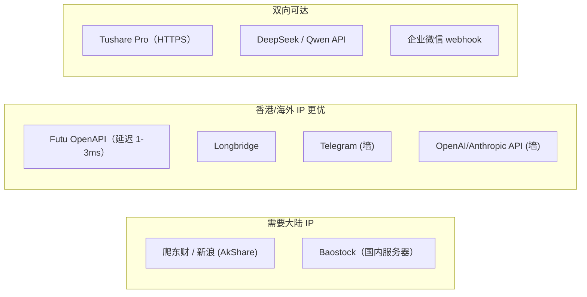

### 单节点 vs 双节点

**方案 A · 单海外节点（推荐）**
- 腾讯云/阿里云香港轻量（4核4G, $12/月）
- AkShare 爬国内稍延迟但日频够用
- Futu 就近接入
- Telegram / OpenAI 直通
- **月开销 ≈ $12**

**方案 B · 双节点（生产进阶）**
- 节点 1 大陆：Tushare / AkShare / Baostock 爬取 + 数据分析
- 节点 2 香港：OpenClaw + Futu + Telegram + LLM
- Tailscale / WireGuard 打通，每晚同步数据
- **月开销 ≈ $12 (HK) + ¥30 (大陆) = ¥110**

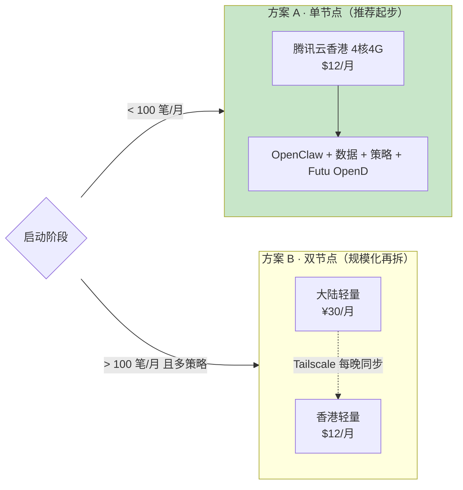

### 云服务商对比

| 云 | 香港 | 大陆→香港延迟 | 香港→Futu 延迟 | 入门价 |
|---|---|---|---|---|
| **腾讯云轻量香港** | ✅ | 20-40ms | **1-3ms**（富途合作） | $12/月 |
| 阿里云香港 | ✅ | 30-50ms (CN2) | 5-10ms | $15/月 |
| Vultr HK | ✅ | 50-80ms | 5-15ms | $6/月 |
| Digital Ocean SG | ✅ | 80-120ms | 10-20ms | $6/月 |

**推荐**：腾讯云轻量香港（和富途合作，延迟最低）。

## Futu OpenD 部署

`OpenD` 必须 **7×24 在线**——systemd 是标准做法：

```ini
# /etc/systemd/system/futu-opend.service
[Unit]
Description=Futu OpenD
After=network.target

[Service]
Type=simple
User=openclaw
ExecStart=/opt/OpenD/OpenD \
    --login_account=xxx \
    --login_pwd=xxx \
    --lang=en \
    --console_log=all
Restart=always
RestartSec=30

[Install]
WantedBy=multi-user.target
```

```bash
sudo systemctl enable --now futu-opend
sudo systemctl status futu-opend
journalctl -u futu-opend -f  # 看日志
```

## 完整架构图（本项目生产部署）

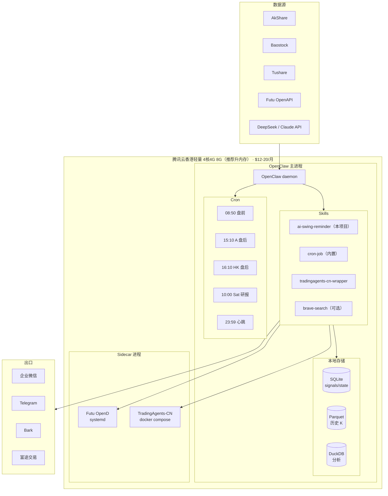

## 踩坑清单（生产经验）

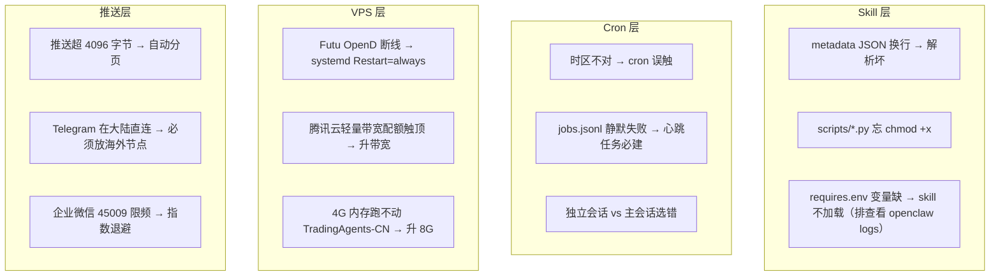

## 热重载 & 快速迭代

`skills.load.watch` 开启后，**Skill 文件改动立即生效**（下一个 agent turn）。调试效率大幅提升。

## 下一步

承载方案定完后就是**港股下单**——见 [9. 合规红线与港股下单 API](9.%20合规红线与港股下单%20API.md)。

---

[^31]: [[openclaw-hosting-architecture|OpenClaw 承载方案]] · 综合自 [OpenClaw Skill 教程](https://2048ai.net/69a28da454b52172bc5e1758.html) · [OpenClaw 实战指南 CSDN](https://blog.csdn.net/quyixiao/article/details/160382493) · [定时任务全攻略 阿里云](https://developer.aliyun.com/article/1718611) · [openclaw.ai](https://openclaw.ai/)

## Sources

| # | Title | Raw Note |
|---|-------|----------|
| 31 | OpenClaw 承载方案 | [[openclaw-hosting-architecture]] |
