# 合规红线与港股下单 API

本页分两个 part：**①A 股为什么只能提醒不能下单**（2024 新规的合规红线），**②港股下单 API 三家对比**（Futu / Longbridge / Tiger）+ **半自动工作流**。

## Part 1 · A 股合规红线

### 法规时间线

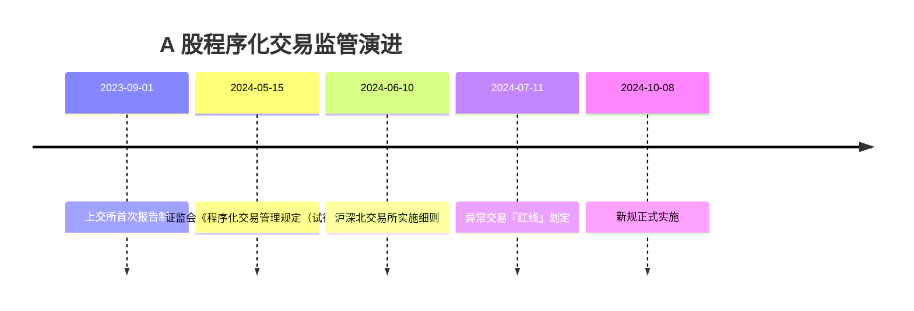

**源**：证监会 2024 年 8 号公告 + 国务院公报[^32]

### 定义：程序化交易 = 计算机程序自动生成或执行交易指令

**关键澄清**：
- 个人投资者**同等适用**（很多人以为只管私募）
- 高频认定：申报 **≥ 300 笔/秒** 或 单日 **≥ 20000 笔**（本项目日频不触发）
- "先报告后交易"原则 —— 未报备直接跑策略 = 违规

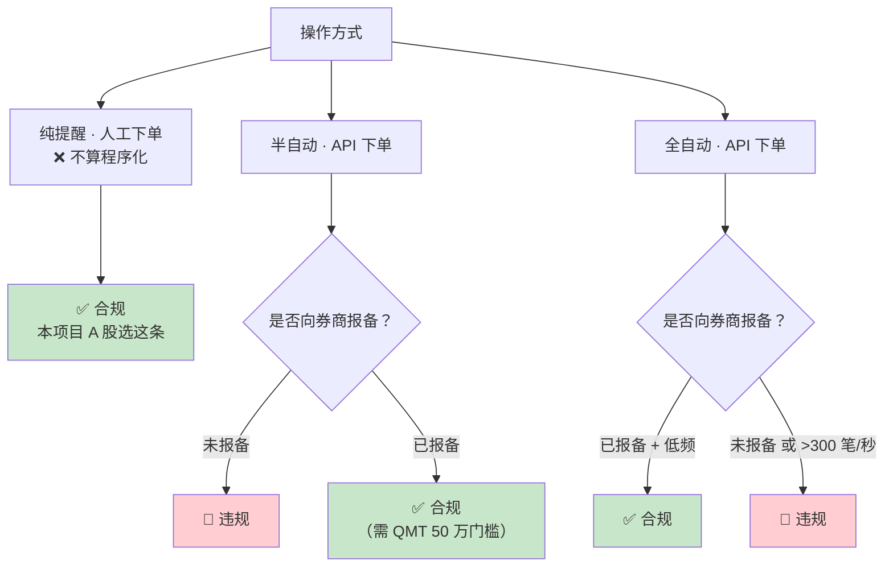

### 异常交易红线（禁止行为）[^32]

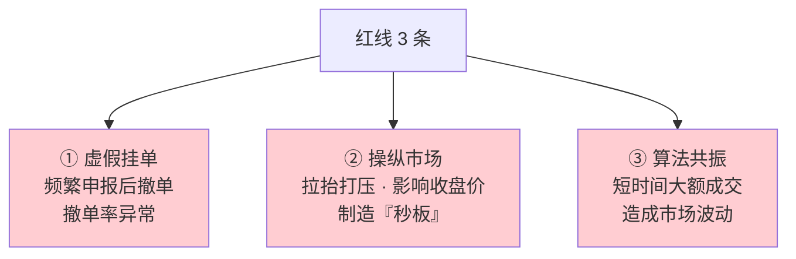

### 本项目为什么推荐"纯提醒"

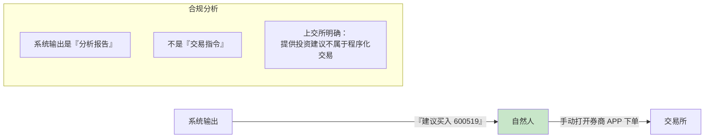

**原则**：
> **对自己操作给出建议从古至今都合法。代替别人做决定需要持牌。让机器代替自己做决定需要报备。本项目是第一种。**

### A 股进阶合规路径（未来扩展）

如果账户持仓 ≥ 50 万，可开通券商 miniQMT（`xtquant`）：

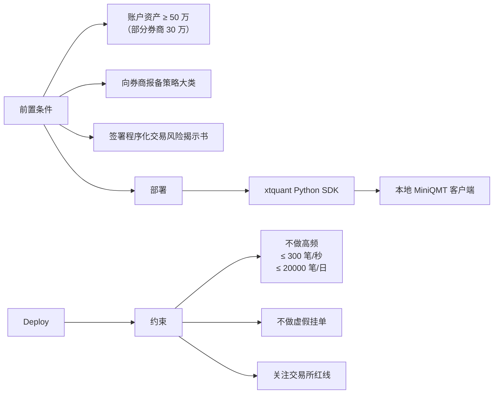

**各方案门槛**：

| 方案 | 资金门槛 | API | 适用 |
|---|---|---|---|
| xtquant / miniQMT | 50 万 | Python，免费 | 散户合法路径 |
| Ptrade（恒生） | 100 万 | Python/VBA | 中高净值 |
| 机构柜台（O32/金证） | 500 万 + 私募资质 | C++/FIX | 机构 |
| easytrader GUI 模拟 | 无门槛 | GUI 模拟 | **🔴 违规** |

### easytrader 不推荐的原因

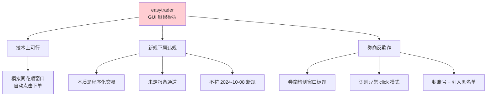

## Part 2 · 港股下单 API 全维度对比

### 三家基本盘

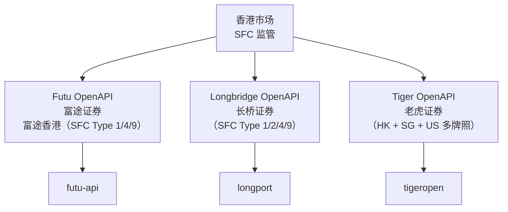

### 全维度对比表[^32]

| 维度 | **Futu** | **Longbridge** | **Tiger** |
|---|---|---|---|
| **Python SDK** | `futu-api` | `longport` | `tigeropen` |
| **本地 daemon** | ✅ 需 **OpenD** | ❌ | ❌ |
| **市场** | HK/US/CN-A/SG/JP/AU | HK/US/CN-A/SG | HK/US/SG/AU/CN-A |
| **港股 LV2** | **✅ 大陆个人免费** | 需付费 | 需付费 |
| **开户门槛** | HKD 10000 | 无最低（建议 10000+） | USD 3000 / HKD 25000 |
| **港股佣金** | 0.03% 最低 **3 HKD** | 0.03% 最低 **3 HKD** | 0.03% 最低 **7 HKD** |
| **订单类型** | 市/限/止损/条件/特殊 HK | 市/限/到价 Stop/追踪止损 | MKT/LMT/STP/STP_LMT/Trailing |
| **架构** | TCP via OpenD | REST + WebSocket | REST + WebSocket |
| **行情限频** | ~30/s | 1s ≤ 10 次，并发 ≤ 5 | 60-120/min |
| **交易限频** | 宽松 | 30s ≤ 30 次，间隔 ≥ 0.02s | 中等 |
| **SDK 内置限流** | 🟡 部分 | 行情 ✅，交易 **❌** | 🟡 |
| **错误码** | 自定义 | 返回 `301606` | HTTP 标准 |
| **社区** | ✅ 最大 | 🟡 中等 | 🟡 中等 |
| **下单额外费** | ✅ 无 | ✅ 无 | ✅ 无 |

### 决策树

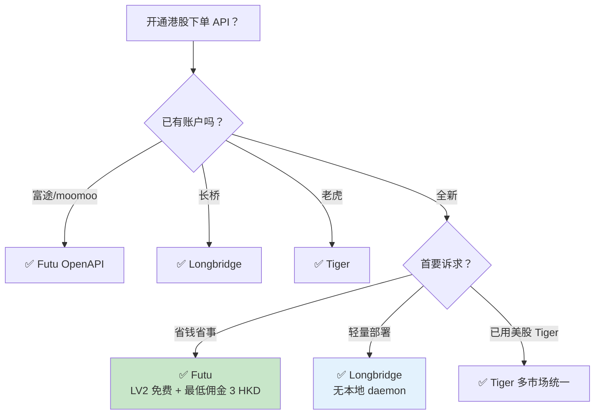

### Longbridge 完整代码示例[^32]

**限价买入**：
```python
from longbridge.openapi import TradeContext, Config, OrderSide, OrderType, TimeInForceType

config = Config.from_env()   # 读 LONGPORT_APP_KEY / SECRET / ACCESS_TOKEN
ctx = TradeContext(config)

ctx.submit_order(
    symbol="0700.HK",
    order_type=OrderType.Limit,
    side=OrderSide.Buy,
    submitted_price=300.0,
    submitted_quantity=100,
    time_in_force=TimeInForceType.Day,
)
```

**到价触发的限价单（条件单）**：
```python
ctx.submit_order(
    symbol="0700.HK",
    order_type=OrderType.Limit,
    side=OrderSide.Buy,
    submitted_price=310.0,
    submitted_quantity=100,
    time_in_force=TimeInForceType.Day,
    trigger_price=310.0,
    trigger_at="last"
)
```

### Longbridge 限流陷阱（踩坑必读）

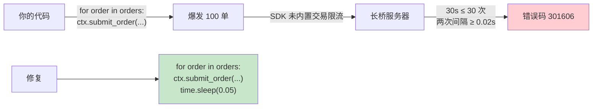

多子账户需**独立计频**（每账户单独 counter）。

### Futu OpenD 部署注意（已在 [8. OpenClaw 承载方案](8.%20OpenClaw%20承载方案.md) 详述）

关键点重申：
- OpenD **必须 7×24 在线**
- systemd 配置 `Restart=always`
- 富途服务器定期维护会断 OpenD，代码要处理重连

## Part 3 · 半自动工作流（提醒 → 确认 → 下单）

### 完整 Flow

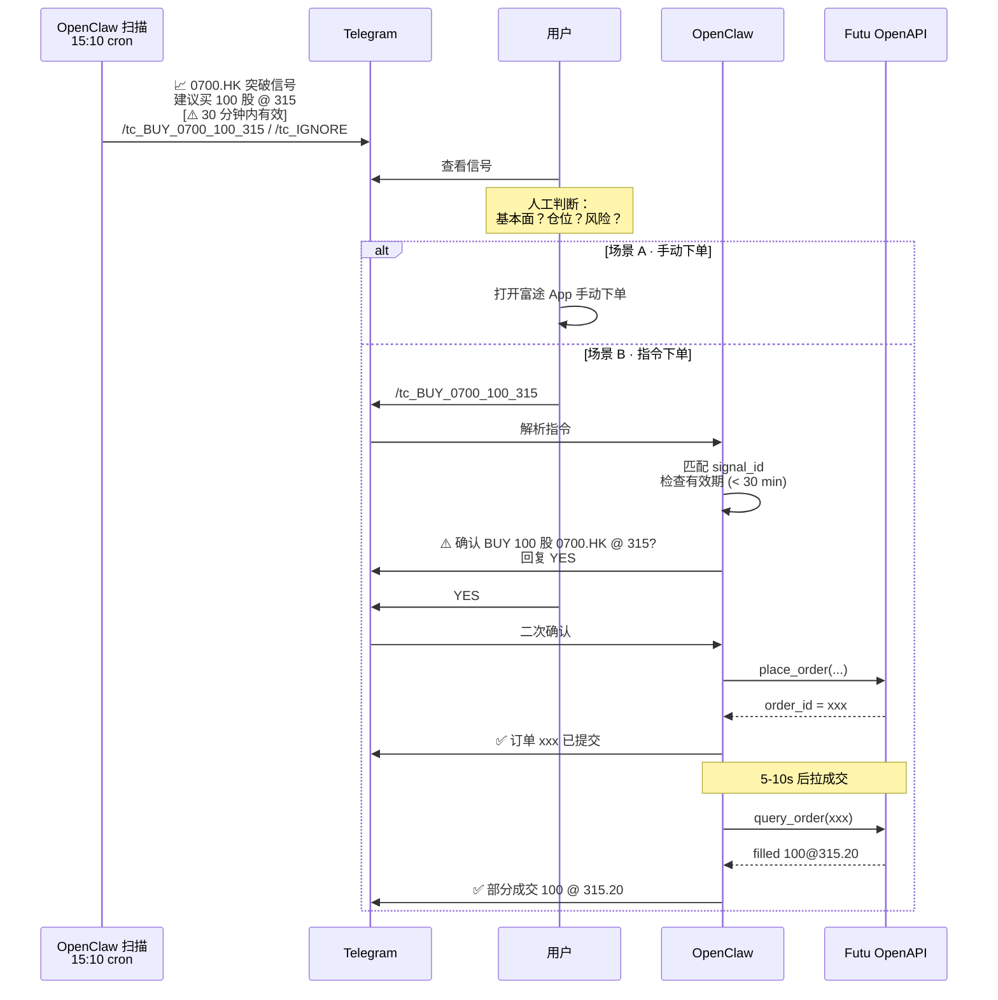

### 为什么一定要人工确认这一步

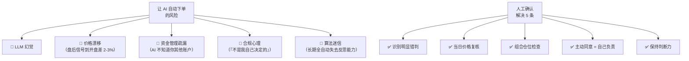

### `/tc_*` 指令解析代码

```python
# skill 里的 message handler
@skill_handler(r"^/tc_")
def on_trade_confirm(cmd: str, ctx: ChatContext):
    # "/tc_BUY_0700.HK_100_315"
    parts = cmd[4:].split("_")
    if len(parts) != 4:
        return "❌ 指令格式错误"
    action, symbol, qty_str, price_str = parts
    qty, price = int(qty_str), float(price_str)

    # 有效期检查（30 分钟）
    signal = load_signal(symbol)
    if not signal:
        return "❌ 找不到对应信号"
    if (now() - signal.ts).total_seconds() > 1800:
        return "⏱️ 信号已过期（30 分钟），请重新扫描"

    # 二次确认
    ctx.reply(f"⚠️ 确认 {action} {qty} {symbol} @ {price}？\n回复 YES 提交")
    reply = ctx.await_reply(timeout=60)
    if reply != "YES":
        return "已取消"

    # 现金与持仓预检
    account = futu_client.get_account_info()
    if action == "BUY" and account.cash < qty * price:
        return f"❌ 现金不足（{account.cash:.0f} < {qty * price:.0f}）"

    # 下单
    try:
        order = futu_client.place_order(
            symbol=symbol, action=action, qty=qty,
            price=price, order_type="NORMAL", time_in_force="DAY"
        )
        return f"✅ 订单 {order.order_id} 已提交"
    except FutuApiError as e:
        return f"❌ 下单失败：{e}"
```

## 避坑清单（中国大陆投资者跨境操作）

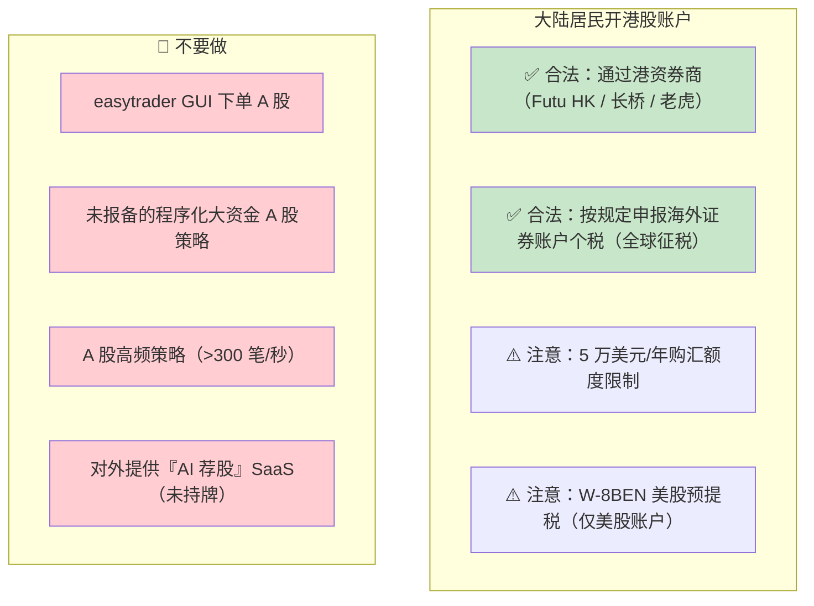

## 港股 API 选型最终建议

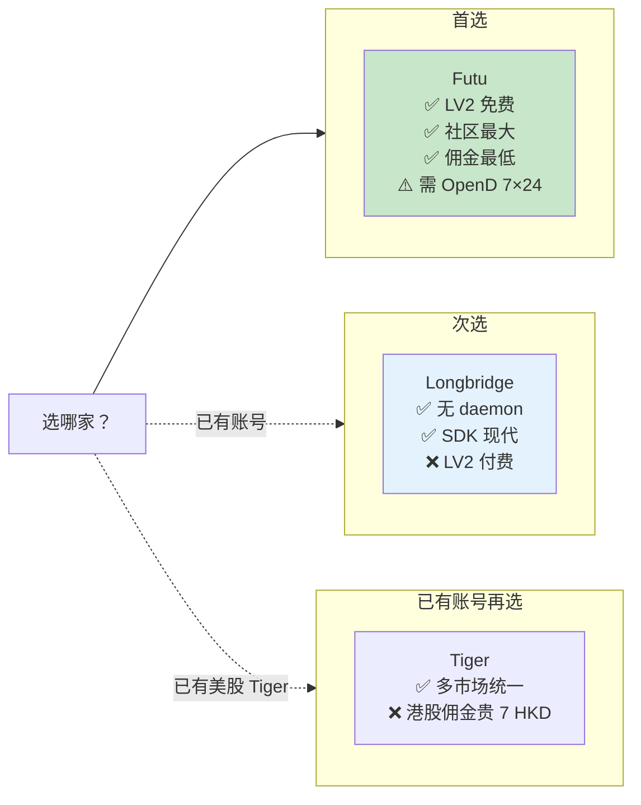

## 下一步

7 个关键子系统讲完，收尾看**端到端的完整 pipeline 模板** —— [10. 端到端 Pipeline 模板](10.%20端到端%20Pipeline%20模板.md)。

---

[^32]: [[compliance-and-hk-trading-api|合规红线与港股下单 API]] · 综合自 [证监会《程序化交易管理规定》](https://www.csrc.gov.cn/csrc/c100028/c7480577/content.shtml) · [国务院公报](https://www.gov.cn/gongbao/2024/issue_11426/202406/content_6959680.html) · [证监会异常交易红线](https://mrdx.cn/h5/mrdx/content/20240711/Articel05006GN.htm) · [Longbridge 官方文档](https://open.longportapp.cn/zh-CN/docs/index) · [Futu OpenAPI](https://openapi.futunn.com/) · [Tiger OpenAPI Python SDK](https://github.com/tigerfintech/openapi-python-sdk)

## Sources

| # | Title | Raw Note |
|---|-------|----------|
| 32 | 合规红线与港股下单 API | [[compliance-and-hk-trading-api]] |
