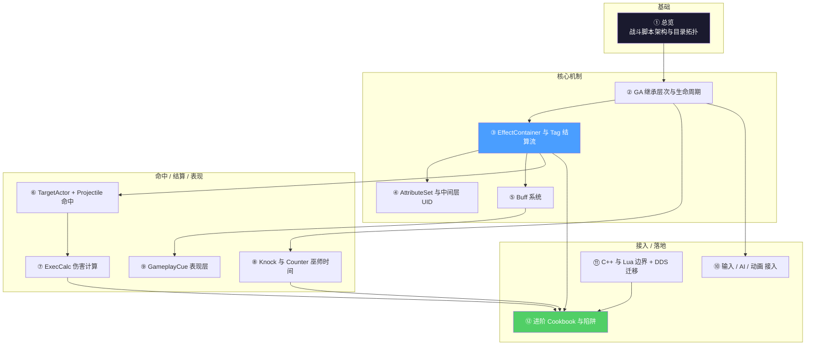

# HiGame 战斗脚本架构 — 总览

> 本 wiki 为 **AI 编程助手**(Claude / CodeBuddy / Cursor)与新加入的战斗开发者准备,把 HiGame 项目(UE5.5.4 + UnLua + GAS,DDS 架构)的战斗脚本层全部技术细节压缩成 12 页有图、有代码、可执行的指南。读者读完后,应当能在没有人指导的情况下,产出一个符合项目规范的新技能(GA + GE + Buff + Cue + 配置)。
>
> **研究方法**:本项目以**本地代码考古**替代 km-websearch 的 web fetch,信息来源为 P4 工作区的项目代码与 C++ 头文件,所有 API 名/字段名/路径均经实际代码验证。

## 知识地图

写一个新技能时,推荐顺序:**② → ③ → ⑥ → ⑦ → ⑫**。
排错或优化时:⑪ → ⑫ → ④ → ⑧。

## 项目最关键的 12 条事实

1. **战斗主入口是 `Content/Script/CommonScript/skill/ability/`**,不是 `Content/Script/skill/`(后者是早期遗留,只剩部分 Affix/Knock/SimpleSummon 残留;新代码全部走 CommonScript)
2. **GA 双向继承链**:C++ `UHiGameplayAbility` ⇄ 蓝图 `GA_Base_C` ⇄ Lua `GABase`。Lua 通过 `IUnLuaInterface.GetServerModuleName/GetClientModuleName` 绑定到蓝图 CDO
3. **结算总是 Tag 驱动**:`AnimNotify_GameplayEvent → WaitGameplayEvent → OnCalcEvent → MakeSpecsByTag → InitCalcForHits → CalcComponent.OnHandleHits`,这条链条要烂熟于心
4. **8 类典型 GA 模板**:`GASkillBase`(普通技能) / `GAPlayerBase`(玩家) / `GAMonsterRush`(怪物冲) / `GASuperSkill`(必杀) / `GAKnockBase`(被击) / `GAPassiveAbilityBase`(被动) / `GA_AffixBase`(词缀) / `GASequence`(过场)
5. **Hero 属性走中间层**:`UHiAttributeComponent` 维护 `FHiHeroAttributeContainer`(FastArraySerializer + UniqueID),用 RPC TargetUniqueID 解决服务端 GE Apply 与客户端属性同步的时序对齐问题
6. **Buff = BuffID + Level**:`FHiBuffRow` (DataTable) → `MakeBuffEffectSpec` → `ApplyBuffToSelf/Target`。**绝大多数 Buff 不直接写 GE 类**,而是通过 BuffID 索引;`EBuffReplacePolicy` 决定多次施加策略
7. **EffectContainer = 一个 Tag 对应一组 GE**:`UHiGameplayAbility::EffectContainerMap[FGameplayTag] → FHiGameplayEffectContainer`(含 `TargetGameplayEffectClasses` / `SelfGameplayEffectClasses` / `TargetBuffIDs` / `TargetType`(TargetActor 子类))
8. **TargetActor + ProjectileActor 是攻击范围抽象**:`AHiTargetActorBase.Spec` 定义 Sweep/Overlap 形状、`CalcType`(Instant/Projectile/MonsterSummon)、起点姿态;`AHiProjectileActorBase` 持有 `GameplayEffectsHandle`/`SelfGameplayEffectsHandle`/`KnockInfo`
9. **ExecCalc_Damage 在 C++ 入口预取 26 属性 + 4 SetByCaller**:`FExecDamageCalcData`,Lua 侧只读这个表,**不再调用 `GetAttrValueByIndex` 等反射穿透函数**
10. **Counter 巫师时间分 4 档优先级**:`EWitchTimePriority`(NormalDodge / TriggerCounter / ChargeCounter / ...),`SkillUtils.StartWitchTime` 比较优先级决定是否覆盖,玩家/怪物各自一份 TimeDilation 曲线
11. **DDS 位面迁移有专门 hook**:`PreTransfer`(清理 AbilityTask)/`SerializeTransferPrivateData`(序列化私有字段)/`PostTransfer`(重建 Task);Lua 端的 `K2_PreTransfer`/`K2_PostTransfer` 是 BlueprintImplementableEvent 入口
12. **客户端预测靠 `bPureClient` 标志**:单机模式下 `IsSinglePlayerGame` 时,所有 Apply* 接口的 `bPureClient=true` 直接在客户端生效,跳过 RPC 与服务端验证

## 页面目录

### 基础
- [1. 总览 — 战斗脚本架构与目录拓扑](wiki/1.%20总览%20—%20战斗脚本架构与目录拓扑.md) — 三层 Lua 隔离、skill/ 子树、GAS C++ 类层次、启动链

### 核心机制
- [2. GA 继承层次与生命周期](wiki/2.%20GA%20继承层次与生命周期.md) — UHiGameplayAbility 的 K2_* 钩子、GABase 8 大覆写点、ActivateAbility → EndAbility 全程
- [3. EffectContainer 与 Tag 驱动结算流](wiki/3.%20EffectContainer%20与%20Tag%20驱动结算流.md) — CalcPrefixTag/ApplyToSelf/ApplyToTarget 三类 Tag 流;MakeEffectContainerSpecByTag 字段全表
- [4. AttributeSet 与 Hero 属性中间层](wiki/4.%20AttributeSet%20与%20Hero%20属性中间层.md) — 属性宏、ATTRIBUTE_ACCESSORS、FastArray UID、ExecuteAttributeModifies 时序
- [5. Buff 系统 — BuffID 到 GE 的链路](wiki/5.%20Buff%20系统%20—%20BuffID%20到%20GE%20的链路.md) — FHiBuffRow 字段、ReplacePolicy、TeamBuff、Notify_State 计数

### 命中 / 结算 / 表现
- [6. TargetActor、Projectile 与命中检测](wiki/6.%20TargetActor、Projectile%20与命中检测.md) — TASpec.CalcType 三类、Sweep vs Overlap、Hit→ExecCalcForHits 转发
- [7. ExecCalc 伤害计算](wiki/7.%20ExecCalc%20伤害计算.md) — 26 属性预取下标、ExecCalcBase.GetLevelSuppress、ColorMatchRate、SetByCaller 4 项
- [8. Knock 与 Counter 巫师时间](wiki/8.%20Knock%20与%20Counter%20巫师时间.md) — KnockBase/Avatar/Monster 分支、EWitchTimePriority、SwitchPlayer 切换 Hook
- [9. GameplayCue 表现层](wiki/9.%20GameplayCue%20表现层.md) — Notify_Actor/Notify_Static、GC_SetMontagePlayRate、子蒙太奇/相机抖动

### 接入 / 落地
- [10. 输入、AI 与动画接入](wiki/10.%20输入、AI%20与动画接入.md) — SkillDriver 状态机、BTTask_HI_TryActiveAbility、AnimNotify_GameplayEvent
- [11. C++ 与 Lua 边界 + DDS 迁移](wiki/11.%20C%2B%2B%20与%20Lua%20边界%20+%20DDS%20迁移.md) — 必须 C++ vs 应当 Lua、PreTransfer/PostTransfer、AbilityTask 工厂
- [12. 进阶 Cookbook 与常见陷阱](wiki/12.%20进阶%20Cookbook%20与常见陷阱.md) — 6 步新技能流程 + 4 套真实模板 + 14 类陷阱

## 关键问题覆盖范围

| 关键问题 | 由以下页面解答 |
|----------|---------------|
| Q1 — 战斗 Lua 目录结构? | [1. 总览](wiki/1.%20总览%20—%20战斗脚本架构与目录拓扑.md) |
| Q2 — GA 继承链与生命周期? | [2. GA 继承层次与生命周期](wiki/2.%20GA%20继承层次与生命周期.md) |
| Q3 — EffectContainer 与 Tag 结算? | [3. EffectContainer 与 Tag 驱动结算流](wiki/3.%20EffectContainer%20与%20Tag%20驱动结算流.md) |
| Q4 — Attribute 中间层 UID? | [4. AttributeSet 与 Hero 属性中间层](wiki/4.%20AttributeSet%20与%20Hero%20属性中间层.md) |
| Q5 — Buff 系统全链路? | [5. Buff 系统](wiki/5.%20Buff%20系统%20—%20BuffID%20到%20GE%20的链路.md) |
| Q6 — TargetActor / Projectile? | [6. TargetActor、Projectile 与命中检测](wiki/6.%20TargetActor、Projectile%20与命中检测.md) |
| Q7 — ExecCalc 伤害公式? | [7. ExecCalc 伤害计算](wiki/7.%20ExecCalc%20伤害计算.md) |
| Q8 — Knock + Counter? | [8. Knock 与 Counter 巫师时间](wiki/8.%20Knock%20与%20Counter%20巫师时间.md) |
| Q9 — GameplayCue 表现层? | [9. GameplayCue 表现层](wiki/9.%20GameplayCue%20表现层.md) |
| Q10 — 输入/AI/动画入口? | [10. 输入、AI 与动画接入](wiki/10.%20输入、AI%20与动画接入.md) |
| Q11 — C++ vs Lua 边界 + DDS? | [11. C++ 与 Lua 边界 + DDS 迁移](wiki/11.%20C%2B%2B%20与%20Lua%20边界%20+%20DDS%20迁移.md) |
| Q12 — 进阶专题(Affix/Roguelike/AI/Counter)? | [12. 进阶 Cookbook 与陷阱](wiki/12.%20进阶%20Cookbook%20与常见陷阱.md) |

## 数据来源(本地 raw 笔记代号)

- [^c01] HiGameplayAbility / HiGameplayEffect / HiAbilityTypes(C++ Public 头文件)
- [^c02] HiAbilitySystemComponent / HiAttributeSet / HiAttributeComponent / HiBuffComponent
- [^c03] HiTargetActorBase / HiProjectileActorBase / HiAbilityTask_PlayMontage / PlaySequence
- [^c04] HiPassiveGameplayAbility / HiPassiveAbilityInfoBase / HiPassiveSingleTriggerData
- [^c05] HiGameplayCueNoitfy_Actor / HiGameplayCueManager
- [^c06] CommonScript/skill/ability/GABase.lua + GASkillBase.lua + GAPlayerBase.lua
- [^c07] CommonScript/skill/ExecCalc/ExecCalc_Base.lua + ExecCalc_Damage.lua
- [^c08] CommonScript/skill/ability/passiveability/Base/GAPassiveAbilityBase.lua
- [^c09] CommonScript/skill/ability/Knock/* + Content/Script/skill/knock/*
- [^c10] CommonScript/actors/components/buff_component.lua + calc_component_base.lua + skill_component.lua
- [^c11] ClientScript/skill/SkillDriver.lua + ServerScript/ai/BTTask/BTTask_HI_TryActiveAbility.lua
- [^c12] CommonScript/actors/components/battle_state_common.lua + battle_starup_component.lua

## 质量说明

- **总页面数**:12
- **总参考来源数**:12 个本地代码考古条目(全部为本地代码考古产物,无 web fetch)
- **覆盖率**:12 / 12 关键问题全部覆盖
- **空白领域**:Niagara/Wwise 表现细节、伤害飘字 BattleNumberManager 由 UI 子系统覆盖、Mass Entity 大批怪物路径与本 Wiki 范围正交,均显式排除
- **最后更新**:2026-05-11

## 与其他 Wiki 的关系

- **前序参考**:[`higame-ui-script`](../higame-ui-script/index.md) — UI 脚本架构,本 Wiki 沿用其本地考古方法论与写作风格
- **后续可扩展**:Mass Entity 大批怪物 / 多人 DDS 同步细节 / Wwise 战斗音频 / Niagara VFX 编排 — 各自独立成 Wiki
