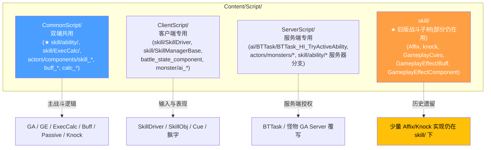
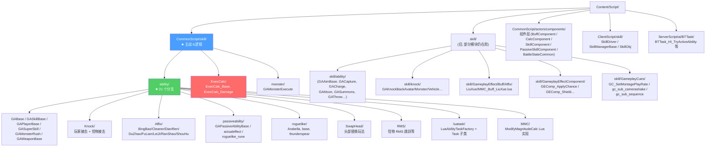
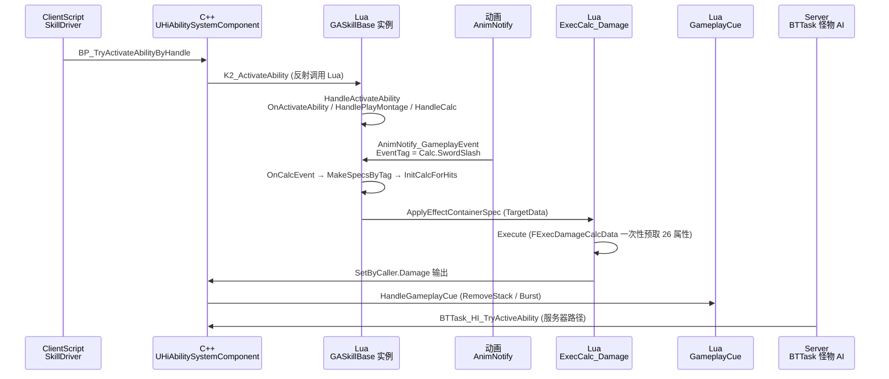
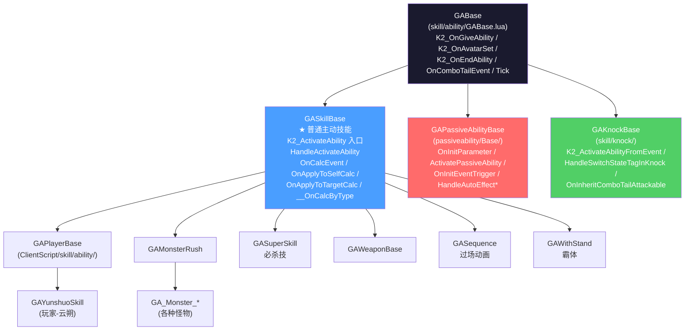
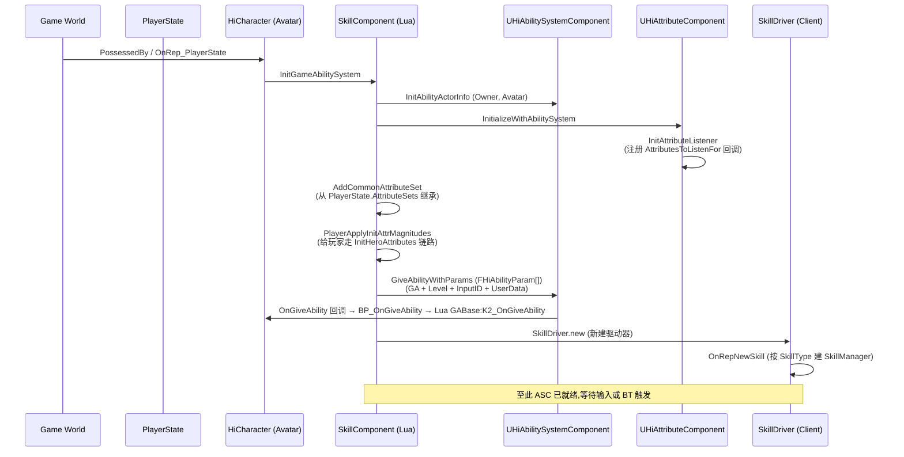
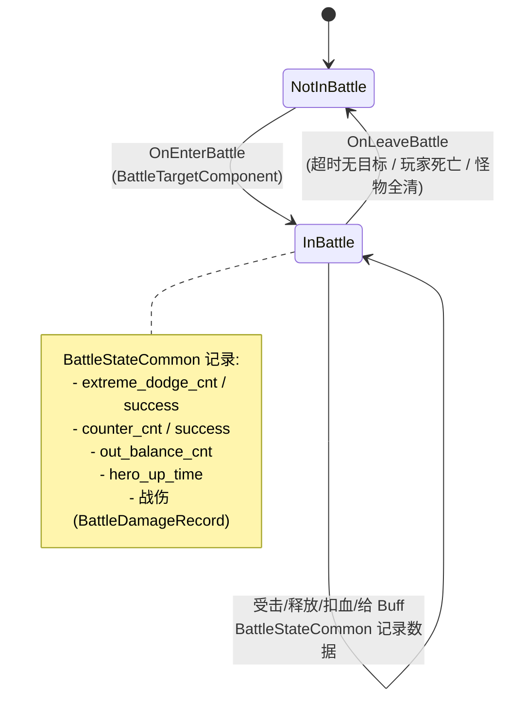
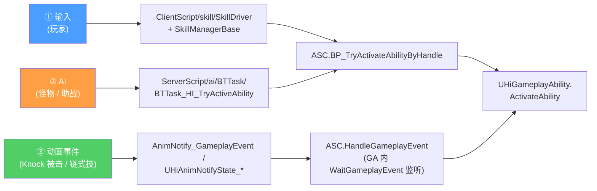

# 总览 — 战斗脚本架构与目录拓扑

HiGame 的战斗系统是 **Epic GAS(GameplayAbilitySystem) + 自研 DDS(分布式 Dedicate Server) + UnLua 业务层**的三明治结构。C++ 仅提供骨架,绝大部分技能逻辑、配置读取、跨系统协同、伤害结算都由 Lua 实现并热更。本页画出整个战斗子系统的边界、目录结构、启动链路,后续每一页深挖其中一块。

## 三层 Lua 代码分隔与战斗子树

HiGame 的 Lua 代码在 `Content/Script/` 下被强制分成三层,**战斗代码主要分布在 Common + Server,Client 仅写驱动与表现**[^c06]。

> **路径陷阱**:历史上有两份 `skill/` 树。**新代码一律落 `Content/Script/CommonScript/skill/ability/`**,旧的 `Content/Script/skill/`(顶层无 CommonScript 前缀)只剩 Affix 词缀、Knock、SimpleSummon、GameplayEffectComponent 等局部模块还在用。读老代码时注意区分,改造时优先迁到 CommonScript。

### 战斗 Lua 子树全图

### 关键三层协同(运行时)

> 这条链是**所有战斗代码读懂后都能 5 秒画出来的核心链路**。任何一个新技能本质都是在这条链路上挂载自己的 Tag、自己的 GE、自己的 Cue 资源。详见 [3. EffectContainer 与 Tag 驱动结算流](3.%20EffectContainer%20与%20Tag%20驱动结算流.md)。

## C++ 战斗类层次

战斗的 C++ 入口集中在两处目录[^c01][^c02]:

```mermaid
classDiagram
    class UDDSAbilitySystemComponent {
        <<UE/DDS Plugin>>
    }
    class UHiAbilitySystemComponent {
        +InitAttributes(Magnitudes)
        +ApplyAttributeModifyEffects()
        +MakeBuffEffectSpec(BuffID, Level)
        +ApplyBuffToSelf / ApplyBuffToTarget
        +GiveAbilityWithParams(FHiAbilityParam)
        +PauseGameplayEffectDuration()
        +SetGameplayEffectDurationHandle()
    }
    UDDSAbilitySystemComponent <|-- UHiAbilitySystemComponent

    class UGameplayAbility {
        <<UE GAS>>
    }
    class UHiGameplayAbility {
        +EffectContainerMap (Tag → Container)
        +CooldownDuration / CooldownTags
        +CostGameplayEffectDef
        +AbilityData (TArray<UHiAbilityDataBase>)
        +MagnitudeModifiers (Tag → Modifier)
        +K2_OnGiveAbility / K2_OnAvatarSet
        +K2_ActivateAbilityParams
        +K2_OnCompleted / K2_OnInterrupted
        +PreTransfer / PostTransfer (DDS)
        +MakeEffectContainerSpecByTag()
        +ApplyEffectContainerSpec()
    }
    UGameplayAbility <|-- UHiGameplayAbility
    UGameplayAbility <|-- UHiPassiveGameplayAbility

    class UHiPassiveGameplayAbility {
        +TriggerAbilityInfo
        +AutoEffectInfoList (List)
        +EffectInfoToSelfList / EffectInfoToTargetList
        +SingleTriggerData (含 CD / 概率)
        +ActivatePassiveAbility / EndPassiveAbility
    }

    class UAttributeSet {
        <<UE GAS>>
    }
    class UHiAttributeSet {
        +ATTRIBUTE_ACCESSORS
        +OnPreGameplayEffectExecute (BlueprintNativeEvent)
        +OnPostGameplayEffectExecute (BlueprintNativeEvent)
        +OnPreAttributeChange
        +InitEffectListeners
    }
    UAttributeSet <|-- UHiAttributeSet
    UHiAttributeSet <|-- UHiHealthAttributeSet : (派生)

    class UGameplayEffect {
        <<UE GAS>>
    }
    class UHiSelfGameplayEffect {
        +bApplyToAllTeamMembers
    }
    class UHiTeamBuffGEBase {
        +bTeamBuff
    }
    UGameplayEffect <|-- UHiSelfGameplayEffect
    UGameplayEffect <|-- UHiTeamBuffGEBase

    class AGameplayAbilityTargetActor {
        <<UE GAS>>
    }
    class AHiTargetActorBase {
        +ProjectileClass
        +GameplayEffectsHandle
        +SelfGameplayEffectsHandle
        +KnockInfo (Replicated)
        +Spec : FHiTargetActorSpec
        +OnTick / OnStartTargeting / OnTargetDataReceived
    }
    AGameplayAbilityTargetActor <|-- AHiTargetActorBase

    class AHiProjectileActorBase {
        +CapsuleComponent
        +GameplayEffectsHandle
        +SelfGameplayEffectsHandle
        +KnockInfo
    }
```

### 各模块职责

| 模块 | 关键文件 | 说明 |
|------|---------|------|
| **HiAbilitySystemComponent** | `Public/Component/HiAbilitySystemComponent.h` | DDS 增强版 ASC,补:`InitAttributes`/`ApplyAttributeModifyEffects`/`MakeBuffEffectSpec`/`ApplyBuffToSelf`/`PauseGameplayEffectDuration`,以及 `bClientReady` 同步标志 |
| **HiAttributeComponent** | `Public/Component/HiAttributeComponent.h` | 战斗属性中间层,持有 `FHiHeroAttributeContainer` + `FHiHeroGameplayEffectContainer`,**用 UniqueID 解决 RPC 时序**;`Client_ExecuteAttributeModifies` 携带 TargetUniqueID |
| **HiGameplayAbility** | `Public/HiAbilities/HiGameplayAbility.h` | 战斗 GA 基类,提供 `EffectContainerMap`/`AbilityData[]`/`MagnitudeModifiers`/`PreTransfer/PostTransfer`/`MakeEffectContainerSpecByTag*`;Lua 子类继承蓝图后再继承 |
| **HiPassiveGameplayAbility** | `Public/HiAbilities/HiPassiveGameplayAbility.h` | 被动技能基类,有 `TriggerAbilityInfo`/`AutoEffectInfoList`/`SingleTriggerData`(冷却+概率) |
| **HiAttributeSet** | `Public/Attributies/HiAttributeSet.h` | 所有自定义属性集的基类,提供 `OnPre/PostGameplayEffectExecute` BlueprintNativeEvent 给蓝图层定制 clamp/listener |
| **HiTargetActorBase** | `Public/HiAbilities/HiTargetActorBase.h` | TargetActor 基类(自定义 reticle / sweep 区域 / 抛射物模板) |
| **HiProjectileActorBase** | `Public/HiAbilities/HiProjectileActorBase.h` | 投射物基类(胶囊体 + GE Spec + KnockInfo) |
| **HiBuffComponent** | `Public/Component/HiBuffComponent.h` | Buff 组件(`AddBuffByID` 蓝图实现) |
| **HiAbilityTask_PlayMontage / PlaySequence** | `Public/HiAbilities/Tasks/*` | 自研 PlayMontage/PlaySequence Task,扩展了同步与位面迁移恢复 |
| **HiGameplayCueManager** | `Public/HiAbilities/HiGameplayCueManager.h` | Cue 管理器,关闭了启动期 AsyncLoad,改为按需异步 |

详细 Lua / C++ 边界 → [11. C++ 与 Lua 边界 + DDS 迁移](11.%20C%2B%2B%20与%20Lua%20边界%20+%20DDS%20迁移.md)。

## Lua 战斗骨架(GA 主线)

战斗 Lua 的根基是 **`GABase` → `GASkillBase` → `GAPlayerBase / GAMonsterRush / GASuperSkill / GAWeaponBase / GAWithStand / GASequence / GAKnockBase / GAPassiveAbilityBase`**[^c06]。

> 这 8 大基类各管一类玩法,新写技能时第一件事就是**选对基类**:
> - 玩家主动 → `GAPlayerBase` 派生
> - 必杀 → `GASuperSkill` 派生
> - 怪物冲锋 → `GAMonsterRush` 派生
> - 普攻被击 → `GAKnockBase` 派生(注意 `K2_ActivateAbilityFromEvent` 而非 `K2_ActivateAbility`)
> - 被动 → `GAPassiveAbilityBase` 派生(走 `OnInitEventTrigger` 注册事件,而非走 montage)
> - 词缀(可叠加属性 buff) → `GA_AffixBase` 派生
> - 过场 → `GASequence` 派生

详见 [2. GA 继承层次与生命周期](2.%20GA%20继承层次与生命周期.md)。

## 战斗启动链路 — 从角色登场到第一刀

详见 [4. AttributeSet 与 Hero 属性中间层](4.%20AttributeSet%20与%20Hero%20属性中间层.md) 与 [10. 输入、AI 与动画接入](10.%20输入、AI%20与动画接入.md)。

## 战斗触发与战斗状态(Battle State)

战斗系统不止"按一下技能",还分**进入战斗 / 战斗中 / 离开战斗**三个阶段[^c12]:

`PlayerState.BattleTargetComponent:IsInBattle()` 是全局判定入口。`SendMessage("OnEnterBattle/OnLeaveBattle")` 由 BattleTargetComponent(C++/蓝图)在感知到敌对目标后广播,Lua 端 `BattleStateCommon` 收消息后开关数据记录。

具体怪物布设是另一个独立子系统:
- **Trigger 体积** — `Public/Trigger/HiTriggerBox.h` / `HiTriggerVolume.h` / `ConvexTriggerVolume_POI.h` — 玩家进入触发器后才允许 Spawn 怪物波次
- **TriggerManagementSystem** — `Public/TriggerManagementSystem/` — 提供物理材质/体积/全局/Voxel 触发,并能挂 BGM/Environment Override 等 Effect 组件
- **GameFeatureAction_AddSpawnedActors** — `Public/GameFeatures/GameFeatureAction_AddSpawnedActors.h` — Game Feature 启用时自动塞 Actor 到关卡

详见 [12. 进阶 Cookbook 与常见陷阱](12.%20进阶%20Cookbook%20与常见陷阱.md) 的"战斗触发与怪物布设"章节。

## 三大入口:输入 / AI / 动画

任何技能最终都是被以下三种途径之一激活的[^c11]:

详见 [10. 输入、AI 与动画接入](10.%20输入、AI%20与动画接入.md)。

## 一句话总结

> **HiGame 战斗 = GAS + DDS 中间层 + Lua 业务**。
> C++ 提供 **ASC / AttributeComponent / GA 基类 / TargetActor / Projectile / Cue Notify** 的最小骨架;
> Lua 在 **GABase 上面盖 8 大主线 GA**(Skill/Player/Monster/Super/Knock/Passive/Affix/Sequence),
> 通过 **EffectContainerMap + Tag 驱动**把 AnimNotify、伤害结算、Buff 应用、表现 Cue 串成一条流水线。
> 任何新技能都是 **选基类 + 配 Tag + 配 EffectContainer + 写 Lua 钩子 + 配 Cue 资源**这五件事的组合。

[^c01]: `Source/HiGame/Public/HiAbilities/HiGameplayAbility.h` `HiGameplayEffect.h` `HiAbilityTypes.h`
[^c02]: `Source/HiGame/Public/Component/HiAbilitySystemComponent.h` `HiAttributeComponent.h` `HiBuffComponent.h`,`Public/Attributies/HiAttributeSet.h`
[^c06]: `Content/Script/CommonScript/skill/ability/GABase.lua` `GASkillBase.lua` `GAPlayerBase.lua`
[^c11]: `Content/Script/ClientScript/skill/SkillDriver.lua`、`Content/Script/ServerScript/ai/BTTask/BTTask_HI_TryActiveAbility.lua`
[^c12]: `Content/Script/CommonScript/actors/components/battle_state_common.lua` `battle_starup_component.lua`,`Source/HiGame/Public/Trigger/*` `TriggerManagementSystem/*`
