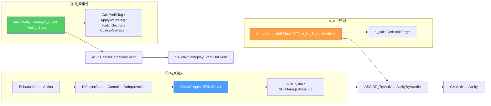
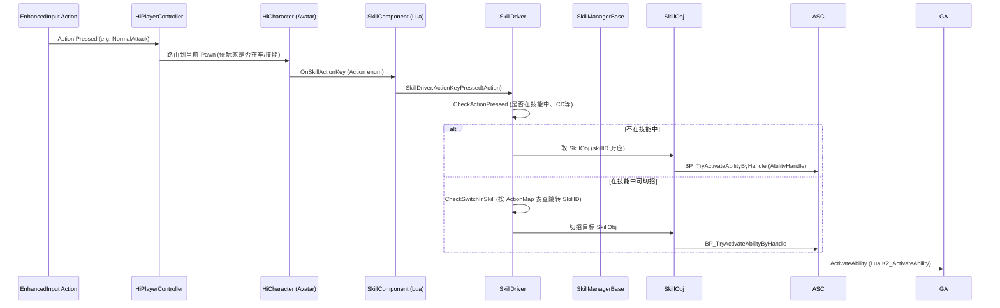
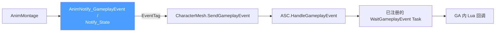

# 输入、AI 与动画接入

GA 是被动的,**只有外部显式激活才会跑起来**。HiGame 战斗的三大激活通道是:**玩家输入(SkillDriver)、AI 行为树(BTTask_HI_TryActiveAbility)、动画事件(AnimNotify)**。本页讲清这三条入口的代码路径、Tag 约定与协同[^c11]。

## 三大入口总览



## ① 输入路径 — SkillDriver



### SkillDriver.lua 关键代码[^c11]

```lua
-- ClientScript/skill/SkillDriver.lua
local SkillDriver = Class()

function SkillDriver:ctor(owner)
    self.Owner = owner
    self.actor = self.Owner.actor
    self.AbilitySystemComponent = G.GetHiAbilitySystemComponent(self.Owner.actor)
    self.DefaultManagerDict = {}        -- (SkillID, SkillManager)
    self.SkillContainer = {}             -- (SkillID, SkillObj)
    self.ActionMap = {}                   -- 按键 → 跳转 SkillID 的映射

    self.LastTarget = nil
    self.LastTargetComponent = nil
    self.LastTargetLocation = nil
end

-- 服务器分配新技能时,通过 RepNotify 调过来
function SkillDriver:OnRepNewSkill(SkillID, SkillType)
    self.DefaultManagerDict[SkillID] = SkillManagerBase.new(self.Owner, SkillID, SkillType)
    self.Owner:SendMessage("OnRepNewSkill", SkillID, SkillType)
end

-- ★ 关键:输入 → 跳转 SkillID
function SkillDriver:CheckActionPressed(Action)
    local TagRequirements = UE.FGameplayTagRequirements()
    TagRequirements.RequireTags.GameplayTags:Add(SkillUtils.GetPositiveSkillTag())
    local bInSkill = self.actor.AbilitySystemComponent:HasActivateAbilities(TagRequirements)

    if bInSkill then
        -- 在技能中,按"切招映射表"找当前可切招目标
        return self:CheckSwitchInSkill(Action)
    else
        return true
    end
end

function SkillDriver:CheckSwitchInSkill(Action)
    local Item = self.ActionMap[Action]
    if Item then
        local bInAir = not self.actor:IsOnFloor()
        local JumpSkillID = bInAir and Item[InAirKey] or Item[OnGroundKey]
        if JumpSkillID then
            -- 在地面/空中走不同的跳转 SkillID
            -- ...
        end
    end
    return false
end
```

### SkillObj 与 SkillManagerBase

`SkillObj` 是单个技能的 Lua 包装,持有:
- `SkillID`(项目自定义 ID,与 GameplayAbilitySpec.UserData.SkillID 一致)
- `AbilityClass`(蓝图 GA 类引用)
- `AbilityHandle`(GAS 内部句柄)
- `Cooldown` / `Cost` 状态镜像

`SkillManagerBase` 在 GA 之上加一层"连击/Combo 管理":
- 普通技能 → 单 SkillObj
- 连击技 → 多 SkillObj 形成 Combo Chain,根据 ComboTail 时机决定下一段
- 蓄能技 → SkillObj + 蓄能进度

具体配置在 **`common/data/skill_list_data.lua`** 与每个角色 `<hero>_skill_*.lua` 中。

### ActionMap 的构建

`ActionMap` 是"按键 → 跳转 SkillID"的映射表,从 `common/data/skill_combo_data.lua`(虚构)读入,运行时按"是否在技能中、当前技能阶段、是否在空中"等条件查表得到下一个 SkillID。

> **典型组合**:
> - `NormalAttack` 按一下 → 普攻第 1 段
> - 在第 1 段动画的 ComboTail 之后再按 `NormalAttack` → 第 2 段
> - 在第 1 段 ComboTail 之前按 `Skill1` → 中断走技能 1
> - 空中按 `NormalAttack` → 走"空中普攻"分支

## SkillID 与 AbilityHandle 的关系

```mermaid
flowchart LR
    GIVE[ASC.GiveAbilityWithParams<br/>(FHiAbilityParam)]
    GIVE --> SPEC[FGameplayAbilitySpec<br/>(Handle, Ability, UserData)]
    SPEC --> UD[UserData.SkillID<br/>(项目分配)]
    SPEC --> H[Handle<br/>(GAS 内部句柄)]

    INPUT[输入 / AI / Knock] --> SID[SkillID]
    SID -.通过 ASC.FindAbilitySpecHandleFromSkillID.-> H
    INPUT2[BTTask] --> CLS[AbilityClass]
    CLS -.通过 FindAbilitySpecHandleFromClass.-> H
    H --> ACT[ASC.BP_TryActivateAbilityByHandle]
```

> **SkillID** 是项目层概念(策划表里的 ID),**AbilityHandle** 是 GAS 内部的运行时句柄。两者通过 `FGameplayAbilitySpec.UserData` 字段关联。
> 项目特有的 `FHiAbilityParam` 包含 `(AbilityClass, Level, InputID, SourceObject, UserData, Magnitudes, DynamicTags)`。

## ② AI 路径 — BTTask_HI_TryActiveAbility[^c11]

```lua
-- ServerScript/ai/BTTask/BTTask_HI_TryActiveAbility.lua
local BTTask_TryActiveAbility = Class(BTTask_Base)

function BTTask_TryActiveAbility:Execute(Controller, Pawn)
    if not self.SkillClass then
        G.log:error("yj", "BTTask_TryActiveAbility:Execute SkillClass empty")
        assert(false)
    else
        return self:Execute_New(Controller, Pawn)
    end
end

function BTTask_TryActiveAbility:Execute_New(Controller, Pawn)
    -- 0. 重置 BT 节点打断标志
    Pawn:SendMessage("SetCurBTNodeBreak", false)

    -- 1. 检查能量消耗(如果配置了)
    if self.NeedCostEnergy then
        local ret = Pawn.SkillComponent:CheckSkillEnergyCost(self.SkillClass, true)
        if ret == false then return ai_utils.BTTask_Failed end
    end

    -- 2. 拿 AbilityHandle
    local ASC = G.GetHiAbilitySystemComponent(Pawn)
    local AbilityHandle = ASC:FindAbilitySpecHandleFromClass(self.SkillClass)

    if AbilityHandle.Handle == -1 then
        G.log:error("chensy", "BTTask_TryActiveAbility Pawn %s has not learned Skill %s",
                    Pawn:GetName(), G.GetDisplayName(self.SkillClass))
        return ai_utils.BTTask_Failed
    end

    -- 3. 拿 AbilitySpec、AbilityCDO
    local AbilitySpec = SkillUtils.FindAbilitySpecFromHandle(ASC, AbilityHandle)
    local AbilityCDO  = AbilitySpec.Ability

    -- 4. 空中状态过滤
    if not AbilityCDO.bCanActivateInAir and ASC:HasGameplayTag(self.InAirTag) then
        return
    end

    -- 5. 设置目标
    local Target = ai_utils.GetBattleTarget(Pawn)
    if Target then
        Pawn.SkillComponent:SetSkillTarget(AbilitySpec.UserData.SkillID, Target,
                                            Target:GetTransform(), true)
    end
    Pawn.SkillInUse = AbilitySpec.UserData.SkillID
    Pawn:SendMessage("BeforeTryActiveAbility")

    -- 6. 注入 ComboBeginSection (BT 节点配的"从蒙太奇某段开始播")
    local GA = G.GetGameplayAbilityFromSpecHandle(ASC, AbilitySpec.Handle)
    GA.ComboBeginSection    = self.ComboBeginSection
    GA.bPlayMontageForCombo = self.bCanFinishInAdvance
                           or (self.ComboBeginSection ~= "None" and self.ComboBeginSection ~= nil)

    -- 7. 真激活
    Pawn:GetAbilitySystemComponent():BP_TryActivateAbilityByHandle(AbilityHandle, true)
    Controller:StopMovement()

    -- 8. 埋点(怪物对玩家发起特定技能)
    if Target and Target.GetAvatarPlayerState then
        local PS = Target:GetAvatarPlayerState()
        if PS then PS:SendMessage("SendBattleConditionEventMsg", ..., {SkillID=...}) end
    end
end
```

### 节点字段(BT Editor 配置)

| 字段 | 类型 | 说明 |
|------|------|------|
| `SkillClass` | `TSubclassOf<UGameplayAbility>` | 要释放的 GA 类 |
| `NeedCostEnergy` | bool | 是否预检查能量 |
| `ComboBeginSection` | FName | 从蒙太奇该段开始播 |
| `bCanFinishInAdvance` | bool | 是否允许提前结束 |
| `InAirTag` | FGameplayTag | "在空中"标记 |

### Tick 阶段

`BTTask_HI_TryActiveAbility:Tick(Controller, Pawn, DeltaSeconds)` 用于:
- 监控 GA 是否还在执行
- 检查 BT 是否被外部 SetCurBTNodeBreak 标记打断
- GA 结束 → BTTask_Succeeded / Failed

```lua
function BTTask_TryActiveAbility:Tick_New(Controller, Pawn, DeltaSeconds)
    -- 检查 GA 是否仍激活
    -- 检查打断标志
    -- 决定 Continue / Succeeded / Failed
end
```

### 怪物 BT 协同

每只怪物的 BT 顶层是一个 Selector,从"行为决策表"(各自策划)选一个 BTTask:
- 距离玩家 < X → BTTask_Attack(走 BTTask_HI_TryActiveAbility 的攻击实例)
- 距离玩家在 X..Y → BTTask_Approach(走移动)
- 距离玩家 > Y → BTTask_Wander
- 玩家不在 perception 内 → BTTask_Patrol

详见 `Content/Script/CommonScript/actors/monsters/<怪物>/BT_*.uasset`(蓝图层) + `<怪物>/Skill/GA_*.lua`(技能 GA Lua 实现)。

## ③ 动画路径 — AnimNotify



### AnimNotify_GameplayEvent

UE 自带的 Notify 类型,可在蒙太奇上配:
- `EventTag`(必填) — 派发的 Tag
- `Instigator` / `Target` — 发起者/目标(可填 Owner)
- `Magnitude` — 数值参数
- `OptionalObject` — 任意 UObject 引用(项目用来传 KnockInfo)
- `OptionalObject2` — 第二个 UObject(项目用来传抛射物 ReplaceData)

### Notify_State 子类

项目自研的 Notify_State(`Source/HiGame/Public/AnimNotify/*.h`):
- `UHiAnimNotifyState_SpawnNiagaraEffect` — 持续 Spawn Niagara
- `ANS_MonsterWeaponAttack` — 武器扫描期间的 Tick 命中(详见 [3. EffectContainer](3.%20EffectContainer%20与%20Tag%20驱动结算流.md) 武器 Sweep 章节)
- 还有 ANS_PlayCameraShake / ANS_DilateMontage 等

```cpp
// Public/AnimNotify/HiAnimNotifyState_SpawnNiagaraEffect.h
UCLASS()
class UHiAnimNotifyState_SpawnNiagaraEffect : public UAnimNotifyState
{
    UPROPERTY(EditAnywhere) UNiagaraSystem* NiagaraSystem;
    UPROPERTY(EditAnywhere) FName AttachSocketName;
    UPROPERTY(EditAnywhere) FVector LocationOffset;
    UPROPERTY(EditAnywhere) FRotator RotationOffset;
    -- ...
    virtual void NotifyBegin(USkeletalMeshComponent*, UAnimSequenceBase*, float TotalDuration);
    virtual void NotifyTick(USkeletalMeshComponent*, UAnimSequenceBase*, float FrameDeltaTime);
    virtual void NotifyEnd(USkeletalMeshComponent*, UAnimSequenceBase*);
};
```

### Tag 命名约定速查

| Tag 前缀 | 谁监听 | 用途 |
|---------|-------|------|
| `Calc.<技能>.<段位>` | `OnCalcEvent` | 主结算 |
| `ApplyToSelfCalc.*` | `OnApplyToSelfCalcEvent` | 给自身上 GE |
| `ApplyToTargetCalc.*` | `OnApplyToTargetCalcEvent` | 给预设目标上 GE |
| `WeaponSweep.*` | `OnWeaponSweepEvent` | 武器持续扫描 |
| `Event.AnimNotify.SwitchSection` | `HandleSwitchSectionEvent` | 蒙太奇跳段 |
| `Event.AnimNotify.CustomSkillEvent` | `HandleCustomSkillEvent` | 派发自定义函数 |
| `SpawnProjectiles.*` | `OnSpawnProjectiles` | 抛射物 |
| `ComboTail.*` | `OnComboTailEvent` | 解锁切招 |
| `Hit.Knock.*` | Target.HitComponent | 派发 Knock GA |
| `Drop.*` | `OnDropEvent` | 资源球掉落 |
| `EndCounterWitch` | `EndCounterWitchTime` | 结束巫师时间 |

详见 [3. EffectContainer 与 Tag 驱动结算流](3.%20EffectContainer%20与%20Tag%20驱动结算流.md) 总表。

### SwitchSection 与 CustomSkillEvent

```lua
function GASkillBase:HandleSwitchSectionEvent(Payload)
    local FunctionName = Payload.OptionalObject.FunctionName
    local IsInstantJump = Payload.OptionalObject.IsInstantJump
    local Func = self[FunctionName]

    if Func and self.MontageToPlay then
        if IsInstantJump then
            local JumpSectionName = Func(self)
            if JumpSectionName then self:MontageJumpToSection(JumpSectionName) end
        else
            local FromSection, ToSection = Func(self)
            if FromSection and ToSection then
                self:MontageSetNextSectionName(FromSection, ToSection)
            end
        end
    end
end

function GASkillBase:HandleCustomSkillEvent(Payload)
    local FunctionName = Payload.OptionalObject.FunctionName
    local Func = self[FunctionName]
    if Func then Func(self) end
end
```

> **设计意图**:让策划在动画上配"在 X 帧调 GA 上的某个 Lua 函数",不需要每个分支都加 Tag。例如:
> - Frame 18:CustomSkillEvent({FunctionName="OnHandlePushBack"}) → 调用 `GA.OnHandlePushBack`
> - Frame 22:SwitchSection({FunctionName="GetNextComboSection"}) → 跳到 GA 决策的下一段

## SendMessage 通信总线

UnLua 的 `actor:SendMessage("XxxMessage", arg1, arg2, ...)` 是组件间通信总线 — Actor 上各 Component 都可以注册同名 Lua 函数,**消息会广播给所有命中的接收者**。

```lua
-- 任意 Component
decorator.message_receiver()
function MyComponent:HandleHitEvent(Payload)
    -- Payload 内已有 Hit 信息
end
```

战斗常用 Message:
```
HandleHitEvent             -- HitComponent 接收,触发 Knock
InitCalcForHits            -- CalcComponent 接收
ExecCalcForHits            -- CalcComponent 接收
OnUseSkill                 -- 多个组件接收 (UI/AudioCue 等)
OnEndAbility
OnNotifyActivateAbility
SetSkillTarget
TriggerSkillActivate / TriggerSkillEnd
RemovePreAttackBuff
StartTimeDilation / StopTimeDilation
```

## 一页速查

| 需求 | 入口 | 备注 |
|------|------|------|
| 玩家按键释放 | EnhancedInput → SkillDriver.ActionKeyPressed | 用 InputAction 名 |
| 玩家在技能中切招 | SkillDriver.CheckSwitchInSkill | 看 ActionMap |
| 怪物释放技能 | BT 加 BTTask_HI_TryActiveAbility | 配 SkillClass |
| 怪物某帧伤害判定 | 在蒙太奇加 AnimNotify_GameplayEvent | EventTag = Calc.* |
| 怪物长动作扫描 | ANS_MonsterWeaponAttack | EventTag = WeaponSweep.* |
| 必杀触发过场 | ANS_PlayCameraShake / GC_SubSequence | 见 [9. GameplayCue](9.%20GameplayCue%20表现层.md) |
| 起手帧给自己 buff | ANS 配 ApplyToSelfCalc.X + EffectContainer.SelfBuffIDs | 自动应用 |
| 在蒙太奇某帧调函数 | Event.AnimNotify.CustomSkillEvent + OptionalObject.FunctionName | 项目惯例 |
| 在蒙太奇跳段 | Event.AnimNotify.SwitchSection + IsInstantJump | 项目惯例 |
| Knock 派发 | HitComponent.HandleHitEvent | EventTag = Hit.Knock.* |

[^c11]: `Content/Script/ClientScript/skill/SkillDriver.lua`、`Content/Script/ServerScript/ai/BTTask/BTTask_HI_TryActiveAbility.lua`、`Source/HiGame/Public/AnimNotify/*.h`
