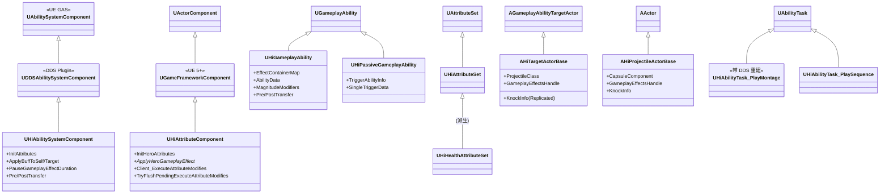
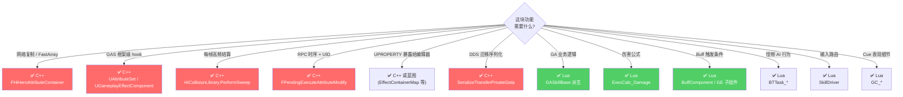
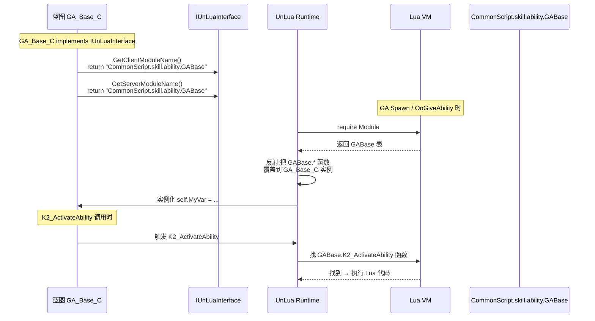
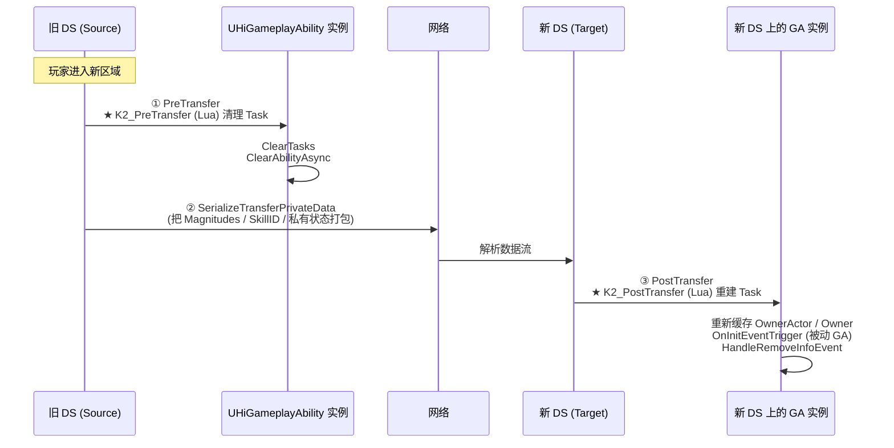
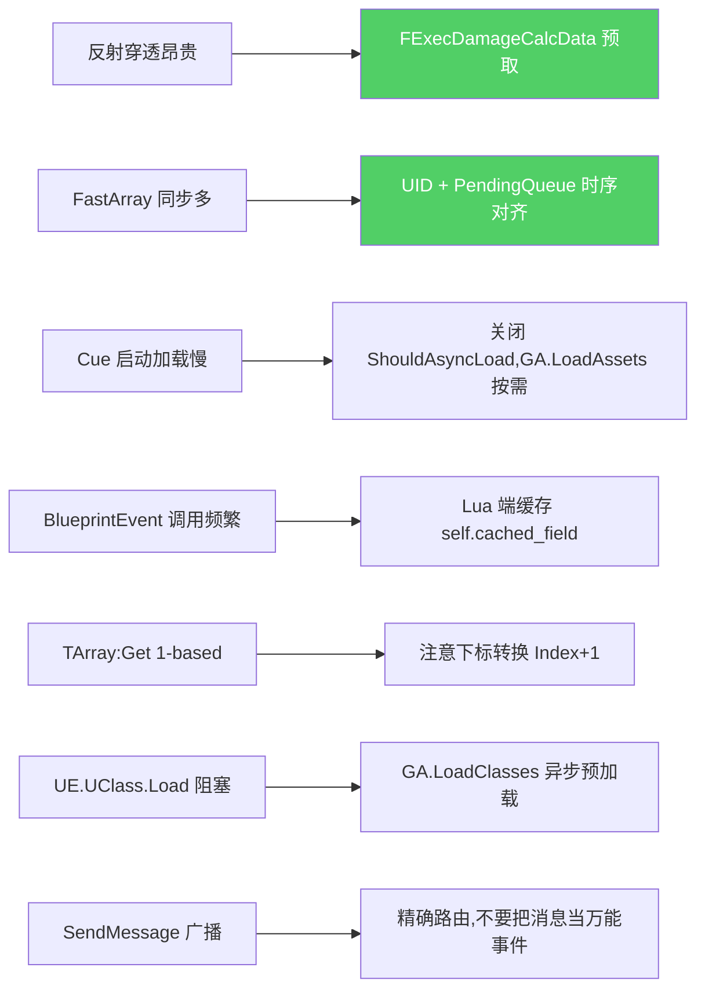

# C++ 与 Lua 边界 + DDS 迁移

战斗系统是 C++ 与 Lua 协作最深的子系统。**搞错边界 = 性能爆炸或者 DDS 迁移崩溃**。本页给出战斗 C++ 类层次图、明确"哪些必须 C++、哪些应该 Lua"、列出 Lua 端最常用的 BlueprintCallable 接口,并讲清 DDS 跨服迁移的协议与陷阱[^c01][^c02][^c03][^c11]。

## 战斗 C++ 类层次



各模块职责见 [1. 总览](1.%20总览%20—%20战斗脚本架构与目录拓扑.md)。

## C++ vs Lua 边界 — 决策表



### 必须 C++ — 不能写 Lua 的领域

- **FFastArraySerializer / FNetDeltaSerializeInfo** — Lua 不能定义网络复制结构
- **UPROPERTY/UFUNCTION 反射展开** — 编辑器友好的字段必须 C++ 注册
- **AttributeSet 的 Pre/PostGameplayEffectExecute** — UE GAS 的 vtable 入口,Lua 必须经蓝图覆写
- **UDDSAbilitySystemComponent 的 PreTransfer / PostTransfer / SerializeTransferPrivateData** — DDS 框架要求 C++ 序列化协议
- **每帧高频路径**(命中扫描、属性聚合)— 性能敏感,反射穿透代价高
- **SetByCaller / Magnitude 计算批量预取** — `UHiGASLibrary::ExtractExecDamageData`(详见 [7. ExecCalc](7.%20ExecCalc%20伤害计算.md))

### 应写 Lua

- **所有 GA 业务逻辑** — `K2_ActivateAbility / OnCalcEvent / __OnCalcByType` 等
- **ExecCalc 主公式** — `ExecCalc_Damage:Execute`(走预取数据,无穿透)
- **BuffComponent.AddBuffByID 业务策略** — TeamBuff 判断、TeammatesBuff 广播
- **Knock 子类业务** — KnockBackAvatar / KnockFlyMonster 等
- **SkillDriver 输入路由** — ActionMap 切招
- **BT Task 怪物决策** — BTTask_HI_TryActiveAbility / BTTask_*
- **GameplayCue 表现细节** — 动画减速、相机抖动调用、子 Sequence
- **GE 子组件**(`GEComp_ApplyChance / GEComp_Shield / GEComp_RelivePlayer`)— 可纯 Lua 实现

## UnLua 双向绑定路径



> **关键事实**:Lua 函数可以**完全覆盖**蓝图同名 K2_* 事件 — 蓝图层只画"骨架/默认实现",Lua 拿过来运行。
> 只有当 Lua 主动 `Super(ParentClass).Func(self, ...)` 时才会调到蓝图层 / 父类 Lua 实现。

## DDS 位面迁移 — 完整协议

DDS(Distributed Dedicated Server)的核心特性是**Actor 跨 DS 迁移**(玩家从 A 区域走到 B 区域,A DS 负责的 Actor 转移到 B DS)。GA 实例化的 AbilityTask 引用的是当前 World 的对象,**迁移后 World 变了所有引用都失效**,必须主动重建。

### 三步协议



### Lua 端实现示例[^c06][^c08]

```lua
-- GABase.K2_PostTransfer
function GABase:K2_PostTransfer()
    local OwnerActor = self:GetAvatarActorFromActorInfo()
    rawset(self, "OwnerActor", OwnerActor)
    if OwnerActor then
        rawset(self, "Owner", OwnerActor.SkillComponent)
    end
end

-- 被动 GA 还需重建事件监听
function GAPassiveAbilityBase:K2_PreTransfer()
    self:PrintSelfLog("K2_PreTransfer")
    self:ClearAbilityAsync()
    self:ClearAbilityTasks()
    self:ClearPreTransferInfo()
end

function GAPassiveAbilityBase:K2_PostTransfer()
    self:OnInitEventTrigger()                    -- 重建 GameplayEvent 监听
    self:HandleRemoveInfoEvent()                 -- 重建移除事件
    -- 把临时缓存的 Auto buff 列表迁移过来
    if not self.AutoMasterActorBuffItemList then
        self.AutoMasterActorBuffItemList = {}
    end
    for IdxM = 1, self.AutoBuffItemToMaster:Length() do
        local BuffItem = self.AutoBuffItemToMaster:Get(IdxM)
        table.insert(self.AutoMasterActorBuffItemList, BuffItem)
    end

    if not self.AutoOwnerActorBuffItemList then
        self.AutoOwnerActorBuffItemList = {}
    end
    for IdxM = 1, self.AutoBuffItemToSelf:Length() do
        local BuffItem = self.AutoBuffItemToSelf:Get(IdxM)
        table.insert(self.AutoOwnerActorBuffItemList, BuffItem)
    end
end

function GAPassiveAbilityBase:ClearPreTransferInfo()
    if self.SingleTriggerInfo then
        self.SingleTriggerInfo.LastTriggerTime = 0
    end
end
```

### C++ 端协议(项目实现)

```cpp
// HiGameplayAbility.h
virtual void PreTransfer();
UFUNCTION(BlueprintImplementableEvent) void K2_PreTransfer();

virtual void SerializeTransferPrivateData(FArchive& Ar, UPackageMap* PackageMap);

virtual void PostTransfer();
UFUNCTION(BlueprintImplementableEvent) void K2_PostTransfer();

virtual void HandlePostTravelWorld(const FGameplayAbilityActorInfo* ActorInfo,
                                    const FGameplayAbilitySpec& Spec);
```

`SerializeTransferPrivateData` 是 C++ 强制存档点 — 项目把 `AbilityActiveID`、`TagStringParams` 等迁移所需的字段在这里 `Ar << field` 序列化。

## Lua AbilityTask 工厂 — 防泄漏

```lua
-- CommonScript/skill/ability/luatask/LuaAbilityTaskFactory.lua
-- 项目自研:用 GA 实例 ID 作 key,跟踪所有 Lua AbilityTask
local Factory = {}
Factory.AbilityTaskMap = {}    -- (GA 实例 → AbilityTask 列表)

function Factory.AddTask(GA, Task)
    Factory.AbilityTaskMap[GA] = Factory.AbilityTaskMap[GA] or {}
    table.insert(Factory.AbilityTaskMap[GA], Task)
end

function Factory.CleanupTasksForAbility(GA)
    local Tasks = Factory.AbilityTaskMap[GA]
    if not Tasks then return end
    for _, Task in ipairs(Tasks) do
        if Task and Task.Cancel then Task:Cancel() end
    end
    Factory.AbilityTaskMap[GA] = nil
end

return Factory
```

`GABase:K2_OnEndAbility` 自动调:
```lua
local LuaAbilityTaskFactory = require("CommonScript.skill.ability.luatask.LuaAbilityTaskFactory")
LuaAbilityTaskFactory.CleanupTasksForAbility(self)
```

> **绝对不能跳过这一步** — Lua 写的 AbilityTask 不像 C++ AbilityTask 有 GAS 内部 GC,必须手动清。

## DDS 迁移陷阱集

### 1. AbilityTask 引用旧 World 对象

```lua
-- ❌ 迁移后 PlayMontageTask 失效:
function GA:OnActivate()
    local Task = UE.UAbilityTask_PlayMontageAndWait.CreatePlayMontageAndWaitProxy(self, ...)
    Task:ReadyForActivation()
    self:AddTaskRefer(Task)
end

-- 迁移期间没清理 → 新 DS 上 Task 引用旧 PlayerController/Mesh
-- ✅ 必须在 K2_PreTransfer 调 ClearTasks / ClearAbilityAsync
```

### 2. WaitGameplayEvent 也是 AbilityTask

```lua
-- 被动 GA 的 OnInitEventTrigger 注册了一组 WaitGameplayEvent
-- 迁移后 ASC 实例不同,旧的 Task 监听不再有效
-- ✅ K2_PostTransfer 必须 OnInitEventTrigger 重新注册
```

### 3. SingleTriggerInfo.LastTriggerTime 不是 World 中性

```lua
-- LastTriggerTime 是 GetWorld().GetTimeSeconds(),旧 World 的时间戳在新 World 没意义
-- ✅ K2_PreTransfer 调 ClearPreTransferInfo,LastTriggerTime = 0
```

### 4. Cache 在 OwnerActor 上的 lua 状态

```lua
-- ❌ 这种缓存,迁移后 OwnerActor 引用还在(Actor 也跟着迁),但内部状态可能错乱
self.OwnerActor.LastSkillTime = ...

-- ✅ 改用 ASC 上的 LooseGameplayTag / 中间层 GE,确保跟随 Actor 数据流
SkillUtils.AddLooseGameplayTag(self.OwnerActor, "State.LastSkill", true)
```

### 5. RPC 与 Network 上下文

迁移期间 ASC 的 NetMode 可能短暂不对。**绝对不要在迁移过程中发起新的 RPC**。统一在 `PostTransfer` 完成后才能继续业务。

## RPC 与客户端预测

### bPureClient 标志

单机游戏中跳过服务端验证,所有 Apply 都在客户端直接生效:
```lua
local bPureClient = SkillUtils.IsSinglePlayerGame(self.OwnerActor)
ASC:BP_ApplyGameplayEffectSpecToSelf(SpecHandle, bPureClient)
```

`UHiAbilitySystemComponent::ApplyGameplayEffectSpecToSelf` 重载有 `bPureClient` 参数,**单机模式下直接走非 replicated 路径**,避免 RPC 开销与时序问题。

### 客户端预测 - CanClientPredict

```cpp
UFUNCTION(BlueprintCallable, Category="Ability")
bool CanClientPredict() const;
```

GAS 标准的客户端预测开关,项目在此之上加判断:
```lua
function GASkillBase:CanCalc()
    if self.OwnerActor:HasAuthority() then return true end
    local ASC = self:GetAbilitySystemComponentFromActorInfo()
    if not ASC then return false end
    return ASC:CanClientPredict()
end
```

只有"服务端 / 客户端可预测"时才允许结算,否则等服务端授权回来。

### Server / Client 函数注解

```lua
-- Lua 通过 decorator 标注函数行为
decorator.dds_function()
function GABase:OnCompleted(...)
    self:OnCompleted()
end

-- Server RPC
function MyComp:Server_DoXxx_RPC()
    -- 服务端实现
end
function MyComp:Server_DoXxx()
    -- 自动 Server replicate
end

-- Client RPC
function MyComp:Client_NotifyYyy_RPC()
    -- 客户端实现
end
```

## ScriptStruct 注册 — UnLua 类型互通

```lua
-- 在 SkillComponent.InitGameAbilitySystemOnServer 中:
AbilitySystem.ScriptStructCache:Add(Struct.UD_FKnockInfo)
```

> Lua 给 KnockInfo 等自定义结构传到 C++ 时必须先注册 ScriptStruct,否则 UnLua 无法识别字段。项目惯例:在 `InitGameAbilitySystem` 时把所有战斗用到的 Struct 全注册一遍。

## 性能优化清单(实战)



## 高频 BlueprintCallable 接口速查(战斗)

### `UHiAbilitySystemComponent`

| 方法 | 作用 |
|------|------|
| `InitAttributes(Magnitudes)` | 初始化角色属性 |
| `ApplyAttributeModifyEffects(Magnitudes, Duration)` | 临时属性 buff |
| `ExecuteAttributeModifyEffects(Magnitudes, SrcAbil)` | 立即扣血 |
| `MakeBuffEffectSpec(BuffID, Level, SrcAbil)` | 构造 Buff Spec |
| `ApplyBuffToSelf(BuffID, Level)` | 给自己 Buff |
| `ApplyBuffToTarget(TargetASC, BuffID, Level)` | 给目标 Buff |
| `RemoveActiveGameplayEffectByBuffID(BuffID)` | 移除某 BuffID 全部实例 |
| `K2_GetActiveEffectsByBuffID(BuffID)` | 查询 |
| `PauseGameplayEffectDurationByBuffID(BuffID)` | 暂停计时 |
| `SetGameplayEffectDurationHandle(Handle, NewDur)` | 改时长 |
| `BP_TryActivateAbilityByHandle(Handle)` | 尝试激活 |
| `HasActivatedAbilityByTag(Tag)` | 判定 |
| `GetActivatedAbilityArrayByTag(Tag)` | 拿激活中的 GA |
| `HasGameplayTag(Tag)` | 检测 Tag |
| `MatchGameplayTagQuery(Query)` | 复杂 Tag 查询 |

### `UHiAttributeComponent`

| 方法 | 作用 |
|------|------|
| `InitializeWithAbilitySystem(ASC)` | 关联 ASC |
| `InitAttributeListener / RemoveAttributeListener` | 开关属性监听 |
| `ApplyHeroGameplayEffect(Init)` | 给中间层加 GE |
| `RemoveHeroGameplayEffectByID/ByBuffID/ByClass` | 移除 |
| `ClearAllHeroGameplayEffects` | 清空 |
| `NotifyGameTypeChange(GameType)` | GameType 切换 |

### `UHiGameplayAbility`

| 方法 | 作用 |
|------|------|
| `MakeEffectContainerSpecByTag(Tag, Level, EC, Specs)` | 构造目标 Specs |
| `MakeEffectContainerSpecByTagOfSelf(...)` | 构造自身 Specs |
| `ApplyEffectContainerSpec(Specs, TargetData)` | 应用 |
| `ApplyEffectContainerSpecWithPK(...)` | 带预测 Key |
| `GetAbilityMagnitude(Magnitude)` | 取参数(经 Modifier 聚合) |
| `ResetAbilityCD()` | 清 CD |
| `FindAbilityDataByClass<T>()` | 取技能配置 |

## 一页速查

| 边界判定 | 答案 |
|---------|------|
| GA 写在哪里? | Lua,基类用 GABase / GASkillBase / GAPassiveAbilityBase |
| 自定义 AttributeSet? | C++(必须 USTRUCT 反射) + 蓝图覆写 OnPre/PostExecute |
| 写新 Buff? | 配 DataTable + 写 GE 蓝图(可空业务) |
| 写新伤害公式? | Lua 派生 ExecCalcBase / ExecCalcDamage |
| 写新 GE 子组件? | Lua + IUnLuaInterface 即可 |
| 跨 DS 迁移如何不崩? | K2_PreTransfer 清 Task,K2_PostTransfer 重建 |
| 单机/多人切换? | bPureClient 标志一以贯之 |
| Lua AbilityTask 防泄漏 | LuaAbilityTaskFactory 自动 |

[^c01]: `Source/HiGame/Public/HiAbilities/HiGameplayAbility.h` `HiAbilityTypes.h` `HiPassiveGameplayAbility.h`
[^c02]: `Source/HiGame/Public/Component/HiAbilitySystemComponent.h` `HiAttributeComponent.h`
[^c03]: `Source/HiGame/Public/HiAbilities/HiTargetActorBase.h` `HiProjectileActorBase.h`、`Tasks/HiAbilityTask_*.h`
[^c06]: `Content/Script/CommonScript/skill/ability/GABase.lua`
[^c08]: `Content/Script/CommonScript/skill/ability/passiveability/Base/GAPassiveAbilityBase.lua`
[^c11]: `Content/Script/CommonScript/skill/ability/luatask/LuaAbilityTaskFactory.lua`
