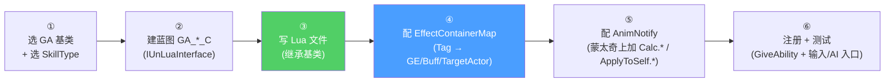

# 进阶 Cookbook 与常见陷阱

把前面 11 页的知识浓缩成 **AI 写新战斗内容的 6 步标准流程**,加上 4 套真实代码模板(普通主动技能 / 投射物 / 被动 / 词缀),再讲 4 个进阶专题(Affix / Roguelike / 怪物 AI / 换人-支援-Counter 协同),最后给出 14 类陷阱清单。AI 直接照抄改造,80% 场景能立即跑通。

## 6 步标准流程



### ① 选 GA 基类与 SkillType

| 你要做什么 | 基类 | SkillType |
|----------|------|-----------|
| 玩家普攻 | `GAPlayerBase` | `Normal` / `InAirNormal` |
| 玩家技能 | `GAPlayerBase` | `Skill` / `Skill2` |
| 玩家必杀 | `GASuperSkill` | `SuperSkill` |
| 玩家弹反 | `GASkillBase`(配 `CounterType=NormalCounter`)| `Counter` |
| 玩家闪避 | `GADodge`(项目子类)| `Dodge` |
| 玩家投射物技 | `GASkillBase` + EffectContainer 配 Projectile | 同对应技能 |
| 玩家蓄能技 | `GACharge`(项目子类)| `Charge` |
| 玩家变身技 | `GATransformationSkill` | 自定义 |
| 玩家飞行/空中术 | `GAAirEmbrace` / `GAAirTread` | InAir |
| 怪物冲锋 | `GAMonsterRush` | NPC |
| 怪物执行(吊打)| `GAMonsterExecute` | NPC |
| 怪物分身/召唤 | `GASummons` | NPC |
| 被动技 | `GAPassiveAbilityBase` | Passive |
| 词缀触发 | `GA_AffixBase` | 同源技能 |
| 受击 | `GAKnockBase`(自动派发)| Knock |
| 过场剧情技 | `GASequence` | Sequence |
| 武器特殊(机枪)| `GAWeaponBase` / `GA_Gatlin` | Weapon |

### ② 建蓝图 GA_*_C

```
1. 在 Content/Blueprints/Skill/<Type>/ 下新建 GA_<SkillName>_C
2. 父类:GA_PlayerBase_C / GA_MonsterBase_C / 等(对应 Lua 基类的蓝图层)
3. 类设置:
   - implements IUnLuaInterface
   - GetServerModuleName / GetClientModuleName 返回 Lua 路径,如:
     "CommonScript.skill.ability.Characters.<hero>.GA<SkillName>"
4. 编辑 CDO:
   - MontageToPlay = 主蒙太奇
   - SequenceToPlay (可选)
   - CooldownDuration / CostGameplayEffectDef
   - bAutoCommit = true (默认) / false (在结算帧扣)
   - AbilityData = [实例化各 UHiAbilityDataBase 子类配置]
   - EffectContainerMap = (见 ④)
   - LoadAssets / LoadClasses (Cue 资源预加载)
```

### ③ 写 Lua 文件(完整模板见下文 4 套)

### ④ 配 EffectContainerMap

```
对每个 AnimNotify 上要派发的 EventTag 加一行:
  Calc.<技能>.<段位> →
    TargetType: BP_TA_*  (具体形状)
    TargetGameplayEffectClasses: [GE_Damage_*]
    TargetBuffIDs: [B_*]
    SelfGameplayEffectClasses: [GE_Self_*]  (命中后给自己)
```

详见 [3. EffectContainer 与 Tag 驱动结算流](3.%20EffectContainer%20与%20Tag%20驱动结算流.md)。

### ⑤ 配 AnimNotify

```
打开主蒙太奇:
  Frame 12 (起手) → AnimNotify_GameplayEvent
    EventTag = Calc.<技能>.Slash01
    OptionalObject = (KnockInfo,可空)
  Frame 24 (二段) → AnimNotify_GameplayEvent
    EventTag = Calc.<技能>.Slash02
  Frame 30 (连段尾) → AnimNotify_GameplayEvent
    EventTag = ComboTail.Default
  Frame 5 (起手前置) → AnimNotify_GameplayEvent
    EventTag = ApplyToSelfCalc.<技能>.Focus  (起手就给自己上专注 buff)
```

### ⑥ 注册 + 测试

```lua
-- 在 SkillComponent.GiveAbilityWithParams (服务端) 中:
local Param = UE.FHiAbilityParam()
Param.AbilityClass = AbilityClass    -- GA_<SkillName>_C
Param.Level = 1
Param.InputID = InputID              -- EnhancedInput Action 对应的 ID
local UserData = ...                 -- 携带 SkillID
Param.UserData = UserData
ASC:GiveAbilityWithParams(Param, false)

-- 客户端通过 EnhancedInput 配 InputAction 绑到对应的 SkillID
-- 或在怪物 BT 配 BTTask_HI_TryActiveAbility 选 AbilityClass
```

## 模板 1:玩家普通主动技能

```lua
-- CommonScript/skill/ability/Characters/yunshuo/GAYunshuoSkill.lua
local GASkillBase = require("CommonScript.skill.ability.GASkillBase")
local SkillUtils  = require("CommonScript.common.skill_utils")

---@class GAYunshuoSkill : GA_Yunshuo_Skill_C
local GAYunshuoSkill = Class(GASkillBase)
GAYunshuoSkill.ClassName = "GAYunshuoSkill"

function GAYunshuoSkill:K2_OnAvatarSet(ActorInfo, Spec)
    Super(GAYunshuoSkill).K2_OnAvatarSet(self, ActorInfo, Spec)
    self.__TAG__ = string.format("[Yunshuo](%s)", G.GetObjectName(self))
end

function GAYunshuoSkill:HandleActivateAbility()
    Super(GAYunshuoSkill).HandleActivateAbility(self)
    -- 父类已注册 6 个 WaitGameplayEvent,这里只追加业务
    self.YunshuoChargeCount = self.YunshuoChargeCount or 0
end

-- 子类重写 OnCalcEvent (可选;默认走父类)
-- 父类 OnCalcEvent → __OnCalc → __OnCalcByType → 自动结算
-- 这里我们什么都不重写,纯走 EffectContainerMap

function GAYunshuoSkill:HandleEndAbility(bWasCancelled)
    Super(GAYunshuoSkill).HandleEndAbility(self, bWasCancelled)
    -- 自定义清理...
end

return GAYunshuoSkill
```

EffectContainerMap 配置:
```
Calc.Yunshuo.Slash01:
  TargetType: BP_TA_CapsuleSweep_Yunshuo_C
  TargetGameplayEffectClasses: [GE_Damage_YunshuoSlash_C]
  TargetBuffIDs: [B_Cold_Lv1]
ApplyToSelfCalc.Yunshuo.Charge:
  SelfGameplayEffectClasses: [GE_YunshuoFocus_C]
```

蒙太奇配置:
```
Frame 12 → Calc.Yunshuo.Slash01
Frame 24 → Calc.Yunshuo.Slash02
Frame 18 → ComboTail.Default
Frame 5  → ApplyToSelfCalc.Yunshuo.Charge
```

## 模板 2:投射物技能

```lua
-- CommonScript/skill/ability/Characters/<hero>/GAFireBolt.lua
local GASkillBase = require("CommonScript.skill.ability.GASkillBase")
local GAFireBolt = Class(GASkillBase)

function GAFireBolt:HandleActivateAbility()
    Super(GAFireBolt).HandleActivateAbility(self)
end

-- 重写:在 Spawn 投射物前注入额外字段
function GAFireBolt:ProjectileAdditionalInit(ProjectileActor)
    ProjectileActor.bExplodeOnHit = true
    ProjectileActor.ExplosionRadius = 200
    -- 还可以挂 Niagara 资源等
end

-- 命中回调(投射物会调回来)
function GAFireBolt:OnHitTarget(ObjectType, Hit, ApplicationTag)
    Super(GAFireBolt).OnHitTarget(self, ObjectType, Hit, ApplicationTag)
    -- 命中后做额外业务:留烟雾、播 cue 等
end

return GAFireBolt
```

EffectContainerMap:
```
Calc.FireBolt.Spawn:
  TargetType: BP_TA_FireProjectile_C
    (BP_TA_FireProjectile_C.Spec.CalcType = Projectile,
     BP_TA_FireProjectile_C.ProjectileClass = BP_Projectile_FireBolt_C)
  TargetGameplayEffectClasses: [GE_Damage_Fire_C]
  TargetBuffIDs: [B_Burn_Lv2]
```

蒙太奇:`Frame 8 → Calc.FireBolt.Spawn` (投射物 Spawn 时机)。

## 模板 3:被动技能

```lua
-- CommonScript/skill/ability/passiveability/heros/<hero>/GA_Passive_<hero>_<id>.lua
local GAPassiveBase = require("CommonScript.skill.ability.passiveability.Base.GAPassiveAbilityBase")
local GA_Passive_Yunshuo_01 = Class(GAPassiveBase)

function GA_Passive_Yunshuo_01:OnInitParameter()
    Super(GA_Passive_Yunshuo_01).OnInitParameter(self)
    -- 初始化策划数据
    self.PassiveID = 10001
    self.TriggerEventTag = UE.UHiGASLibrary.RequestGameplayTag("Event.Skill.Yunshuo.UseSkill1")
end

function GA_Passive_Yunshuo_01:OnInitEventTrigger()
    -- 监听:玩家释放技能 1 后给自己加 5 秒攻速 buff
    self:CreateWaitGameplayEventToActor(self.TriggerEventTag)
end

function GA_Passive_Yunshuo_01:HandleWaitGameplayEventToActor(GameplayTag)
    if not SkillUtils.IsServer(self.OwnerActor) then return end

    -- 检查 SingleTrigger 数据(CD/概率/次数)
    if not self:CheckSingleTriggerValue(self.SingleTriggerInfo, 1) then return end
    if self:CheckIsCooldowning(self.SingleTriggerInfo) then return end

    -- 上 buff
    self.OwnerActor.AbilitySystemComponent:ApplyBuffToSelf("B_PassiveSpeed_Lv1", 1, self)
    -- 刷新 CD
    self:RefreshCDTimeInfo(self.SingleTriggerInfo)
end

return GA_Passive_Yunshuo_01
```

蓝图层 `GA_Passive_Yunshuo_01_C` 设 `SingleTriggerData`(冷却/概率/最大触发次数等)。

## 模板 4:词缀(Affix)

词缀是项目特殊的"在普攻之上叠加元素效果"系统[^c12_affix]:

```
Content/Script/CommonScript/skill/ability/Affix/
├── BingBao    -- 冰爆
├── Cleaner
├── DamageGrantBuff
├── DianRen    -- 电人
├── DuZhao     -- 毒爪
├── FuLian     -- 复联
├── LeiJI      -- 雷击
├── Mission
├── QingCha    -- 清查
├── RanShao    -- 燃烧
└── ShouHu     -- 守护
```

每个 Affix 通常包含:
- `GA_Affix_<Name>_C` — 词缀 GA(继承 GA_AffixBase_C)
- `B_Affix_<Name>_Lv1` — 词缀 Buff(以叠层数表征强度)
- `GE_Buff_Affix_<Name>_C` — 词缀 Buff 的 GE
- `GC_Affix_<Name>_*` — 词缀表现 Cue(在 `Content/Script/skill/GameplayCues/Affix/`)

```lua
-- CommonScript/skill/ability/Affix/RanShao/GA_Affix_RanShao.lua (虚构示例)
local GA_AffixBase = require("CommonScript.skill.ability.GA_AffixBase")
local GA_Affix_RanShao = Class(GA_AffixBase)

function GA_Affix_RanShao:OnApplyAffix(Target)
    if not SkillUtils.IsServer(self.OwnerActor) then return end

    -- 给目标上"燃烧"buff,叠层
    local Handle = Target.AbilitySystemComponent:ApplyBuffToTarget(
        Target.AbilitySystemComponent, "B_RanShao_Lv1", 1, self)
    -- buff 在自身 GE 内挂 dynamic Cue,Lua 不需手动播

    -- 额外:每叠 3 层触发一次大爆炸
    local Stack = Target.AbilitySystemComponent:K2_GetCurrentStackCount(Handle)
    if Stack > 0 and Stack % 3 == 0 then
        self:TriggerExplosion(Target)
    end
end

return GA_Affix_RanShao
```

## 进阶专题 1:Affix 词缀系统[^c12_affix]

```mermaid
flowchart TB
    SKILL[玩家普攻 GA] --> CALC[OnCalcEvent → 命中 Hits]
    CALC --> AFFCMP[AffixComponent (玩家身上)]
    AFFCMP --> CHK{当前装备 Affix Tag?}
    CHK -->|Cold| RA[GA_Affix_BingBao 触发]
    CHK -->|Fire| RB[GA_Affix_RanShao 触发]
    CHK -->|Lightning| RC[GA_Affix_DianRen 触发]

    RA --> APPLY[ApplyBuffToTarget 元素 Buff]
    RB --> APPLY
    RC --> APPLY

    APPLY --> GE[GE_Buff_<Affix>_C<br/>DynamicGameplayCues]
    GE --> CUE[Affix Cue (烟雾/灼烧)]

    style AFFCMP fill:#4a9eff,color:#fff
```

特点:
- **解耦**:词缀独立于具体技能,任何普攻都能触发
- **叠加**:用 Buff 的 StackCount 表示强度
- **配置驱动**:角色装备词缀通过 PassiveSkill 注册触发条件
- **表现独立**:每个词缀有专属 Cue 树,不互相污染

## 进阶专题 2:Roguelike 流派系统

```
Content/Script/CommonScript/skill/ability/roguelike/
├── Arabella
├── base
└── thunderspear

Content/Script/CommonScript/skill/ability/passiveability/roguelike_rune/
└── (符文相关被动)
```

```mermaid
flowchart LR
    RG[Roguelike GameMode] --> RUNE[符文 (Rune)]
    RUNE --> KW[Kwaidan (怪谈)]
    RUNE --> AR[Arabella]
    RUNE --> TS[ThunderSpear]

    KW --> GA[GA_Kwaidan_Arabella.lua<br/>(各种符文具体实现)]
    AR --> PASSIVE[passiveability/roguelike_rune/<br/>对应被动]
    TS --> PASSIVE

    PASSIVE --> EFFECT[属性加成 / 触发条件 / 特殊技能]

    style RG fill:#ff9f43,color:#fff
```

实现方式:
- 进入 Roguelike 时给玩家 ASC 加一组 PassiveAbility 实例(对应符文)
- 符文之间通过 GameplayEvent 互相联动(如"火符文 + 风符文 = 火旋风"组合技)
- 数值由 PassiveAbility 自带的 Magnitude 注入到普攻/技能

## 进阶专题 3:怪物 AI 技能

怪物分类(项目实测的怪谈系列):
```
Content/Script/CommonScript/actors/monsters/
├── ZiZhiHui   -- 紫芝荟
│   ├── ZzhA   -- 类型 A (近战农夫等)
│   ├── ZzhB   -- 类型 B (电工等)
│   ├── ZzhC   -- 类型 C
│   └── ZzhD   -- 类型 D (孢子等)
├── TLMY       -- 听老梦语 (大 boss)
├── TGDS       -- 怪物 D
├── PikaMecha  -- 皮卡机甲
├── CaoDuo     -- 草垛系列
├── RMS        -- RMS
└── JrzztA     -- 金人怪 A
```

每只怪物:
- `BP_Monster_<Name>_C` — 蓝图主类(继承 HiCharacter / 蓝图层 BP_MonsterBase)
- `BT_Monster_<Name>` — 行为树
- `BB_Monster_<Name>` — Blackboard
- `Skill/GA_Monster_<Name>_<SkillName>.lua` — 各技能 Lua

### 怪物 GA 与玩家 GA 的差异

| 差异点 | 玩家 GA | 怪物 GA |
|--------|---------|---------|
| 入口 | 输入 → SkillDriver | BT → BTTask_HI_TryActiveAbility |
| 基类 | GAPlayerBase 派生 | GAMonsterRush / GASkillBase 派生 |
| 蒙太奇 | 包括各连段 | 通常单段或两段 |
| ComboBeginSection | SkillDriver 切招控制 | BTTask 节点直接配 |
| 服务器/客户端 | 强客户端预测 | 服务端权威,客户端表现 |
| Counter | 主动玩 | 被动被打 |
| 韧性 | 不重要 | 关键:决定是否被破防 |

### 怪物伤害计算关键

伤害公式仍走 `ExecCalc_Damage`,但有几个特殊点:
- 怪物的 `MonsterLevel` 来自 `Pawn.MonsterLevel`(不是 PlayerState)
- 怪物的 Tenacity 上限可被技能"破防"机制击穿,触发"失衡"buff
- 怪物的 HitZone(头/弱点)由 `monster_hit_zone_component.lua` 驱动

详见 [7. ExecCalc 伤害计算](7.%20ExecCalc%20伤害计算.md)。

## 进阶专题 4:换人/支援/Counter 协同

```mermaid
flowchart TB
    SUB[换人/支援系统]
    SUB --> SPC[SwitchPlayerComponent]
    SUB --> ASC[AssistSkillComponent]
    SUB --> SUP[支援角色 Pawn]

    SPC --> SWE[OnSwitchOut / OnSwitchIn]
    SWE --> SK[SkillComponent.PlayerBeforeSwitchOut]
    SK --> ALL[所有 GA.HandleBeforeSwitchOut]

    ASC --> AA[助战角色释放技能<br/>(SupportSkillType)]
    AA --> COMP[Pawn 暂时变身为助战角色]
    AA --> CUE[过场 Sequence(独立相机)]

    SUP --> CC[bAssistCounter]
    CC --> CG[GameState.bAssistCounter]
    CG --> CHECK[GASkillBase.CanTriggerCounterWitch<br/>分支:支援触发还是切人触发]

    style SPC fill:#4a9eff,color:#fff
    style ASC fill:#ff9f43,color:#fff
    style CC fill:#ff6b6b,color:#fff
```

### 切人路径

```
玩家按"切人键"(InputAction.SwitchPlayer)
  → SwitchPlayerComponent.RequestSwitch
    → MulticastBeforeSwitchOut (Server RPC)
      → actor:SendMessage("PlayerBeforeSwitchOut")
        → SkillComponent:PlayerBeforeSwitchOut
          → 当前所有激活 GA.HandleBeforeSwitchOut
            → GASkillBase.HandleBeforeSwitchOut
              → if InCounterWitch: EndCounterWitchTime ★
        → 切换 Pawn 操控权,SwitchInComponent 执行入场动画
```

### IsPreAttackSwitch — 切人触发 Counter

```lua
-- SwitchPlayerComponent (蓝图)
function SwitchPlayerComponent:IsPreAttackSwitch()
    return self.bSwitchInPreAttackTime
        -- 在切入瞬间(几帧),如果对方有 PreAttack(预警攻击 buff)
        -- → 这个切人就视为"完美切入",触发 Counter
end
```

详见 [8. Knock 与 Counter 巫师时间](8.%20Knock%20与%20Counter%20巫师时间.md)。

## 战斗触发与怪物布设

### Trigger 体积驱动战斗

```
Source/HiGame/Public/Trigger/
├── HiTriggerBox.h              -- 立方体触发器
├── HiTriggerVolume.h            -- 通用体积触发器
├── ConvexTriggerVolume_POI.h   -- POI 触发器(凸形)
├── ConvexTriggerVolume_RequestEnterPlane.h  -- 入界面体积
├── AConvexTriggerVolume.h
└── WeatherChangeActor.h         -- 天气切换触发(影响战斗环境)
```

### TriggerManagementSystem

```
Source/HiGame/Public/TriggerManagementSystem/
├── HiGlobalTriggerActor.h
├── HiPhysicalMaterialTriggerActor.h
├── HiVolumeTriggerActor.h
├── HiVoxelTriggerActor.h
├── HiTriggerEffectBaseComponent.h
├── HiTriggerInterfaceComponent.h
└── HiTriggerEffectComponents/
    ├── BGMEffectComponent.h
    ├── EnvironmentOverrideComponent.h
    └── InteractionTriggerComponent.h
```

> **战斗触发模式**:
> 1. 玩家进入 `ConvexTriggerVolume_POI` → 派发 `OnPlayerEnter` 事件
> 2. 关卡蓝图监听事件 → 调用 `UGameplayStatics::SpawnActor` Spawn 怪物波次
> 3. 玩家进入 `HiVolumeTriggerActor` → 触发 BGM 切换 / 环境 Override
> 4. 当所有怪物死亡 → 派发 `OnAllEnemiesDead` → 关闭战斗 BGM

### Game Feature 布设

```cpp
// Public/GameFeatures/GameFeatureAction_AddSpawnedActors.h
UCLASS()
class HIGAME_API UGameFeatureAction_AddSpawnedActors : public UGameFeatureAction
{
    UPROPERTY(EditAnywhere)
    TArray<FSpawnedActorEntry> ActorsToSpawn;

    virtual void OnGameFeatureRegistering() override;
    virtual void OnGameFeatureLoading() override;
    virtual void OnGameFeatureActivating() override;
    virtual void OnGameFeatureDeactivating() override;
};
```

> 用 Game Feature 启用机制(如新关卡章节)→ 自动 Spawn 一批 Actor 到关卡。比 SubLevel 灵活,比直接放关卡里可热插拔。

### BattleStateCommon 全局战斗状态[^c12_battle]

```lua
-- CommonScript/actors/components/battle_state_common.lua
function BattleStateCommon:IsInBattle()
    local PlayerState = self.actor:GetAvatarPlayerState()
    if PlayerState then
        return PlayerState.BattleTargetComponent:IsInBattle()
    end
    return false
end

function BattleStateCommon:OnEnterBattle(OldTarget, NewTarget)
    if self:__HasAuthorityToRecord() then
        self:SendMessage("SetInBattleState", true)
        self:_RecordEnterBattle()
    end
end

function BattleStateCommon:OnLeaveBattle(OldTarget, Reason)
    if self:__HasAuthorityToRecord() then
        self:_RecordLeaveBattle()
        self:SendMessage("SetInBattleState", false)
    end
end
```

记录的战斗数据:
- 极限闪避计数(`extreme_dodge_cnt / success`)
- Counter 计数(`counter_cnt / success`)
- 失衡计数(`out_balance_cnt / out_balance_super_cnt`)
- 角色出场时间(`hero_up_time`)
- 战斗伤害记录(`__GetBattleDamageRecord`)

数据用于:
- 结算面板 UI
- 玩家成就触发(GameEventBus)
- AI 老手玩家行为分析

## 14 类陷阱清单

```mermaid
flowchart TB
    P1["陷阱 1<br/>新代码写到旧 skill/ 树"]
    P2["陷阱 2<br/>Knock GA 用错入口<br/>(K2_ActivateAbility 而不是 FromEvent)"]
    P3["陷阱 3<br/>K2_OnEndAbility 不清 Lua Task"]
    P4["陷阱 4<br/>EffectContainerMap 漏 Self*"]
    P5["陷阱 5<br/>ExecCalc 直接调反射函数"]
    P6["陷阱 6<br/>修改 26 ATTR_INDEX 下标"]
    P7["陷阱 7<br/>跨 DS 不实现 PreTransfer"]
    P8["陷阱 8<br/>用 OwnerActor 缓存关键状态"]
    P9["陷阱 9<br/>TeamBuff 走错通道"]
    P10["陷阱 10<br/>巫师时间不清 Counter 残留"]
    P11["陷阱 11<br/>AI Pawn 没学会 SkillClass"]
    P12["陷阱 12<br/>用 InAir Tag 不查 bCanActivateInAir"]
    P13["陷阱 13<br/>属性中间层 vs 战斗 buff 混"]
    P14["陷阱 14<br/>Lua local 缓存数据残留"]

    style P5 fill:#ff6b6b,color:#fff
    style P6 fill:#ff6b6b,color:#fff
    style P7 fill:#ff6b6b,color:#fff
    style P3 fill:#ff6b6b,color:#fff
```



### 详细说明

1. **新代码写到旧 skill/ 树** — 旧 `Content/Script/skill/` 是历史遗留,只剩部分 Affix/Knock/SimpleSummon 在用。新代码必须落 `CommonScript/skill/` 才会被规范的代码审查覆盖。
2. **Knock GA 用错入口** — Knock GA 由 GameplayEvent 触发,**入口是 `K2_ActivateAbilityFromEvent`,不是 `K2_ActivateAbility`**。写错了 EventData 参数收不到。
3. **K2_OnEndAbility 不清 Lua Task** — Lua AbilityTask 没有 GAS GC,必须 `LuaAbilityTaskFactory.CleanupTasksForAbility(self)`。漏写就内存泄漏。
4. **EffectContainerMap 漏 Self*** — 想"命中后给自己上 Buff",必须配 `SelfGameplayEffectClasses` 或 `SelfBuffIDs`,不是写在 `TargetGameplayEffectClasses`。
5. **ExecCalc 直接调反射函数** — 必须走 `GetAttributeValueByIndex` 间接路径(读 `_CurrentCalcData.AttributeValues`),直接调 `GetAttrValueByIndex` 性能炸 10-30 倍。
6. **修改 26 ATTR_INDEX 下标** — 加新属性只能 append 在末尾。改下标会让所有派生公式静默错。
7. **跨 DS 不实现 PreTransfer** — Lua AbilityTask 引用旧 World 对象,迁移后不主动清会崩。**必须 K2_PreTransfer 清 Task,K2_PostTransfer 重建监听**。
8. **用 OwnerActor 缓存关键状态** — `self.OwnerActor.LastSkillTime = ...` 这种状态在迁移时不会跟着同步,改用 LooseGameplayTag 或中间层 GE。
9. **TeamBuff 走错通道** — TeamBuff 必须走 `BuffComponent.AddBuffByID`(自动判 TeamASC),直接 `ASC.ApplyBuffToSelf` 不会广播到队友。
10. **巫师时间不清 Counter 残留** — `InCounterWitch` 状态在切角色时必须强制清,**`HandleBeforeSwitchOut` 父类已实现自动清,子类覆写时记得 `Super(...).HandleBeforeSwitchOut(self)`**。
11. **AI Pawn 没学会 SkillClass** — `BTTask_HI_TryActiveAbility` 调 `FindAbilitySpecHandleFromClass`,Handle == -1 报错"has not learned Skill"。怪物必须在 OnGiveAbility 阶段 GiveAbility 这个类。
12. **用 InAir Tag 不查 bCanActivateInAir** — BT 走的怪物如果 GA `bCanActivateInAir = false`,Pawn 在空中(`InAirTag` 在 ASC 上)→ BTTask 直接返回 nil(不 Failed,默认重试)。
13. **属性中间层 vs 战斗 buff 混** — 角色等级、武器、装备这些"养成系"必须走 `AttributeComponent.ApplyHeroGameplayEffect*`(走 UID 中间层);战斗中的临时 buff 走 `ASC.ApplyBuffToSelf`(直接 GAS)。混用会导致 GameType 切换时清错。
14. **Lua local 缓存数据残留** — `local _CurrentCalcData` 这种文件 local 变量,Execute 后必须 `_CurrentCalcData = nil`;`self.field` 在多次 Execute 间会保留,**清字段也要主动赋 nil**。

## 自检清单(写完一个新技能必过 14 项)

```
☐ ① 选了对的 GA 基类 (普攻/必杀/被动/弹反 各不同)
☐ ② 蓝图层 implements IUnLuaInterface 路径正确
☐ ③ Lua 文件路径在 CommonScript/(不是 skill/)
☐ ④ EffectContainerMap 至少配了一行 Calc.* + 对应 GE
☐ ⑤ 蒙太奇上至少 2 个 AnimNotify_GameplayEvent (起手/结算)
☐ ⑥ ComboTail 配置 (允许切招的窗口)
☐ ⑦ K2_OnEndAbility 调用了 Super 与 LuaAbilityTaskFactory.Cleanup
☐ ⑧ 投射物有配 OnUnBindProjectile / 在 EndAbility 销毁
☐ ⑨ Counter 类技能配了 CounterType + 对应 EndCounterWitchTag
☐ ⑩ Self GE/Buff 配在 SelfGameplayEffectClasses (不是 Target)
☐ ⑪ DDS 跨服测试: K2_PreTransfer 清 Task,K2_PostTransfer 重建
☐ ⑫ ExecCalc 走 _CurrentCalcData 不直接调反射
☐ ⑬ Buff 走 BuffComponent.AddBuffByID (TeamBuff 自动判)
☐ ⑭ Cue 资源在 GA.LoadAssets / LoadClasses 预加载
```

## 跨页参考

- 起手前 → [1. 总览](1.%20总览%20—%20战斗脚本架构与目录拓扑.md)
- 选对 GA 基类 → [2. GA 继承层次与生命周期](2.%20GA%20继承层次与生命周期.md)
- 配 EffectContainerMap → [3. EffectContainer 与 Tag 驱动结算流](3.%20EffectContainer%20与%20Tag%20驱动结算流.md)
- 加属性 → [4. AttributeSet 与 Hero 属性中间层](4.%20AttributeSet%20与%20Hero%20属性中间层.md)
- 加 Buff → [5. Buff 系统](5.%20Buff%20系统%20—%20BuffID%20到%20GE%20的链路.md)
- TargetActor / 投射物 → [6. TargetActor、Projectile 与命中检测](6.%20TargetActor、Projectile%20与命中检测.md)
- 写伤害公式 → [7. ExecCalc 伤害计算](7.%20ExecCalc%20伤害计算.md)
- Counter 弹反 → [8. Knock 与 Counter 巫师时间](8.%20Knock%20与%20Counter%20巫师时间.md)
- 表现 Cue → [9. GameplayCue 表现层](9.%20GameplayCue%20表现层.md)
- 输入/AI/动画接 → [10. 输入、AI 与动画接入](10.%20输入、AI%20与动画接入.md)
- DDS / Lua 边界 → [11. C++ 与 Lua 边界 + DDS 迁移](11.%20C%2B%2B%20与%20Lua%20边界%20+%20DDS%20迁移.md)

## 一句话总结

> **HiGame 战斗 = "GAS 骨架 + DDS 中间层 + Lua 业务"**。
> 99% 的战斗内容都是 **选基类 + 配 EffectContainerMap + 写 Lua + 配 AnimNotify** 的组合。
> 当你迷路时:**Tag 是货币,EffectContainer 是市场,GA 是商人,ASC 是仓库**。

[^c12_affix]: `Content/Script/CommonScript/skill/ability/Affix/*` `Content/Script/skill/GameplayCues/Affix/*`
[^c12_battle]: `Content/Script/CommonScript/actors/components/battle_state_common.lua` `battle_starup_component.lua`
