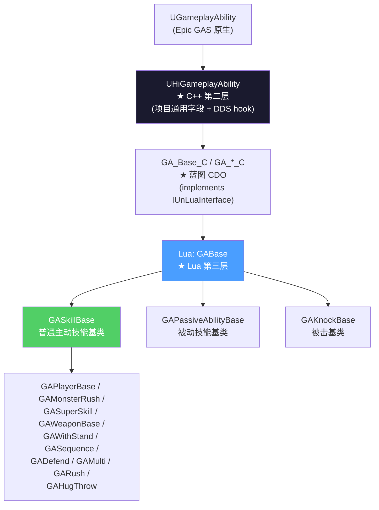
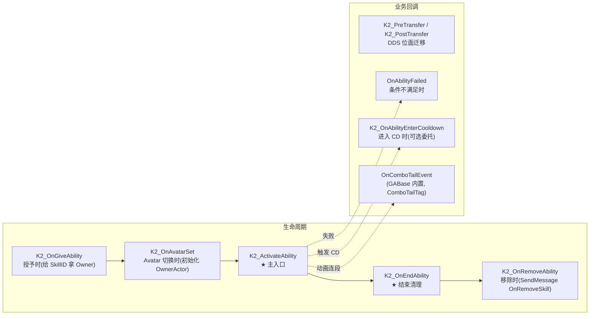
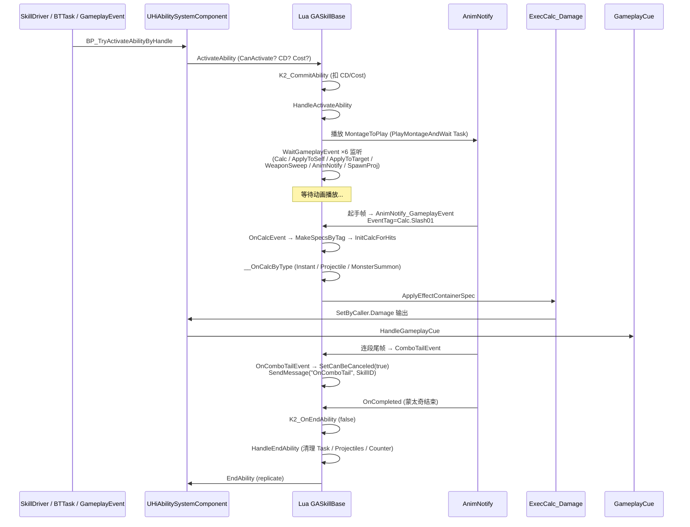
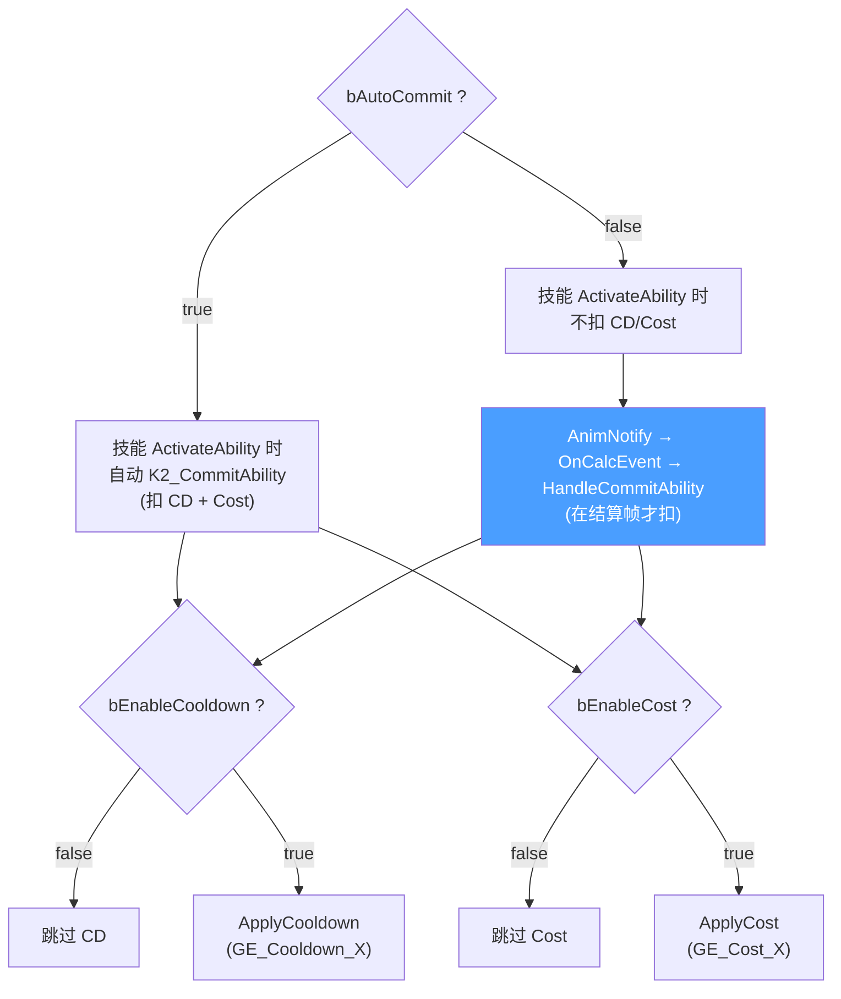

# GA 继承层次与生命周期

GameplayAbility(GA)是战斗的最小执行单元。HiGame 在 Epic GAS `UGameplayAbility` 之上做了**两层增强**:C++ `UHiGameplayAbility` 加项目级字段、Lua `GABase` 集成 ComboTail/Counter/位面迁移/技能数据。本页给出三层继承图、9 个关键钩子的入口/触发条件/可覆写位置,以及一条 GA 从 Activate 到 EndAbility 的完整生命周期[^c01][^c06]。

## 三层继承全景



> **绑定路径**:蓝图 `GA_Base_C` 实现 `IUnLuaInterface.GetServerModuleName/GetClientModuleName`,返回 Lua 模块路径(如 `"CommonScript.skill.ability.GABase"`)。UnLua 在蓝图实例化时反射加载该模块,Lua 表里同名方法自动 override 蓝图的 `K2_*` 事件。
> 详见 [11. C++ 与 Lua 边界 + DDS 迁移](11.%20C%2B%2B%20与%20Lua%20边界%20+%20DDS%20迁移.md)。

## UHiGameplayAbility 关键字段速查

```cpp
// Public/HiAbilities/HiGameplayAbility.h
class HIGAME_API UHiGameplayAbility : public UGameplayAbility
{
    // ───── 资源 ─────
    UPROPERTY(EditDefaultsOnly, BlueprintReadWrite)
    TObjectPtr<UAnimMontage> MontageToPlay;       // 主蒙太奇

    UPROPERTY(EditDefaultsOnly, BlueprintReadWrite, Category="Sequence")
    TObjectPtr<ULevelSequence> SequenceToPlay;    // 过场序列(可选)

    UPROPERTY(EditDefaultsOnly, BlueprintReadWrite, Category="Sequence")
    TObjectPtr<UCameraAnimationSequence> CameraSequenceToPlay;

    // ───── Cooldown / Cost ─────
    UPROPERTY(BlueprintReadOnly, EditAnywhere, Category="Cooldowns")
    FHiAbilityMagnitude CooldownDuration;         // CD 时长(支持 Magnitude 公式)
    UPROPERTY(EditDefaultsOnly, Instanced, Category=Costs)
    TObjectPtr<UHiGameplayEffectDef> CostGameplayEffectDef;
    UPROPERTY(EditDefaultsOnly, BlueprintReadOnly)
    bool bAutoCommit = true;                      // 是否自动 Commit CD/Cost

    // ───── 配置 ─────
    UPROPERTY(BlueprintReadOnly, EditDefaultsOnly, Instanced, Category="Ability|Data")
    TArray<TObjectPtr<UHiAbilityDataBase>> AbilityData;   // ★ 业务配置容器
    UPROPERTY(BlueprintReadOnly, EditAnywhere, Category="Magnitude Modifiers")
    TMap<FGameplayTag, FHiAbilityMagnitudeModifier> MagnitudeModifiers;
    UPROPERTY(EditDefaultsOnly, Instanced)
    TArray<TObjectPtr<UObject>> LoadAssets;       // 预加载资源 (异步)
    UPROPERTY(EditDefaultsOnly, Instanced)
    TArray<TSubclassOf<UObject>> LoadClasses;

    // ───── ★ 核心:EffectContainerMap ─────
    UPROPERTY(EditDefaultsOnly, BlueprintReadOnly)
    TMap<FGameplayTag, FHiGameplayEffectContainer> EffectContainerMap;

    // ───── DDS 迁移 ─────
    virtual void PreTransfer();
    UFUNCTION(BlueprintImplementableEvent) void K2_PreTransfer();
    virtual void SerializeTransferPrivateData(FArchive& Ar, UPackageMap* PackageMap);
    virtual void PostTransfer();
    UFUNCTION(BlueprintImplementableEvent) void K2_PostTransfer();
    virtual void HandlePostTravelWorld(const FGameplayAbilityActorInfo* ActorInfo,
                                       const FGameplayAbilitySpec& Spec);
};
```

| 字段 | 用途 | 详细页 |
|------|------|--------|
| `MontageToPlay` / `SequenceToPlay` | 技能动画/过场资源 | [9. GameplayCue](9.%20GameplayCue%20表现层.md) |
| `CooldownDuration` / `CostGameplayEffectDef` | 冷却/消耗,可被 Lua 端 `EnableCost`/`EnableCooldown` 动态关闭 | (本页下文) |
| `bAutoCommit` | true=技能开始自动扣 CD,false=结算帧 `K2_CommitAbilityCooldown/Cost` | (本页下文) |
| `AbilityData` | **★** 各技能私有配置(SkillTarget/Counter/MotionWarp/MonsterSummon 等),通过 `FindAbilityDataByClass<T>()` 取 | [12. Cookbook](12.%20进阶%20Cookbook%20与常见陷阱.md) |
| `MagnitudeModifiers` | 技能内部数值的运行时修正(被被动/buff 注入) | [4. AttributeSet](4.%20AttributeSet%20与%20Hero%20属性中间层.md) |
| `EffectContainerMap` | **★★★** Tag → (TargetGEs + SelfGEs + BuffIDs + TargetActor 类型),所有结算结果都从这里取 | [3. EffectContainer](3.%20EffectContainer%20与%20Tag%20驱动结算流.md) |

## 9 个关键 K2 钩子

GA 暴露给蓝图/Lua 的事件分**生命周期**与**业务回调**两类:



### `K2_OnGiveAbility(OwnerActor)` — 授予

```lua
-- CommonScript/skill/ability/GABase.lua
function GABase:K2_OnGiveAbility(OwnerActor)
    rawset(self, "OwnerActor", OwnerActor)
    rawset(self, "Owner", OwnerActor.SkillComponent)
end
```

**触发**:`ASC:GiveAbilityWithParams` 服务端调用(或 OnRep_ActivateAbilities 客户端复制)。
**用途**:缓存 Owner、注册被动监听(被动 GA 在这里就开始工作)。
**陷阱**:此时 `AvatarActor` 还可能为空,`OwnerActor` 是 ASC 的 Owner(通常是 PlayerState),用 `K2_OnAvatarSet` 才能拿到 Pawn。

### `K2_OnAvatarSet(ActorInfo, Spec)` — Avatar 关联

```lua
function GABase:K2_OnAvatarSet(ActorInfo, Spec)
    rawset(self, "OwnerActor", ActorInfo.AvatarActor)
end
```

**触发**:Avatar(Pawn)被设置或切换(切人时也会触发)。
**用途**:重新拿 Pawn 引用、刷新 SkillComponent。

### `K2_ActivateAbility` — 主入口

`GASkillBase` 把入口拆成 6 个步骤:

```lua
-- CommonScript/skill/ability/GASkillBase.lua
function GASkillBase:K2_ActivateAbility()
    self.bCounter = false
    self:OnActivateAbility()                  -- ① 通用初始化(GABase)

    if not self:K2_CommitAbility() then       -- ② Commit CD/Cost
        self:K2_EndAbility()
        return
    end

    self:SetOwnerBoneServerUpdate(true)       -- ③ 服务端骨骼更新
    self:HandleActivateAbility()              -- ④ 业务流(可被子类完全覆写)
end

function GASkillBase:HandleActivateAbility()
    self.Projectiles = {}
    self.ApplyToSelfMap = {}
    self.bAbilityCommitted = false

    if self.bEnableWeaponWarp then            -- 武器 warp 到目标位置
        self:HandleMotionWarpWeapon()
    end
    self.OwnerActor:ClearVelocityAndAcceleration()
    self:HandleMovementAndStateWhenActivate()  -- 状态/位移模式

    if self.bPlayMontageForCombo then         -- 蒙太奇(连击/单段)
        self:HandlePlayMontageForCombo()
    else
        self:HandlePlayMontage()
    end

    self:HandleComboTail()                     -- ⑤ 连段尾事件监听
    self:HandleCalc()                          -- ⑥ 注册 CalcPrefixTag 监听
    self:HandleWeaponSweepCalc()               -- ANS_MonsterWeaponAttack 驱动
    self:HandleApplyToSelfCalc()               -- ApplyToSelfCalcPrefixTag 监听
    self:HandleApplyToTargetCalc()             -- ApplyToTargetCalcPrefixTag 监听
    self:HandleProjectile()                    -- SpawnProjectilesTag 监听
    self:HandleAnimNotifyEvent()               -- AnimNotifyTag(SwitchSection 等)

    if self.bSwitchInSkill then
       self.OwnerActor:SendMessage("PendingSwitchInSkill", self.SkillID)
    end
    self:TryTriggerSkillActivate()
    self.OwnerActor:SendMessage("OnUseSkill", self:GetSkillID())
end
```

> 这是**所有主动技能的标准模板**。子类基本只覆写 `HandleActivateAbility`、`HandleMovementAndStateWhenActivate`、`OnCalcEvent`、`__OnCalcByType` 等几个钩子,主流程不动。

### `K2_OnEndAbility(bWasCancelled)` — 结束清理

```lua
function GABase:K2_OnEndAbility(bWasCancelled)
    -- ★ Lua AbilityTask 自动清理(防内存泄漏)
    local LuaAbilityTaskFactory = require("CommonScript.skill.ability.luatask.LuaAbilityTaskFactory")
    LuaAbilityTaskFactory.CleanupTasksForAbility(self)

    self.bEnd = true
    self:ClearTasks()
    self.ObjectReferList:Clear()
    self:SetOwnerBoneServerUpdate(false)
    self:HandleEndAbility(bWasCancelled)
end

function GABase:HandleEndAbility(bWasCancelled)
    if self.TickHandle and self.TickHandle > 0 then
        self.OwnerActor:UnRegisterTickCallback(self.TickHandle)
    end
    if self.bShouldClearSpeed then
        self:ClearSpeed()
    end
    local UserData = self:GetCurrentUserData()
    if UserData then
        self.OwnerActor:SendMessage("OnEndAbility", UserData.SkillID, self.SkillType, self:GetMontageToPlay())
        self:ResetUserData()
    end
    self:HandleMovementAndStateWhenEnd(bWasCancelled)
    if not bWasCancelled then
        self:NotifyAbilityInfoState(false)
    end
end
```

**陷阱清单**(都在这里清):
- AbilityTask 引用(走 ClearTasks)
- 抛射物(`self.Projectiles[*]:DestroySelf()`)
- Counter 巫师时间(`EndCounterWitchTime`)
- PlayMontageCallbackProxy 委托
- TickHandle
- MovementMode / CharacterStateManager 复位

## ActivateAbility → EndAbility 全程时序



## ComboTail 与中断窗口

`GABase:HandleComboTail` 注册 `ComboTailTag`(常见 `Event.AnimNotify.ComboTail`),AnimNotify 在动画的"连段窗口起点"发出此事件,GA 收到后:

```lua
function GABase:OnComboTailEvent(Payload)
    if self.OwnerActor:GetLocalRole() == UE.ENetRole.ROLE_ServerSimulatedProxy then
        return
    end
    self:SetShouldBlockOtherAbilities(false)   -- ★ 解锁其他技能可激活
    self:SetCanBeCanceled(true)                -- ★ 自身可被取消
    self:HandleComboTailState(Payload)
    self.OwnerActor:SendMessage("OnComboTail", self:GetSkillID())
end
```

这是 ARPG 战斗手感的核心:**动画播完才能切下一招很僵,在动画一半就开窗才丝滑**。HiGame 用 ComboTailTag 显式标注每个动画的"丝滑期",而不是硬编码时长。

## CD 与 Cost 的双路径



### Lua 端动态开关

```lua
-- 关闭 CD/Cost(免费技能)
function GAYourSkill:OnActivateAbility()
    Super(GAYourSkill).OnActivateAbility(self)
    if self:GetAbilityHitCount() == 0 then    -- 第一次释放免费
        self:EnableCost(false)
        self:EnableCooldown(false)
    end
end
```

`GABase:K2_GetCostGameplayEffect / K2_GetCooldownGameplayEffect` 内部检查 `self.bEnableCost / bEnableCooldown`,返回 `nil` 即跳过。

## 被动 GA 的不同生命周期

被动技能不走 `K2_ActivateAbility` 主线,而是 `OnInitParameter → ActivatePassiveAbility → OnInitEventTrigger → HandleAutoEffect*`[^c08]:

```lua
-- CommonScript/skill/ability/passiveability/Base/GAPassiveAbilityBase.lua
function GAPassiveAbilityBase:ActivatePassiveAbility()
    self:OnInitEventTrigger()                          -- ① 注册各类 GameplayEvent 监听
    if SkillUtils.IsMultiServerOrSingleClient(self.OwnerActor) then
        if SkillUtils.IsServer(self.OwnerActor) then
            self:HandleAutoEffectToSelf()              -- ② 自动给自己加 Buff
            self:HandleAutoEffectToMaster()            -- ③ 自动给主人(队友)加 Buff
            self:ReceiveAutoEffectApply()
        else
            self:Server_ClientTryAutoEffect()          -- ④ 客户端发 RPC 请求
        end
    end
    self:HandleRemoveInfoEvent()                       -- ⑤ 注册移除事件
    self:HandleAutoCheckEvent()                        -- ⑥ 周期性检查
end
```

被动 GA 的`UHiPassiveGameplayAbility::SingleTriggerData`定义了:
- 触发 GameplayTag 列表
- CD(`PreCD` / `Limit`)
- 触发概率(`CheckIsTriggerProbability`)
- 触发次数上限(`CheckIsMaxTriggerTime`)
- 叠层缓存(`RefreshCacheOverlayCount`)

详见 [12. 进阶 Cookbook](12.%20进阶%20Cookbook%20与常见陷阱.md) 的"被动技能"章节。

## DDS 位面迁移

DDS 架构下 Actor 会跨 DS 迁移,GA 实例必须**在迁移前主动清理 AbilityTask**(因为 AbilityTask 引用了对面 World 的对象),迁移后再重建:

```cpp
virtual void PreTransfer();      // 父类 RAII
UFUNCTION(BlueprintImplementableEvent) void K2_PreTransfer();
virtual void PostTransfer();
UFUNCTION(BlueprintImplementableEvent) void K2_PostTransfer();
```

```lua
function GABase:K2_PostTransfer()
    local OwnerActor = self:GetAvatarActorFromActorInfo()
    rawset(self, "OwnerActor", OwnerActor)
    if OwnerActor then
        rawset(self, "Owner", OwnerActor.SkillComponent)
    end
end

-- 被动 GA 还需重建事件监听
function GAPassiveAbilityBase:K2_PostTransfer()
    self:OnInitEventTrigger()
    self:HandleRemoveInfoEvent()
    -- 重建 AutoBuff 列表...
end
```

详见 [11. C++ 与 Lua 边界 + DDS 迁移](11.%20C%2B%2B%20与%20Lua%20边界%20+%20DDS%20迁移.md)。

## 一页速查

| 钩子 | 何时调 | 在哪写 | 注意 |
|------|--------|--------|------|
| `K2_OnGiveAbility(Owner)` | 授予时(可能在 PossessedBy 之前) | GABase / 被动 | Owner = ASC 的 Owner,不是 Pawn |
| `K2_OnAvatarSet(Info, Spec)` | Avatar 关联/切换时 | GABase | 才有 Pawn |
| `K2_CanActivateAbility` | 激活前条件检查 | GABase | bDisabled / 死亡判定 |
| `K2_ActivateAbility` | 激活时 | GASkillBase / 子类 | 主入口,通过 HandleActivateAbility 拆步 |
| `OnCalcEvent(Payload)` | AnimNotify 触发 CalcPrefixTag | GASkillBase | 主结算入口 |
| `OnApplyToSelfCalcEvent` | AnimNotify 触发 ApplyToSelf | 子类按需 | 给自身上 Buff |
| `OnApplyToTargetCalcEvent` | AnimNotify 触发 ApplyToTarget | 子类按需 | 给预设目标上 Buff |
| `OnComboTailEvent` | AnimNotify 触发 ComboTail | GABase 默认通用 | 解锁切招/取消窗口 |
| `K2_OnEndAbility(bCancelled)` | 任何方式结束 | GABase | 必须做的清理见上文 |
| `K2_PreTransfer` / `K2_PostTransfer` | DDS 跨 DS 迁移 | GABase + 业务子类 | 必须重建 AbilityTask |

[^c01]: `Source/HiGame/Public/HiAbilities/HiGameplayAbility.h`
[^c06]: `Content/Script/CommonScript/skill/ability/GABase.lua` `GASkillBase.lua`
[^c08]: `Content/Script/CommonScript/skill/ability/passiveability/Base/GAPassiveAbilityBase.lua`、`Source/HiGame/Public/HiAbilities/HiPassiveGameplayAbility.h`
