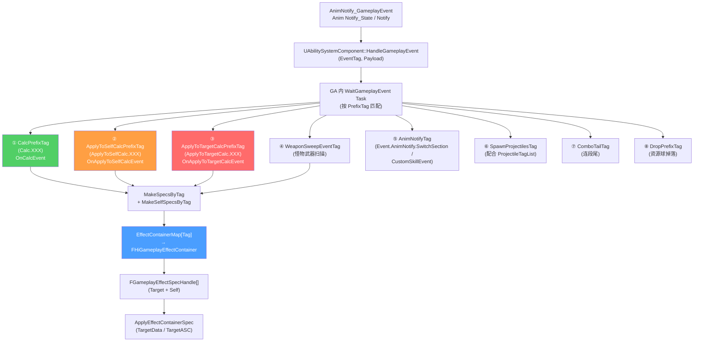
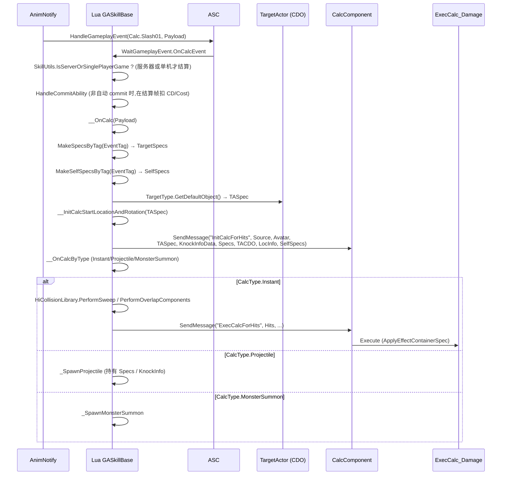

# EffectContainer 与 Tag 驱动结算流

HiGame 战斗的**最核心抽象**是 `FHiGameplayEffectContainer`:**一个 Tag 索引一组 GE+BuffID+TargetActor 配置**。技能不直接 Apply GE,而是动画在某帧抛出一个 `Calc.XYZ` Tag,GA 根据 Tag 在 `EffectContainerMap` 中查到对应配置,生成 Spec,再通过 TargetActor 命中目标后应用。本页讲清这条流水线的每一环[^c01][^c06]。

## 三种 Tag 流的全景



## FHiGameplayEffectContainer 字段全表

```cpp
// Public/HiAbilities/HiAbilityTypes.h
USTRUCT(BlueprintType)
struct HIGAME_API FHiGameplayEffectContainer
{
    /** 1. 命中区域形状(TargetActor 子类 CDO 提供 Spec) */
    UPROPERTY(EditAnywhere, BlueprintReadOnly)
    TSubclassOf<AHiTargetActorBase> TargetType;

    /** 2. 目标确认方式(Instant / UserConfirmed) */
    UPROPERTY(EditAnywhere, BlueprintReadOnly)
    TEnumAsByte<EGameplayTargetingConfirmation::Type> ConfirmationType;

    UPROPERTY(EditAnywhere, BlueprintReadOnly)
    FName TaskInstanceName;

    /** 3. 延迟应用 */
    UPROPERTY(EditAnywhere, BlueprintReadOnly)
    float DelayTime;

    /** 4. ★★★ 给目标的 Buff(BuffID 列表,引用 Buff DataTable) */
    UPROPERTY(EditAnywhere, BlueprintReadOnly)
    TArray<FName> TargetBuffIDs;

    /** 5. 给目标的 GE Define(参数化 GE) */
    UPROPERTY(EditAnywhere, BlueprintReadOnly, Instanced)
    TArray<TObjectPtr<UHiGameplayEffectDef>> TargetGameplayEffectDefs;

    /** 6. ★★★ 给目标的 GE Class(直接 Apply) */
    UPROPERTY(EditAnywhere, BlueprintReadOnly)
    TArray<TSubclassOf<UGameplayEffect>> TargetGameplayEffectClasses;

    /** 7-9. 同样的三组,但是给自己 (命中时) */
    UPROPERTY(EditAnywhere, BlueprintReadOnly)
    TArray<FName> SelfBuffIDs;
    UPROPERTY(EditAnywhere, BlueprintReadOnly, Instanced)
    TArray<TObjectPtr<UHiGameplayEffectDef>> SelfGameplayEffectDefs;
    UPROPERTY(EditAnywhere, BlueprintReadOnly)
    TArray<TSubclassOf<UGameplayEffect>> SelfGameplayEffectClasses;
};
```

| 分组 | 给谁 | 何时应用 |
|------|------|---------|
| `TargetGameplayEffectClasses` / `Defs` / `BuffIDs` | 命中目标 | Hit 后 |
| `SelfGameplayEffectClasses` / `Defs` / `BuffIDs` | 自身 | **命中后**(注意是命中后才上 Self,不命中不上) |
| `TargetType` | TargetActor CDO | 决定 Sweep/Overlap 形状(Spec 字段在 TargetActor 上)|

## EffectContainerMap 配置示例(蓝图层)

```
GA_PlayerAttack_C.EffectContainerMap:
  Calc.NormalAttack.Slash01 →
    TargetType: BP_TargetActor_CapsuleSweep_C
    TargetGameplayEffectClasses: [GE_Damage_Normal_C]
    TargetBuffIDs: [B_Bleed_Lv1]
    SelfGameplayEffectClasses: [GE_LifeSteal_C]
  Calc.NormalAttack.Slash02 → ... (同上,但形状/伤害不同)
  Calc.NormalAttack.HeavyHit → ... (重击)
```

> **配置惯例**:
> - Tag 命名 `Calc.<技能类>.<段位>` 或 `Calc.<技能ID>.<段位>`,严格分层方便筛选
> - **同一 GA 通常有多个 EffectContainer**(对应蒙太奇里多个攻击帧)
> - GE Class 名前缀:`GE_Damage_*` 伤害、`GE_Buff_*` Buff、`GE_Cooldown_*` CD、`GE_Cost_*` 消耗

## MakeEffectContainerSpecByTag — Spec 构造

```cpp
// HiGameplayAbility.h
UFUNCTION(BlueprintCallable, Category = Ability)
virtual bool MakeEffectContainerSpecByTag(
    FGameplayTag ContainerTag,
    int32 Level,
    FHiGameplayEffectContainer& EffectContainer,    // out
    TArray<FGameplayEffectSpecHandle>& Specs        // out
);

UFUNCTION(BlueprintCallable, Category = Ability)
virtual bool MakeEffectContainerSpecByTagOfSelf( /* Self 版 */ );
```

C++ 内部:
1. `EffectContainerMap.Find(ContainerTag)` 取容器
2. 遍历 `TargetGameplayEffectClasses`,每条调 `MakeOutgoingGameplayEffectSpec(EffectClass, Level, Context)`
3. 遍历 `TargetGameplayEffectDefs`,调 `Def.GetEffectClass()` 后同上,再 `Def.SetEffectParameters(ASC, SpecHandle)` 注入参数
4. 遍历 `TargetBuffIDs`,调 `ASC.MakeBuffEffectSpec(BuffID, Level)` 取 Buff 表
5. 把所有 SpecHandle Append 到 `Specs` 数组返回

> **Lua 侧封装**(GASkillBase 提供的工具)[^c06]:
> ```lua
> function GASkillBase:MakeSpecsByTag(EventTag, Level)
>     local EffectContainer = UE.FHiGameplayEffectContainer()
>     local Specs = UE.TArray(UE.FGameplayEffectSpecHandle)
>     local bFounded = self:MakeEffectContainerSpecByTag(EventTag, Level, EffectContainer, Specs)
>     -- 给所有 Spec 自动加 EventTag 作 AssetTag(用于 ExecCalc 索引)
>     for Ind = 1, Specs:Length() do
>         UE.UAbilitySystemBlueprintLibrary.AddAssetTag(Specs:Get(Ind), EventTag)
>     end
>     return bFounded, EffectContainer, Specs
> end
> ```

## OnCalcEvent 主结算流

`GASkillBase` 注册 `WaitGameplayEvent` 监听 `CalcPrefixTag`(常见配置如 `Event.Calc`),当 AnimNotify 抛出任何带此前缀的 EventTag 时触发:



### 关键 Lua 代码 — 主结算入口

```lua
function GASkillBase:OnCalcEvent(Payload)
    if not SkillUtils.IsServerOrSinglePlayerGame(self) then
        return
    end
    self:HandleCommitAbility()                              -- 非自动 Commit 在这里扣 CD/Cost

    local EventTag = Payload.EventTag
    if Payload.OptionalObject and not Payload.OptionalObject.bBind
       and Payload.OptionalObject.bIsBindType then
        self:OnUnBindProjectile(EventTag)                  -- 解除绑定抛射物
        return
    end
    self:__OnCalc(Payload)
end

function GASkillBase:__OnCalc(Payload)
    local EventTag = Payload.EventTag
    local bFounded, EffectContainer, Specs = self:MakeSpecsByTag(EventTag, self:GetAbilityLevel())
    local bFoundedSelf, _, SelfSpecs = self:MakeSelfSpecsByTag(EventTag, self:GetAbilityLevel())

    if not bFounded and not bFoundedSelf then
        return
    end

    local TargetActorClass = EffectContainer.TargetType
    local TargetActorCDO   = TargetActorClass:GetDefaultObject()
    if not self:CheckCalc(TargetActorCDO) then return end

    local TASpec = LuaUtils.DeepCopy(TargetActorCDO.Spec)        -- ★ 深拷贝避免 CDO 污染
    -- 支持 Payload 替换 StartPos / Bone (链式技 / 子模块)
    local ReplaceData = Payload.OptionalObject2
    if ReplaceData and ReplaceData.bReplace then
        TASpec.StartPosType    = ReplaceData.StartPosType
        TASpec.StartPosBoneName= ReplaceData.StartPosBoneName
        TASpec.StartRotOffset  = ReplaceData.StartRotOffset
        TASpec.StartPosOffset  = ReplaceData.StartPosOffset
    end

    local TargetingLocationInfo = self:__InitCalcStartLocationAndRotation(TASpec)

    -- ★ Instant 类型才在这里 InitCalcForHits;Projectile 在 SpawnProjectile 内部初始化
    if TASpec.CalcType == Enum.Enum_CalcType.Instant then
        self.OwnerActor:SendMessage("InitCalcForHits",
            self.OwnerActor, self.OwnerActor, TASpec,
            self:_GetKnockInfoData(Payload), Specs,
            TargetActorCDO, TargetingLocationInfo, SelfSpecs)
    end

    self:__OnCalcByType(TASpec, TargetActorClass, TargetingLocationInfo,
                       Payload, Specs, SelfSpecs, TargetActorCDO.bDebug)
end
```

### __OnCalcByType 三大分支

```lua
function GASkillBase:__OnCalcByType(TASpec, TargetActorClass, LocInfo, Payload, Specs, SelfSpecs, bDebug)
    if TASpec.CalcType == Enum.Enum_CalcType.Instant then
        self:__CalcInstant(TASpec, LocInfo, Payload, bDebug)        -- 立即扫描+伤害
    end
    if TASpec.CalcType == Enum.Enum_CalcType.Projectile then
        self:_SpawnProjectile(TASpec, TargetActorClass, LocInfo, Payload, Specs, SelfSpecs)
        return
    end
    if TASpec.CalcType == Enum.Enum_CalcType.MonsterSummon then
        self:_SpawnMonsterSummon(TASpec, TargetActorClass, LocInfo, Payload, Specs, SelfSpecs)
    end
end
```

| CalcType | 含义 | 适用 |
|----------|------|------|
| `Instant` | 立即在指定位置 Sweep/Overlap → 命中即伤害 | 普攻、近战、AOE |
| `Projectile` | Spawn `AHiProjectileActorBase` 子类,投射物自带 Specs/KnockInfo | 远程、子弹、飞剑 |
| `MonsterSummon` | Spawn 一只怪(从 `AbilityData_MonsterSummon.MonsterID` 读)|怪物召唤、分身 |

详见 [6. TargetActor、Projectile 与命中检测](6.%20TargetActor、Projectile%20与命中检测.md)。

## ApplyToSelf vs ApplyToTarget 流

这两个流**不需要命中**,直接给自身/预设目标应用 GE。常用于:
- 起手帧给自己上"专注"buff
- 起手帧给附近队友上"加 buff"
- 命中前置阶段给目标点 reticle

### ApplyToSelfCalc 流

```lua
function GASkillBase:HandleApplyToSelfCalcEvent(Payload)
    self:HandleCommitAbility()
    local EventTag = Payload.EventTag
    local bFounded, _, Specs = self:MakeSpecsByTag(EventTag, self:GetAbilityLevel())
    if not bFounded then return end

    local TargetData = UE.UAbilitySystemBlueprintLibrary.AbilityTargetDataFromActor(self.OwnerActor)
    self:ApplyEffectContainerSpec(Specs, TargetData)
end
```

### ApplyToTargetCalc 流

```lua
function GASkillBase:HandleApplyToTargetCalcEvent(Payload)
    self:HandleCommitAbility()
    local PresetTarget = self:GetSkillTarget()
    if not PresetTarget then return end

    local EventTag = Payload.EventTag
    local bFounded, _, Specs = self:MakeSpecsByTag(EventTag, self:GetAbilityLevel())
    if not bFounded then return end

    local TargetData = UE.UAbilitySystemBlueprintLibrary.AbilityTargetDataFromActor(PresetTarget)
    local bPureClient = UE.UHiUtilsFunctionLibrary.IsSinglePlayerGame(self.OwnerActor)
    self:ApplyEffectContainerSpec(Specs, TargetData, bPureClient)
end
```

> **注意**:基类的 `OnApplyToSelfCalcEvent` / `OnApplyToTargetCalcEvent` 是空的,真正逻辑在 `Handle*Event` 里 — 这是项目惯例,**子类按需在 `OnApply*` 里调 `Handle*`**。

## 实战示例 — "雪宿一击"

```lua
-- CommonScript/skill/ability/Characters/yunshuo/GAYunshuoSkill.lua (虚构示例)
local GASkillBase = require("CommonScript.skill.ability.GASkillBase")
local GAYunshuoSkill = Class(GASkillBase)

function GAYunshuoSkill:HandleActivateAbility()
    Super(GAYunshuoSkill).HandleActivateAbility(self)
    -- 父类已经注册了 6 个 WaitGameplayEvent
    -- 雪宿一击不需要额外注册
end

-- 蓝图 EffectContainerMap 配置:
--   Calc.Yunshuo.Slash01 → BP_TA_CapsuleSweep_Yunshuo / GE_Damage_YunshuoSlash01_C / B_Cold_Lv1
--   Calc.Yunshuo.Slash02 → ...
--   ApplyToSelfCalc.Yunshuo.Charge → GE_YunshuoFocus_C
-- AnimMontage 内 AnimNotify 配置:
--   Frame 12 → AnimNotify_GameplayEvent(EventTag=Calc.Yunshuo.Slash01)
--   Frame 24 → AnimNotify_GameplayEvent(EventTag=Calc.Yunshuo.Slash02)

return GAYunshuoSkill
```

## ApplyEffectContainerSpec — 最终落地

```cpp
// HiGameplayAbility.h
UFUNCTION(BlueprintCallable, Category = Ability)
virtual TArray<FActiveGameplayEffectHandle> ApplyEffectContainerSpec(
    const TArray<FGameplayEffectSpecHandle>& Specs,
    const FGameplayAbilityTargetDataHandle& TargetData,
    bool bPureClient = false);

UFUNCTION(BlueprintCallable, Category = Ability)
virtual TArray<FActiveGameplayEffectHandle> ApplyEffectContainerSpecWithPK(
    const TArray<FGameplayEffectSpecHandle>& Specs,
    const FGameplayAbilityTargetDataHandle& TargetData,
    FPredictionKey& PredictionKey);
```

C++ 内部对每个 Spec、对每个 TargetData 中的 Actor:`Target.ASC.ApplyGameplayEffectSpecToSelf(Spec, PK, bPureClient)`。

## CalcComponent — 命中转发与扩展

`OnHandleHits` 是命中后的服务端结算入口[^c10]:

```lua
-- CommonScript/actors/components/calc_component_base.lua
function CalcComponentBase:OnHandleHits(HitData)
    local SourceActor    = HitData.SourceActor
    local BindActor      = HitData.BindActor
    local SourceAbility  = HitData.SourceAbility
    local CalcTag        = HitData.CalcTag
    local bPureClient    = HitData.bPureClient

    self.KnockInfoData = HitData.KnockInfo
    local bAOE, SourceLoc, AllHits, DamageableHits = self:__HandleHitTargets(HitData)

    if not self:IsServerComponent() and not bPureClient then
        return
    end

    if SourceActor and SourceActor.CalcComponent then
        SourceActor.CalcComponent:ResetBreakTenacityFlag()
    end

    -- ★ GE 重建路径:客户端预测时服务器没有 Spec 缓存
    local GEHandles = self.GameplayEffectsHandle
    if not GEHandles and SourceAbility then
        local bFounded, _, Specs = SourceAbility:MakeSpecsByTag(CalcTag, SourceAbility:GetAbilityLevel())
        if bFounded then GEHandles = Specs end
    end

    self:OnAbilityHitDamageable(SourceActor, SourceAbility, CalcTag, DamageableHits)
    self:AddHitCountToTarget(AllHits)

    if DamageableHits:Length() > 0 then
        local TargetDataHandle
        if bAOE then
            TargetDataHandle = UE.UHiUtilsFunctionLibrary.AbilityAOETargetDataFromHitResults(DamageableHits, SourceLoc)
        else
            TargetDataHandle = UE.UHiUtilsFunctionLibrary.AbilityTargetDataFromHitResults(DamageableHits)
        end
        self:OnHandleHitDamageable(HitData, TargetDataHandle, GEHandles)  -- 实际 Apply
    end

    -- 给绑定 Actor 也来一发
    if AllHits:Length() > 0 then
        self:ApplyEffectToBindActor(BindActor, AllHits:Get(1), GEHandles, bPureClient)
    end
end
```

详见 [6. TargetActor、Projectile 与命中检测](6.%20TargetActor、Projectile%20与命中检测.md)。

## 8 类技能 Tag 约定速查

| Tag 前缀 | 谁监听 | 何时触发 | 用途 |
|---------|-------|---------|------|
| `Calc.*` | `OnCalcEvent` | AnimNotify / 武器扫描 | 主伤害结算 |
| `ApplyToSelfCalc.*` | `OnApplyToSelfCalcEvent` | AnimNotify | 给自身 GE/Buff |
| `ApplyToTargetCalc.*` | `OnApplyToTargetCalcEvent` | AnimNotify | 给预设目标 GE/Buff |
| `WeaponSweep.*` | `OnWeaponSweepEvent` | ANS_MonsterWeaponAttack Tick | 武器持续扫描(per-frame Overlap) |
| `Event.AnimNotify.SwitchSection` | `HandleSwitchSectionEvent` | AnimNotify | 蒙太奇跳段 |
| `Event.AnimNotify.CustomSkillEvent` | `HandleCustomSkillEvent` | AnimNotify | 派发自定义函数名 |
| `SpawnProjectiles.*` | `OnSpawnProjectiles` | AnimNotify | 抛射物专门入口 |
| `ComboTail.*` | `OnComboTailEvent` | AnimNotify | 解锁切招/取消 |
| `Drop.*` | `OnDropEvent` | AnimNotify | 资源球掉落 |
| `Hit.*` (Knock 链) | 由 KnockBase 触发到目标 | 命中时 | 由 [8. Knock](8.%20Knock%20与%20Counter%20巫师时间.md) 详解 |

## 一页速查

| 概念 | 类型 | 关键 API |
|------|------|---------|
| `EffectContainerMap` | C++ TMap 字段 | 编辑器配 |
| `MakeEffectContainerSpecByTag` | C++ UFUNCTION | Lua 调用 |
| `MakeSpecsByTag` / `MakeSelfSpecsByTag` | Lua 封装 | 业务调用 |
| `ApplyEffectContainerSpec` | C++ UFUNCTION | Lua 调用 |
| `OnCalcEvent` / `OnApplyToSelfCalcEvent` / `OnApplyToTargetCalcEvent` | Lua 入口 | GA 内 WaitGameplayEvent 触发 |
| `__OnCalc` / `__OnCalcByType` / `__CalcInstant` / `_SpawnProjectile` | Lua 业务 | GASkillBase 提供,可覆写 |
| `CalcComponent.OnHandleHits` / `OnHandleHitDamageable` | Lua 业务 | 命中后落地 GE |

[^c01]: `Source/HiGame/Public/HiAbilities/HiGameplayAbility.h` `HiAbilityTypes.h`
[^c06]: `Content/Script/CommonScript/skill/ability/GASkillBase.lua`
[^c10]: `Content/Script/CommonScript/actors/components/calc_component_base.lua`
