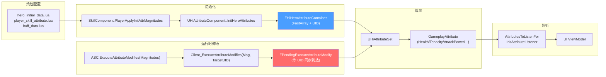
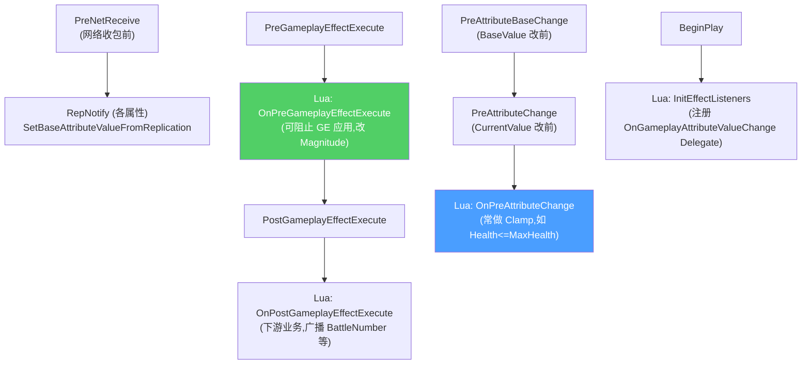
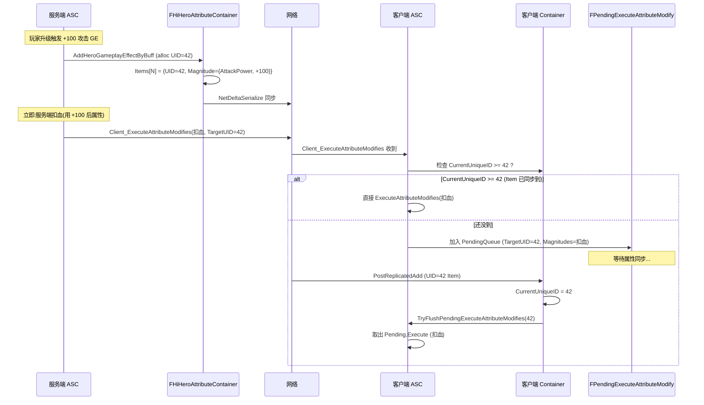

# AttributeSet 与 Hero 属性中间层

战斗的所有"血/蓝/防御/暴击"都是 GAS `UAttributeSet` 子类的浮点字段,经 GE 修改、由 ASC 同步、被 ExecCalc 读取。HiGame 在标准 GAS 之上**额外加了一层"Hero 属性中间层"**:`UHiAttributeComponent` 持有 `FHiHeroAttributeContainer` 与 `FHiHeroGameplayEffectContainer` 两个 FastArraySerializer 容器,用 **服务端递增 UniqueID** 解决 RPC 时序与属性同步对齐问题。本页讲清属性的声明、修改、同步、监听、中间层 4 个面向[^c01][^c02]。

## 4 层属性数据流



## UHiAttributeSet 与属性宏

```cpp
// Public/Attributies/HiAttributeSet.h
#define ATTRIBUTE_ACCESSORS(ClassName, PropertyName) \
    GAMEPLAYATTRIBUTE_PROPERTY_GETTER(ClassName, PropertyName) \
    GAMEPLAYATTRIBUTE_VALUE_GETTER(PropertyName) \
    GAMEPLAYATTRIBUTE_VALUE_SETTER(PropertyName) \
    GAMEPLAYATTRIBUTE_VALUE_INITTER(PropertyName)

UCLASS(Blueprintable)
class HIGAME_API UHiAttributeSet : public UAttributeSet
{
    GENERATED_BODY()
    REPLICATED_BASE_CLASS(UAttributeSet)
public:
    virtual void GetLifetimeReplicatedProps(...) override;
    virtual void PreNetReceive() override;
    virtual bool PreGameplayEffectExecute(FGameplayEffectModCallbackData& Data) override;
    virtual void PostGameplayEffectExecute(const FGameplayEffectModCallbackData& Data) override;
    virtual void PreAttributeBaseChange(const FGameplayAttribute&, float& NewValue) const override;
    virtual void PreAttributeChange(const FGameplayAttribute&, float& NewValue) override;

    UFUNCTION(BlueprintNativeEvent) void InitEffectListeners();
    UFUNCTION(BlueprintNativeEvent) bool OnPreGameplayEffectExecute(...);
    UFUNCTION(BlueprintNativeEvent) void OnPostGameplayEffectExecute(...);
    UFUNCTION(BlueprintNativeEvent) void OnPreAttributeChange(...);
};
```

> 项目派生:`UHiHealthAttributeSet`(血量、护盾、韧性 …)、其他职能子集。**实际属性大量是在蓝图层(BPA_Attribute_*)直接添加**,通过宏 `ATTRIBUTE_ACCESSORS` 自动展开 4 个静态/实例方法。

### 项目主要属性命名约定[^c10]

```lua
-- CommonScript/common/skill_utils.lua (节选)
AttrNames.Health = "Health"
AttrNames.MaxHealth = "MaxHealth"
AttrNames.Shield = "Shield"
AttrNames.Tenacity = "Tenacity"            -- 韧性(可被打掉,清空进入失衡)
AttrNames.MaxTenacity = "MaxTenacity"
AttrNames.Stamina = "Stamina"
AttrNames.Power = "Power"                  -- 大招能量
AttrNames.MaxPower = "MaxPower"
AttrNames.SuperPower = "SuperPower"        -- 超级登场技能能量
AttrNames.Bullet = "Bullet"                -- 子弹能量(西雅)
AttrNames.AssistPoint = "AssistPoint"      -- 支援能量
AttrNames.Energy = "Energy"                -- 高速战斗能量
AttrNames.AttackPower = "AttackPower"
AttrNames.DefensePower = "DefensePower"
AttrNames.NormalSkillSpeed = "NormalSkillSpeed"
AttrNames.NormalSkillCritRate = "NormalSkillCritRate"
AttrNames.NormalSkillCritDmg = "NormalSkillCritDmg"
AttrNames.CooldownReduction = "CooldownReduction"
AttrNames.ResourceHealRate = "ResourceHealRate"
-- 还有 60+ 项分流派/类型加成属性,详见原文件
```

### 6 大父子事件



## Magnitude 体系 — FHiAbilityMagnitude

技能/Buff 中的"伤害/加成"参数都用 `FHiAbilityMagnitude` 描述,而不是裸 float[^c01]:

```cpp
// HiAbilityTypes.h
USTRUCT(BlueprintType)
struct FHiAbilityMagnitude
{
    UPROPERTY(BlueprintReadWrite)
    FName DataName;                          // 索引名(从 player_skill_attribute 表查)

    UPROPERTY(EditAnywhere, BlueprintReadWrite, meta = (Categories = "Ability.Magnitude"))
    FGameplayTag DataTag;                    // 用 Tag 索引(被 MagnitudeModifiers 拦截)

    UPROPERTY(EditAnywhere, BlueprintReadWrite)
    float Value = 0.f;                       // 直接值(Tag 找不到时回退用)
};
```

`UHiGameplayAbility::GetAbilityMagnitude`:`Tag 优先 → MagnitudeModifiers 注入加减成乘后乘 → DataName 查表 → Value 兜底`。

### MagnitudeModifier — 被动注入伤害加成

```cpp
USTRUCT(BlueprintType)
struct FHiAbilityMagnitudeModifier
{
    UPROPERTY(EditAnywhere, BlueprintReadWrite) FHiAbilityMagnitude Additive;       // 加
    UPROPERTY(EditAnywhere, BlueprintReadWrite) FHiAbilityMagnitude Multiplicitive; // 乘
    UPROPERTY(EditAnywhere, BlueprintReadWrite) FHiAbilityMagnitude PostAdditive;   // 后加
    UPROPERTY(EditAnywhere, BlueprintReadWrite) FHiAbilityMagnitude PostProduct;    // 后乘

    UPROPERTY(EditAnywhere, BlueprintReadWrite)
    FGameplayTagRequirements SourceTagRequirements;
    UPROPERTY(EditAnywhere, BlueprintReadWrite)
    FGameplayTagRequirements AbilityTagRequirements;
    UPROPERTY(EditAnywhere, BlueprintReadWrite)
    FGameplayTagRequirements EffectTagRequirements;

    FGameplayAbilitySpecHandle AbilityHandle;
    FActiveGameplayEffectHandle ActiveGEHandle;
};
```

ASC 维护一个 `(MagnitudeTag → 多个 Modifier 的聚合器)`,GA 调 `GetMagnitude` 时聚合产出最终值。

> **典型用例**:被动技"暴击伤害提升 30%" — Modifier 命中 `Damage.CritDmg` Tag,所有走 `CritDmg` 的 Magnitude 都乘 1.3。

## ★ Hero 属性中间层 — 解决 RPC 时序

### 为何需要中间层?

```
朴素 GAS:
  Server: 给玩家加 +100 攻击力 GE → ApplyGameplayEffect → 客户端 RepNotify → AttackPower += 100
  Server: 立即扣血(用 +100 后的攻击力) → Client_ExecuteAttribute → 客户端立即扣血
                                                                  ↑
  问题:客户端的 +100 GE 同步可能还没到,扣血时仍按旧 AttackPower 算 → 伤害与服务端不一致
```

HiGame 的解法:**给每次"养成系 GE 改属性"事件分配一个递增 UniqueID,RPC 时携带"我的属性同步必须到这个 UID 才生效"约束**[^c01][^c02]。

```cpp
// HiAbilityTypes.h - 容器 Item
USTRUCT(BlueprintType)
struct FHiHeroAttributeItem : public FFastArraySerializerItem
{
    UPROPERTY() int32 UniqueID = 0;                      // 服务端分配
    UPROPERTY(BlueprintReadWrite) FHiAbilityMagnitude MagnitudeData;
    FActiveGameplayEffectHandle Handle;                  // 关联的 ActiveGE Handle

    void PreReplicatedRemove(const FHiHeroAttributeContainer&);
    void PostReplicatedAdd(const FHiHeroAttributeContainer&);
    void PostReplicatedChange(const FHiHeroAttributeContainer&);
};

USTRUCT()
struct FHiHeroAttributeContainer : public FFastArraySerializer
{
    TWeakObjectPtr<UHiAttributeComponent> OwnerComponent;
    UPROPERTY() TArray<FHiHeroAttributeItem> MagnitudeItems;
    UPROPERTY() int32 NextUniqueID = 1;                  // 服务端递增

    int32 CurrentUniqueID = 0;                           // ★ 当前已生效 UID(不同步)

    int32 AllocateUniqueID() { return NextUniqueID++; }
    void RegisterWithOwner(UHiAttributeComponent*);
    void InitHeroAttributes(const TArray<FHiAbilityMagnitude>& Magnitudes);
    FHiHeroAttributeItem* FindHeroAttributeItem(const FHiAbilityMagnitude&);
    void ClearHeroAttributes();

    bool NetDeltaSerialize(FNetDeltaSerializeInfo&);
    void PreReplicatedRemove(const TArrayView<int32>&, int32 FinalSize);
    void PostReplicatedAdd(const TArrayView<int32>&, int32 FinalSize);
    void PostReplicatedChange(const TArrayView<int32>&, int32 FinalSize);
};
```

### 时序流程



### 中间层 GE 容器的 EHiGameplayEffectItemType

```cpp
UENUM()
enum class EHiGameplayEffectItemType : uint8
{
    Buff,            // 通过 BuffID + BuffLevel 应用 GE
    EffectClass,     // 通过 GameplayEffectClass 直接应用
    AttributeModify, // 通过 FHiAbilityMagnitude 应用属性修改
};

USTRUCT(BlueprintType)
struct FHiHeroGameplayEffectItem : public FFastArraySerializerItem
{
    UPROPERTY() int32 UniqueID = 0;
    UPROPERTY() EHiGameplayEffectItemType ItemType = EHiGameplayEffectItemType::Buff;
    UPROPERTY(BlueprintReadWrite) FName BuffID;
    UPROPERTY(BlueprintReadWrite) int32 BuffLevel = 1;
    UPROPERTY(BlueprintReadWrite) TSubclassOf<UGameplayEffect> GameplayEffectClass;
    UPROPERTY() FHiAbilityMagnitude MagnitudeData;
    UPROPERTY() bool bPureClient = false;   // 单机:跳过 RPC
    // ...
};
```

> Buff/EffectClass/AttributeModify 三种入口最终都走 `FHiHeroGameplayEffectContainer` 一个中间层 — **统一了"养成系属性"的网络同步路径**。

### Lua/蓝图调用接口[^c02]

```cpp
// Public/Component/HiAttributeComponent.h
UFUNCTION(BlueprintCallable, Category = "HiAbility|HeroGameplayEffect")
TArray<int32> ApplyHeroGameplayEffects(const TArray<FHiHeroGameplayEffectInit>& Inits);

UFUNCTION(BlueprintCallable, Category = "HiAbility|HeroGameplayEffect")
int32 ApplyHeroGameplayEffect(const FHiHeroGameplayEffectInit& Init);

UFUNCTION(BlueprintCallable, Category = "HiAbility|HeroGameplayEffect")
void RemoveHeroGameplayEffectsByIDs(const TArray<int32>& UniqueIDs);

UFUNCTION(BlueprintCallable, Category = "HiAbility|HeroGameplayEffect")
void RemoveHeroGameplayEffectByBuffID(FName BuffID);

UFUNCTION(BlueprintCallable, Category = "HiAbility|HeroGameplayEffect")
void RemoveHeroGameplayEffectByClass(TSubclassOf<UGameplayEffect> EffectClass);

UFUNCTION(BlueprintCallable, Category = "HiAbility|HeroGameplayEffect")
void ClearAllHeroGameplayEffects();
```

> **业务规则**:养成系 buff(角色等级、武器、装备)走 `ApplyHeroGameplayEffect*`(中间层 + UID 同步保证);战斗中临时 buff(技能伤害 GE、击晕 buff)走 `ASC.ApplyBuffToSelf/Target`(直接 GAS,不经中间层)。

### GameType 切换协同

```cpp
void NotifyGameTypeChange(EGameType NewGameType);

// FHiHeroGameplayEffectContainer
void OnGameTypeChange(EGameType NewGameType);
```

切换大世界/Dungeon/PvP 等"游戏类型"时,中间层会重置或保留某类 GE。

## ASC 入口 API[^c02]

```cpp
// Public/Component/HiAbilitySystemComponent.h
UFUNCTION(BlueprintCallable, Category = "Attributes")
void InitAttributes(const TArray<FHiAbilityMagnitude>& Magnitudes);

UFUNCTION(BlueprintCallable, Category = "Attributes")
TArray<FActiveGameplayEffectHandle> ApplyAttributeModifyEffects(
    const TArray<FHiAbilityMagnitude>& Magnitudes, float Duration = -1.f);

UFUNCTION(BlueprintCallable, Category = "Attributes")
FActiveGameplayEffectHandle ApplyAttributeModifyEffect(
    const FHiAbilityMagnitude& Magnitude, float Duration = -1.f);

UFUNCTION(BlueprintCallable, Category = "Attributes")
void ExecuteAttributeModifyEffectsWithTags(
    const TArray<FHiAbilityMagnitude>& Magnitudes,
    const FGameplayTagContainer& AssetTags = FGameplayTagContainer());

UFUNCTION(BlueprintCallable, Category = "Attributes")
void ExecuteAttributeModifyEffects(
    const TArray<FHiAbilityMagnitude>& Magnitudes,
    const UGameplayAbility* SourceAbility = nullptr);
```

| 接口 | 类型 | 用途 |
|------|------|------|
| `InitAttributes` | 一次性 | 角色登场初始化属性 |
| `ApplyAttributeModifyEffects` | Duration > 0 → 临时 | 临时 buff 加属性 |
| `ApplyAttributeModifyEffect` | Duration < 0 → 永久 | 永久属性修改 |
| `ExecuteAttributeModifyEffects` | Instant(瞬发) | 立即扣血/恢复 |
| `ExecuteAttributeModifyEffectsWithTags` | Instant + AssetTag | 带 Tag 的瞬发(用于 Notify_State 计数) |

## 属性监听

```cpp
// Public/Component/HiAttributeComponent.h
UPROPERTY(BlueprintReadOnly, EditAnywhere)
TArray<FGameplayAttribute> AttributesToListenFor;

UPROPERTY(BlueprintReadOnly, EditAnywhere)
TArray<FGameplayAttribute> ChildAttributesToListenFor;

UFUNCTION(BlueprintCallable)
void InitAttributeListener();

UFUNCTION(BlueprintCallable)
void RemoveAttributeListener();

void HandleAttributeChange(const FOnAttributeChangeData& Data);
```

`InitAttributeListener` 内部对每个 `AttributesToListenFor` 调 `ASC.GetGameplayAttributeValueChangeDelegate(Attribute).AddUObject(this, &HandleAttributeChange)`,变化触发 Lua 端的回调(如更新 UI、播放音效)。

> 变化回调 → `SkillComponent.OnGameplayEffectRemoved/TagCountChanged/Applied` 三个委托 → Lua → UI ViewModel 字段刷新。
> 详见 [`higame-ui-script` 第 6 页 MVVM](../../higame-ui-script/wiki/6.%20MVVM%20数据绑定.md)。

## 一页速查

| 问题 | 接口 | 备注 |
|------|------|------|
| 给角色加永久攻击力 | `AttributeComponent.ApplyHeroGameplayEffect{ Magnitude }` | 走中间层,UID 同步 |
| 给角色一次性扣血 | `ASC.ExecuteAttributeModifyEffects([{Health, -100}])` | Instant |
| 给角色加 5 秒攻速 buff | `ASC.ApplyAttributeModifyEffects([{Speed, +0.5}], 5)` | Duration |
| 修改属性时 Clamp | 蓝图覆写 `OnPreAttributeChange` | Set 之前最后一道 |
| 监听 Health 变化更新血条 | `AttributeComponent.AttributesToListenFor` 加 Health,Lua 端 SendMessage 转 UI VM | InitAttributeListener |
| 让伤害根据 Tag 加成 | 加 `MagnitudeModifier` 命中目标 Tag,GA 用 `GetAbilityMagnitude` | 由被动 GA 注入 |
| 注释:此属性是养成 vs 战斗临时? | 养成 → AttributeComponent;战斗 → ASC | 容易踩坑 |

[^c01]: `Source/HiGame/Public/HiAbilities/HiAbilityTypes.h` (FHiHeroAttributeItem/Container, FHiHeroGameplayEffectItem/Container, FHiAbilityMagnitude, FHiAbilityMagnitudeModifier)
[^c02]: `Source/HiGame/Public/Component/HiAttributeComponent.h` `HiAbilitySystemComponent.h`,`Public/Attributies/HiAttributeSet.h`
[^c10]: `Content/Script/CommonScript/common/skill_utils.lua`
