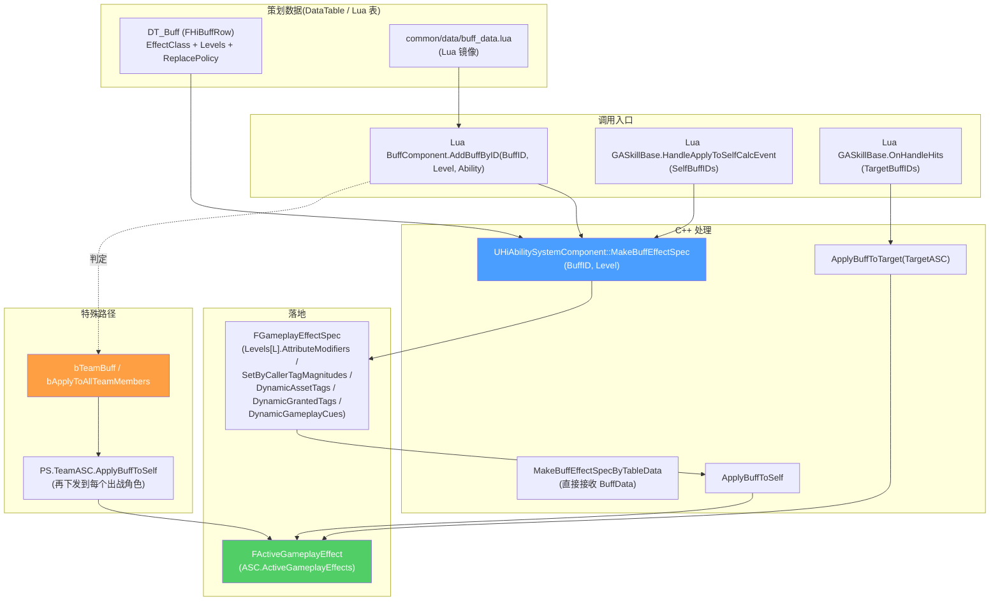

# Buff 系统 — BuffID 到 GE 的链路

战斗中 99% 的"中毒/燃烧/护盾/狂暴"等都是 **Buff**。HiGame 的 Buff 不是单纯的 GameplayEffect — 它是 **`FHiBuffRow` (DataTable 行) → `MakeBuffEffectSpec` → ApplyGameplayEffectSpec` 的两层抽象**。这层抽象让策划可以在 Excel 改 Buff 数值不动代码,也让 Buff 支持等级、叠层、替换策略等增强行为。本页讲清这条链路 + Lua `BuffComponent` + Notify 状态计数等附加机制[^c01][^c02][^c10]。

## Buff 数据流总览



## FHiBuffRow — 单条 Buff 完整字段

```cpp
// Public/HiAbilities/HiAbilityTypes.h
USTRUCT(BlueprintType)
struct FHiBuffRow : public FTableRowBase
{
#if WITH_EDITORONLY_DATA
    UPROPERTY(EditAnywhere) FString Description;
#endif

    /** ★ Buff 真正的 GE 类(必须继承 GE_BuffBase_C) */
    UPROPERTY(EditAnywhere, BlueprintReadWrite, meta = (AllowedClasses = "GE_BuffBase_C"))
    TSoftClassPtr<UGameplayEffect> EffectClass;

    /** 同 BuffID 多次施加策略(仅对不可叠层 GE 有效) */
    UPROPERTY(EditAnywhere, BlueprintReadWrite)
    EBuffReplacePolicy ReplacePolicy;

    /** ★ 各等级参数 */
    UPROPERTY(EditAnywhere, BlueprintReadWrite)
    TArray<FHiBuffLevel> Levels;

    /** 动态加到 Spec 的 AssetTags(用于 ExecCalc 索引、AnimNotify_State 计数) */
    UPROPERTY(EditAnywhere, BlueprintReadWrite)
    FGameplayTagContainer DynamicAssetTags;

    /** 动态加到 ActiveGE 的 GrantedTags(GE 持续期间挂在 ASC 上的 Tag) */
    UPROPERTY(EditAnywhere, BlueprintReadWrite)
    FGameplayTagContainer DynamicGrantedTags;

    /** 动态加到 Spec 的 GameplayCues */
    UPROPERTY(EditAnywhere, BlueprintReadWrite)
    TArray<FGameplayEffectCue> DynamicGameplayCues;
};

UENUM()
enum class EBuffReplacePolicy : uint8
{
    None,           // 多次施加 = 多个独立 Active GE
    TimePriority,   // 后施加替换前施加(刷新)
    LevelPriority,  // 高等级替换低等级
};

USTRUCT(BlueprintType)
struct FHiBuffLevel
{
    UPROPERTY(EditAnywhere) FHiAbilityMagnitude ApplyChance;        // 命中概率(0~1)
    UPROPERTY(EditAnywhere) FHiAbilityMagnitude Duration;           // 持续时间(0=永久)
    UPROPERTY(EditAnywhere) FHiAbilityMagnitude Period;             // 周期(0=不周期)
    UPROPERTY(EditAnywhere) FHiAbilityMagnitude StackCount;         // 叠层数
    UPROPERTY(EditAnywhere) TArray<FHiAbilityMagnitude> AttributeModifiers;  // 属性改
    UPROPERTY(EditAnywhere) TArray<FHiAbilityMagnitude> AbilityMagnitudeModifiers; // 技能数值改(给 MagnitudeModifier 用)
    UPROPERTY(EditAnywhere) TArray<FHiSetByCallerMagnitude> SetByCallerTagMagnitudes;  // 走 SetByCaller 的参数
};
```

> **关键事实**:Buff 的"伤害/属性"参数是按等级配的,**升级 buff 不需要换 GE 类,改 Level 即可**。

### `FHiBuffTableRow` — 运行时打平结构

`FHiBuffRow` 是配置侧,运行时还有一个打平/简化版 `FHiBuffTableRow`(去掉 Magnitude 公式,直接用 float):

```cpp
USTRUCT(BlueprintType)
struct FHiBuffTableRow
{
    TSoftClassPtr<UGameplayEffect> EffectSoftClass;
    float Duration = 0;
    float Period = 0;
    int32 StackCount = 1;
    TArray<FName> GrantedTags;
    TArray<FName> AssetTags;
    TArray<FHiAbilityMagnitude> AttributeModifiers;
    TArray<FHiAbilityMagnitude> AbilityMagnitudeModifiers;
    TMap<FName, float> SetByCallerTagMagnitudes;
    FHiAdditionBuffData AdditionBuffData;        // 移除时再触发的 Buff 列表
    bool bIsDamageBuff = false;
    float DamageRate = 1.0f;
};
```

`UHiAbilitySystemComponent::MakeBuffEffectSpecByTableData` 接收这个结构,适合**在 Lua 侧动态构造 buff,无需走 DataTable**。

## ASC 入口 API[^c02]

```cpp
// Public/Component/HiAbilitySystemComponent.h
// ───────────── 构造 Spec ─────────────
UFUNCTION(BlueprintCallable, Category = "Abilities")
FGameplayEffectSpecHandle MakeBuffEffectSpec(FName BuffID, int32 Level = 1,
                                              const UGameplayAbility* SourceAbility = nullptr);

UFUNCTION(BlueprintCallable, Category = "Abilities")
FGameplayEffectSpecHandle MakeBuffEffectSpecByTableData(const FHiBuffTableRow& BuffData,
                                                         FName BuffID, int32 Level,
                                                         const UGameplayAbility* SourceAbility);

// ───────────── 一步 Apply ─────────────
UFUNCTION(BlueprintCallable, Category = "Abilities")
FActiveGameplayEffectHandle ApplyBuffToSelf(FName BuffID, int32 Level = 1,
                                             const UGameplayAbility* SourceAbility = nullptr,
                                             bool bPureClient = false);

UFUNCTION(BlueprintCallable, Category = "Abilities")
FActiveGameplayEffectHandle ApplyBuffToTarget(UAbilitySystemComponent* TargetASC,
                                               FName BuffID, int32 Level = 1,
                                               const UGameplayAbility* SourceAbility = nullptr,
                                               bool bPureClient = false);

// ───────────── 移除 ─────────────
UFUNCTION(BlueprintCallable, Category = "Abilities")
void RemoveActiveGameplayEffectByBuffID(FName BuffID, int32 StacksToRemove = -1);

// ───────────── 查询 ─────────────
TArray<FActiveGameplayEffect*> GetActiveEffectsByBuffID(FName BuffID);
UFUNCTION(BlueprintCallable) TArray<FActiveGameplayEffect> K2_GetActiveEffectsByBuffID(FName BuffID);
UFUNCTION(BlueprintCallable) TArray<FActiveGameplayEffectHandle> K2_GetActiveEffectHandlesByBuffID(FName BuffID);
UFUNCTION(BlueprintPure) FName GetBuffIDFromHandle(const FActiveGameplayEffectHandle& Handle) const;

// ───────────── Duration 暂停/恢复 ─────────────
UFUNCTION(BlueprintCallable) bool PauseGameplayEffectDuration(FActiveGameplayEffectHandle Handle);
UFUNCTION(BlueprintCallable) bool UnPauseGameplayEffectDuration(FActiveGameplayEffectHandle Handle);
UFUNCTION(BlueprintPure)     bool IsGameplayEffectDurationPaused(FActiveGameplayEffectHandle Handle) const;
UFUNCTION(BlueprintCallable) int32 PauseGameplayEffectDurationByBuffID(FName BuffID);
UFUNCTION(BlueprintCallable) int32 PauseAllGameplayEffectDurations();
UFUNCTION(BlueprintCallable) bool SetGameplayEffectDurationHandle(FActiveGameplayEffectHandle, float NewDuration);
UFUNCTION(BlueprintCallable) bool AddGameplayEffectDurationHandle(FActiveGameplayEffectHandle, float Delta);
UFUNCTION(BlueprintCallable) bool RestartActiveGameplayEffectDuration(FActiveGameplayEffectHandle);
```

> `Pause/UnPause` 是 HiGame 自研接口 — 标准 GAS 没有这个能力。常用于:
> - 时间膨胀/巫师时间内 Buff Duration 不流逝
> - 切场景时保留 Buff 但暂停计时
> - 大世界过场动画期间所有 Buff 暂停

## ApplyBuffToSelf 的实际流(Lua)[^c10]

```lua
-- CommonScript/actors/components/buff_component.lua
function BuffComponent:AddBuffByID(BuffID, BuffLevel, Ability, bPureClient)
    self:Enable()

    -- ① 单机模式下,服务端加 buff 也要先 RPC 到主控端
    if bPureClient and self.actor:IsServer() then
        self:Client_AddBuffByID(BuffID, BuffLevel, Ability, bPureClient)
        return
    end

    if self.actor:IsAvatar() then
        local BuffAssetTags = SkillUtils.GetBuffAssetTags(BuffID)

        -- ② TeamBuff (DynamicAssetTags 含 Team 标记) → 走 PlayerState.TeamASC
        local bTeamBuff = UE.UBlueprintGameplayTagLibrary.HasTag(BuffAssetTags, SkillUtils.GetTeamEffectTag(), true)
        if bTeamBuff then
            local PS = self.actor:GetAvatarPlayerState()
            if PS then
                PS.TeamASC:ApplyBuffToSelf(BuffID, BuffLevel or 1, Ability, bPureClient)
            end
            return
        end

        -- ③ "给全队"标记 → 自身 + 队友都加(分别 Apply 到每个角色 ASC)
        local bTeammatesBuff = UE.UBlueprintGameplayTagLibrary.HasTag(BuffAssetTags,
                                  SkillUtils.GetApplyToTeammatesTag(), false)
        -- ... (枚举所有出战角色,逐个 ApplyBuffToSelf)
    end

    -- ④ 普通路径
    return self.actor.AbilitySystemComponent:ApplyBuffToSelf(BuffID, BuffLevel, Ability, bPureClient)
end
```

### TeamBuff 与 TeamASC 三层

```mermaid
flowchart TB
    BC["Lua BuffComponent.AddBuffByID(BuffID, Level)"]
    BC --> CHK1{bTeamBuff ?<br/>(DynamicAssetTags 含 Team)}
    CHK1 -->|Yes| TEAM["PS.TeamASC.ApplyBuffToSelf"]
    TEAM --> SLAVE["FHiActiveTeamEffect:<br/>MasterEffectHandle (PS.TeamASC)<br/>SlaveEffectHandles[N] (各角色 ASC)"]
    SLAVE --> EACH["对每个出战角色 ASC<br/>各自 ApplyGameplayEffectSpecToSelf"]
    SLAVE --> NOTIFY["OnStackChangeHandle:<br/>主 GE 叠层变化时,同步到所有 Slave"]

    CHK1 -->|No| CHK2{bTeammatesBuff ?}
    CHK2 -->|Yes| BROADCAST["对每个队友 ASC 调 ApplyBuffToSelf"]
    CHK2 -->|No| SELF["self.AbilitySystemComponent.ApplyBuffToSelf"]

    style TEAM fill:#ff6b6b,color:#fff
    style SELF fill:#4a9eff,color:#fff
```

> `FHiActiveTeamEffect` 数据结构存在于 `HiAbilityTypes.h`[^c01] — 主 GE 在 PS.TeamASC,每个出战角色 ASC 上挂一个 Slave。叠层变化通过 `OnStackChangeHandle` 委托同步。

## 移除 Buff 与 AdditionBuffData

`FHiAdditionBuffData` 描述 Buff 移除时的"链式 Buff":

```cpp
USTRUCT(BlueprintType)
struct FHiAdditionBuffData
{
    UPROPERTY(BlueprintReadWrite) TArray<FName> OnCompletedAlways;     // 任何方式结束都触发
    UPROPERTY(BlueprintReadWrite) TArray<FName> OnCompleteNormal;      // 正常超时结束
    UPROPERTY(BlueprintReadWrite) TArray<FName> OnCompletePrematurely; // 提前移除(被替换/dispel)
    UPROPERTY(BlueprintReadWrite) TArray<FName> OnStackMax;            // 叠到最大层时触发
};
```

> 用例:"中毒"buff 结束时上一个"虚弱"buff、"结冰"被打破时上"易碎"buff。

## ApplyChance — 概率应用

`FHiBuffLevel.ApplyChance` 在应用前过滤,实现"30% 命中触发流血"。具体由 `UHiAdditionalBuffEffectComponent` C++ Component 在 GE Apply 路径上拦截。

## DynamicGameplayCues — Buff 自带表现

```cpp
TArray<FGameplayEffectCue> DynamicGameplayCues;
```

每条 `FGameplayEffectCue` 在 GE Apply 时自动派发对应 Cue Tag(如 `GameplayCue.Bleeding.Add` / `.Remove` / `.WhileActive`)。
GameplayCue 处理详见 [9. GameplayCue 表现层](9.%20GameplayCue%20表现层.md)。

## GE 中和(Neutralize) — 反向消除机制

```cpp
// HiAbilitySystemComponent.h
bool GetEffectNeutralizeResults(FActiveGameplayEffectHandle ActiveEffectHandle,
                                 const FGameplayEffectSpec& EffectSpec,
                                 int32& RemoveStackCount,
                                 TMap<FActiveGameplayEffectHandle, int32>& UpdateStackEffectHandles);

UFUNCTION(BlueprintImplementableEvent)
FString GetTargetNeutralizeSubString(FGameplayTag NeutralizeTag);
```

**用例**:玩家挂"火焰"3 层、被打中"冰冻"buff,冰冻 Apply 时检查到火焰存在,**双方互相消除 X 层**(冰扣火、火扣冰),不再各自独立堆叠。
具体配置在 `common/data/buff_neutralize_data.lua`,蓝图层 `BuffComponent` 调 `GetEffectNeutralizeResults` 拿到要 RemoveStackCount。

## GameplayEffectComponent 扩展(项目自研)[^c01]

GAS 5.4+ 引入 `UGameplayEffectComponent` 让 GE 可以模块化扩展,HiGame 用这个机制加了若干战斗专属 Component:

| Component | 用途 |
|-----------|------|
| `UHiAbilityMagnitudeModifierComponent` | GE 应用时把 `MagnitudeModifier` 注册到目标 ASC(被动技+伤害加成) |
| `UHiAdditionalBuffEffectComponent` | 处理 ApplyChance / AdditionBuffData / 叠层最大触发 |
| `UHiPassiveAbilityModifierComponent` | 给被动 GA 的 SingleTrigger 数据动态注入修改 |
| `UHiWeakenEffectComponent` | 弱点伤害加成 |
| `UHiGameplayEffectComponent` | 项目通用基类 |

**Lua 侧也可以写扩展**(走蓝图 `UGameplayEffectComponent` 子类 + UnLua 绑定):
```
Content/Script/skill/GameplayEffectComponent/
├── GEComp_ApplyChance.lua            -- Lua 概率拦截
├── GEComp_DeathwhisperAttrModify.lua -- 死亡低语属性修改
├── GEComp_ModifyPassiveSkillInfo.lua -- 修改被动技数据
├── GEComp_RelivePlayer.lua           -- 复活
└── GEComp_Shield.lua                 -- 护盾(吸收伤害)
```

## NotifyState 计数 — 重要陷阱

`buff_component.lua:Initialize`:
```lua
self.NotifyStateGECountMap = {}  -- per-GE ref count
```

某些蒙太奇 AnimNotify_State 在 Begin/End 各加/减一次 buff,**叠层数会因 GE 累加 bug 变错**。HiGame 的解法:用 `NotifyStateGECountMap` 在 Lua 端做引用计数:
- Notify_State Begin → 引用计数 +1,首次才真 Apply
- Notify_State End → 引用计数 -1,归 0 才真 Remove
- 防止"Begin/End 配对错乱"或"Begin 触发两次"导致的脏数据

## 完整调用示例 — "毒刃" Buff

```
DT_Buff:
  B_DuRen_Lv1:
    EffectClass: GE_Buff_Poison_C   (子类 GE_BuffBase_C)
    ReplacePolicy: TimePriority      (新中毒覆盖旧)
    Levels[0]:
      ApplyChance: { Tag=Ability.Magnitude.PoisonChance, Value=0.5 }
      Duration: { Value=10 }
      Period: { Value=1 }
      StackCount: { Value=1 }
      AttributeModifiers: []
      SetByCallerTagMagnitudes:
        - Tag=SetByCaller.Damage.Period, Value=12     (每秒 12 伤害)
    DynamicAssetTags: [Buff.Poison, Element.Toxic]
    DynamicGrantedTags: [State.Poison]
    DynamicGameplayCues:
      - GameplayCue.Buff.Poison
```

```lua
-- 在 GA 中应用
function GA_DuJian:OnHandleHits(HitData)
    Super(GA_DuJian).OnHandleHits(self, HitData)
    for i = 1, HitData.Hits:Length() do
        local Target = HitData.Hits:Get(i).Actor
        if Target and Target.AbilitySystemComponent then
            self.AbilitySystemComponent:ApplyBuffToTarget(
                Target.AbilitySystemComponent,
                "B_DuRen_Lv1", 1, self, false)
        end
    end
end
```

或者在 EffectContainerMap 配置 `TargetBuffIDs: [B_DuRen_Lv1]`,**不写 Lua 也能自动施加**。

## Buff 数据查询(Lua 侧)[^c10]

```lua
local BuffTable = require("common.data.buff_data").data

local row = BuffTable[BuffID]
if row then
    local Levels = row.Levels
    local Lv = Levels[Level] or Levels[1]
    print(Lv.Duration, Lv.Period, Lv.StackCount)
end
```

`SkillUtils` 还提供大量便捷:`GetBuffAssetTags(BuffID)` / `IsTeamBuff(BuffID)` 等。

## 一页速查

| 任务 | 接口 | 备注 |
|------|------|------|
| 给自己上 Buff | `ASC.ApplyBuffToSelf(BuffID, Level, Ability)` | 不会经队伍/团队判定 |
| 给目标上 Buff | `ASC.ApplyBuffToTarget(TargetASC, BuffID, Level)` | 同上 |
| 给自己上 Buff(走团队判定) | `BuffComponent.AddBuffByID(BuffID, Level)` | 自动判 TeamBuff/TeammatesBuff |
| 上技能附加 Buff | EffectContainerMap.TargetBuffIDs | 自动随 EffectContainer 命中应用 |
| 移除某 BuffID 的所有实例 | `ASC.RemoveActiveGameplayEffectByBuffID(BuffID)` | StacksToRemove=-1 全清 |
| 查 BuffID 是否激活 | `ASC.K2_GetActiveEffectsByBuffID(BuffID)` | 返回数组,长度>0 即有 |
| 暂停 Buff 计时 | `ASC.PauseGameplayEffectDurationByBuffID(BuffID)` | 巫师时间常用 |
| 拉取 Buff 数据 | `BuffTable[BuffID]` Lua 表 | 配 hot reload |
| 多 Buff 互相消除 | DataTable 配 BuffNeutralize + `GetEffectNeutralizeResults` | 复杂 |

[^c01]: `Source/HiGame/Public/HiAbilities/HiAbilityTypes.h` (FHiBuffRow / FHiBuffLevel / FHiBuffTableRow / FHiAdditionBuffData / FHiActiveTeamEffect / EBuffReplacePolicy)
[^c02]: `Source/HiGame/Public/Component/HiAbilitySystemComponent.h` `HiBuffComponent.h`
[^c10]: `Content/Script/CommonScript/actors/components/buff_component.lua`
