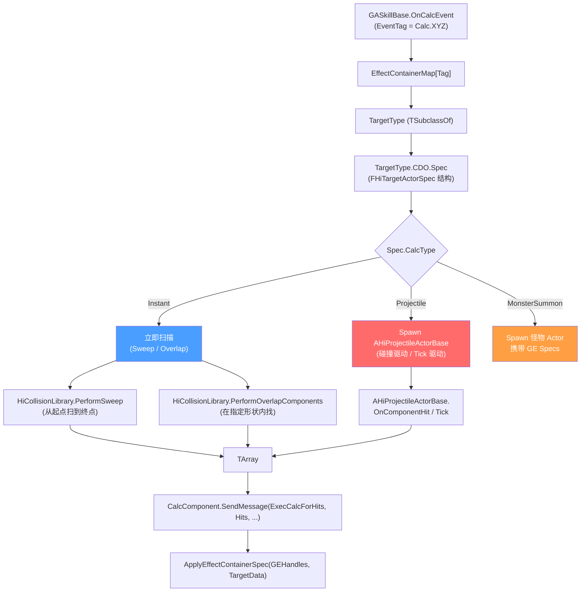
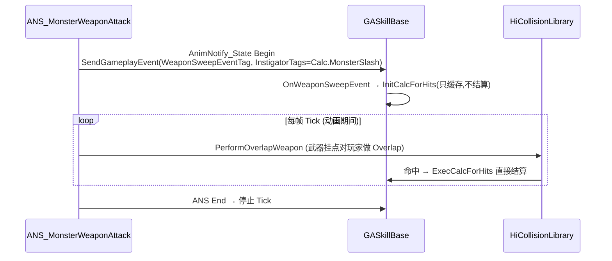
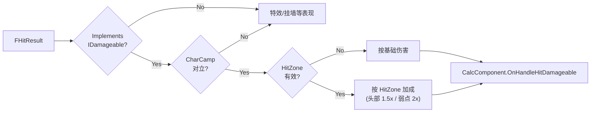

# TargetActor、Projectile 与命中检测

技能"打哪里、用什么形状、命中谁"由两类 Actor 抽象:**TargetActor** 是命中区域配置(矩形/胶囊体/线段),**Projectile** 是飞行体(子弹/飞剑/弹道)。本页讲清两类 Actor 的字段、Sweep/Overlap 算法分支、HitResult 转发到 CalcComponent 的全程,以及 InstantTracking / 武器 Sweep / Tick 等常见模式[^c01][^c03][^c10]。

## 命中检测三大模式总图



## AHiTargetActorBase 字段[^c03]

```cpp
// Public/HiAbilities/HiTargetActorBase.h
UCLASS()
class HIGAME_API AHiTargetActorBase : public AGameplayAbilityTargetActor
{
public:
    /** 投射物 class(配 Spec.CalcType=Projectile 时使用) */
    UPROPERTY(BlueprintReadWrite, EditAnywhere, Category=Targeting)
    TSubclassOf<AHiProjectileActorBase> ProjectileClass;

    /** 给目标的 GE Specs(从 EffectContainer 复制过来) */
    UPROPERTY(EditAnywhere, BlueprintReadOnly, meta=(ExposeOnSpawn=true))
    TArray<FGameplayEffectSpecHandle> GameplayEffectsHandle;

    /** 命中时给自己的 GE Specs */
    UPROPERTY(EditAnywhere, BlueprintReadOnly, meta=(ExposeOnSpawn=true))
    TArray<FGameplayEffectSpecHandle> SelfGameplayEffectsHandle;

protected:
    UPROPERTY(BlueprintReadWrite, meta=(ExposeOnSpawn=true), Replicated)
    TObjectPtr<UObject> KnockInfo;          // 击退/击飞参数(自定义 Lua 类)

public:
    UPROPERTY(BlueprintReadWrite, EditAnywhere, Category=Debug)
    TEnumAsByte<EDrawDebugTrace::Type> DebugType;
    UPROPERTY(BlueprintReadWrite, EditAnywhere)
    float DebugTime;

    /** Spec 字段在子类 BP 上,通常为 FHiTargetActorSpec(项目自研) */
    // (子类常附加:CalcType / HitTypes / Sweep 形状参数 / StartPos 等)

    UFUNCTION(BlueprintNativeEvent) void OnTick();
    UFUNCTION(BlueprintNativeEvent) void OnStartTargeting(UGameplayAbility*);
    UFUNCTION(BlueprintNativeEvent) void OnConfirmTargetingAndContinue();
    UFUNCTION(BlueprintNativeEvent) bool OnTargetDataReceived(FGameplayAbilityTargetDataHandle&) const;

    UFUNCTION(BlueprintCallable) void BroadcastTargetDataHandleWithActors(const TArray<AActor*>&);
    UFUNCTION(BlueprintCallable) void BroadcastTargetDataHandleWithHitResults(const TArray<FHitResult>&);
    UFUNCTION(BlueprintCallable) void BroadcastTargetDataHandle(const FGameplayAbilityTargetDataHandle&);
    UFUNCTION(BlueprintCallable) bool IsShouldProduceTargetDataOnServer();

    UPROPERTY(EditAnywhere, BlueprintReadOnly, meta=(ExposeOnSpawn=true), Category=Calculation)
    TObjectPtr<AGameplayAbilityWorldReticle> ReticleActor;
};
```

> **重点**:`AHiTargetActorBase` 本身不持有"形状"字段,具体的 Sweep 形状/角度/范围在**子类 CDO 上的 `Spec` 字段**(`FHiTargetActorSpec` 类型,蓝图类如 `BP_TA_CapsuleSweep_C` / `BP_TA_BoxOverlap_C` / `BP_TA_LineTrace_C`)。

## FHiTargetActorSpec 字段(典型项目蓝图)

蓝图层 `FHiTargetActorSpec` 结构 *没有 C++ USTRUCT 定义*(项目放在 BP 蓝图结构里),典型字段(从 GASkillBase 用法逆推[^c06]):

```
struct FHiTargetActorSpec (蓝图):
    CalcType            : Enum_CalcType (Instant / Projectile / MonsterSummon)
    HitTypes            : TArray<EObjectTypeQuery> (要扫描的 ObjectType,如 Pawn/Vehicle)
    StartPosType        : Enum_StartPosType (Owner / Bone / SkillTarget / Camera 等)
    StartPosBoneName    : FName
    StartRotOffset      : FRotator
    StartPosOffset      : FVector

    -- 形状参数 (按 CalcType 与具体 TargetActor 子类不同)
    SweepShape          : Enum_SweepShape (Capsule / Sphere / Box / Line)
    SweepRadius / SweepHalfHeight / SweepBoxExtent
    SweepLength         : float    -- 扫描距离
    SweepAngle          : float    -- 扇形角度

    Sort                : Enum_CalcSortType (None / NearestFirst / FarthestFirst)
    bUseNewProjectileFollowTarget : bool
    NewProjectileFollowTargetTag  : FName
    DestroyEffect       : (Niagara/Cue 资源, 抛射物销毁特效)

    -- (项目还有大量其他字段,如 ReboundRotOffset / HitSceneTargetConfig 等)
```

## Instant 模式 — 立即扫描

`GASkillBase:__CalcInstant` 的核心算法[^c06]:

```lua
function GASkillBase:__CalcInstant(TASpec, TargetingLocationInfo, Payload, bDebug)
    local OriginLocation = UE.FVector()
    local OriginRotation = UE.FRotator()
    UE.UKismetMathLibrary.BreakTransform(TargetingLocationInfo.LiteralTransform,
                                          OriginLocation, OriginRotation, UE.FVector())
    local ForwardVector = UE.UKismetMathLibrary.Conv_RotatorToVector(OriginRotation)
    local KnockInfoData = SkillUtils.GetKnockInfoFromGameplayEventData(Payload)

    local Hits = UE.TArray(UE.FHitResult)
    local ActorsToIgnore = UE.TArray(UE.AActor)
    ActorsToIgnore:AddUnique(self.OwnerActor)

    if self.OwnerActor and self.OwnerActor:IsAvatar() then
        -- 玩家 Avatar:从相机方向 Sweep
        local SweepDir = UE.UKismetMathLibrary.TransformRotation(self.OwnerActor:GetTransform(),
                                                                  KnockInfoData.HitTraceRotator)
        SweepDir = UE.UKismetMathLibrary.Conv_RotatorToVector(SweepDir)
        local DebugType = self.bDebug and UE.EDrawDebugTrace.ForDuration or UE.EDrawDebugTrace.None
        HiCollisionLibrary.PerformSweep(self, TASpec, OriginLocation, OriginRotation, nil, SweepDir,
            ForwardVector, TASpec.HitTypes, ActorsToIgnore, Hits, DebugType, self.LifeTime)
    else
        -- 怪物或其他:在指定形状内 Overlap
        HiCollisionLibrary.PerformOverlapComponents(self, TASpec, OriginLocation, ForwardVector,
            TASpec.HitTypes, ActorsToIgnore, Hits, self.bDebug, self.LifeTime)
    end

    if Hits:Length() > 0 then
        -- ★ 排序(可选)
        local SortType = TASpec.Sort
        if SortType and SortType ~= Enum.Enum_CalcSortType.CalcSortTypeNone then
            local HitArray = {}
            for i = 1, Hits:Length() do
                local Hit = Hits:Get(i)
                local Dist = UE.UKismetMathLibrary.Vector_Distance(OriginLocation, Hit.ImpactPoint)
                HitArray[#HitArray + 1] = { Hit = Hit, Dist = Dist }
            end
            if SortType == Enum.Enum_CalcSortType.NearestFirst then
                table.sort(HitArray, function(a, b) return a.Dist < b.Dist end)
            else
                table.sort(HitArray, function(a, b) return a.Dist > b.Dist end)
            end
            Hits:Clear()
            for _, Entry in ipairs(HitArray) do Hits:Add(Entry.Hit) end
        end
        self:CustomFilter(Hits)        -- ★ 子类可覆写做自定义过滤
        self.OwnerActor:SendMessage("ExecCalcForHits", Hits, nil, KnockInfoData,
                                    true, false, Payload.EventTag)
    end
end
```

### Sweep vs Overlap 选型

| 检测 | 何时用 | 性能 | 准确度 |
|------|--------|------|-------|
| **Sweep** | 攻击有"扫过"的方向感(劈砍、冲撞) | 中 | 给出 ImpactPoint/Normal |
| **Overlap** | 攻击在区域内"全收"(AOE 圆爆) | 中 | ImpactPoint = 中心 |

`HiCollisionLibrary` 是封装好的 C++ 库(具体实现私有),Lua 直接调即可。

### 排序与过滤

```lua
function GASkillBase:CustomFilter(Hits)
    -- 子类可覆写,从 Hits 数组里 Remove 不需要的条目
end
```

> **典型用例**:
> - "穿透"技能:不过滤(默认全打)
> - "锁定 1 个目标":覆写 `CustomFilter` 只保留首个最近的
> - "排除已命中"(per-skill 唯一命中):覆写 `OnHitTarget` 记录,后续 `CustomFilter` 排除

## InitCalcForHits → CalcComponent 转发

`GASkillBase:__OnCalc`(Instant 分支)调:
```lua
self.OwnerActor:SendMessage("InitCalcForHits",
    self.OwnerActor, self.OwnerActor, TASpec,
    self:_GetKnockInfoData(Payload), Specs,
    TargetActorCDO, TargetingLocationInfo, SelfSpecs)
```

`SendMessage` 会路由到 `Owner.CalcComponent.InitCalcForHits`(Lua),把当前帧的 `(Specs / KnockInfo / SelfSpecs / TargetCDO / Location)` 缓存到组件上。

后续 `__CalcInstant` 拿到 `Hits` 后,调:
```lua
self.OwnerActor:SendMessage("ExecCalcForHits", Hits, nil, KnockInfoData, ...)
```

`CalcComponent` 此时知道用刚才缓存的 `Specs / KnockInfo` 对所有 Hits 做 ApplyEffect,经过 `OnHandleHits → OnHandleHitDamageable`[^c10]:

```lua
function CalcComponentBase:OnHandleHits(HitData)
    -- 1. 把 Hits 分类:AllHits, DamageableHits
    local bAOE, SourceLoc, AllHits, DamageableHits = self:__HandleHitTargets(HitData)

    -- 2. 仅服务端(或纯客户端模式)才结算
    if not self:IsServerComponent() and not bPureClient then return end

    -- 3. 重建 GEHandles(客户端预测时服务端没有缓存)
    local GEHandles = self.GameplayEffectsHandle
    if not GEHandles and SourceAbility then
        local _, _, Specs = SourceAbility:MakeSpecsByTag(CalcTag, SourceAbility:GetAbilityLevel())
        GEHandles = Specs
    end

    -- 4. 命中数累加
    self:OnAbilityHitDamageable(SourceActor, SourceAbility, CalcTag, DamageableHits)
    self:AddHitCountToTarget(AllHits)

    -- 5. 应用 GE
    if DamageableHits:Length() > 0 then
        local TargetData = bAOE
            and UE.UHiUtilsFunctionLibrary.AbilityAOETargetDataFromHitResults(DamageableHits, SourceLoc)
            or  UE.UHiUtilsFunctionLibrary.AbilityTargetDataFromHitResults(DamageableHits)
        self:OnHandleHitDamageable(HitData, TargetData, GEHandles)
    end

    -- 6. 给绑定 Actor(子模块/僚机)
    if AllHits:Length() > 0 then
        self:ApplyEffectToBindActor(BindActor, AllHits:Get(1), GEHandles, bPureClient)
    end
end
```

## Projectile 模式

```cpp
// Public/HiAbilities/HiProjectileActorBase.h
UCLASS()
class HIGAME_API AHiProjectileActorBase : public AActor
{
public:
    UPROPERTY(VisibleAnywhere, BlueprintReadOnly)
    TObjectPtr<UCapsuleComponent> CapsuleComponent;

    UPROPERTY(EditAnywhere, BlueprintReadWrite, Category=Calculation)
    TArray<FGameplayEffectSpecHandle> GameplayEffectsHandle;

    UPROPERTY(EditAnywhere, BlueprintReadWrite, Category=Calculation)
    TArray<FGameplayEffectSpecHandle> SelfGameplayEffectsHandle;

    UPROPERTY(EditAnywhere, BlueprintReadWrite, Category=Calculation)
    TObjectPtr<const UObject> KnockInfo;
protected:
    UPROPERTY(BlueprintReadWrite, EditAnywhere, Replicated, Category=Targeting)
    bool bDebug;
public:
    UPROPERTY(BlueprintReadWrite, EditAnywhere, Category=Targeting)
    TEnumAsByte<EDrawDebugTrace::Type> DebugType;
};

// 同目录还有:
// HiProjectileActorBaseV2.h - 第二代实现(更高性能/Niagara集成)
// HiProjectileTypes.h       - 投射物枚举/参数结构
// HiProjectileEventComponent.h - 投射物事件分发组件
```

### Spawn 流程[^c06]

```lua
function GASkillBase:_SpawnProjectile(TASpec, TargetActorClass, LocInfo, Payload, Specs, SelfSpecs)
    local TargetActorCDO = TargetActorClass:GetDefaultObject()
    local ProjectileClass = self:GetProjectileClass(TargetActorClass)
    -- ...
    local SpawnTransform = LocInfo.LiteralTransform
    local CalcTag = Payload.EventTag

    ---@type BP_ProjectileBase_C
    local ProjectileActor = UE.UGameplayStatics.BeginDeferredActorSpawnFromClass(
        self, ProjectileClass, SpawnTransform)

    -- 把 TASpec / TargetActor.Spec / SourceAbility 等都打包进去
    ProjectileActor.Spec = TASpec
    ProjectileActor.Spec.TargetActorClassPath =
        UE.UKismetSystemLibrary.Conv_ClassToSoftClassReference(TargetActorClass)
    ProjectileActor.HitSceneTargetConfig = TargetActorCDO.HitSceneTargetConfig
    ProjectileActor.HitSceneSelfConfig   = TargetActorCDO.HitSceneSelfConfig
    ProjectileActor.StartLocation        = LocInfo
    ProjectileActor.SourceAbility        = self
    ProjectileActor.ApplicationTag       = CalcTag
    ProjectileActor.ReboundRotOffset     = TargetActorCDO.ReboundRotOffset
    ProjectileActor.bDebug               = self.bDebug or TargetActorCDO.bDebug
    ProjectileActor.SourceActor          = self.OwnerActor
    if self.OwnerActor then
        ProjectileActor.CharCamp            = self.OwnerActor.CharCamp
        ProjectileActor.SourceActorTransform = self.OwnerActor:GetTransform()
    end
    ProjectileActor.SkillTarget,
    ProjectileActor.SkillTargetController,
    ProjectileActor.SkillTargetTransform = self:OnUseNewProjectileFollowTarget(TASpec)
    ProjectileActor.GameplayEffectsHandle     = Specs       -- ★ 抛射物自带 Spec
    ProjectileActor.SelfGameplayEffectsHandle = SelfSpecs

    -- KnockInfo
    local KnockInfoData = SkillUtils.GetKnockInfoFromGameplayEventData(Payload)
    ProjectileActor.KnockInfoData     = KnockInfoData
    ProjectileActor.Spec.ProjectType  = KnockInfoData.ProjectType

    self:ProjectileAdditionalInit(ProjectileActor)    -- 子类附加初始化
    ProjectileActor:Init()                            -- 蓝图层初始化(MovementComponent 启动等)

    -- 是否绑定回调(用于 OnHitTarget / DestroyOnEnd 等)
    if (Payload.OptionalObject and Payload.OptionalObject.bBind and Payload.OptionalObject.bIsBindType)
       or TargetActorCDO.RecordProjectiles then
        self:OnBindProjectile(CalcTag, ProjectileActor)
        ProjectileActor:RegisterHitCallback(self, self.OnHitTarget)
    end
    UE.UGameplayStatics.FinishSpawningActor(ProjectileActor, SpawnTransform)
    return ProjectileActor
end
```

### 抛射物运行模式

抛射物的 Tick / Hit 逻辑在 BP `BP_ProjectileBase` 蓝图,典型路径:
1. `MovementComponent.OnComponentHit` 或 `Tick` 内 Sweep
2. 命中 → `Projectile.HitCallback` 转回 `GASkillBase:OnHitTarget`(GA 还活着才能回调)
3. 应用 `GameplayEffectsHandle` 到目标
4. 应用 `SelfGameplayEffectsHandle` 到 SourceActor(只一次,通过 `ApplyToSelfMap[CalcTag]` 去重)
5. 满足销毁条件 → `Projectile:DestroySelf`

### 投射物绑定与提前销毁

```lua
function GASkillBase:OnBindProjectile(EventTag, ProjectileActor)
    local TagStr = UE.UBlueprintGameplayTagLibrary.GetTagName(EventTag)
    if self.Projectiles then
        if self.Projectiles[TagStr] and self.Projectiles[TagStr] == ProjectileActor then
            self:OnUnBindProjectile(EventTag)
        end
        self.Projectiles[TagStr] = ProjectileActor
    end
end

function GASkillBase:OnUnBindProjectile(EventTag)
    local TagStr = UE.UBlueprintGameplayTagLibrary.GetTagName(EventTag)
    if self.Projectiles then
        local CurProjectile = self.Projectiles[TagStr]
        if CurProjectile then
            CurProjectile:DestroySelf()
        end
        self.Projectiles[TagStr] = nil
    end
end
```

GA `K2_OnEndAbility` 会清理所有 `self.Projectiles` 的实例,**避免技能结束后弹道还飞 = 内存泄漏**。

## ANS_MonsterWeaponAttack — 武器持续扫描模式

普通技能 `OnCalcEvent` 是"瞬时"扫描;但**怪物挥刀的整个动画过程都是有效命中区**,这种叫 **武器 Sweep 模式**:



`GASkillBase:OnWeaponSweepEvent` 比标准 `OnCalcEvent` 多一步:**只 InitCalc 不结算**,真正的 Overlap 由 ANS Tick 触发。这是 HiGame 处理"长动作中持续判定"(如怪物挥锤、玩家剑横扫)的标准模式。

```lua
function GASkillBase:OnWeaponSweepEvent(Payload)
    -- EventTag 被 GameplayEventContainerCallback 重写为 WeaponSweepEventTag
    -- 真实 CalcTag 通过 InstigatorTags 传过来
    local CalcTags = UE.UBlueprintGameplayTagLibrary.BreakGameplayTagContainer(Payload.InstigatorTags)
    local EventTag = CalcTags:Get(1)

    if not self.EffectContainerMap:Find(EventTag) then return end

    local bFounded, EffectContainer, Specs = self:MakeSpecsByTag(EventTag, self:GetAbilityLevel())
    if not bFounded then return end

    local TargetActorClass = EffectContainer.TargetType
    local TargetActorCDO   = TargetActorClass:GetDefaultObject()
    local TASpec           = LuaUtils.DeepCopy(TargetActorCDO.Spec)
    local LocInfo          = self:__InitCalcStartLocationAndRotation(TASpec)

    self.OwnerActor:SendMessage("InitCalcForHits",
        self.OwnerActor, self.OwnerActor, TASpec,
        self:_GetKnockInfoData(Payload), Specs,
        TargetActorCDO, LocInfo, nil)
    -- 注意:这里没有 __OnCalcByType,Tick 阶段才真正 ExecCalc
end
```

## MonsterSummon 模式

```lua
function GASkillBase:_SpawnMonsterSummon(TASpec, TargetActorClass, LocInfo, Payload, Specs, SelfSpecs)
    local bIsFound, AbilityData_MonsterSummon = SkillUtils.FindAbilityDataByType(self,
        SkillUtils.AbilityDataType.MONSTER)
    if not bIsFound or not AbilityData_MonsterSummon then return end

    local MonsterID = AbilityData_MonsterSummon.MonsterID
    local bIsSummon = AbilityData_MonsterSummon.bIsSummon
    local BPPath    = monsterUtil.FindMonsterBPPathByID(MonsterID)
    local SummonsClass = UE.UClass.Load(BPPath)

    local SpawnTransform = self:_MonsterSummon_FindSpawnTransform(SummonsClass, LocInfo, TargetActorClass)
    LocInfo.LiteralTransform = SpawnTransform

    local SummonsActor = UE.UGameplayStatics.BeginDeferredActorSpawnFromClass(
        self, SummonsClass, SpawnTransform,
        UE.ESpawnActorCollisionHandlingMethod.AdjustIfPossibleButAlwaysSpawn)
    if SummonsActor then
        self:_Summon_Init(SummonsActor, TASpec, TargetActorClass, LocInfo, Payload, Specs, SelfSpecs)
        SummonsActor.MonsterId = MonsterID
        if bIsSummon then SummonsActor.bInheritLevel = true end
        UE.UGameplayStatics.FinishSpawningActor(SummonsActor, SpawnTransform)
    end
    return SummonsActor
end
```

> **典型用例**:角色技能召唤宠物/分身,从 `AbilityData[].MonsterID` 配,直接在战斗中 Spawn。详见 [12. 进阶 Cookbook](12.%20进阶%20Cookbook%20与常见陷阱.md)。

## 起点位置与朝向

`__InitCalcStartLocationAndRotation` 是项目通用的起点计算:

```lua
function GASkillBase:__InitCalcStartLocationAndRotation(TASpec)
    local StartLocation = UE.FGameplayAbilityTargetingLocationInfo()
    StartLocation.LocationType = UE.EGameplayAbilityTargetingLocationType.LiteralTransform
    StartLocation.SourceActor   = self.OwnerActor
    StartLocation.SourceAbility = self

    local StartPos = self:__InitStartLocation(TASpec)        -- 通常调 SkillUtils.GetSkillStartLocation
    local StartRot = self:__InitStartRotation(TASpec, StartPos)
    StartLocation.LiteralTransform = UE.UKismetMathLibrary.MakeTransform(StartPos, StartRot, UE.FVector(1,1,1))
    return StartLocation
end
```

`SkillUtils.GetSkillStartLocation(Spec, UserData, OwnerActor)` 内部根据 `Spec.StartPosType` 分支:
- `Owner` → 自身 Actor 位置
- `Bone` → 角色骨骼名(如 `weapon_r`)
- `SkillTarget` → 目标位置
- `Camera` → 玩家相机位置
- `LiteralTransform` → UserData 中携带的具体 Transform

## 受击判定 — Damageable / Hit / HitZone

命中分多个层级:
1. **Hit** — 命中任何 Actor(用于触发墙体、地形特效)
2. **DamageableHit** — Hit 中能受伤的子集(`HiInterface_Damageable` / 不同 Camp)
3. **HitZone** — 命中部位(头部/身体/尾巴)由 `monster_hit_zone_component.lua` 管理



详见 [7. ExecCalc 伤害计算](7.%20ExecCalc%20伤害计算.md) 的 HitType / Weakness 部分。

## 一页速查

| 场景 | TargetActor.CalcType | 实现 |
|------|---------------------|------|
| 普攻劈砍 | `Instant` | Sweep + DefaultLand |
| AOE 圆爆 | `Instant` | OverlapComponents Sphere |
| 远程子弹 | `Projectile` | Spawn BP_Projectile_Bullet |
| 召唤宠物 | `MonsterSummon` | AbilityData_Monster.MonsterID |
| 怪物挥刀(整段动画都判) | `Instant` + ANS_MonsterWeaponAttack | 见武器 Sweep 章节 |
| 锁定单目标 | 任意 + 子类覆写 `CustomFilter` | 保留 1 个 |
| 穿透 | 任意 + `CustomFilter` 不过滤 | 默认即可 |
| 起点在武器骨骼 | `Spec.StartPosType=Bone, BoneName=weapon_r` | 配 |
| 起点在相机方向 | `Spec.StartPosType=Camera` | 配 |
| 命中后给自己加 buff | EffectContainer.SelfBuffIDs | 配 |
| 防止攻击不结束就再触发 | `K2_OnEndAbility` 清 Projectiles | 默认行为 |

[^c01]: `Source/HiGame/Public/HiAbilities/HiAbilityTypes.h`
[^c03]: `Source/HiGame/Public/HiAbilities/HiTargetActorBase.h` `HiProjectileActorBase.h` `HiProjectileActorBaseV2.h` `HiProjectileTypes.h` `HiProjectileEventComponent.h`
[^c06]: `Content/Script/CommonScript/skill/ability/GASkillBase.lua`
[^c10]: `Content/Script/CommonScript/actors/components/calc_component_base.lua`
