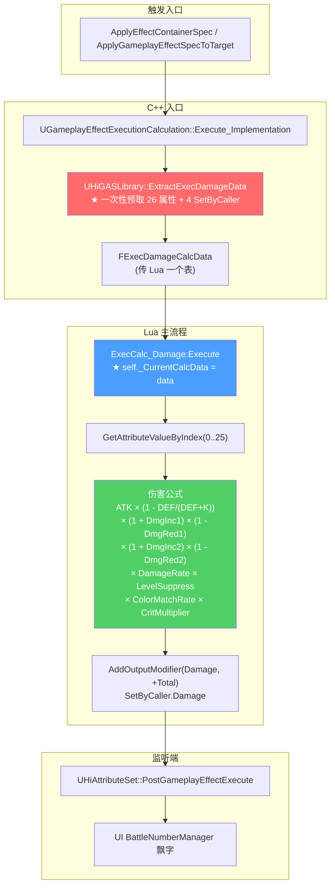

# ExecCalc 伤害计算

ExecCalc 是 GAS 的"自定义伤害公式"插槽。HiGame 的伤害公式分两层 Lua:`ExecCalc_Base.lua`(等级压制等通用工具)、`ExecCalc_Damage.lua`(主流程)。**关键性能优化**:Execute 入口由 C++ 一次性预取 26 个属性 + 4 个 SetByCaller 到 `FExecDamageCalcData`,Lua 后续读取全部走表,**不再调反射穿透函数**。本页讲清这条公式的输入/常量/分支与下标语义[^c01][^c07]。

## ExecCalc 全景



## FExecDamageCalcData — 26 属性 + 4 SetByCaller 预取[^c01]

```cpp
// Public/HiAbilities/HiAbilityTypes.h
USTRUCT(BlueprintType)
struct HIGAME_API FExecDamageCalcData
{
    // ─────── 26 个属性聚合值(按下标语义稳定)──────
    UPROPERTY(BlueprintReadWrite) TArray<float> AttributeValues;

    // ─────── EffectContext / Tag 集合(值拷贝)──────
    UPROPERTY(BlueprintReadWrite) FGameplayEffectContextHandle EffectContextHandle;
    UPROPERTY(BlueprintReadWrite) int32 SourceCharacterLevel = 1;
    UPROPERTY(BlueprintReadWrite) FGameplayTagContainer AllAssetTags;
    UPROPERTY(BlueprintReadWrite) FGameplayTagContainer CapturedSourceTags;
    UPROPERTY(BlueprintReadWrite) FGameplayTagContainer CapturedTargetTags;

    // ─────── ASC / Actor 引用(WeakObjectPtr) ──────
    UPROPERTY(BlueprintReadWrite) TWeakObjectPtr<UAbilitySystemComponent> SourceASC;
    UPROPERTY(BlueprintReadWrite) TWeakObjectPtr<UAbilitySystemComponent> TargetASC;
    UPROPERTY(BlueprintReadWrite) TWeakObjectPtr<AActor> SourceActor;
    UPROPERTY(BlueprintReadWrite) TWeakObjectPtr<AActor> TargetActor;

    // ─────── Source GA 引用 ──────
    UPROPERTY(BlueprintReadWrite) TWeakObjectPtr<const UGameplayAbility> SourceAbility;
    UPROPERTY(BlueprintReadWrite) int32 SkillType = 0;            // 蓝图字段,C++ 不读,Lua 自填
    UPROPERTY(BlueprintReadWrite) int32 SkillHitType = 0;

    // ─────── 4 个高频 SetByCaller 预取 ──────
    UPROPERTY(BlueprintReadWrite) float DamageRateMagnitude = 1.0f;       // SetByCaller.Damage.Rate
    UPROPERTY(BlueprintReadWrite) float SpecialDamageMagnitude = 0.0f;    // SetByCaller.Damage.Special
    UPROPERTY(BlueprintReadWrite) float ExtraDamageMagnitude = 0.0f;      // SetByCaller.Damage.Extra
    UPROPERTY(BlueprintReadWrite) float TenacityDamageMagnitude = 0.0f;   // SetByCaller.TenacityDmg

    // ─────── 标志位 ──────
    UPROPERTY(BlueprintReadWrite) bool bIsMonster = false;
    UPROPERTY(BlueprintReadWrite) bool bHasHitResult = false;

    // ─────── 调试预取(避免反射) ──────
    UPROPERTY(BlueprintReadWrite) FString SourceActorName;
    UPROPERTY(BlueprintReadWrite) FString TargetActorName;
    UPROPERTY(BlueprintReadWrite) FString AbilityClassName;
};
```

> **设计理由**(直接节自源码注释):"ExecCalc_Damage.lua 的 Execute 中会反复调用 UHiExecCalcBase::GetAttrValueByIndex / GetAttributeValueWithFilterByIndex / GetSetByCallerMagnitude / GetEffectContext / GetCapturedSourceTags / GetCapturedTargetTags 等 UFUNCTION,每次都穿透 Lua→C++ 反射层。通过 UHiGASLibrary::ExtractExecDamageData 在 Execute 入口一次性把所有可预取的数据打包到本结构体返回给 Lua,Execute 主干内后续读取全部走 Lua 表,避免重复穿透。"
>
> **稳定性约定**:"字段顺序与下标语义保持稳定。未来追加新属性只能在末尾 Append,禁止改动既有字段位置,以保证 Lua 常量(*_ATTR_INDEX) 的语义不随之漂移。"

## 26 属性下标速查[^c07]

```lua
-- CommonScript/skill/ExecCalc/ExecCalc_Damage.lua (节选)
local ATTACK_POWER_ATTR_INDEX                  = 0   -- 攻击力
local DEFENSE_POWER_ATTR_INDEX                 = 1   -- 防御力
local IGN_DEFENSE_ATTR_INDEX                   = 2   -- 无视防御
local CRIT_RATE_ATTR_INDEX                     = 3   -- 暴击率
local CRIT_DMG_ATTR_INDEX                      = 4   -- 暴击伤害
local DMG_INC1_ATTR_INDEX                      = 5   -- 伤害加成 1
local DMG_RED1_ATTR_INDEX                      = 6   -- 伤害减免 1
local DMG_INC2_ATTR_INDEX                      = 7   -- 伤害加成 2
local DMG_RED2_ATTR_INDEX                      = 8   -- 伤害减免 2
local TENACITY_ATTR_INDEX                      = 9   -- 当前韧性
local SHIELD_ATTR_INDEX                        = 10  -- 护盾
local TENACITY_ENHANCE_ATTR_INDEX              = 11  -- 韧性强化
local WEAKNESS_ATTR_INDEX                      = 12  -- 弱点(被击 ratio)
local NORMAL_SKILL_TEAM_DMG_INC1_ATTR_INDEX    = 13  -- 普攻团队伤害加成
local RESOURCE_ORB_TEAM_DMG_INC1_ATTR_INDEX    = 14  -- 资源球团队伤害加成
local SUPER_SWITCH_TEAM_DMG_INC1_ATTR_INDEX    = 15  -- 切人/必杀团队加成
local NORMAL_SKILL_ATTACK_POWER_ATTR_INDEX     = 16  -- 普攻独有攻击力
local NORMAL_SKILL_DMG_INC1_ATTR_INDEX         = 17  -- 普攻 DmgInc1
local NORMAL_SKILL_CRIT_RATE_ATTR_INDEX        = 18  -- 普攻暴击率
local NORMAL_SKILL_CRIT_DMG_ATTR_INDEX         = 19  -- 普攻暴击伤害
local NORMAL_SKILL_CLASS_DMG_INC_ATTR_INDEX    = 20  -- 普攻流派加成
local RESOURCE_ORB_CLASS_DMG_INC_ATTR_INDEX    = 21  -- 资源球流派加成
local SUPER_SWITCH_CLASS_DMG_INC_ATTR_INDEX    = 22  -- 切人流派加成
local SHIELD_CLASS_DMG_INC_ATTR_INDEX          = 23  -- 护盾流派加成
local LIFE_CLASS_DMG_INC_ATTR_INDEX            = 24  -- 生命流派加成
local SUPPORT_CLASS_DMG_INC_ATTR_INDEX         = 25  -- 支援流派加成
```

> **新增属性必须 Append 在末尾**,绝不能改这 26 项的下标。所有 ExecCalc 派生公式都依赖此契约。

## 关键常量

```lua
local NORMAL_ATTACK_SKILL_TYPES = {
    Enum.Enum_SkillType.Normal,
    Enum.Enum_SkillType.InAirNormal,
}

local COLOR_MATCH_RATE     = 1.0   -- 颜色匹配韧性伤害倍率
local COLOR_MISMATCH_RATE  = 0.5   -- 颜色不匹配
-- ElementTag = "Effect.DaoTu" (元素 Tag 父级)
```

> 颜色匹配是项目设定:不同元素打不同弱点,匹配则 100% 韧性伤害,不匹配 50%。`Effect.DaoTu.Fire/Water/Earth/...` 是元素 Tag 子级。

## ExecCalcBase — 等级压制[^c07]

```lua
-- CommonScript/skill/ExecCalc/ExecCalc_Base.lua
function ExecCalcBase:GetLevelSuppress(ExecutionParams, CalcData)
    local Source = CalcData and CalcData.SourceActor or self:GetSource(ExecutionParams)
    local Target = CalcData and CalcData.TargetActor or self:GetTarget(ExecutionParams)
    if not Source or not Target then return 1.0 end

    local bSourceIsAvatar = Source:IsAvatar()
    local bTargetIsAvatar = Target:IsAvatar()
    if bSourceIsAvatar and bTargetIsAvatar then return 1.0 end       -- PvP 不压制
    if not bSourceIsAvatar and not bTargetIsAvatar then return 1.0 end -- 怪打怪不压制

    local SourceLevel = self:GetSourceLevel(ExecutionParams, Source, bSourceIsAvatar)
    local TargetLevel = self:GetTargetLevel(ExecutionParams, Target, bTargetIsAvatar)

    if bSourceIsAvatar then
        local LevelGap = SourceLevel - TargetLevel
        return self:GetLvSuppressCfg(LevelGap).damage_dealt_scale       -- 玩家打怪
    else
        local LevelGap = TargetLevel - SourceLevel
        return self:GetLvSuppressCfg(LevelGap).damage_taken_scale       -- 怪打玩家
    end
end
```

`levelsuppress_data.lua` 表:
```
LevelGap → { damage_dealt_scale, damage_taken_scale }
+10 → { 1.5, 0.5 }    -- 高 10 级,打人多 50%, 受伤少 50%
+5  → { 1.2, 0.8 }
0   → { 1.0, 1.0 }
-5  → { 0.8, 1.2 }
-10 → { 0.5, 1.5 }
-20 → { 0.2, 2.0 }    -- 越低越惨
```

`GetMaxLvSuppressCfg / GetMinLvSuppressCfg` 用 Lua local 单例缓存最值,避免每次 Execute 遍历表。

## ExecCalc_Damage 主流程

> 完整文件 ~1500 行,这里给出**结构化骨架**,具体的小函数太多不一一展开。

```lua
local _CurrentCalcData = nil

local ExecCalcDamage = Class(ExecCalcBase)

function ExecCalcDamage:Execute(ExecutionParams, ExecutionOutput)
    -- ① 入口 C++ 预取
    _CurrentCalcData = UE.UHiGASLibrary.ExtractExecDamageData(ExecutionParams)
    self._CurrentCalcData = _CurrentCalcData

    -- ② 拿基础值
    local AtkPow = self:GetAttributeValueByIndex(ExecutionParams, ATTACK_POWER_ATTR_INDEX)
    local DefPow = self:GetAttributeValueByIndex(ExecutionParams, DEFENSE_POWER_ATTR_INDEX)
    local IgnDef = self:GetAttributeValueByIndex(ExecutionParams, IGN_DEFENSE_ATTR_INDEX)
    local CritRate = self:GetAttributeValueByIndex(ExecutionParams, CRIT_RATE_ATTR_INDEX)
    local CritDmg  = self:GetAttributeValueByIndex(ExecutionParams, CRIT_DMG_ATTR_INDEX)
    local DmgInc1 = self:GetAttributeValueByIndex(ExecutionParams, DMG_INC1_ATTR_INDEX)
    local DmgRed1 = self:GetAttributeValueByIndex(ExecutionParams, DMG_RED1_ATTR_INDEX)
    -- ... 余 19 项

    -- ③ SetByCaller 预取(高频 4 项)
    local Rate    = _CurrentCalcData.DamageRateMagnitude       -- SetByCaller.Damage.Rate
    local Special = _CurrentCalcData.SpecialDamageMagnitude    -- SetByCaller.Damage.Special
    local Extra   = _CurrentCalcData.ExtraDamageMagnitude      -- SetByCaller.Damage.Extra
    local TenacityDmg = _CurrentCalcData.TenacityDamageMagnitude  -- SetByCaller.TenacityDmg

    -- ④ 等级压制
    local LvSupress = self:GetLevelSuppress(ExecutionParams, _CurrentCalcData)

    -- ⑤ SkillType 分支(普攻/技能/必杀加不同的属性)
    local SkillType = _CurrentCalcData.SkillType
    if self:IsNormalAttack(SkillType) then
        AtkPow = AtkPow + self:GetAttributeValueByIndex(ExecutionParams, NORMAL_SKILL_ATTACK_POWER_ATTR_INDEX)
        DmgInc1 = DmgInc1 + self:GetAttributeValueByIndex(ExecutionParams, NORMAL_SKILL_DMG_INC1_ATTR_INDEX)
        CritRate = CritRate + self:GetAttributeValueByIndex(ExecutionParams, NORMAL_SKILL_CRIT_RATE_ATTR_INDEX)
        CritDmg  = CritDmg  + self:GetAttributeValueByIndex(ExecutionParams, NORMAL_SKILL_CRIT_DMG_ATTR_INDEX)
    end

    -- ⑥ 暴击判定
    local bCrit = math.random() < CritRate
    local CritMul = bCrit and (1 + CritDmg) or 1.0

    -- ⑦ 防御力削减(项目自定义公式)
    local DefRatio = (DefPow * (1 - IgnDef)) / (DefPow * (1 - IgnDef) + DEFENSE_K)

    -- ⑧ 颜色匹配(韧性伤害)
    local ColorMatchRate = self:CheckColorMatch(ExecutionParams) and COLOR_MATCH_RATE or COLOR_MISMATCH_RATE

    -- ⑨ 弱点(HitZone 加成)
    local Weakness = self:GetAttributeValueByIndex(ExecutionParams, WEAKNESS_ATTR_INDEX)

    -- ⑩ 流派加成(Hero Class)
    local ClassDmgInc = self:GetClassDmgInc(SkillType, ExecutionParams)

    -- ⑪ 主公式(简化)
    local Damage = AtkPow * (1 - DefRatio)
                 * (1 + DmgInc1) * (1 - DmgRed1)
                 * (1 + DmgInc2) * (1 - DmgRed2)
                 * (1 + ClassDmgInc) * (1 + Weakness)
                 * Rate * LvSupress
                 * CritMul

    Damage = self:FloatToInt(Damage + Special + Extra)        -- "+0.99 容差向上"

    -- ⑫ 韧性伤害(独立公式)
    local TenacityDamage = TenacityDmg * ColorMatchRate * (1 + TenacityEnhance)

    -- ⑬ 输出
    ExecutionOutput:AddOutputModifier(
        UE.FGameplayModifierEvaluatedData(SkillUtils.GetDamageAttribute(),
                                          UE.EGameplayModOp.Additive,
                                          -Damage))           -- 减血 = 负数
    ExecutionOutput:AddOutputModifier(
        UE.FGameplayModifierEvaluatedData(SkillUtils.GetTenacityAttribute(),
                                          UE.EGameplayModOp.Additive,
                                          -TenacityDamage))

    -- ⑭ 设置 EffectContext (用于飘字)
    UE.UHiGASLibrary.EffectContextSetIsCrit(_CurrentCalcData.EffectContextHandle, bCrit)
    UE.UHiGASLibrary.EffectContextSetDamageType(_CurrentCalcData.EffectContextHandle, ...)

    _CurrentCalcData = nil   -- 清空缓存
    self._CurrentCalcData = nil
end
```

## GetAttributeValueByIndex — 双路径

```lua
function ExecCalcDamage:GetAttributeValueByIndex(ExecutionParams, Index)
    -- 优先走预取表(0-based, Lua 数组 1-based)
    local CalcData = self._CurrentCalcData
    if CalcData and CalcData.AttributeValues then
        local Values = CalcData.AttributeValues
        if Values:Length() > Index then
            return Values:Get(Index + 1)
        end
    end
    -- 回退到老路径(穿透 C++)
    return self:GetAttrValueByIndex(ExecutionParams, Index)
end
```

> **绝对不要直接调老的 `GetAttrValueByIndex`/`GetSetByCallerMagnitude` 等 UFUNCTION**,会把单帧伤害结算的耗时增加 10-30 倍。

## SkillType 与 SkillHitType 分类

```lua
-- 蓝图层 Enum_SkillType:
Normal           -- 普攻
InAirNormal      -- 空中普攻
SuperSkill       -- 必杀
ResourceOrb      -- 资源球攻击
SwitchInSkill    -- 切人技
Support          -- 支援技
Counter          -- 弹反
ChargeCounter    -- 冲能弹反
...

-- Enum_SkillHitType:
None
Counter
Charge
Special
HitZone
...
```

不同 SkillType 决定:
- ATTACK_POWER 用基础攻还是 NORMAL_SKILL_ATTACK_POWER
- DmgInc 用 1 还是 2
- CritRate / CritDmg 是否走 NormalSkill 专属
- Class DmgInc 走 RESOURCE_ORB / SUPER_SWITCH 还是普通

## ExtractExecDamageData 注意点[^c01]

字段排在末尾的有几个特殊语义:
- `bIsMonster` — C++ 判定有限(因 HiCharacter 没有 CharIdentity UPROPERTY),默认 false,**Lua 会用 `SkillUtils.IsMonster` 兜底重写**
- `bHasHitResult` — `EffectContextHandle` 是否带 Hit,Lua 跳过 `GetHitResult` 无效路径
- `SkillType / SkillHitType` — C++ 不读蓝图层字段,默认 0,**Lua 端 `ExtractExecutionData` 二次填充**
- `SourceActorName / TargetActorName / AbilityClassName` — 仅 PrintDebugLog 用

## 实战示例 — 自定义 ExecCalc 子类

```lua
-- 项目惯例:每种特殊伤害写一个 ExecCalc 子类
-- 文件:CommonScript/skill/ExecCalc/ExecCalc_BleedDot.lua

local ExecCalcBase = require("CommonScript.skill.ExecCalc.ExecCalc_Base")
local ExecCalcBleedDot = Class(ExecCalcBase)

function ExecCalcBleedDot:Execute(ExecutionParams, ExecutionOutput)
    local Source = self:GetSource(ExecutionParams)
    local Target = self:GetTarget(ExecutionParams)
    -- 流血 dot 公式简单:
    -- BleedDmg = TargetMaxHP × Rate × LvSupress
    local MaxHP = Target.AbilitySystemComponent:GetAttributeBaseValue(MaxHealthAttr)
    local Rate  = self:GetSetByCallerMagnitude(ExecutionParams, "SetByCaller.BleedRate") or 0.01
    local LvSupress = self:GetLevelSuppress(ExecutionParams)

    local Dmg = math.floor(MaxHP * Rate * LvSupress)
    ExecutionOutput:AddOutputModifier(
        UE.FGameplayModifierEvaluatedData(SkillUtils.GetDamageAttribute(),
                                           UE.EGameplayModOp.Additive,
                                           -Dmg))
end

return ExecCalcBleedDot
```

蓝图侧 `BP_ExecCalc_BleedDot_C` 实现 `IUnLuaInterface` 绑定到这个 Lua 文件,GE 配置 `Executions = [BP_ExecCalc_BleedDot_C]`。

## 一页速查

| 任务 | 接口/字段 |
|------|---------|
| 拿属性 | `GetAttributeValueByIndex(0..25)` |
| 拿 SetByCaller | `_CurrentCalcData.DamageRate/Special/Extra/TenacityDmg`(其余走 GetSetByCallerMagnitude) |
| 等级压制 | `self:GetLevelSuppress(ExecutionParams, CalcData)` |
| 当前是否普攻 | `_CurrentCalcData.SkillType` ∈ NORMAL_ATTACK_SKILL_TYPES |
| 颜色匹配韧性 | `CheckColorMatch` → MATCH_RATE / MISMATCH_RATE |
| 弱点伤害 | `GetAttributeValueByIndex(WEAKNESS_ATTR_INDEX)` |
| 流派加成 | 按 SkillType 选 RESOURCE_ORB / SUPER_SWITCH / NORMAL 等 |
| 输出 | `ExecutionOutput:AddOutputModifier(SkillUtils.GetDamageAttribute(), Additive, -Dmg)` |
| 暴击/伤害类型回写 | `UHiGASLibrary.EffectContextSet*` |
| 不要 | 直接调老反射函数(`GetAttrValueByIndex` 等) |
| 不要 | 改 26 个 ATTR_INDEX 的下标(只能末尾追加) |

## 常见陷阱

1. **直接读老函数 → 性能炸** — 必须走 `GetAttributeValueByIndex` 间接路径
2. **下标改了 → 全公式静默错** — 加新属性只能末尾 append
3. **忘记 `_CurrentCalcData = nil`** — Lua local 不会自然清,但 self.field 会保留到下次 Execute 引发错读
4. **暴击 random 用 LUA `math.random`** — **不与服务端蓝图一致**,接受不同种子(注释明确说不同步种子,所有 Damage 都在服务端结算,客户端预测不算暴击)
5. **`FloatToInt` 是项目自定义** — `Floor(x) - x < 0.01` 视为整数,否则 Ceil。**不能用 `math.floor` 直接代替**,会导致策划想要的"接近整数就向下"被破坏
6. **MaxLvSuppressCfg 缓存** — 第一次调用才遍历表,**别在 Execute 内频繁取最值**
7. **TenacityDmg 不归伤害值** — 走 `Tenacity` Attribute,扣完进入失衡(由 AttributeSet.PreAttributeChange 触发)

## 与 PostGameplayEffectExecute 的衔接

```cpp
// HiAttributeSet 子类 (项目通常蓝图实现)
void UHiHealthAttributeSet::PostGameplayEffectExecute(const FGameplayEffectModCallbackData& Data)
{
    Super::PostGameplayEffectExecute(Data);

    if (Data.EvaluatedData.Attribute == GetDamageAttribute())
    {
        // 1. Damage Attribute 是 Meta 属性(伤害管道)
        // 2. 实际扣血:Health -= GetDamage(),然后 SetDamage(0) 清空
        const float LocalDamageDone = GetDamage();
        SetDamage(0.f);
        if (LocalDamageDone > 0.0f) {
            const float NewHealth = GetHealth() - LocalDamageDone;
            SetHealth(FMath::Clamp(NewHealth, 0.0f, GetMaxHealth()));
        }
    }
}
```

ExecCalc_Damage 输出到 `Damage` 属性(Meta), 由 `HiAttributeSet::PostGameplayEffectExecute` 在该帧把 Damage 转成 Health -=,**再触发 RepNotify 同步**。详见 [4. AttributeSet](4.%20AttributeSet%20与%20Hero%20属性中间层.md)。

## 飘字(BattleNumberManager)

`Damage` 属性变化 → `OnAttributeChanged` 委托 → Lua → 触发 `BattleNumberManager` 在屏幕坐标弹出数字。
飘字归属 [`higame-ui-script` 第 11 页](../../higame-ui-script/wiki/11.%20新%20UI%20Cookbook%20与真实模板.md) 的范畴,本 wiki 不展开。

[^c01]: `Source/HiGame/Public/HiAbilities/HiAbilityTypes.h` (FExecDamageCalcData)
[^c07]: `Content/Script/CommonScript/skill/ExecCalc/ExecCalc_Base.lua` `ExecCalc_Damage.lua`
