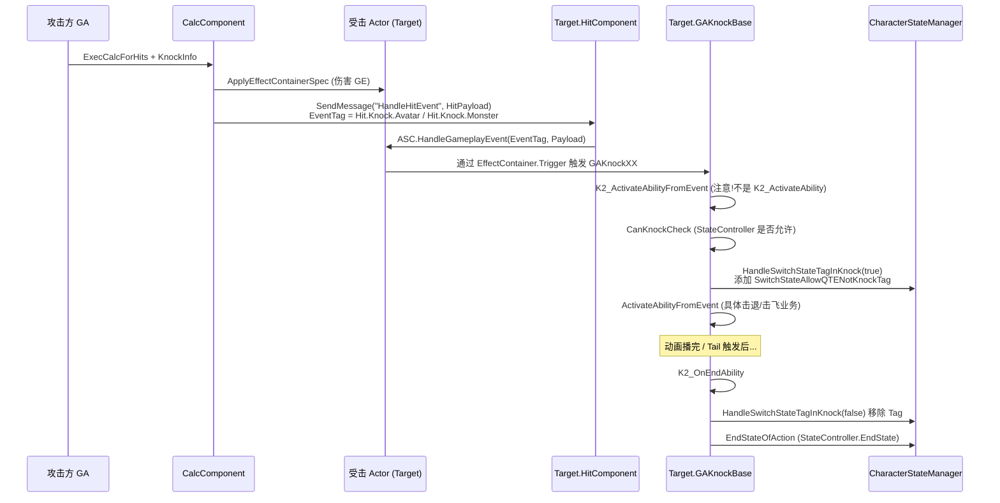
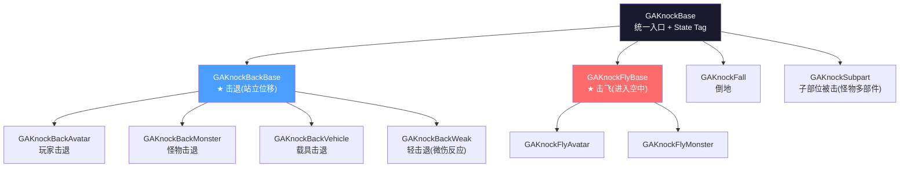
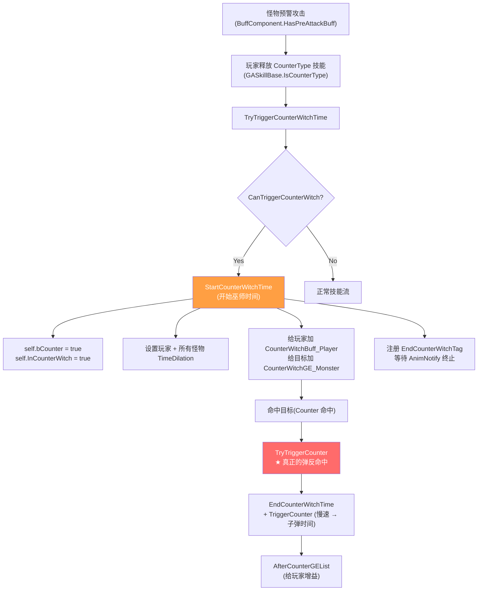
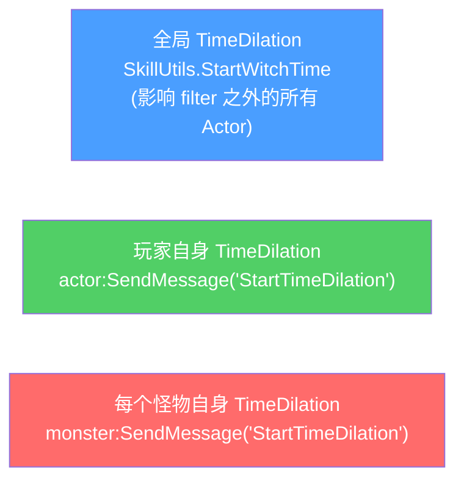

# Knock 与 Counter 巫师时间

被击与弹反是 ARPG 战斗"打击感"的灵魂。HiGame 用一组 GA 子树(`GAKnockBase` 派生)实现被击反应,用 `EWitchTimePriority` 优先级队列管理巫师时间(子弹时间)。本页讲清:Knock 链路、Knock 子类分支、Counter 状态机、巫师时间叠加规则、与 Switch/Support/HitZone 的协同[^c06][^c09]。

## Knock 总链路



## GAKnockBase 入口[^c09]

```lua
-- Content/Script/skill/knock/GAKnockBase.lua
local GAKnockBase = Class(GABase)

function GAKnockBase:K2_ActivateAbilityFromEvent(EventData)
    if not self:CanKnockCheck() then
        self:K2_EndAbility()
        return
    end
    self.Component = self.OwnerActor.HitComponent
    self.EventData = EventData

    -- ★ 继承"上一次 knock 已进入可被打断窗口"的标志
    -- (rapid combo 连击 BC 时,允许后一记被立即打断)
    local bInheritAttackable = self.OwnerActor.bKnockComboTailAttackableInherited == true

    self:OnActivateAbility()
    self:ActivateAbilityFromEvent()        -- 子类重写

    self.bHitTail = false
    self.bEnd = false
    self:HandleSwitchStateTagInKnock(true) -- 添加 QTE 状态 Tag

    if bInheritAttackable then
        self:OnInheritComboTailAttackable()
    end
end

function GAKnockBase:CanKnockCheck()
    if self.OwnerActor then
        local StateController = self.OwnerActor:_GetComponent("StateController", false)
        if StateController and not StateController:CheckAction(self:GetHitAction()) then
            return false
        end
    end
    return true
end

function GAKnockBase:HandleSwitchStateTagInKnock(IsAdd)
    if self.OwnerActor then
        local tagName = SkillUtils.GetSwitchStateAllowQTENotKnockTagName()
        local tag = UE.UHiGASLibrary.RequestGameplayTag(tagName)
        local playerState = self.OwnerActor.CachePlayerState
        if UE.UBlueprintGameplayTagLibrary.IsGameplayTagValid(tag) and playerState then
            if IsAdd then SkillUtils.AddLooseGameplayTag(playerState, tag, true)
            else          SkillUtils.RemoveLooseGameplayTag(playerState, tag, true)
            end
        end
    end
end
```

> **关键事实**:Knock GA **不走 `K2_ActivateAbility`**,而是 **`K2_ActivateAbilityFromEvent`** — 因为它由 GameplayEvent(被击事件)触发,Payload 携带攻击方信息。`K2_ActivateAbility` 入口只在自己主动施法时用。

### `KnockParams` 数据包

```lua
function GAKnockBase:ActivateAbilityFromEvent()
    self.KnockParams = {}
    local KnockInfo = SkillUtils.GetKnockInfoFromGameplayEventData(self.EventData)
    self.KnockParams.KnockInfo = KnockInfo
    self.KnockParams.Instigator = self.EventData.Instigator
    -- 子弹类技能用 OptionalObject2 传抛射物本身,作为方向参考
    self.KnockParams.Causer = self.EventData.OptionalObject2 or self.EventData.Instigator

    local KnockExtraData, bFound = SkillUtils.GetKnockExtraDataFromGameplayEventData(self.EventData)
    if not bFound then
        KnockExtraData = SkillUtils.MakeKnockExtraData(self.KnockParams.Causer, self.KnockParams.Instigator)
    end
    self.KnockParams.KnockExtraData = KnockExtraData
    self.KnockParams.HitResult = KnockInfo.Hit
    self.Component:OnKnockActivated(self)

    if not self:CanKnockByInstigator(self.KnockParams) then
        self:K2_EndAbility()
        return
    end
    -- 子类继续...
end
```

`KnockInfo`(项目自定义结构,`UD_FKnockInfo` 在 ScriptStructCache 注册):
```
struct KnockInfo:
    HitType         : Enum_KnockType (KnockBack / KnockFly / KnockFall / KnockCounter / KnockSubpart...)
    Hit             : FHitResult (命中结果)
    HitTraceRotator : FRotator (Sweep 方向)
    KnockMagnitude  : float (强度,决定击退距离)
    KnockDuration   : float
    HitTags         : FGameplayTagContainer
    ProjectType     : enum (是否被弹道打)
    -- 项目还有大量字段
```

## Knock 子类分支[^c09]

```
Content/Script/skill/knock/(旧)
  GAKnockBase.lua
  GAKnockBackBase.lua / GAKnockBackAvatar.lua / GAKnockBackMonster.lua / GAKnockBackVehicle.lua / GAKnockBackWeak.lua
  GAKnockFlyBase.lua / GAKnockFlyAvatar.lua / GAKnockFlyMonster.lua
  GAKnockFall.lua
  GAKnockSubpart.lua

CommonScript/skill/ability/Knock/(新, 部分迁移)
  Player/  (玩家 knock)
  Monster/ (怪物 knock)
```



每个子类按 KnockType 与 Owner 类型分别处理:
- 玩家 vs 怪物的击退距离/动画/耐力消耗都不同
- 载具有自己的减速曲线
- KnockWeak 对应"微伤"反应(攻击没破防或 Tenacity 不破)

### 触发表(Owner.HitComponent)

`HitComponent` 是触发 Knock GA 的桥梁:它根据当前 Actor 类型(Avatar/Monster/Vehicle)与 KnockInfo.HitType,**派发到对应的 Knock GA Class**。

```
HitComponent.HandleHitEvent(HitPayload):
  KnockType = HitPayload.OptionalObject (KnockInfo).HitType
  if Owner is Avatar:
    if KnockType == KnockBack:  Trigger GAKnockBackAvatar
    if KnockType == KnockFly:   Trigger GAKnockFlyAvatar
    if KnockType == KnockFall:  Trigger GAKnockFall
  elif Owner is Monster:
    ...
  elif Owner is Vehicle:
    ...
```

## ComboTailAttackableInherited — 连击丝滑机制

```lua
-- 在 GABase:OnActivateAbility 中:
if self.OwnerActor:IsAvatar() then
    self.OwnerActor.bKnockComboTailAttackableInherited = false  -- 任何技能都重置
end
```

```lua
-- 在 GAKnockBase:K2_ActivateAbilityFromEvent 中:
local bInheritAttackable = self.OwnerActor.bKnockComboTailAttackableInherited == true
self:OnActivateAbility()  -- 这一步会清掉这个标记 (上面 GABase 那段)
self:ActivateAbilityFromEvent()
if bInheritAttackable then self:OnInheritComboTailAttackable() end
```

> 这是项目处理"连续被击时,只要前一记进入可打断窗口,后一记从一开始就可被打断"的标志位。**非 knock 技能(普攻/闪避)会自动清除这个标志,中断 inheritance 链**。
> 设计动机:玩家被同一个怪物连续打 BB-BB-BB,第一个 knock 还没结束就接到第二个 knock,**第二个 knock 应当继承第一个的"可逃脱窗口"** — 否则玩家 UI 上看到的是"无法挣脱"非常糟糕。

## Counter — 弹反巫师时间

弹反本质是:**预警攻击触发条件下,玩家在某帧释放一个 CounterType 技能,进入慢速,真正命中时全屏"咔哒"放大效果**。



### 触发条件 — `CanTriggerCounterWitch`[^c06]

```lua
function GASkillBase:CanTriggerCounterWitch()
    if not self:IsCounterType() then return false, nil end

    local bPreAttackBuff = self.OwnerActor.BuffComponent
                       and self.OwnerActor.BuffComponent:HasPreAttackBuff()
    local bPreAttackSwitch = false
    local GameState = UE.UGameplayStatics.GetGameState(self.OwnerActor:GetWorld())
    if GameState and GameState.bAssistCounter then
        bPreAttackSwitch = SkillUtils.IsSupportCounterSkill(self.SkillType)        -- 支援 Counter
    else
        bPreAttackSwitch = SkillUtils.IsSwitchSkill(self)                           -- 切人 Counter
    end
    bPreAttackSwitch = bPreAttackSwitch
        and self.OwnerActor.SwitchPlayerComponent
        and self.OwnerActor.SwitchPlayerComponent:IsPreAttackSwitch()

    local result = bPreAttackBuff or bPreAttackSwitch
    if not result then return false, nil end

    local counterTarget = nil
    if bPreAttackBuff then
        counterTarget = self.OwnerActor.BuffComponent:GetPreAttackBuffInstigator()
    end
    if bPreAttackSwitch then
        counterTarget = self.OwnerActor.SwitchPlayerComponent:GetSwitchSkillTarget()
    end
    if not counterTarget then counterTarget = self:GetSkillTarget() end
    return result, counterTarget
end
```

> Counter 触发分**两条路径**:
> 1. **PreAttackBuff** — 怪物预警攻击给玩家挂的 buff,玩家在 buff 期间释放 CounterType 技能
> 2. **PreAttackSwitch** — 玩家在被预警攻击瞬间切人/支援(`SwitchPlayerComponent:IsPreAttackSwitch()`)
>
> `bAssistCounter`(在 GameState 上)决定是走"支援触发"还是"切人触发"。

### EWitchTimePriority — 巫师时间优先级

```lua
-- common/consts.lua
EWitchTimePriority = {
    -- 数值越大优先级越高
    NormalDodge      = 1,    -- 普通闪避
    TriggerCounter   = 2,    -- 触发 Counter
    ChargeCounter   = 3,    -- 蓄能 Counter
    ...
}
```

`SkillUtils.StartWitchTime(actor, scale, duration, ..., priority, filterType)` 内部:
- 当前若已有更高优先级的巫师时间 → 不覆盖
- 当前若优先级相同或更低 → 覆盖
- 退出时 `StopWitchTime(world, priority)` 只会撤销该优先级

```lua
-- GASkillBase:StartCounterWitchTime
function GASkillBase:StartCounterWitchTime()
    local actor = self.OwnerActor
    local TimeDilationActor = SkillUtils.GetTimeDilationActor(actor:GetWorld())
    if TimeDilationActor then
        local CounterParam = self:GetCounterParam()
        if not SkillUtils.IsMultiPlayerFight(actor) then
            -- 全局慢速(对所有不在 filter 内的 Actor)
            SkillUtils.StartWitchTime(actor, CounterParam.CounterWitchScale, -1,
                actor, nil, CounterParam.CounterWitchSequence, false,
                EWitchTimePriority.TriggerCounter, Enum.Enum_CalcFilterType.AllAlly)

            -- 玩家自己单独的慢速速率(可与全局不同)
            local curve = CounterParam.CounterWitchCurve_CounterCharacter
            local duration = curve and CounterParam.CounterWitchDuration_CounterCharacter or -1
            local timeDilation = curve and 1 or CounterParam.CounterWitchScale_CounterCharacter
            actor:SendMessage("StartTimeDilation", duration, timeDilation, curve, 0,
                EWitchTimePriority.TriggerCounter)
        end

        -- 对场景中其他所有怪物各自施加 TimeDilation
        local curve = CounterParam.CounterWitchCurve_Monster
        local duration = curve and CounterParam.CounterWitchDuration_Monster or -1
        local timeDilation = curve and 1 or CounterParam.CounterWitchScale_Monster
        self.counterWitchMonsters = {}
        local TargetMonsters = self:IsServer() and t.Monsters_Server or t.Monsters_Client
        for i = 1, TargetMonsters:Length() do
            local monster = TargetMonsters:Get(i)
            if monster and monster.SendMessage then
                monster:SendMessage("StartTimeDilation", duration, timeDilation, curve, 0,
                    EWitchTimePriority.TriggerCounter)
                table.insert(self.counterWitchMonsters, monster)
            end
        end
    end
end
```

### TimeDilation 三层模型



> **为何分三层?**
> - **全局**只能给一个 scale,无法精细控制玩家与怪物分别走不同曲线
> - **玩家单独**可以走 `CounterWitchCurve_CounterCharacter`(慢速但回归到 1 的曲线)
> - **每个怪物**单独慢速,优先级合并保证不冲突
>
> filterType=`AllAlly` 表示全局慢速时**只对怪物起作用**,队友 filter 掉走自己的曲线。

## EndCounterWitchTime

```lua
function GASkillBase:EndCounterWitchTime()
    if not self:bInCounterWitch() then return end
    self.InCounterWitch = false

    if SkillUtils.IsServerOrSinglePlayerGame(self) then
        -- 清除 CounterWitchBuffs
        local actor = self.OwnerActor
        local targetActor = (...)        -- 支援判断
        if targetActor then
            for Ind = 1, self.CounterWitchBuffHandles:Length() do
                targetActor.AbilitySystemComponent:RemoveActiveGameplayEffect(
                    self.CounterWitchBuffHandles:Get(Ind))
            end
        end
    end

    self.OwnerActor:SendMessage("StopTimeDilation", EWitchTimePriority.TriggerCounter)

    -- 停止其他所有怪物的子弹时间
    if self.counterWitchMonsters then
        for _, monster in ipairs(self.counterWitchMonsters) do
            if monster and monster.SendMessage then
                monster:SendMessage("StopTimeDilation", EWitchTimePriority.TriggerCounter)
            end
        end
        self.counterWitchMonsters = nil
    end
    SkillUtils.StopWitchTime(self.OwnerActor:GetWorld(), EWitchTimePriority.TriggerCounter)
end
```

## TriggerCounter — 命中后真正进入 Counter

```lua
function GASkillBase:TryTriggerCounter()
    if not self.counterTarget then return end
    self:EndCounterWitchTime()       -- 关闭"准备期"巫师时间
    self:TriggerCounter()
    return true
end

function GASkillBase:TriggerCounter()
    if SkillUtils.IsServerOrSinglePlayerGame(self) then
        local targetActor = ...   -- 支援/玩家
        if targetActor then
            targetActor.BuffComponent:HandleAddBuffsByGE(self.AfterCounterGEList)
        end
    end
    self:EnterCounterTime()        -- 进入正反"超慢"
    self.counterTarget = nil
end

function GASkillBase:EnterCounterTime()
    local TimeDilationActor = SkillUtils.GetTimeDilationActor(self.OwnerActor:GetWorld())
    if TimeDilationActor then
        local CounterParam = self:GetCounterParam()
        SkillUtils.StartWitchTime(self.OwnerActor,
            CounterParam.CounterScale, CounterParam.CounterDuration,
            self.OwnerActor, CounterParam.CounterCurve, CounterParam.CounterSequence,
            true, EWitchTimePriority.TriggerCounter, Enum.Enum_CalcFilterType.All)
    end
end
```

> **巫师时间分两段**:
> 1. **CounterWitch**(预警/触发期)— 慢速观察玩家是否真命中(`-1` duration,等命中或超时取消)
> 2. **Counter**(命中放大期)— 真命中后短促(0.5 秒左右)的极慢放大,通常带 Sequence 镜头特写

## OnCounterCalc — 命中时给目标的 GE

```lua
function GASkillBase:OnCounterCalc(DamageableTargetDataHandle)
    -- 给玩家加 buff(命中之后)
    local SourceActor = self.OwnerActor
    local CounterParam = self:GetCounterParam()
    local targetActor = (...)        -- 支援判断
    if targetActor then
        targetActor.BuffComponent:HandleAddBuffsByGE(CounterParam.CounterBuffList_Player)
    end

    -- 给目标加 CounterGE_Monster(僵直 / 易伤等)
    if UE.UKismetSystemLibrary.IsValidClass(CounterParam.CounterGE_Monster)
       and SkillUtils.IsMultiServerOrSingleClient(self) then
        local SpecHandle = self:MakeOutgoingGameplayEffectSpec(CounterParam.CounterGE_Monster)
        local ContextHandle = UE.UAbilitySystemBlueprintLibrary.GetEffectContext(SpecHandle)
        UE.UHiGASLibrary.EffectContextAddTag(ContextHandle, SkillUtils.GetCounterTag())
        self:K2_ApplyGameplayEffectSpecToTarget(SpecHandle, DamageableTargetDataHandle,
            SkillUtils.IsSinglePlayerGame(self))
    end
end
```

## 切人时强制结束 Counter — HandleBeforeSwitchOut

```lua
-- 角色切换时强制结束 Counter,避免 InCounterWitch 状态泄漏
function GASkillBase:HandleBeforeSwitchOut()
    if self:bInCounterWitch() then
        self:EndCounterWitchTime()
    end
end
```

> 触发路径(项目实测): `switch_player_component:MulticastBeforeSwitchOut` → `actor:SendMessage("PlayerBeforeSwitchOut")` → `SkillComponent:PlayerBeforeSwitchOut` → `AbilityInstance:HandleBeforeSwitchOut`(此处)

## CounterIsSuccess 埋点

```lua
function GASkillBase:CheckCounterIsSuccess()
    local CounterOverlapActors = ((self.OwnerActor or {}).SkillComponent or {}).CounterOverlapActors
    if not CounterOverlapActors then return end

    local PSArray = UE.TArray(UE.APlayerState)
    local IsCounterSuccess = true
    for i = 1, CounterOverlapActors:Length() do
        local OtherActor = CounterOverlapActors:Get(i)
        if OtherActor and SkillUtils.IsAvatar(OtherActor) then
            local PS = OtherActor:GetAvatarPlayerState()
            if PS and not PSArray:Contains(PS) then
                PSArray:Add(PS)
                if not PS.HasTriggeredCounter then
                    PS:SendMessage("SendBattleConditionEventMsg",
                        GameEventTypes.OnTriggerCounterAttack, { IsSuccess = false })
                    IsCounterSuccess = false
                end
                PS.HasTriggeredCounter = false
            end
        end
    end
    CounterOverlapActors:Clear()

    if not IsCounterSuccess then
        self.OwnerActor:SendMessage("OnBeCounterFailed", self)
    end
    self.HasTriggeredCounter = false
end
```

> 即使 Counter 没真命中,只要触发了 PreAttack overlap 就会被记录,随后判断:
> - 真命中(`HasTriggeredCounter = true`)→ 上报成功
> - 没命中 → 上报失败
> 用于成就埋点("成功 X 次弹反"),也用于 AI 老手玩家行为分析。

## State Tag 与 StateController

被击 GA 通过 `StateController` 与移动/攻击/技能解锁系统协同:
```lua
-- StateController 是 Avatar / Monster 上的状态机组件
-- 包含 Action 枚举:Action_Hit / Action_Skill / Action_Dodge / ...
function GAKnockBase:GetHitAction() return StateConflictData.Action_Hit end
function GAKnockBase:CanKnockCheck()
    if self.OwnerActor then
        local StateController = self.OwnerActor:_GetComponent("StateController", false)
        if StateController and not StateController:CheckAction(self:GetHitAction()) then
            return false           -- ★ 当前 Action 不允许 Hit(如霸体中)
        end
    end
    return true
end

function GAKnockBase:EndHitAction()
    local StateController = self.OwnerActor:_GetComponent("StateController", false)
    if StateController then StateController:EndStateOfAction(self:GetHitAction()) end
end
```

> StateController 是项目自研状态机,各类 Action 互斥规则在 `state_conflict_data.lua` 配置。Knock GA 进出时调 StateController 是为了让"霸体技能不被 Knock 打断"自然成立。

## QTE Hit Tag

`SwitchStateAllowQTENotKnockTag` 是给 Switch/QTE 系统的标记 — 当玩家在被击但仍处于"非完全无控制"状态时,允许触发支援/切人 QTE。Knock 进入时 Add,结束时 Remove,简单的"在 Knock 期间允许 QTE"信号。

## Knock 子模块特殊 — GAKnockSubpart

`GAKnockSubpart` 给"怪物多部件"用 — 比如打掉怪物尾巴/手臂这种独立 Actor,**只在子部件上播 Hit 动画,本体不进入 Hit 状态**。

```
Calc 时:HitResult.HitActor 是子部件
HitComponent:DispatchKnock(HitActor):
    if HitActor.bIsSubpart:
        Trigger GAKnockSubpart on HitActor (子部件自己结算)
    else:
        Trigger GAKnockBackMonster on Owner (本体)
```

## 一页速查

| 任务 | 接口 | 备注 |
|------|------|------|
| 角色被击 | `Target.HitComponent.HandleHitEvent(HitPayload)` | KnockType 决定走哪个 GAKnock 子类 |
| 设置攻击的 KnockType | `KnockInfo.HitType = Enum.Enum_KnockType.KnockBack` | 在 ANS 配 |
| 检测当前是否可被 Knock | `StateController:CheckAction(Action_Hit)` | 霸体期间返回 false |
| 玩家弹反 | 技能 GA 设 `CounterType = NormalCounter`,蓝图层注册 | 父类 GASkillBase 自动处理 |
| 玩家蓄能弹反 | `CounterType = ChargeCounter` | 走 ChargePreAttackBuff |
| 切人弹反 | `bAssistCounter` GameState 关闭 + `IsSwitchSkill` | 切人瞬间 |
| 支援弹反 | `bAssistCounter = true` GameState + `IsSupportCounterSkill` | 支援角色释放时 |
| 进入 Counter 巫师时间 | `OnTriggerCounterWitchTime(target)` 自动调 | 父类 |
| 命中后真正放大 | `TryTriggerCounter` | 子类在命中点调 |
| 主动结束巫师时间 | `EndCounterWitchTime` | 强制结束 |
| 切角色时强制清 | `HandleBeforeSwitchOut` | 父类自动 |
| 巫师时间不冲突 | 用 `EWitchTimePriority` | 高优先级覆盖低 |

[^c06]: `Content/Script/CommonScript/skill/ability/GASkillBase.lua` (CanTriggerCounterWitch / StartCounterWitchTime / TryTriggerCounter)
[^c09]: `Content/Script/skill/knock/GAKnockBase.lua` 等 11 个 Knock 子类、`CommonScript/skill/ability/Knock/Player/*` `Monster/*`
